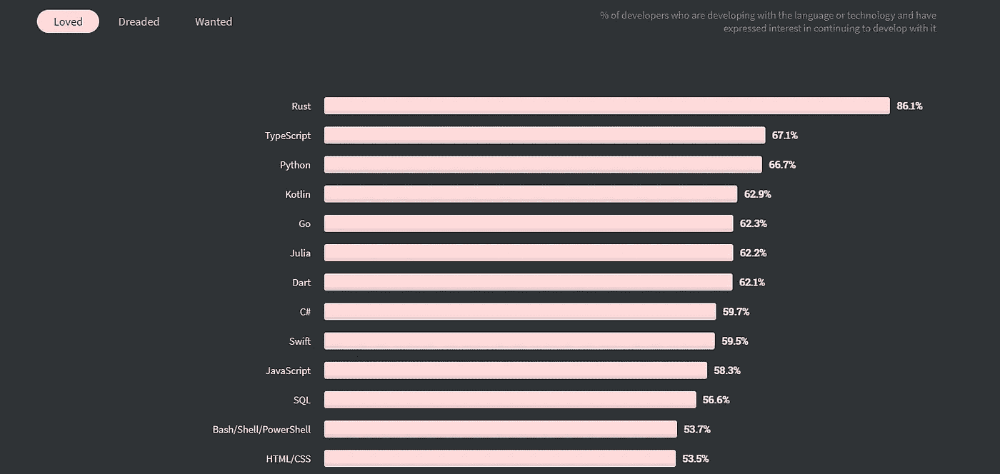
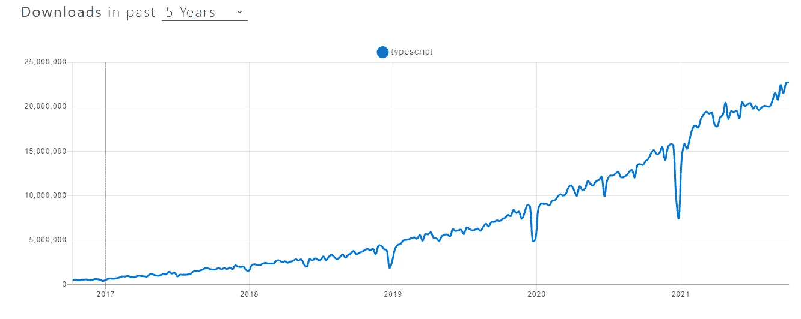

# 这就是为什么您应该切换到 TypeScript

> 原文：<https://javascript.plainenglish.io/this-is-why-you-should-switch-over-to-typescript-44fa6449b899?source=collection_archive---------14----------------------->


Photo by [Greg Rakozy](https://unsplash.com/@grakozy?utm_source=unsplash&utm_medium=referral&utm_content=creditCopyText) on [Unsplash](https://unsplash.com/s/photos/javascript?utm_source=unsplash&utm_medium=referral&utm_content=creditCopyText)

# 到底什么是 TypeScript？

TypeScript 是基于 JavaScript 的强类型语言，这意味着它是 JavaScript 的上标。用 JavaScript 可以做的任何事情都可以用 TypeScript 来完成。这意味着学习曲线非常短。所以欢呼吧！当我参与的一个项目由于客户的要求而不得不在 Angular 上完成时，我学会了 TypeScript。学习曲线并不重要，如果你以前使用过任何面向对象的语言，那就更好了。

# Typescript 上的框架


[Image By Angular Presskit](https://angular.io/presskit)

由于 TypeScript 是 JavaScript 的上标，理论上*所有的 JavaScript 框架都可以配置成使用 TypeScript* 。以下是一些你可能熟悉的最流行的:

1.  棱角——最明显的一点，因为它完全基于 TS。
2.  Vue . js——根据[文档](https://vuejs.org/v2/guide/typescript.html)，Vue 也可以和 TypeScript 一起使用。
3.  NestJS——NestJS 是节点领域发展最快的框架之一。受 Angular 模块的启发，“它是一个渐进式 Node.js 框架，用于构建高效、可伸缩的 Node.js web 应用程序，这些应用程序是用现代 JavaScript 和 TypeScript 构建的。”留意一下这个。
4.  React —由脸书提供支持，这是基于 JavaScript 的最流行的前端库之一；但是，可以将其配置为使用 TypeScript。React 保持中立，让开发人员选择使用 JavaScript 或 TypeScript。
5.  ionic——基于 TypeScript 的混合应用框架。

对于混合平台和本地平台还有更多。

# 使用 TypeScript 的原因

# **1)静态打字**

在 JavaScript 中，变量是动态类型的。这意味着变量的类型是在运行时根据它的设置值决定的。使用 TypeScript，您可以定义变量的类型，就像在 C++或 Java 中一样。这可以帮助您在编写代码时识别任何与类型转换相关的错误。

它还可以避免在使用 JavaScript 及其动态类型变量时可能出现的恼人的错误。考虑下面的例子来理解它:

```
// The JavaScript wayvar age = 25;if (localStorage.getItem() >== age) {
  console.log("The user is older than 25.");
}
```

上面的“如果”条件会给你意想不到的结果。为什么？因为，如你所见，变量‘age’被设置为 25，一个整数。localStorage.getItem()是一个返回 null 或字符串的函数。为了简单起见，假设 getItem()返回一个字符串，比如 30。现在它将比较一个字符串和一个整数，在某些情况下结果可能不准确。在 TypeScript 中很容易防止的简单错误。考虑下面的例子:

```
// The TypeScript waylet age:number = 25;if (localStorage.getItem() >== age) {//---> This will give an error.
  console.log("The user is older than 25.");
}
```

现在我们已经强类型化了年龄变量，它现在是一个数字。因此，当我们在 getItem(一个字符串)的返回值和 age(一个数字)之间进行比较时，我们将在 IDE 中得到一个错误，我们可以相应地进行更改。这只是通过严格定义变量、函数返回值、函数参数等可以简单地防止这种错误的许多例子中的一个。

但是如果你想动态定义一个变量呢？是的，你也可以这样做。因为 TypeScript 是 JavaScript 的上标，所以您可以选择将变量的类型设置为“any”。但是，请记住，这样的变化意味着您放弃了防止上述不可预测错误的能力。[**这里是 TypeScript**](https://www.typescriptlang.org/docs/handbook/basic-types.html) **中变量类型的完整列表。**

# 2)易于编写和维护

如果你使用现代的 ide，你可以简单地开始输入代码，然后弹出建议。通常你会发现自己只是按下 Tab 键来自动填充建议。还可以很容易地获取任何第三方库函数的文档，例如，从您的 IDE 本身。这是一个令人难以置信的工具，它将提高你的团队的表现。我推荐 IDE 使用 TypeScript 的方式是 **Visual Studio Code、WebStorm 和 Atom** 。按照这个顺序。使用这些 ide 还允许您轻松地在代码中找到引用，这非常有用。

我的一个同事曾经告诉我，自从他们改用 TypeScript 以来，代码似乎是自我表达的，我同意这一点。如果代码不是意大利面条，由于良好类型的函数、变量和良好定义的类，一段代码的意图非常清楚。是的，它确实增加了一些样板代码，但从长远来看，它非常有用。也就是说，这并不意味着你不应该记录你的代码。这仅仅意味着在几个月的时间里，对文档的需求会减少，节省时间。我对 TypeScript 的文档工具的推荐是 [**TSDoc**](https://github.com/microsoft/tsdoc) **和**[**TypeDoc**](https://typedoc.org/)**。**

# 3)面向对象的原则

我们都知道 OOP 的强大。您的 TypeScript 项目可以具有基于类的设计。由于 TypeScript 支持面向对象编程，这意味着存在类、接口和功能，如函数重载、继承等等。

随着您的项目变得越来越复杂，拥有一个面向对象的设计非常有帮助。这保持了简单性并提高了代码的可读性。这里可以利用面向对象设计的任何好处。当然，这并不意味着你必须有类，如果你愿意，你仍然可以用 JavaScript 的方式来实现。

# 4)知名度和支持度

无论一项技术有多强大，如果没有人使用它，或者如果它没有得到行业的支持，它就没有任何意义。根据 StackOverflow 的调查，TypeScript 是第二大最受欢迎的语言，出人意料地超过了 Python。



[Most Loved Languages by StackOverflow](https://insights.stackoverflow.com/survey/2020#technology-most-loved-dreaded-and-wanted-languages-loved)

过去 5 年，npm 的 TypeScript 下载量呈上升趋势，截至 2021 年 10 月 11 日，每周下载量达到 2270 万次的峰值。



[Image by npmtrends](https://www.npmtrends.com/typescript)

更不用说它有微软的支持，有一个行业巨头的支持总是好事。

# 开始

我希望您现在已经确信，转换到 TypeScript 有很多好处。如果您想开始使用 TypeScript，我想建议一个简单的逐步过程。

1.  [如何安装打字稿](https://www.typescriptlang.org/download)
2.  学习基础知识— [文档](https://www.typescriptlang.org/docs/handbook/2/basic-types.html)或[视频](https://www.youtube.com/watch?v=ahCwqrYpIuM&ab_channel=Fireship)
3.  [理解项目参考](https://www.typescriptlang.org/docs/handbook/project-references.html)
4.  选择一个框架——我建议[反应](https://reactjs.org/) / [角度](https://angular.io/)(注意，您需要将反应配置为使用 TypeScript。然而，角度完全是基于类型脚本的)
5.  玩得开心！(最重要的一步😉)

**希望您喜欢这篇文章。**

**我的名字叫毗瑟奴·萨西哈兰，我写技术文章，编码，讲故事。我的目标是把复杂的概念简化成简单的东西，并用外行人的术语来解释。我也分享激励我的真实生活故事。**

**如果您喜欢这篇文章，您也可以喜欢:**

[](/promises-in-typescript-27d887a8d380) [## 打字稿中的承诺

### 想象一下，你去商店买糖果。你要一块糖，店主就答应了(即给你一块)。

javascript.plainenglish.io](/promises-in-typescript-27d887a8d380) [](/why-you-should-stop-using-loops-88a6a789106e) [## 为什么应该停止使用循环

### 如果你像我一样，你已经在 JavaScript 中使用 for 和 while 循环很长时间了。我的意思是如果它得到了…

javascript.plainenglish.io](/why-you-should-stop-using-loops-88a6a789106e) 

*更多内容看*[***plain English . io***](http://plainenglish.io/)