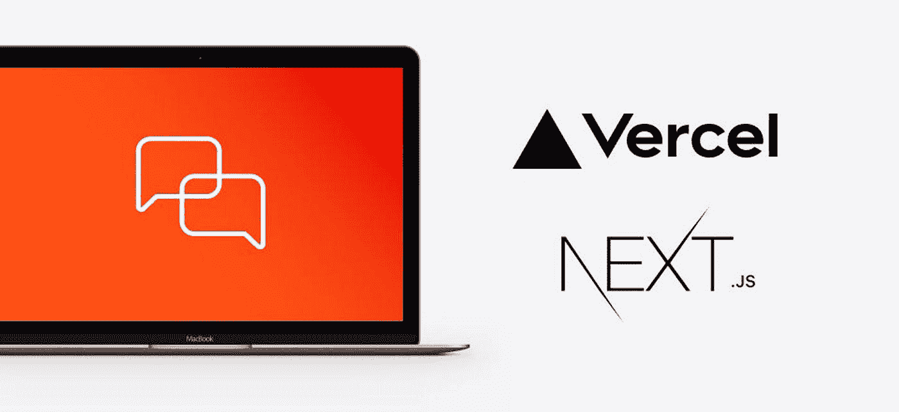
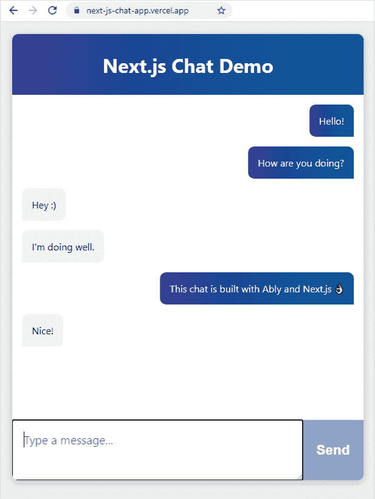

# 用 Next.js，Vercel 和 Ably 创建一个实时聊天应用程序

> 原文：<https://javascript.plainenglish.io/this-post-will-walk-through-the-creation-of-a-realtime-chat-application-with-next-js-361878ad95f4?source=collection_archive---------16----------------------->

## 使用 React 构建您自己的聊天应用程序

**这篇文章将教你以下内容:**

*   创建全新的 Next.js 应用程序
*   用 Ably 添加实时功能
*   创建一个 Next.js Vercel 无服务器 API
*   巧妙地使用 React 功能组件和 React 钩子
*   在 Vercel 上托管您的应用

检查一个[运行版本的应用程序](https://next-js-chat-app.vercel.app/)。



# Vercel 中的 WebSockets 与 Ably

Vercel 允许用户部署[无服务器功能](https://vercel.com/docs/serverless-functions/introduction)，本质上只是对 HTTP 请求提供响应的代码块。但是，这些函数有一个最大执行超时，这意味着不可能以这种方式维护 WebSocket 连接。这就是 Ably 的用武之地。客户端可以连接到一个[频道](https://ably.com/documentation/realtime/channels)并在上面发送和接收消息，通过为你管理 WebSocket 连接来为你的应用添加实时功能。我们将在本演练中讨论如何构建一个使用实时功能的应用程序，如果愿意，您可以[直接跳到如何巧妙地使用 Vercel](https://ably.com/blog/realtime-chat-app-nextjs-vercel?utm_content=156129294&utm_medium=social&utm_source=twitter&hss_channel=tw-610981768#ablyandvercel) 。

> [*看看为 JavaScript 应用程序实现一个可靠且高性能的客户端 WebSocket 解决方案的一些挑战。*](https://ably.com/topic/websockets-javascript)

# 我们要建造什么？

我们将构建一个在浏览器中运行的实时聊天应用程序。它将建立在 next . js[create-next-app](https://nextjs.org/docs/api-reference/create-next-app)模板的基础上，它将包含一个 React 组件，可以用来发送和接收消息。我们还将编写一个 Next.js 无服务器函数，用于连接 Ably。



# 属国

为了构建此应用程序，您需要:

*   **发送消息的 Ably 账户**:[免费创建 Ably 账户](https://ably.com/signup)。
*   **一个 Vercel 账户**用于制作托管:[免费创建一个 Vercel 账户](https://vercel.com/signup)。
*   **节点 12** (LTS)以上:[安装节点](https://nodejs.org/en/)。

# 本地开发先决条件

您将需要一个来自 Ably 的 API 密钥来认证 Ably 服务。要获得 API 密钥，一旦你[创建了一个账户](https://ably.com/signup):

1.  访问您的[应用仪表板](https://ably.com/accounts)并点击“创建新应用”。
2.  给新应用命名
3.  创建应用程序后，复制私有 API 密钥。保持它的安全，这是你如何认证 Ably 服务。

Vercel 提供了一些 Next.js 命令行工具来帮助我们。它们不需要安装在您的系统上，因为它们是使用`npx`执行的。

# 构建 Next.js 聊天应用程序

# 要创建初学者应用程序:

1.  在您的终端中，键入`npx create-next-app`创建一个空的 Next.js 应用程序。
2.  在根目录下创建一个名为`.env`的文件，这是我们放置项目环境变量的地方。
3.  将 Ably API 密钥添加到。环境文件:

```
ABLY_API_KEY=your-ably-api-key:goes-here
```

1.  导航到 Next.js 应用程序目录，并在控制台中键入:

```
npm run dev
```

Next.js dev 服务器将启动，您将看到一个空的 Next。JS 入门 app。这是我们将在其上构建聊天应用程序的基础。

# 实时发布/订阅消息

我们将构建的聊天应用程序巧妙地使用在用户之间进行[发布/订阅消息](https://ably.com/documentation/core-features/pubsub)。Pub/Sub 代表发布和订阅，是用于实时数据交付的流行模式。该应用程序将能够通过一个[通道](https://ably.com/pub-sub-messaging)发送或`publish`消息。使用该应用程序的客户端将被`subscribed`到频道，并将能够接收消息。我们将构建一个 UI 来创建要发送的消息，并在收到消息时显示消息。

[**免费试用我们的 API**](https://pages.ably.com/cs/c/?cta_guid=0d5e4729-b3d0-44fc-b892-88a0e85e544b&signature=AAH58kHDaiijUA2ezYd6O20zj7XsyVmbzg&placement_guid=85f436af-7315-44c9-aa12-d764f40b294d&click=e45ad845-2678-49a5-83b8-38848c9114a8&hsutk=2e23ace75e4744214a2aca9d8ea843e1&canon=https%3A%2F%2Fably.com%2Fblog%2Frealtime-chat-app-nextjs-vercel&portal_id=6939709&redirect_url=APefjpEFmN0FrqvvBKaPDIjgItsADRvUqwUVrUlTWRz4jmtbYO835aeTgQrzPCRPR7y4ssDEV5ojI3p95jTlNmWXKZK35EBqplbPeWhYF4iaeOI8Do2IyxO5yltFZySv96tnFlDSoLB6X_6iGYrasLXCCzDuHniczNW-6d5tAA46DEg53-FHesHQ8oh_wQopSvPXt-8A406-NRKZCh54MKZ1q1nJRK7m6ZWzj7UfPyVQg6fBKUy7WrU&__hstc=12655464.2e23ace75e4744214a2aca9d8ea843e1.1610965950917.1614953799619.1614965705856.14&__hssc=12655464.1.1614965705856&__hsfp=1889468195)

# Ably 服务的认证

Vercel Next.js 应用不运行传统的“服务器端代码”，但是，您可以将 JavaScript 文件添加到`/pages/api/*`中，Vercel 部署引擎会将每个文件视为一个 API 端点，并作为无服务器功能来管理它们。

对于本地开发，Next.js 工具在一个节点服务器中运行这些函数，因此它们在本地开发环境中可以像您所期望的那样工作。我们将在我们之前创建的启动代码中添加一个 Next.js / Vercel 无服务器函数，以使用 Ably 认证我们的应用程序，并使通过 Ably 服务发送和接收消息成为可能。

# 编写无服务器函数来连接 Ably

你需要安装 Ably npm 包(为了与 Vercel 兼容，你必须运行 Ably 1.2.5+。

在终端中，在新应用程序的根目录下运行:

```
npm install ably@1.2.5-beta.1
```

接下来，创建一个名为`./pages/api/createTokenRequest.js`的文件，在其中添加以下代码:

```
import Ably from "ably/promises";export default async function handler(req, res) {
    const client = new Ably.Realtime(process.env.ABLY_API_KEY);
    const tokenRequestData = await client.auth.createTokenRequest({ clientId: 'ably-nextjs-demo' });
    res.status(200).json(tokenRequestData);
};
```

这个无服务器函数使用 Ably SDK 创建一个带有 API 密钥的`tokenRequest`。稍后将使用这个令牌——它允许您在 Next.js 应用程序中使用“真正的”API 密钥时保持其安全。默认情况下，这个 API 被配置为在`http://localhost:3000/api/createTokenRequest`
上可用。我们将把这个 URL 提供给客户端中的 Ably SDK，以便 Ably 进行身份验证。

# 实时聊天应用架构

我们的 Next.js 应用程序的拓扑将如下所示:

```
├─ .env
├─ .gitignore
├─ package-lock.json
├─ package.json
├─ README.md   
|    
├─── components
│     ├─ AblyChatComponent.jsx
│     ├─ AblyChatComponent.module.css
│     └─ AblyReactEffect.js
|
├─── pages
│    ├─ index.js
│    │   
│    └─── api
│          └─ createTokenRequest.js
│           
└─── public
```

*   `/pages/index.js`是主页
*   `/api/createTokenRequest.js`是我们巧妙的令牌认证 API
*   `/components/AblyChatComponent.jsx`是聊天组件
*   `/components/AblyChatComponent.module.css`包含聊天组件的样式
*   `/components/AblyReactEffect.js`是巧妙地反应钩。

让我们看看这个应用程序是如何构建的。

# 构建组件

`Next.js`中的页面是 React 组件，因此`pages/index.js`主页是包含页面布局的 React 组件。

这是由`create-next-app`生成的默认页面，我们将在其中添加我们自己的组件——一个`AblyChatComponent`:

```
import Head from 'next/head'
import dynamic from 'next/dynamic'const AblyChatComponent = dynamic(() => import('../components/AblyChatComponent'), { ssr: false });export default function Home() {
  return (
    <div className="container">
      <Head>
        <title>Create Next App</title>
        <link rel="icon" href="/favicon.ico" />
      </Head> <main>
        <h1 className="title">Next.js Chat Demo</h1>
        <AblyChatComponent />
      </main> <footer>
        Powered by
        <a href="https://vercel.com" target="_blank" rel="noopener noreferrer">
          
        </a>
        and
        <a href="https://ably.com" rel="noopener noreferrer">
          
        </a>
      </footer> <style jsx>{`
        ...       
      `}</style> <style jsx global>{`
        ...        
      `}</style>
    </div>
  )
}
```

您会注意到它看起来不像常规导入，我们是这样包含它的:

```
const AblyChatComponent = dynamic(() => import('../components/AblyChatComponent'), { ssr: false });
```

在像使用任何其他 react 组件一样使用它之前:

```
<main>
  <h1 className="title">Next.js Chat Demo</h1>
  <AblyChatComponent />
</main>
```

这种不寻常的包含样式是因为`AblyChatComponent`只能在用户的浏览器中运行。它使用 WebSockets 连接，不适合使用 Vercel 进行服务器端渲染。默认情况下，Next.js 试图在服务器端呈现所有内容，所以通过使用`dynamic()`调用包含组件，我们可以告诉 Next.js 不要在构建过程中呈现它，因为它无法连接到它需要运行的 API，所以会抛出错误。

# 编写聊天组件逻辑

聊天应用程序逻辑包含在`AblyChatComponent.jsx`组件中。

首先在文件顶部引用我们需要的导入:

```
import React, { useEffect, useState } from 'react';
import { useChannel } from "./AblyReactEffect";
import styles from './AblyChatComponent.module.css';
```

然后，我们将定义将作为 React 功能组件导出的函数。我们需要访问代码中的一些 HTML 元素，这样我们就可以创建变量来存储它们的引用:

```
const AblyChatComponent = () => { let inputBox = null;
  let messageEnd = null;
```

接下来，设置我们将在组件中使用的状态属性:

```
const [messageText, setMessageText] = useState("");
  const [receivedMessages, setMessages] = useState([]);
  const messageTextIsEmpty = messageText.trim().length === 0;
```

*   **messageText** 将被绑定到可以输入消息的 textarea 元素
*   **接收消息**至屏幕聊天记录
*   **messageTextIsEmpty** 用于在文本区为空时禁用发送按钮

现在我们将使用我们之前导入的`useChannel`钩子。

`useChannel`是一个 [react-hook](https://reactjs.org/docs/hooks-intro.html) 风格的 API，用于订阅来自 Ably 通道的消息。您为它提供一个通道名和一个回调，以便在收到消息时调用。

```
const [channel, ably] = useChannel("chat-demo", (message) => {
    // Here we're computing the state that'll be drawn into the message history
    // We do that by slicing the last 199 messages from the receivedMessages buffer const history = receivedMessages.slice(-199);
    setMessages([...history, message]); // Then finally, we take the message history, and combine it with the new message
    // This means we'll always have up to 199 message + 1 new message, stored using the
    // setMessages react useState hook
  });
```

接下来，我们需要通过定义一些函数来处理 UI 交互。

首先是`sendChatMessage`，负责发布新消息。
它使用由`useChannel`钩子返回的 Ably 通道，清除输入，并聚焦于文本区域，以便用户可以键入更多的消息:

```
const sendChatMessage = (messageText) => {
    channel.publish({ name: "chat-message", data: messageText });
    setMessageText("");
    inputBox.focus();
  }
```

然后是`handleFormSubmission`，当`submit`按钮被点击时触发，调用`sendChatMessage`，同时阻止页面重新加载:

```
const handleFormSubmission = (event) => {
    event.preventDefault();
    sendChatMessage(messageText);
  }
```

此外，`handleKeyPress`事件被连接起来，以确保当文本区中有文本时，如果用户按下`enter`键，就会触发`sendChatMessage`功能。

```
const handleKeyPress = (event) => {
    if (e.charCode !== 13 || messageTextIsEmpty) {
      return;
    }
    sendChatMessage(messageText);
    event.preventDefault();
  }
```

接下来，我们需要构造 UI 元素来显示消息。为此，我们将把收到的消息映射到 HTML span 元素中:

```
const messages = receivedMessages.map((message, index) => {
    const author = message.connectionId === ably.connection.id ? "me" : "other";
    return <span key={index} className={styles.message} data-author={author}>{message.data}</span>;
  });
```

为了保持消息框滚动到最近的消息(底部的消息),我们需要在消息容器中添加一个空的 div 元素，每当组件重新呈现时，它就会滚动到视图中。这是我们稍后将添加到 UI 中的元素:

```
<div ref={(element) => { messageEnd = element; }}></div>
```

每当组件呈现时，我们使用一个`useEffect`钩子和`[scrollIntoView()](https://developer.mozilla.org/en-US/docs/Web/API/Element/scrollIntoView)`将消息历史滚动到底部。

```
useEffect(() => {
    messageEnd.scrollIntoView({ behaviour: "smooth" });
  });
```

最后，我们将编写 React 组件标记，所有事件处理程序都绑定到 JSX 的`onChange`和`onKeyPress`事件。

标记本身只是几个 div 元素和一个带有供用户输入的文本区域的表单。

有两个对 react `ref`函数的调用，它允许我们在呈现元素时捕获对元素的引用，以便我们可以用 JavaScript 与它们进行交互。

返回的标记将如下所示:

```
return (
    <div className={styles.chatHolder}>
      <div className={styles.chatText}>
        {messages}
        <div ref={(element) => { messageEnd = element; }}></div> // empty element to control scroll to bottom
      </div>
      <form onSubmit={handleFormSubmission} className={styles.form}>
        <textarea
          ref={(element) => { inputBox = element; }}
          value={messageText}
          placeholder="Type a message..."
          onChange={e => setMessageText(e.target.value)}
          onKeyPress={handleKeyPress}
          className={styles.textarea}
        ></textarea>
        <button type="submit" className={styles.button} disabled={messageTextIsEmpty}>Send</button>
      </form>
    </div>
  )
}export default AblyChatComponent;
```

就在文件的底部，该函数被导出为`AblyChatComponent`，这样我们在开始时创建的 Next.js 页面就可以引用它。

# 巧妙正确地使用反应元件

将 Ably 与 React 功能组件一起使用的一个更棘手的部分是知道何时何地创建 SDK 的实例，以及何时何地连接到您的通道。当组件被渲染时，你应该避免实例化 SDK，因为这可能会产生多个连接并烧穿你的 Ably 帐户限制。

为了确保应用程序正确地处理组件重绘、安装和卸载— `AblyReactEffect`导出一个 [React 钩子](https://reactjs.org/docs/hooks-intro.html)来与 Ably SDK 交互。

React 钩子在你第一次使用的时候看起来有点不寻常。挂钩是一种功能，它:

*   执行我们期望`componentDidMount`运行的功能
*   返回*另一个*函数，该函数将由调用`componentDidUnmount`的框架执行
*   执行它需要的任何其他行为

这个反应钩子是基于`useEffect`建造的。当被引用时，它创建 Ably SDK 的一个实例(它只做一次),该实例被配置为使用您的无服务器函数的`URL`对`createTokenRequest`进行认证:

```
import Ably from "ably/promises";
import { useEffect } from 'react'const ably = new Ably.Realtime.Promise({ authUrl: '/api/createTokenRequest' });
```

在组件范围之外实例化 Ably 库意味着它只被创建一次，这将降低你的使用限制。

然后我们需要创建将要导出的函数——我们的钩子，这样我们就可以在我们的组件中使用它。
我们称之为`useChannel`，它需要通道名和一个回调作为参数。每次调用`useChannel`时，我们从 Ably-JS SDK 中`[get](https://ably.com/documentation/realtime/channels#obtaining-channel)` [请求的通道](https://ably.com/documentation/realtime/channels#obtaining-channel)并准备钩子函数。

*   **onMount** 是每次渲染组件时运行的代码。在 onMount 内部，我们将订阅指定的通道，每当接收到消息时就触发`callbackOnMessage`。
*   **onUnmount** 是在组件被重新呈现之前卸载组件时运行的代码。在这里，我们将取消订阅频道，这将停止意外的多次连接，再次节省我们的帐户限制。
*   **useeffecthhook**是一个正确调用这些函数的函数，返回 onUnmount 供 React 使用。

`AblyReactEffect.js`中导出的钩子将如下所示:

```
export function useChannel(channelName, callbackOnMessage) {
    const channel = ably.channels.get(channelName); const onMount = () => {
        channel.subscribe(msg => { callbackOnMessage(msg); });
    } const onUnmount = () => {
        channel.unsubscribe();
    } const useEffectHook = () => {
        onMount();
        return () => { onUnmount(); };
    }; useEffect(useEffectHook); return [channel, ably];
}
```

`useChannel`钩子返回当前 Ably 通道和 Ably SDK，供调用代码用来发送消息。这个钩子在一个地方巧妙地封装了 React 功能组件的 pub/sub，所以我们不需要在其他地方担心它，使用它的代码可以只处理它接收到的消息。

# 用 CSS 模块让一切看起来漂亮— `AblyChatComponent.module.css`

您可能已经注意到，在编写聊天组件时，`Next.js`有一些编译器强制的约定，规定了您保存 CSS 的位置以及如何导入它。
对于这个应用程序，我们将创建一个与`.jsx`文件同名的 CSS 文件，只是扩展名为`.module.css`。我们这样做是为了使组件的管理更容易，如果将来我们想删除这个组件，也可以简单地删除它的 CSS。创建后，可以将其导入到组件中:

```
import styles from './AblyChatComponent.module.css';
```

在 JSX 元素上创建 CSS 类时，我们在元素上使用以下语法:

```
className={styles.yourClassName}
```

附带的 css 将如下所示:

```
.yourClassName {
  styles: gohere;
}
```

这个应用程序是用 [CSS Grid](https://css-tricks.com/snippets/css/complete-guide-grid/) 来创建应用程序布局的，当然欢迎你使用这个项目提供的 CSS 或者自己编写或者使用框架。

# 在 Vercel 上托管

我们使用`Vercel`作为我们的开发服务器和构建管道。

> *将 Next.js 部署到生产的最简单方法是使用 Next.js 的创建者提供的 Vercel 平台。Vercel 是一个一体化平台，具有支持静态& Jamstack 部署和无服务器功能的全局 CDN。
> —*[*next . js 文档*](https://nextjs.org/docs/deployment)

为了将新的聊天应用程序部署到 Vercel，您需要:

1.  创建一个 [GitHub 账户](https://github.com/)(如果你还没有的话)
2.  [将你的应用推送到 GitHub 库](https://docs.github.com/en/free-pro-team@latest/github/creating-cloning-and-archiving-repositories/creating-a-new-repository)
3.  [创建一个 Vercel 账户](https://vercel.com/signup)
4.  创建一个新的 Vercel 应用程序，并从 GitHub 存储库中导入您的应用程序。(这将要求您授权 Vercel 使用您的 GitHub 帐户)
5.  添加您的`ABLY_API_KEY`作为环境变量
6.  观看您的应用部署
7.  在浏览器中访问新创建的 URL！

# 让它成为你自己的

有几种方法可以扩展这个例子:

# 添加消息历史记录

此演示中目前没有聊天记录，您将只能看到加入聊天后收到的消息。你可以通过使用 [Ably 的倒带功能](https://ably.com/documentation/realtime/history)来扩展这个演示，免费播放长达两分钟的历史，或者使用付费帐户，长达 48 小时。

# 添加用户名

聊天信息中没有发送任何用户名。这个演示可以扩展为引入一个用户名输入框，并在消息发送时添加当前用户名。

该演示使用随机生成的 Ably 客户端 Id 作为唯一标识符——这是它如何检测发送消息的是“我”还是“其他人”。

# 结论

如果这篇教程有帮助，或者你在你的项目中使用了 Next.js，我们很乐意听听。在推特上给我们留言[或者发邮件给我们](https://twitter.com/ablyrealtime) [devrel@ably.io](mailto:devrel@ably.io) 。