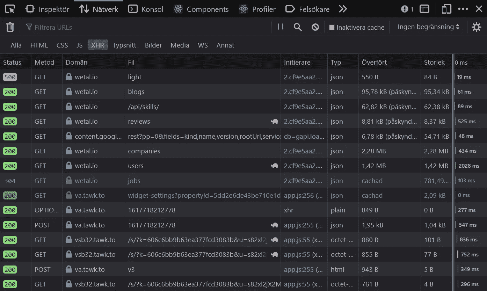
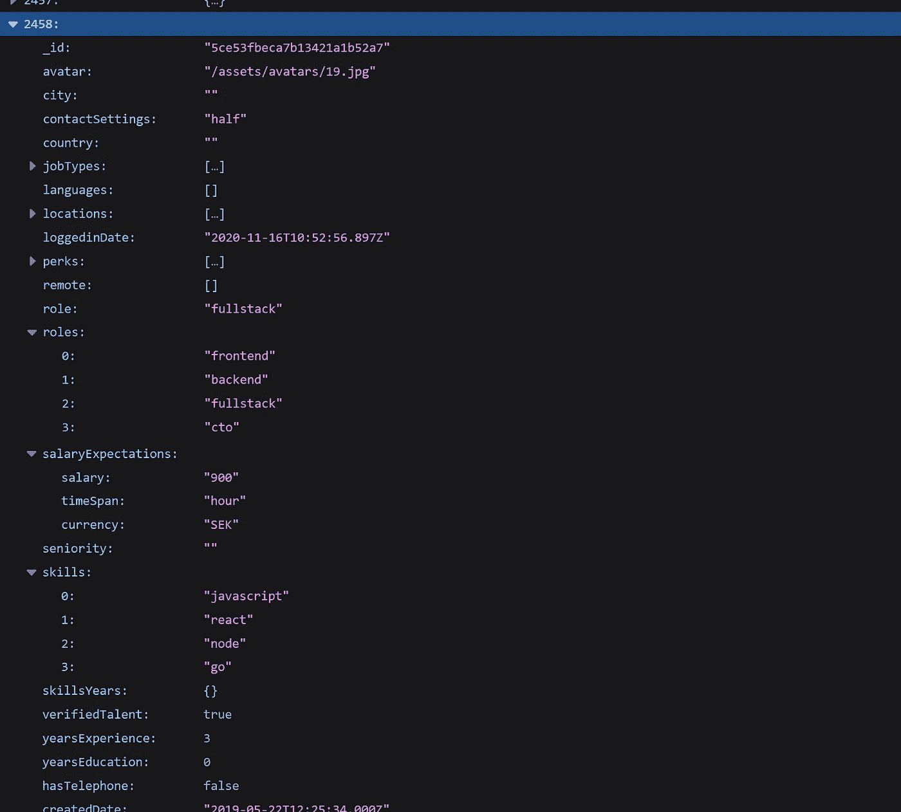

# 这个招聘网站公开暴露用户数据

> 原文：<https://javascript.plainenglish.io/this-recruitment-website-publicly-exposes-user-data-6a2f5736f805?source=collection_archive---------1----------------------->

Photo by [Sterlinglanier Lanier](https://unsplash.com/@sterlinglanier?utm_source=unsplash&utm_medium=referral&utm_content=creditCopyText).

## 我发现超过 1000 个用户的工资期望值

我控制不住自己。我总是检查网站，寻找[谎言](https://medium.com/dev-genius/are-14-people-currently-looking-at-this-product-e7fe8412f16b)和[促销代码](/this-website-accidentally-left-promo-codes-in-their-public-source-code-176c52fbfdc3)。这一次，我收到了 LinkedIn 的一条信息，邀请我加入一个名为 [WeTal](https://wetal.io/) 的平台，有人对我说这个平台“像 Tinder 一样，但为开发者提供工作岗位。”听起来没什么吸引力。我正要删除这条消息，但有些东西激起了我的兴趣。该消息包含一个到他们网站的链接，该链接包含一个 URL 参数，该参数包含推荐我的人的用户名。换句话说，我收到了一个类似这样的 URL:[https://wetal.io/invitation?user=theirusername](https://wetal.io/invitation?user=theirusername)。

显然，我不得不试着进入 https://wetal.io/invitation?user=null。Null 是编程中的一个关键字，基本意思是*没有值*。我很高兴地发现，去这个网址，当然，打破了网站。它最终看起来像是无限加载，重点是*看起来像*，因为网站的前端似乎没有正确更新。不管你在空的地方输入什么，这似乎都会发生。

我之所以知道网站只有*看起来*像是无限加载，是因为我查了网络调用。我想知道为什么网站加载如此之慢，但我最终发现有趣得多。我找到了数据。大量数据。

Network calls on [WeTal](https://wetal.io/invitation?user=null). In Windows, you can usually click F12 to open your browser’s developer tools. If that doesn’t work, you can right-click anywhere on the website and select something akin to “Inspect element” to open the developer tools. Once the tools are open, head on over to the tab that says “Network.” If the network tab is empty, try refreshing the website. Select “XHR” to filter the list to only show network requests. Double-click on a row to fetch that data in a new tab. Screenshot of [WeTal’s networks calls](https://wetal.io/invitation?user=null) made by the author on 2021–04–06.

# 这是大量的数据

我发现一大堆 API 调用(意思是网站和网络服务器之间的对话)包含大量数据，这些数据是公开的。博文、技能、公司、用户、工作、评论是我观察到的一些数据。

用户数据是我最感兴趣的。通过跟随[这个链接](https://wetal.io/api/users)，你可以访问(大概？)WeTal 的所有用户，以 JSON 文件的形式交付，其中每个条目代表一个用户。在撰写本文时，在服务器响应中找到了 2458 个用户的数据。 [WeTal 声称他们的平台上有 2500+](https://wetal.io/for-employers)。那些所谓的 40 多岁的用户在哪里，我当然不知道。

在我们继续之前，有几个问题可能会出现在你的脑海中，我想解决一下。我的意思是，我当然很担心。公开暴露用户数据？听起来像是重大安全漏洞！看了这些数据之后，我确信这些数据实际上是有意公开的。两个原因让我得出这个结论。第一，数据匿名化。在任何地方都没有暴露可识别的数据。其次，对看似可识别数据的访问受到正确限制。通过检查网络呼叫，我可以知道该网站通过访问以下链接获取个人用户数据:【https://wetal.io/api/users/username[。如果你试图点击那个链接，你会被拦在门外——这个请求是安全的。开发人员本可以对所有其他网络调用做同样的事情，但却选择了匿名化。](https://wetal.io/api/users/username)

换句话说:没有理由担心。该公司没有做错任何事情；这不是一个羞辱的故事。相反，他们似乎有意公开这些数据。我很好奇他们为什么这么做，所以我在大约五周前，也就是 2021 年 3 月 3 日，联系了 WeTal 的开发者。我很想知道他们将这些 API 调用公开的理由是什么。可悲的是，他们从未回复我。

An anonymous user found in [a server response on WeTal](https://wetal.io/api/users). This user is a freelancer with three years of work experience, who would expect a salary of 900 SEK per hour for their services as a developer. If you try to view the data in your browser, it might not look as structured as it does for me. Some browsers come with a built-in JSON viewer, but most don’t. You can download a JSON viewer extension for any major browser by going to your browser’s add-on/extension store and searching for JSON. Screenshot from [WeTal’s server response](https://wetal.io/api/users) taken by the author on 2021–04–06.

# 统计上有用的数据

正如我们已经确定的，数据被适当地匿名化，这符合我们的目的。我们对指认任何人都不感兴趣。我们对统计学感兴趣。看，这些数据包含了激动人心的信息。我们谈论的是诸如薪水期望值、经验年限和技能组合等数据。如果我们把这些因素放在一起，我们就可以根据专业人士多年的经验和技能，对他们期望的中值或平均工资进行统计分析。请注意，它没有告诉我们他们已经有多少薪水，而是告诉我们他们想要多少薪水。还要注意的是，绝大多数用户都居住在瑞典。

数据很乱。当然有 2458 个用户，但是他们中的大多数几乎没有输入任何数据。如果你排除每一个没有进入角色和工资预期的用户，你只剩下 1173 个用户(在撰写本文时)，勉强一半，这让我怀疑其中许多用户的真实性。尽管如此，1173 名用户在统计上仍然是一个很大的数字。人们可以下载这些数据并进行各种统计分析。

和往常一样，本文的重点是教你使用浏览器的开发工具找到令人兴奋的信息的技巧。好奇。网站是如何运营的？站点和服务器之间的数据是如何发送的？使用我在本文中介绍的技术，看看您会在其他网站上发现什么。哦，如果你觉得我应该报道些什么，请联系我。

说到接触，如果 WeTal 联系我，我会用他们的回应更新这篇文章。

*感谢阅读！如果你喜欢这篇文章，你可能也会喜欢这两段文字:*

 [## 一个网上商店的源代码中揭露的无耻谎言

### 14 个人真的在看这个产品吗？

medium.com](https://medium.com/dev-genius/are-14-people-currently-looking-at-this-product-e7fe8412f16b)  [## 这个网站不小心在源代码中留下了推广代码

### 通过浏览网站找到有趣的东西

javascript.plainenglish.io](/this-website-accidentally-left-promo-codes-in-their-public-source-code-176c52fbfdc3) 

*更多内容尽在*[***plain English . io***](https://plainenglish.io/)