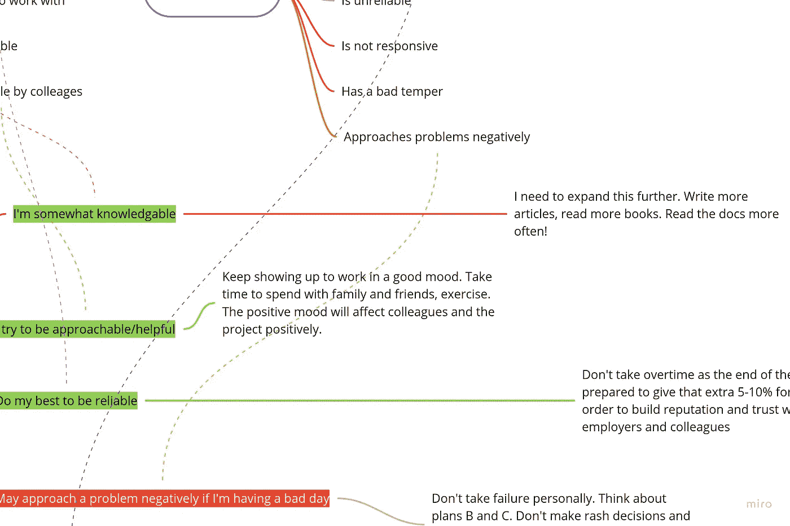

# 这个简单的练习将帮助你在任何面试中胜出

> 原文：<https://javascript.plainenglish.io/this-simple-exercise-will-help-you-ace-any-interview-ec22cb2833f6?source=collection_archive---------7----------------------->

## 书面面试练习

Photo by [Christina @ wocintechchat.com](https://unsplash.com/@wocintechchat?utm_source=medium&utm_medium=referral) on [Unsplash](https://unsplash.com?utm_source=medium&utm_medium=referral)

首先，为了通过任何面试，你将*几乎可以肯定*必须具备必要的知识。而且，即使你会听到人们说“我们雇佣员工，技术可以被教授”，你几乎肯定会*(除非你的雇主急需资源)必须跳过某个技术门槛才能通过。*

*证明你已经阅读了相关技术的官方文档，证明你已经阅读了你所选择的编程语言或一般的计算机科学基础知识，这肯定会让你在竞争中遥遥领先，因为你在第 0 天就带来了更多的价值。*

*记住，面试只是一个谈判步骤，最终是价值交换(金钱和你工作时间的经验)。也就是说，根据你的技术背景和工作描述，技术部分会有所不同。我想说的是软技能部分，它可以在技术(甚至不同的工作)之间转换。*

# *推销自己*

*人们通常最头疼的是“推销自己”这个术语。“我不是可以被贱卖的商品！”，我听到你哭了。我在这里的方法是将“我自己”视为一个分层的、独特的个体。当然，私下里，我喜欢我妻子从来不想和我一起看的冗长的俄罗斯电影，我开黄色的玩笑，以自己和亲密的朋友为代价，而且通常很幼稚/顽皮。这只是三个随机的特征，甚至我的朋友和我的妻子*可能会有不同的看法，她经常拒绝和我一起看精彩的电影，因为她认为它们很无聊*。我在这里要说的是，你的雇主并不像你的爱人那样关心这些品质。你是一个分层的个体，作为一个整体，你作为一个“专业人士”，只是一个独特的、无限深层的一层。我为什么要说这个？*

# *改变自己(作为专业人士)是可以的*

**

*Photo by [Martin Kleppe](https://unsplash.com/@aemkei?utm_source=medium&utm_medium=referral) on [Unsplash](https://unsplash.com?utm_source=medium&utm_medium=referral)*

*我想说的是，作为一个分层的个体，你不会因为改变加班方式而“出卖”自己。你如何对待工作，如何在工作场所穿针引线，这是一种**技能**，如果你想推进你的职业生涯，这是你需要努力的事情。我想指出的是，我并不主张你患上分裂型人格障碍或对雇主撒谎——为了得到一份工作而扭曲面试官的看法通常不会有好结果，因为如果你过分夸大一些不存在的特质，你将无法达到那些期望。你最终只会筋疲力尽，陷入冲突。相反，我在这里说的是，试着找出能让你进入任何(好)公司的完美特质。事实上，作为练习的第一部分——用一张纸，或者[米罗](https://miro.com/)或者只是一个谷歌文档，写下一张你认为完美员工所具备的特质清单。试着列出至少 7 个特征。*

# *知道自己的错误很重要*

*像其他任何事情一样，参加面试和获得一份好的项目/工作是一个不断尝试和犯错的过程。如果你被淘汰了，不是每个面试官都会给你反馈，事实上，大多数不会，你要么会得到一个笼统的回答，要么什么都没有。这里你需要做的是对工作流程进行逆向工程。想象一个糟糕的员工。随意想一想你不喜欢共事的同事(我肯定你脑子里有这样一个人)，试着描述他的特质，那些让你们的关系紧张或不正常的特质。回到你的工作表，在完美员工特质列表旁边，做一个新的列表——地狱员工列表。试着列出至少 7 个特征。*

# *设定一个你应该追求的理想，并定义你想要消除的特征*

*现在你已经描述了一个理想的员工和最差的员工，你已经描述了两个形象。记住，你在面试中的目标是给自己创造一种职业形象。所以，你在这里并没有违背真实的、私人的自我，你正在建立一个形象，这个形象是部分技能、部分个性(它的“有用”层)，你将在你的职业道路上把它作为一个模型、一个向导。看看这两个员工的特点，写一份你和他们共同的特点的新清单。试着寻找相似之处——如果你已经写了最差的员工从不遵守最后期限，而你一个月也有几次没有遵守最后期限，那么把这作为一个常见的负面因素写下来。对积极的方面也这样做——试着概括并诚实地说出你和每张照片共有的特征。不要把你列出的夸大考虑在内——总是/从不/有时在这里应该被忽略和等同。如果你没有至少 3 或 4 个共同特征(例如，2 个积极的和 2 个消极的)，试着从一开始就记住这一点(或者只是对自己更诚实)。用绿色标记正片，红色标记负片。*

# *考虑行动计划*

*既然你已经确定了你与这两个极端共有的积极和消极特征，那就制定一个行动计划吧。写下关于每个共同特征的几个句子。如果是积极的，如何增强它，如果是消极的，如何消除它。继续做下去，试着把它打印出来(或者保留书面清单)放在你桌子上的某个地方。*

# *结论*

**

*View the full mind map I did as an example [here](https://miro.com/app/board/o9J_ljuDqmg=/?invite_link_id=652002416780).*

*这个练习的原因是诚实地评估你当前的“状态”,并形成一个行动计划来改进。如果你是一个优秀的开发人员，你可以逃脱很多，但是在一天结束的时候，如果面试中的第一印象是强烈的，你总是“为自己做得更好”。不要害怕承认是什么让你对面试官没有吸引力，集中精力描述是什么让你脱颖而出。最重要的是，努力做出改变，以反映出**在就业市场上的理想形象**。**不诚实不是一个好的长期策略**，所以如果你需要改掉一个习惯，那就真的改掉它。*

*最后但同样重要的是，如果你对自己的工作满意，或者你的职业不是你的主要关注点，那就太好了。什么都不要改变。心理健康是一个经常被忽视的话题，尤其是远程和案头工作。做你喜欢的工作之外的事情。花点时间和你爱的人在一起，如果你觉得改善工作会给你带来“现实生活”的好处，那就努力改善吧。希望这份指南对你有帮助。它大致基于乔丹·彼得森(Jordan B. Peterson)的[性格评估](https://www.understandmyself.com/)，它确实帮助我度过了一些艰难时期，并让我的生活走上了“正确”的道路——所以如果你正在这方面挣扎，完成它可能是对你时间的一个很好的利用。*

**此外，如果你认为你有一些我可能遗漏或误解的见解，请在评论中自由讨论——这个主题很广泛，可以用无数种方式来处理。如果你想拓展你的人际网络，你可以在* [*Twitter*](https://twitter.com/SNimcevic) *和*[*LinkedIn*](https://www.linkedin.com/in/sini%C5%A1a-nim%C4%8Devi%C4%87-5b438996/)*上找到我。**

**更多内容请看*[***plain English . io***](http://plainenglish.io/)*