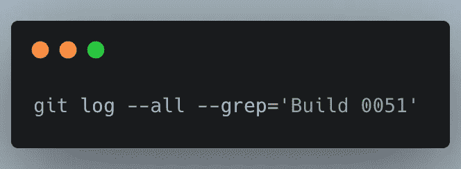
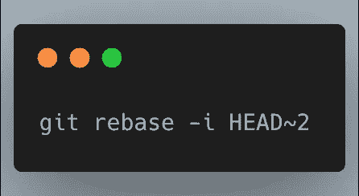
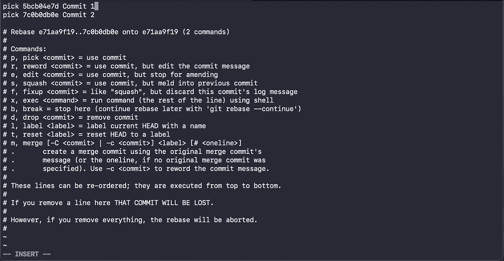
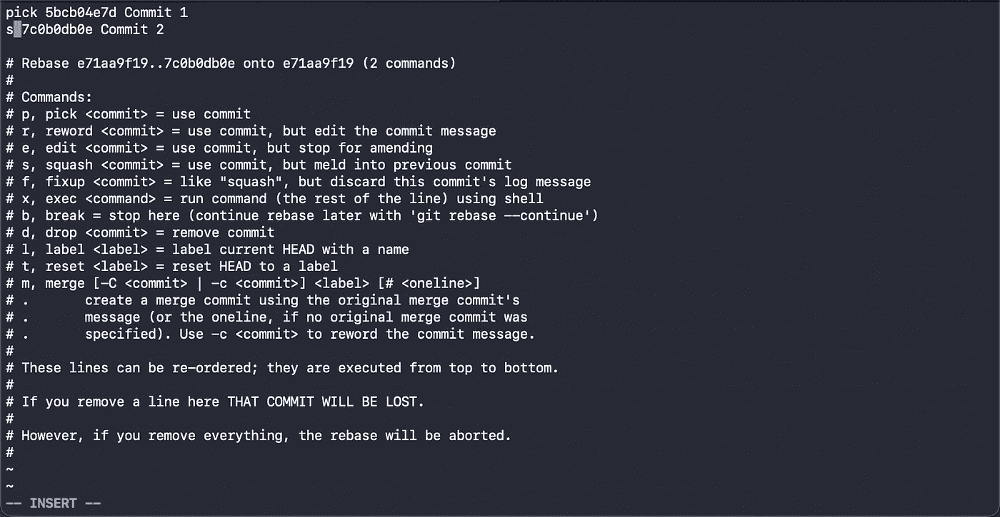
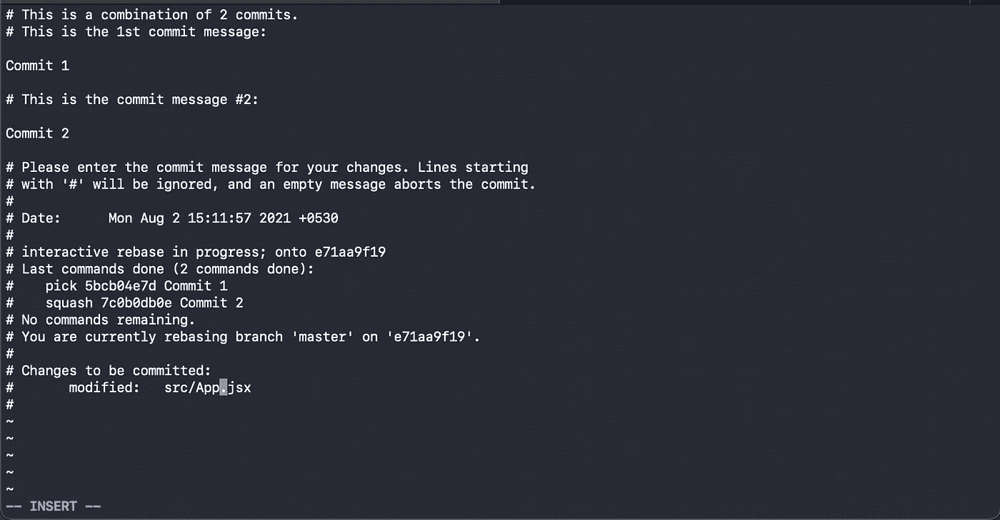
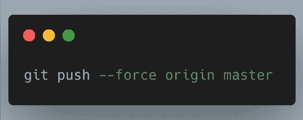
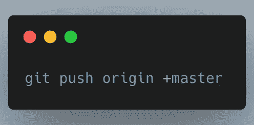

# 让你看起来像 Git 专家的 3 个命令

> 原文：<https://javascript.plainenglish.io/three-commands-that-will-make-you-look-pro-in-git-36805d9e06ef?source=collection_archive---------15----------------------->

在一个开发人员的生命周期中，一定有人遇到过 **Git** 并且想过掌握它以使他们的开发更容易。

所以这里有几个命令，会让你的生活变得轻松一些，让你在别人面前看起来像个专业人士。

# **在所有分支中搜索提交**

假设有一个提交，您需要[挑选](https://www.atlassian.com/git/tutorials/cherry-pick)，但是由于项目中有多个分支，您找不到它。但是您记得提交消息。

因此，您可以使用下面的命令来获取提交日志:

# **将多个提交合并成一个提交**

如果您在开发一个特性时创建了多个提交，而现在当您推动更改时，您希望所有的提交都在一个提交中分离，该怎么办？因此，您可以使用下面的命令:

This is for merging two commits

在执行上述命令后，它将打开一个编辑器，显示在重置基础时提到的提交数量。

要将*提交 2* 合并到*提交 1* ，您可以将*选择*替换为*提交 2* 前面的(即挤压)并保存它*(如下图所示)*

之后，它将再次打开一个编辑器进行编辑，并要求确认提交消息。保存后，Git 会将*提交 2* 合并到*提交 1* 中，从而产生一个提交。

# 强制推送的快捷方式

当开发人员想要改变他们的提交历史或者重写已经提交的提交时，他们利用重定基础，不仅改变提交，而且替换它们并完全创建新的提交(*就像我们在上面做的*)。

为了推送更新的提交，必须使用以下命令对远程分支进行强制推送:

现在，您可以使用此快捷方式来执行相同的强制推送命令

希望这能帮到你，让你看起来像个专业人士😎。编码快乐！👨🏻‍💻

*更多内容请看*[***plain English . io***](http://plainenglish.io/)