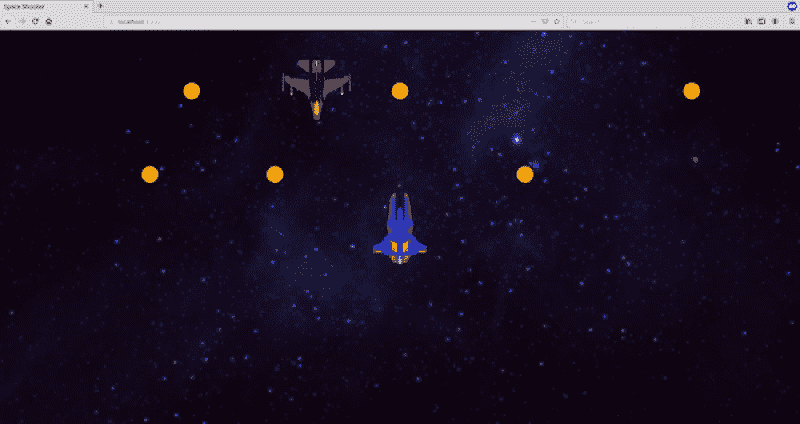

# Three.js 教程:如何构建你的第一个浏览器游戏——太空射手

> 原文：<https://javascript.plainenglish.io/three-js-tutorial-to-build-your-first-browser-game-ae34bb0d351d?source=collection_archive---------0----------------------->

## 使用 JavaScript 库 Three.js 开发你的第一个游戏的分步指南


Space-Shooter: 2D Browser Game

嘿！今天我们将学习如何使用 Three.js 构建浏览器游戏！这将是一个简单的演练教程，其中我们创建了著名的*“太空射手”*游戏(就像[这个](https://play.google.com/store/apps/details?id=com.game.space.shooter2))，每个步骤后都有源代码链接，让你容易理解。

哦，顺便说一下，这就是你的游戏将会是什么样子的: [**太空射手**](https://fik-shun.github.io/Space-Shooter-ThreeJS/)

那么，你对创建自己的游戏感到兴奋吗？？那我们走吧！


Three.js 是一个*跨浏览器* JavaScript 库和应用程序编程接口，使得使用 *WebGL* 在 web 浏览器中创建和显示动画 3D 图形变得非常容易。

对于本教程，我将假设你熟悉 Three.js 的基础知识，但如果你是一个完全的初学者，那么我强烈建议你先浏览一下这个[初学者指南](https://medium.com/@benjamin.c.coleman/the-beginners-guide-to-beginning-three-js-c36b8947c2aa)和这个惊人的[系列](https://www.youtube.com/playlist?list=PLRtjMdoYXLf6mvjCmrltvsD0j12ZQDMfE)。此外，一定要查看 Three.js 的[官方文档](https://threejs.org/docs/)，当你对一些 Three.js 类/方法感到困惑时，这些会派上用场。

# 第一步。初始化

让我们首先组织我们的目录结构并创建一个样板文件，这对您将来的 Three.js 项目会有帮助。我们将要讨论的方法受到了这篇文章的启发。

*   首先，我们创建一个`**index.html**`文件。这将是我们网页/游戏的*入口。*基本上就是一个带有 canvas 元素的空白 HTML 页面，链接了 Three.js 库和其他 js 文件。每当我们创建一个新的 js 文件时，我们将回到`index.html`并在这里链接它。
*   接下来，我们创建`**main.js**`，它是应用程序 JavaScript 端的*入口点，可以访问 DOM 并包含 SceneManager。*
*   最后，我们创建`**SceneManager.js**`，它是*负责处理 app 的 Three.js 端*，对 main 完全隐藏。它对 DOM 一无所知，并且创建场景、渲染器和正交照相机。是的，我们将使用正交照相机，因为这将是一场 2D 的比赛。

这种初始化对于所有的 Three.js 项目都是一样的。所以你可以直接去 [*这个样板文件*](https://github.com/Fik-shun/threejs-game-medium/tree/step-1) ，克隆它，然后开始工作。

为了**测试**我们的应用程序，我们将在浏览器中运行`python3 -m http.server`并前往 [localhost:8000](http://localhost:8000) 。

您应该会看到一个黑屏(如下图所示)，这是一个好的开始！


**步骤 1 后的源代码:** [链接](https://github.com/Fik-shun/threejs-game-medium/tree/step-1)

# 第二步。添加场景主题

我们现在将添加对象到我们的游戏中。首先，让我们给游戏添加一个像样的背景和我们的飞船。

*   让我们创建文件`**Background.js**`，并创建一个平面(将作为我们的背景)，并添加纹理(图像)。我们将定位我们的平面，使其下端接触我们浏览器窗口的底部，因此我们将通过`(3000-window.height)/2`沿 y 轴平移它。

*   接下来，我们将从网上下载一个免费的 3D 模型( [sketchfab](https://sketchfab.com/features/free-3d-models) ， [cgtrader](https://www.cgtrader.com/free-3d-models) 等)。)并将其存储在`assets/`中。在`**Spaceship.js**`内部，我们将加载模型，添加纹理并存储其尺寸。对于加载模型，我们必须在`index.html`中为我们的模型扩展*单独链接加载器*(我正在为我的`.obj`模型链接 OBJLoader)

```
<script src="[https://unpkg.com/three@0.87.0/examples/js/loaders/OBJLoader.js](https://unpkg.com/three@0.87.0/examples/js/loaders/OBJLoader.js)"> </script>
```

下面是`Spaceship.js`的一个片段。请注意，我们这里还有一个 update 方法，每一帧都会调用它。

*   在`**SceneManager.js**`中，我们将创建一个新方法`createSceneSubjects`来初始化我们的对象(背景和飞船)。我们还将维护一个动态主题数组*(那些需要每帧更新的)。*

```
*function createSceneSubjects(scene) {
    theBackground = new Background(scene);
    theSpaceship  = new Spaceship(scene); dynamicSubjects.push(theSpaceship);
}*
```

***记住**链接`index.html`里面新的`.js` 文件。在重新加载浏览器时，我们的游戏看起来像这样。耶，我们的太空船来了！*

**

***步骤 2 后的源代码:** [链接](https://github.com/Fik-shun/threejs-game-medium/tree/step-2)*

# *第三步。移动我们的场景*

*我们现在将移动我们的场景，因此以恒定的速度向上移动相机和宇宙飞船(直到背景持续)。*

*   *在`**Spaceship.js**`的更新功能里面，我们沿着 y 轴匀速平移我们的飞船。*

```
*this.update = function() {
    if (this.model)
        this.model.position.y += 1;
}*
```

*   *类似地，我们以相同的恒定速度沿 y 轴平移相机。我们还将在每一帧调用 dynamicSubjects 的 update 方法。`SceneManager.js`的更新方法是这样的:*

```
*this.update = function() {
    if (camera.position.y < 2000) {
        camera.position.y += 1;
        for(let i=0; i<dynamicSubjects.length; i++)
            dynamicSubjects[i].update();
    }
    renderer.render(scene, camera);
}*
```

*太好了！重新装弹时，我们的场景在移动。🎆 🎆*

**

***第三步后的源代码:** [链接](https://github.com/Fik-shun/threejs-game-medium/tree/step-3)*

# *第四步。控制我们的飞船*

*游戏的基础已经建立，但我们现在想乘坐我们的飞船在太空中移动！是时候处理输入了。*

*   *在`**main.js**`内部，我们将为`window.onkeydown`和`window.onkeyup`添加*事件监听器*，并调用 SceneManager 的`handleInput`方法。*

```
*function bindEventListeners() {
    window.onkeydown = handleKeyDown;
    window.onkeyup = handleKeyUp;
}function handleKeyDown(event) {
    var keyCode = event.which;
    sceneManager.handleInput(keyCode, true);
}
function handleKeyUp(event) {
    var keyCode = event.which;
    sceneManager.handleInput(keyCode, false);
}*
```

*   *在`**SceneManager.js**`内部，我们将维护一个键映射，它存储每个键的状态(如果按下则为*真*，否则为*假*)，这些键将在更新中被发送到我们飞船的`handleInput`方法。我们将更新 SceneManager 的`handleInput`方法中的键映射。*

```
*this.update = function() {
    ...
    theSpaceship.handleInput(keyMap);
    ...
}
this.handleInput = function(keyCode, isDown) {
    keyMap[keyCode] = isDown;
}*
```

*   *最后，我们将映射键 *W，S，A，D* 以在相应的方向平移飞船，同时确保它不会越界。*

```
*this.handleInput = function(keyMap, camera) {

    if (keyMap[87] && (this.model.position.y + this.height/2 < camera.position.y + camera.top)) {
        this.model.position.y += 5;
    }
    if (keyMap[83] && (this.model.position.y - this.height/2 > camera.position.y + camera.bottom)) {
        this.model.position.y -= 5;
    }
    if (keyMap[68] && (this.model.position.x + this.width/2 < camera.right)) {
        this.model.position.x += 5;   
    }
    if (keyMap[65] && (this.model.position.x - this.width/2 > camera.left)) {
        this.model.position.x -= 5;
    }
}*
```

*重新载入网页后，你就可以移动飞船了！🚀 🎆*

**

***步骤 4 后的源代码:** [链接](https://github.com/Fik-shun/threejs-game-medium/tree/step-4)*

# *第五步。添加硬币和敌人*

*让我们通过添加硬币和敌人来使我们的游戏更有趣。*

*   *在`Coin.js`中创建一个新组件，创建一个球体，将其涂成金色，定位并存储其高度/宽度。*

*   *现在创建一个函数`placeCoins`来随机地**将硬币散布在整个背景平面上，并在场景管理器的`createSceneSubjects`方法中调用这个函数。***
*   ***同样，你可以添加敌人并随机放置。我使用了敌人的`.gltf`模型，因此链接了`index.html`中的 GLTFLoader。另外，*不要忘记*链接新的 JavaScript 文件。***

***我们的游戏现在看起来很刺激。但是我们如何对抗敌人呢？***

******

*****步骤 5 后的源代码:** [链接](https://github.com/Fik-shun/threejs-game-medium/tree/step-5)***

# ***第六步。发射导弹***

***我们现在允许我们的飞船向我们的敌人发射导弹。同样，我们将创建一个导弹组件，每当按下空格键时初始化它，并给它一个恒定的速度。***

*   ***所以造一个*导弹*组件类似上面的敌人。然后，在 SceneManager 的更新方法中，我们将处理 *Space* 输入并将我们的导弹存储在一个数组中:***

```
***this.update = function() {
    ...
    if (keyMap[32]) {
        var x = theSpaceship.model.position.x;
        var y = theSpaceship.model.position.y + theSpaceship.height/2; const m = new Missile(scene, x, y); dynamicSubjects.push(m);
        theMissiles.push(m);
        keyMap[32] = false;
    }
    ...
}***
```

***哇哦。我们终于可以射杀我们的敌人了，但是等等...为什么我们的敌人没有被消灭？***

******

*****第六步后的源代码:** [链接](https://github.com/Fik-shun/threejs-game-medium/tree/step-6)***

# ***第七步。冲突检出***

***我们需要在游戏中加入碰撞检测，这样我们的飞船可以收集硬币，我们的导弹可以杀死敌人，飞船在与敌人碰撞时的生命值会减少。于是我们寻找这些模型之间的 ***交集***:(a)飞船&所有硬币，(b)飞船&所有敌人，(c)所有导弹&所有敌人。***

*   ***我们需要在每一帧的*中检查碰撞，所以让我们创建一个函数`checkCollsions`并在更新方法中调用它。下面的`isCollision`函数将使用两个模型的位置和尺寸来确定它们之间的交集。****

***现在当我们重新加载时，我们的游戏感觉非常棒！***

******

*****第 7 步后的源代码:** [链接](https://github.com/Fik-shun/threejs-game-medium/tree/step-7)***

# ***第八步。添加记分板***

***最后，我们将使用基本的 HTML 在游戏顶部添加一个记分牌。***

*   ***我们将简单地在`index.html`中添加两个*div*:一个用于记分牌，另一个用于显示*‘游戏结束’*或*‘你输了’*，并赋予它们适当的样式。***

```
***<div id=”scoreboard”>HEALTH: 3 &emsp; SCORE: 0</div>
<div id="gameover"></div><style type="text/css">
    #scoreboard {
      position: absolute;
      top: 10px;
      width: 100%;
      z-index: 100;
      font-size: 40px;
      color: white;
      display:block;
    } #gameover {
      z-index: 100;
      color: white;
      font-size: 120px;
      position: fixed;
      top: 50%;
      left: 50%;
      transform: translate(-50%, -50%);
    }
</style>***
```

*   ***在 ***每次碰撞*** 后，我们更新我们的变量*分数*和*健康*并更新记分牌 *div* 。当我们飞船的*生命值*降到 0 时，我们显示— **你输了**，当摄像机到达我们背景的尽头时，我们将显示— **游戏结束**。***

***就是这样！我们的游戏是 ***终于*** 完成了，看起来太好玩了！***

******

*****步骤 8 后的源代码:** [链接](https://github.com/Fik-shun/threejs-game-medium/tree/step-8)***

# ***结论***

***就这样，我们结束了。你可以在这里找到最终游戏[的源代码](https://github.com/Fik-shun/threejs-game-medium/)。***

***将这款游戏转换为 **3D** 相当简单——你只需要将相机转换到*视角*并重新定位！在这里查看我的同一游戏[的 **3D 版本**，在这里](https://fik-shun.github.io/Fik-shoot/)获取其源代码[。](https://github.com/Fik-shun/Fik-shoot)***

******

***我还为 ***Unity3D*** 中的游戏制作了一个简短的**预告/预告片**，同样令人难以置信！看这里的！***

***你可以给你的游戏增加更多的功能，比如强大的敌人(可以躲避导弹并向我们的飞船射击)，提高美感，或者增加飞船的速度。***

***非常感谢你的时间。希望你喜欢这个教程，它帮助你建立一个神话般的游戏。一旦完成，一定要上传(也许在 GitHub 上)并在评论中分享链接。我很想玩它们！***

***甚至在这之前我也是初学 Three.js。但是在这个过程中我学到了很多。我做的可能不完美，但肯定是打造一个完美游戏的良好开端。***

***如果你觉得这个游戏缺少了什么或者可以有某些改进，请留下你的建议。如果你有任何疑问或遇到困难，请在评论中提出你的疑问。我会尽力帮忙的！***

***到时候见。下次见！***

## ***资源***

*   *****Three.js 基础知识:** [文章](https://medium.com/@benjamin.c.coleman/the-beginners-guide-to-beginning-three-js-c36b8947c2aa)，[视频系列](https://www.youtube.com/playlist?list=PLRtjMdoYXLf6mvjCmrltvsD0j12ZQDMfE)，[公文](https://threejs.org/docs/)***
*   *****整理 Three.js 项目:** [文章](https://pierfrancesco-soffritti.medium.com/how-to-organize-the-structure-of-a-three-js-project-77649f58fa3f)***
*   *****游戏源代码:** [2D 版](https://github.com/Fik-shun/threejs-game-medium/) & [3D 版](https://github.com/Fik-shun/Fik-shoot/)***

****更多内容请看*[*plain English . io*](http://plainenglish.io/)***