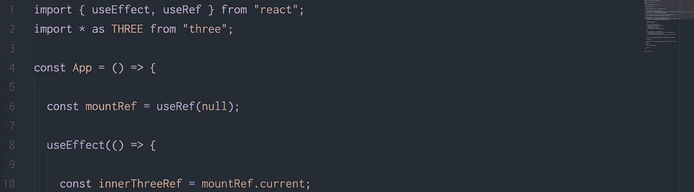
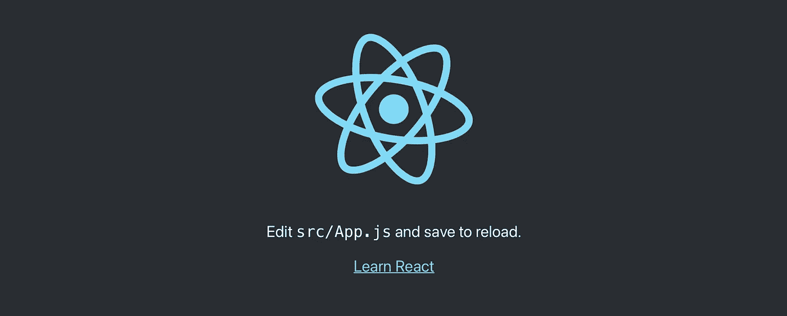

# 带有 React 挂钩的 Three.js

> 原文：<https://javascript.plainenglish.io/three-js-with-react-functional-component-9e66e08dbeac?source=collection_archive---------1----------------------->

## 通过 7 个简单的步骤，将一个 Three.js 场景添加到 React 应用程序中，并观看 3D 奇迹的发生！

Get a React app up and running with Three.js in 7 easy steps!

# 1.创建您的项目

假设您还没有启动并运行 React 项目，启动新项目的最简单方法是在命令行中运行`npx create-react-app my-app`，等待初始化完成，然后通过运行`cd my-app`导航到 React 应用程序的新文件夹。

# 2.安装并导入 Three.js

在命令行中，让我们安装 Three.js。运行`npm install three`来安装 Three.js 作为项目的依赖项。在进入我们的代码之前，让我们通过运行`npm start`来启动我们的应用程序。导航到`localhost:3000`。如果一切顺利，我们现在应该看到默认的起始页，它鼓励我们“编辑 src/App.js 并保存以重新加载”。让我们去做吧！

If everything’s gone right, this is what the site should look like.

# 3.导入三个，useEffect 和 useRef

让我们稍微清理一下 App.js，删除我们不需要的行，然后导入:

*   useEffect(一旦组件被挂载，我们将使用它来添加和删除我们的 Three.js 场景)，
*   useRef(告诉 React 场景应该安装在哪里)，以及
*   Three.js 库。

# 4.复制粘贴我们的 Three.js 代码

我们现在已经设置了我们的 useEffect-function，并复制粘贴了来自 [Three.js 指南中关于如何创建场景的代码](https://threejs.org/docs/index.html#manual/en/introduction/Creating-a-scene)(为了更好的可读性，我添加了一些空格)。这段代码将场景直接附加到文档体，在第 14 行:`document.body.appendChild(renderer.domElement)`。

起初这可能看起来根本不是问题，但是如果我们看看我们的开发人员工具，我们可以看到画布已经附加在我们的`<body>`标签的最后，如果我们在我们的`
`标签之间添加一行文本，这变得更加明显。让我们在下一步解决这个问题！

At this point you should have a rotating green cube on your page, yay!

# 5.使用 useRef 将场景挂载到我们的 div 上

我们定义了一个名为`mountRef`的`const`，并在我们的 useEffect-function 之前将其赋值为`useRef(null)`。然后我们告诉 React，我们创建的引用应该通过添加属性`ref={mountRef}`来引用我们的`
`元素。最后，我们用`mountRef.current`替换`document.body`来将场景挂载到我们引用的`
`元素上。

# 6.清理东西

如果你在浏览器打开的情况下保存了几次文件，你会注意到我们在页面上添加了很多场景。这是因为每次我们保存时，组件都会被重新渲染，并将另一个场景添加到页面中。在第 5 步之前，我们在 useEffect-function 中没有任何清理。在第 5 步第 34 行添加的代码告诉 React，在组件被卸载之前，它应该从我们的`
`元素中移除场景，并在组件被再次装载时重新添加。如果你现在手动更新浏览器，你会注意到页面上只有一个场景。

# 7.收尾

最后，当窗口调整大小时，我们希望我们的场景适应它的大小。在第 31–37 行，我们添加了一个简单的函数，它可以调整相机的大小，更新投影矩阵，并告诉渲染器调整大小。轻松点。

[此处提供回购的完整代码！](https://github.com/coreAux/react-threejs)

*更多内容尽在*[***plain English . io***](https://plainenglish.io/)