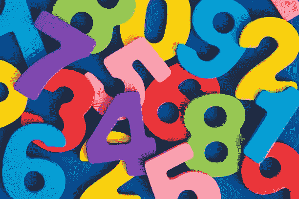

# 三个数和问题

> 原文：<https://javascript.plainenglish.io/three-number-sum-problem-52840b032801?source=collection_archive---------11----------------------->

大多数程序员都熟悉二进制数和问题，这是一个在技术面试中可能会遇到的常见问题。这是我在自己面试准备过程中研究的第一个问题，也是我认为对于适应一般算法来说是一个很好的起点。

如果你没听说过两个总和，这里有一篇我之前写的[博客文章](/two-sum-problem-hash-map-solution-581779a56022)更详细地讨论了这个问题。这篇文章将关注一个*非常*相似的问题，这个问题有点困难，因为有……**三个数字**。

以下是表述**问题陈述**的一种可能方式:

> 给定一个由不同整数组成的非空数组和一个代表目标和的整数，编写一个函数，查找数组中所有与目标和相加的三元组，并返回一个包含三元组的二维数组。如果找不到与目标总和相加的数字，则返回一个空数组。

**示例:**

输入数组:[8，10，-2，49，14]

目标金额:57

输出:[-2，10，49]]

**溶液**

我对这个问题的*首选*方法是**两点**策略。虽然我可以像处理两个和问题一样使用哈希表方法，但我发现在这种情况下，两个指针(也称滑动窗口)技术更直观。不过，这只是我个人的喜好；使用哈希表进行三个数求和是一种有效的方法，并且具有相同的时间复杂性，这使得它成为一个很好的解决方案，我可能会在以后的文章中介绍它。

让我们看看两个指针的解决方案，如下所示。

第一步是按升序对输入数组中的数字进行排序。接下来，我们创建一个 const **result** ，它有一个(初始)空数组的值，我们将用来存储三元组。

通过使用 for 循环并从第一个数字开始迭代输入数组。这是我们建立两个指针的地方，左**和右**。左指针的初始值是 i+1，这是当前数字索引之后的一个索引(即我们当前看到的索引，最初是 0，因为我们从数组中的第一个数字开始)。右指针的初始值是 arr.length-1，它告诉我们它指向输入数组中的最后一个数字。当我们遍历数组寻找三元组时，这些指针会改变它们的位置。****

****一旦我们将指针设置在它们各自的位置，我们就进入检查我们正在查看的三个数字(当前索引、左指针和右指针)相加是否达到目标和的部分。如果它们满足我们的条件，我们将它们添加到结果数组，增加左指针，减少右指针，从而移动当前三元组的位置。如果当前三元组总和小于目标总和，我们将左指针向右移动一个索引。如果当前总和大于目标值，我们将右指针向左移动一个索引。我们继续这个比较和的过程，直到我们检查了输入数组中所有可能的三元组。最后，我们返回结果数组，该数组要么包含“获胜”的三元组，要么为空。****

******时间和空间复杂度******

*   ****时间:o(^北部 2)****
*   ****Space: O(n)(其中 n 是数组中元素的数量)****