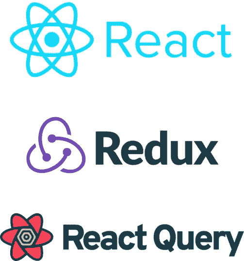

# React 项目中处理数据提取逻辑的 3 种方法

> 原文：<https://javascript.plainenglish.io/three-ways-to-handle-data-fetching-logic-in-react-projects-91b06eeefa70?source=collection_archive---------3----------------------->

## 探索并找到 React 项目中处理数据获取逻辑的 3 种方法中的最佳方法。



The three ways to do it.

# 最简单的方法

除了浏览器支持的[获取 API](https://developer.mozilla.org/en-US/docs/Web/API/Fetch_API/Using_Fetch) 之外，不要使用任何库。

这里有一个例子:

What is wrong with this?

这可能是在一个基本的 web 应用程序中实现的方式，但是大多数时候我们都是用各种 API 调用来构建复杂的东西。上述方法虽然简单，但并不是在复杂的应用程序中处理数据获取逻辑的最佳方式。原因是它使你的组件看起来逻辑臃肿，你必须写很多非业务逻辑。您可以通过创建一个自定义挂钩并抽象出逻辑来改进这一点。或者更好的方法是使用外部库，它提供的不仅仅是获取数据，如下所示。

# Redux 方式

如果你的项目已经在 [Redux 工具包](https://redux-toolkit.js.org/introduction/getting-started)的帮助下使用了 [Redux](https://redux.js.org/introduction/getting-started) ，那么你可以使用 [RTK 查询](https://redux-toolkit.js.org/rtk-query/overview)来处理这个逻辑。它在内部使用 fetch，所以你只需要设置端点和基本 URL。

以下是您的设置方法:

```
npm install @reduxjs/toolkit react-redux
```

然后在项目目录中创建一个包含 API 定义的服务文件夹:

src/services/todo.js

您已经可以看到如何在一个地方设置所有端点。接下来，你要做的就是建立你的商店。记得像我一样导出自动生成的钩子，这是 [RTK 查询](https://redux-toolkit.js.org/rtk-query/usage/queries)文档想要你做的。

src/store.js

中间件是可选的，但是提供了注释中提到的附加特性。剩下的就是把商店提供给你的 app 了。

src/index.js

最后，在组件中，调用如下所示的查询:

src/components/ReduxWay.js

您可以看到您的组件现在看起来有多精简。

# React 查询方式

做复杂事情的最简单方法。

以下是您的设置方法:

```
npm install react-query
```

然后以与 Redux 相似的方式设置您的 API。除了更少的样板代码。

src/services/todoReactQuery.js

然后，向组件甚至整个应用程序提供查询客户端。在这里，我将它包装在组件本身上。

src/app.js

最后，在组件中进行 API 调用。

Again the code is as clean as the Redux one.

# 那么，哪种方式是最好的呢？

这完全取决于您的团队和项目需求，但是 React Query 是处理服务器和客户端之间所有通信的方法。虽然 Redux 也试图用 RTK Query 插件来做这件事，但 React Query 提供了更多的功能，因为它是为这个特定的用例设计的。如果您的项目已经使用 Redux，使用 RTK Query 可能会更好，而不是向您的项目添加额外的包，尽管与 React Query 相比，社区对 Redux 这方面的支持仍然很低。

阅读下面的比较，做出更好的决定。

*   React Query 与其他库的比较。
*   [RTK 查询与其他库的比较。](https://redux-toolkit.js.org/rtk-query/comparison)

您可以在我的 GitHub 上找到所有三个实现的完整代码。

[](https://github.com/yaralahruthik/DataFetchingLogicReact) [## GitHub-yaralahruthik/DataFetchingLogicReact

### 包括数据提取逻辑的三种实现。在中运行应用程序…

github.com](https://github.com/yaralahruthik/DataFetchingLogicReact) 

感谢您的阅读。

*更多内容看* [*说白了. io*](http://plainenglish.io/) *。报名参加我们的* [*免费周报*](http://newsletter.plainenglish.io/) *。在我们的* [*社区*](https://discord.gg/GtDtUAvyhW) *获得独家写作机会和建议。*