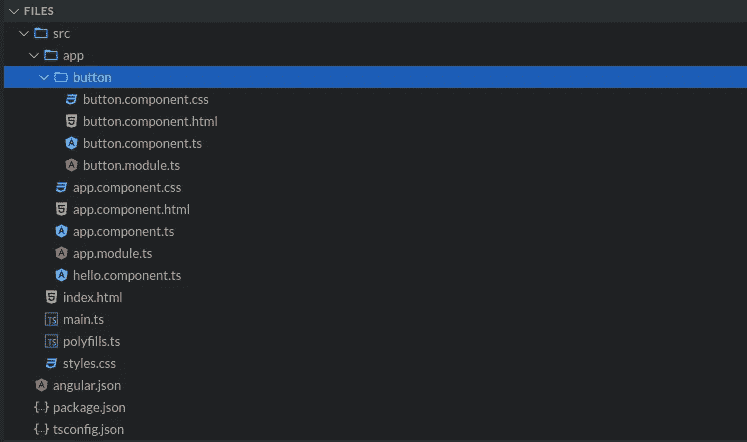
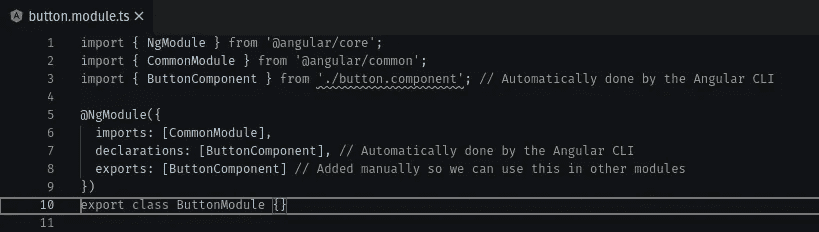
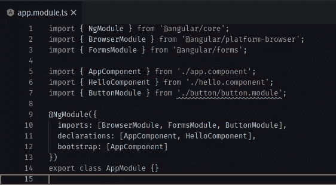
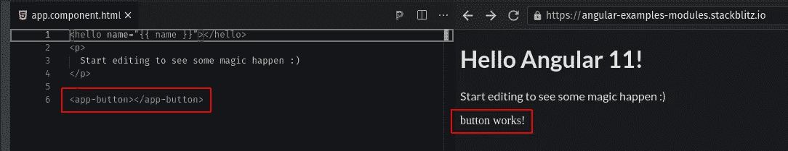

# 为什么我们应该扔掉 React，拿起 Angular

> 原文：<https://javascript.plainenglish.io/throw-out-react-and-pick-up-angular-8b578bb7cabc?source=collection_archive---------0----------------------->


好了，我写了一点关于[为什么我认为我们应该停止使用 React](https://sredmond.medium.com/why-we-need-to-stop-using-react-1ae3ec7959a4) 的内容。总结一下这篇文章，我对 React 有几个主要问题:

1.  推动其流行的主要是炒作。
2.  它给了你太多的自由，这导致你在早期犯一些非常基本的错误，这是你以后要做的破坏。
3.  这是一个记忆猪，而不是树动摇。
4.  你的 React 应用程序变得越大越复杂，维护起来也很麻烦。
5.  它没有内置任何东西(比如表单处理)，所以你必须写很多复杂的代码来弥补，或者安装一堆第三方依赖项。
6.  将应用程序升级到最新版本通常需要完全重写。

这些是我个人在处理各种 React 项目时面临的最大问题。在这篇文章中，我想和你分享 Angular 是如何解决这些问题的，并且让你能够专注于你正在构建的东西，而不是你如何构建它。

# 所有登上炒作列车

Angular 也得到了大量的宣传，所以我不能真正说 Angular“解决”了这个特殊的问题。首先，我不认为 Angular 得到了 React 那样的大肆宣传。我认为这主要与谷歌如何给它品牌化有关。首先，有一个棱角分明的 JS，这是一个巨大的垃圾蒸汽堆。我要赞扬谷歌，因为他们决定彻底检查 Angular JS，把它变成 Angular(或 Angular 2)，这是一个巨大的改进。我认为这种改进是以它的受欢迎程度为代价的。

我个人认为他们应该把 Angular 换成别的名字，因为 Angular JS 和 Angular 一点都不像。从字面上看，唯一的相似之处是名称和生产公司。

在我看来，我确实认为 Angular 值得大肆宣传。我认为 Angular devs 已经创建了一个非常好的框架，它既能很好地执行，又非常容易使用。我将在本文中更多地讨论使用 Angular 的优势，也许到最后你会同意我的观点，认为 Angular 的宣传是当之无愧的。

# 你会得到你想要的

Angular 和 React 之间最大的区别之一是 Angular 是一个成熟的框架，而不仅仅是一个库。正如我在上一篇文章中所讨论的，React 试图同时拥有库和框架的优势，但在这两方面都做得很差。相比之下，Angular 并没有试图成为一个库，而是全力以赴成为一个框架，而且做得非常好。

通过 Angular 的基本安装，您可以获得几乎所有您需要的东西，以便构建您想要的任何应用程序，而不必安装任何第三方库(我已经知道您在想什么，我们会实现这一点)。有了 Angular，你就有了一个健壮的框架，它让你有所作为，而不是拖你的后腿。你不必花大量的时间编写大量复杂的代码来做表单处理或验证之类的事情，因为这些都在框架中处理。

此外，您还可以获得 Angular CLI 之类的东西，这是 Angular 系列中最强大的工具之一。


developers using the Angular CLI

我对 React 最大的问题之一是缺乏标准。如果你学了一个 React 应用程序，你就学会了一个 React 应用程序，因为它们完全不同。另一方面，如果你学习了一种角度应用，你就学会了所有角度应用，而角度 CLI 是其背后的主要驱动力。

与 React 不同，Angular 做事有对错之分。使用 CLI 通常可以确保您总是以正确的方式做事。让我们从头开始。我们想要创建一个新的应用程序，那么它是如何工作的呢？

```
ng new my-app
```

对，就是这样。运行此命令，CLI 将为您设置一堆东西。它甚至会给你一些选项，比如林挺。您可以在创建应用程序之前选择的样式系统和路径。所以接下来会发生这样的事情:

1.  它将创建一个名为 my-app 的目录，并在其中初始化一个 Angular 应用程序，并为您安装依赖项。
2.  搭建您的新应用程序，让您在应用程序完成后立即运行应用程序。
3.  除了搭建之外，您还将获得一个带有量角器的基线端到端测试实现，您可以在应用程序运行过程中添加量角器。
4.  angular 为您提供了一个易于使用的配置文件(angular.json ),您可以在其中轻松定制 Angular 如何构建您的应用程序，甚至是环境如何完成的。
5.  说到环境，Angular 还内置了一个易于管理的类型化环境管理系统。

我可能会谈到你得到的更多，但这已经是你直接从盒子里得到的许多东西，你只是没有反应。那么 CLI 还能给你什么呢？


除了创建和搭建你的整个应用程序，它还将为你管理你的应用程序。假设现在你有一个闪亮的新应用程序，你想创建一个组件。

```
ng generate component my-component OR ng g c my-component
```

有两种方法可以生成一个组件，它们基本上是长指令和短指令，这很好。这也做了几件事:

1.  创建一个名为 my-component 的目录，并在其中放置一个空白的 slate 组件。
2.  自动为该组件生成单元测试。
3.  自动将组件移植到应用程序的结构中。

# 棱角分明的方式

所以我提到了做事的正确和错误的方法，我也提到了一些发生在脚手架周围的事情，但是那看起来像什么呢？我将简要回顾一下高层次的概念，而不是从角度出发。我会用一些你能在 stackblitz 上找到的例子:[https://stackblitz.com/edit/angular-examples-modules](https://stackblitz.com/edit/angular-examples-modules)

我们将建立一个超级简单的示例应用程序。在每个 Angular 应用程序中，都有基础应用程序文件。然后，我们将需要一个自定义按钮组件。我们将使用 Angular CLI 并运行两个命令:

```
ng g m button
ng g c button
```



在本例中，我们有一个名为 button 的文件夹。在该文件夹中，有一个按钮模块、按钮组件、按钮测试文件、按钮样式表和按钮 HTML 文件。

*快速注意，Stackblitz 不生成。规格或测试文件。在您的本地编辑器中，将为您创建一个 button.component.spec.ts 文件，其中包含一个基本的“does it render”测试，您可以在进行过程中添加测试。*

这都是由 Angular CLI 自动生成的。如果你注意到命令的顺序非常具体，那是有原因的。首先，我们需要一个模块来包含我们的按钮组件。然后，我们创建名为 button 的组件，CLI 会自动将您的新组件导入到模块中。然后，我们将导出按钮组件，以便在应用程序的另一个模块中使用它。



为了简单起见，我们只需将其导入 app.module.ts。我们要做的是导入 app.module.ts 中的 ButtonModule，然后将 ButtonModule 包含在 AppModule 的@NgModule decorator 的导入中。



就这样，现在我们可以在我们的 app.component.html 文件中使用标签`<app-button></app-button>`。



这是在 Angular 中使用模块的最简单的实现，你可以用它做更多的事情，但是不管你如何使用它，我们在这里讨论的基本实现几乎保持不变，所以即使你的用例更加微妙，它也不会使你的生活更加复杂。

# 把我从 A 点带到 B 点

我想再谈一谈 Angular 给你的开箱即用的东西，那就是路由和延迟加载。我不会在这里做得太深入，但我只想给你一个小小的预览。如果你想要完整的体验，你只能自己使用 Angular).

像任何一个好的命令行界面一样，Angular 有你可以使用的选项。其中之一是在搭建应用程序时启用路由。

```
ng new my-app --routing
```

现在，您可以从选项中选择它，而不必指定标志，但如果您喜欢它，标志就在那里。选择布线时，Angular 会为您创建一个布线文件。这将作为您的主要路由配置。然后，当您为页面创建模块时，您还可以指定路由标志。这将为该模块创建一个路由配置。

当您有一个带有路由文件的模块时，您可以很容易地将该模块延迟加载到您的主路由配置中:

```
const routes: Routes = [
    {
    path: 'main',
    loadChildren: () =>    import('src/app/routes/main/main.module').then((*mod*) => mod.MainModule)
    },
];
```

当您指定 loadChildren 时，您可以对想要延迟加载的模块使用异步导入语法。这意味着当你的应用程序加载时，客户端不必下载主路径的代码或任何第三方依赖项或主路径可能使用的任何东西，直到用户想要加载它们。这使你的初始加载保持良好和精简，并确保用户不会一次下载整个应用程序。更重要的是，这是开箱即用的，你所要做的就是在创建你的应用程序和模块时使用一个小标志。

# 可重用性让您的生活变得轻松


我们已经了解了 Angular 如何使用模块来组织你的应用程序页面和组件，我想在这一点上做一些扩展。现在您可能已经意识到 Angular 使用的是 TypeScript，而不是普通的 JavaScript。这是 Angular 充分利用的一个鲜明优势。

我知道你会说“well React 也可以使用 TypeScript”，这是真的，但是他们没有充分利用 TypeScript。类型系统只是让 TypeScript 变得伟大的一部分，另一部分是你可以充分利用像类和装饰器这样的东西。React 已经非常清楚地表明，他们正在向功能组件发展，而不是基于类的组件，后者实际上夺走了 TypeScript 一半的能力。现在，我很难在整个应用程序中轻松地重用功能，这使得我很难以一种有助于维护的方式开发我的应用程序。

在 Angular 中，我可以创建一个与生命周期方法挂钩的装饰器来执行一组标准的操作，我所要做的就是在类的顶部包含我的装饰器。

```
@my-decorator()
export class MyClass {}
```

从长远来看，这使得我的代码更具可读性和可维护性，因为我在构建中添加了更多的功能。

# 树摇你的应用

在进入这一部分之前，我想为这篇优秀的文章大声喊出 [Victor Savkin](https://medium.com/u/76fc1db4149b?source=post_page-----8b578bb7cabc--------------------------------) ，因为我将从中汲取一些关于角藤的知识。

[](https://blog.nrwl.io/understanding-angular-ivy-incremental-dom-and-virtual-dom-243be844bf36) [## 了解角状常春藤:增量 DOM 和虚拟 DOM

### 在 Nrwl 这里，我们已经分享了很多关于角状常春藤的见解，因为人们期待它会…

blog.nrwl.io](https://blog.nrwl.io/understanding-angular-ivy-incremental-dom-and-virtual-dom-243be844bf36) 

在[的上一篇文章](https://sredmond.medium.com/why-we-need-to-stop-using-react-1ae3ec7959a4)中，我稍微谈到了虚拟 DOM 是一种内存猪，你不能动摇它，所以你每次都必须运送整个东西。恩，Angular 用 Angular Ivy 颠覆了游戏。你可以在 Victor 的文章中读到关于 Ivy 如何深入工作的所有内容(10/10 推荐 btw ),我只给你与本文相关的部分。

Angular Ivy 使用了一种叫做增量 DOM 的东西。关键思想是每个组件引用一组编译时已知的指令，因此如果某组指令没有被使用，它们可以从构建中被排除。

与虚拟 DOM 不同，当发生变化时，如果没有任何变化，增量 DOM 不需要任何内存来重新呈现 DOM 树。此外，为更改分配的内存与更改的大小成比例。这些都有助于 Angular 更有效地运行，尤其是在移动设备上。

记得我之前说过“我已经知道你在想什么，我们会实现的”。好了，我们到了。在文章的那一点上，我敢肯定你在想“如果我不需要 Angular 给我的一切怎么办”。好吧，你自己去读吧，如果你不使用 Angular 给你的一部分，它就会被彻底动摇！他们的树抖动和构建优化一直在变得更好，将会导致更苗条的构建，特别是如果你没有完全使用 Angular core 中的所有东西。

# 升级非常容易


如果你正在读这篇文章，很可能你已经从事过某种软件开发工作。我确信我没有必要向你传达试图进入下一个版本的库/依赖的绝对痛苦和不幸。更新是生活中必不可少的一部分，有了 Angular，它们不一定是痛点。

我使用 Angular 已经很长时间了，我已经看到了自最初发布以来的所有更新(我甚至使用过 Angular JS，但我不喜欢谈论它)。Angular 无疑取得了长足的进步，CLI 也是如此。大约在 2018 年(我认为)Angular CLI 得到了另一个名为 ng update 的命令。你可以这样使用它:

```
ng update @angular/core
```

然后奇迹发生了。所有核心角度从属关系都会更新到最新版本。如果您的代码需要更新，CLI 将在可能的地方为您更新代码，并告诉您在无法更新时需要手动更新的位置。升级到 Angular 的最新版本需要几秒到几分钟，而 React 则需要几小时或几天(有时是几周)。

这在一定程度上得益于 Angular CLI 以及 Angular 团队发布更新的方式。Angular 团队小心翼翼地不发布一堆会迫使开发人员完全重写他们的应用程序的突破性变更。他们确保如果他们发布了突破性的变更，总会有一个或两个版本的向后兼容性，以允许开发人员有时间在必要时进行更大的变更。这是我经常使用的东西，从那以后，维护角度应用就变得轻而易举了。

# 让我们把它们绑在一起

好的，我们在这篇文章中谈论了很多事情，但是我觉得我还有很多想说的。然而，我认为我已经解决了我在开始时提到的所有棘手问题。

以 Angular 的方式做事并利用 Angular CLI 可以让您在应用程序中获得很大的一致性。虽然一些应用程序可能在设置方式上有所不同，但原则总是相同的，因此开始一个新的 Angular 项目将是一件轻而易举的事情。一次学会，处处适用。

同样的一致性也给了你可维护性。随着项目规模的增长，维护难度不会成倍增加。这可能是我在使用 React 时遇到的最大问题之一，Angular 完美地解决了这个问题。沿着同样的思路，我们也可以将我们可能想要的一切都嵌入到角状核心中。表单处理？检查。路由？检查。偷懒？仔细检查。我可以继续，但我会长话短说。更好的是，如果你不使用 Angular core 给你的东西，它会被直接从你的构建中抛出，因为 Angular core 中的所有东西都是树摇动的，包括渲染器。

总结一下，我就说这些。去试试 Angular。观看 YouTube 视频，阅读文档，或者以你最擅长的方式学习。然后毫不客气地把 React 扔进垃圾箱，因为你再也用不到它了。

如果你是一家拥有大量前端应用程序的大公司，并且你强迫你的开发人员使用 React，请重新考虑。如果你想要一群开发人员可以在项目之间无缝跳转，以极快的速度开发新的应用程序和添加功能，并拥有一套易于维护的前端项目，请乘坐 Angular 列车。如果你是那种企业，那么反应只会拖你的后腿。

如果你喜欢这篇文章，我希望你能[加入我的邮件列表](https://email.sam-redmond.com/)，在那里我会发送更多的提示&技巧！

如果你觉得这篇文章有帮助，有趣，或者有娱乐性[请给我买杯咖啡](https://email.sam-redmond.com/products/throw-me-a-bit)帮助我继续发布内容！

*更多内容尽在*[*plain English . io*](http://plainenglish.io/)