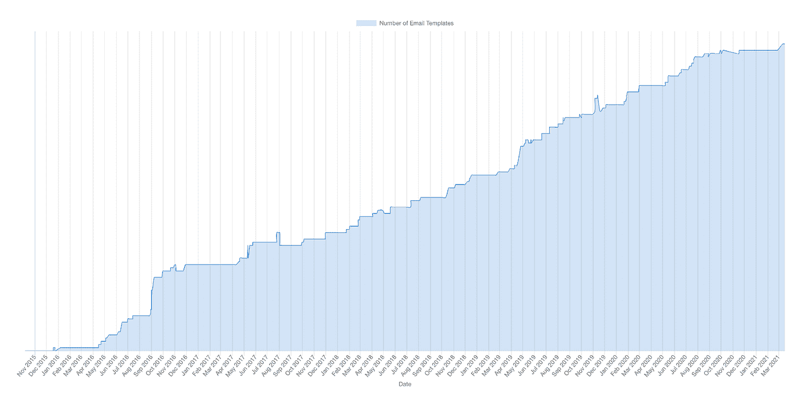

# TIL:同步异步缩减功能

> 原文：<https://javascript.plainenglish.io/til-synchronous-async-reduce-functions-ff3fb339a154?source=collection_archive---------13----------------------->

## 使用 async/await 语法，而不一次解决所有问题。

Photo by [Clayton Robbins](https://unsplash.com/@claytonrobbins?utm_source=medium&utm_medium=referral) on [Unsplash](https://unsplash.com?utm_source=medium&utm_medium=referral)

上周我碰壁了。我试图为我的帖子制作一个图表，展示代码库随时间的增长，这个帖子是关于我如何在 TripActions 重建电子邮件架构的。我想遍历所有提交，计算特定目录中的文件数量，并绘制输出。最大的挑战不是获得提交或构建图表。它在没有压倒 git 的情况下循环提交。

# 为什么使用 Async/Await？

首先，我是 Async/Await 代码风格的超级粉丝，我尽可能地使用它。如果你以前没有使用过，这是一个很好的方法来简化你的代码，使它更容易阅读和调试。

上面这个过于简单的例子展示了两种编码风格之间的区别。使用承诺时，很容易迷失在层叠的`then`循环中，尤其是如果您想要嵌套标签——一个获取用户的示例，该用户数据用于进行另一次获取以获取他们以前的购买。

Async/Await 帮助我们编写简单的、非嵌套的代码，易于阅读和理解。

# 更进一步

我也是[阵的忠实粉丝。减少](https://developer.mozilla.org/en-US/docs/Web/JavaScript/Reference/Global_Objects/Array/Reduce)(这里简称减少)，虽然情况并不总是如此。我认为 Reduce 被广泛认为过于复杂，不容易阅读，并且被那些想要证明他们知道事情的开发者所使用。反过来，我觉得只是误解。

当与常见的[映射](https://developer.mozilla.org/en-US/docs/Web/JavaScript/Reference/Global_Objects/Array/map)和[过滤](https://developer.mozilla.org/en-US/docs/Web/JavaScript/Reference/Global_Objects/Array/filter)方法一起使用时，它会是一个非常有用的工具

有时 Map 和 Reduce 可以用来实现相同的目的(例如:将数组中的值加倍)。通常，如果您可以选择使用 Map 或 Reduce，则默认为 Map。它降低了复杂性，增加了可读性。

Reduce 有一些很好的例子，如上所示——按字母顺序对对象进行排序(在使用 hmacsha1 auth 时很有用),其中您获取现有对象，获取键，然后基于键按字母顺序重新构建它。Reduce 最大的优点是它知道你正在构建的东西的状态，因为它正在被构建。使用初始值参数意味着您保持了严格的范围，不需要 Reduce 函数之外的变量来托管结果值。

# 将一切融合在一起

您可以在 Reduce 循环中执行异步 Await。但你为什么要这么做？也许像我一样，你有一个值数组，你想遍历它们，做一些处理，然后返回一些别的东西。

在我的例子中，我有一个提交数组。我想遍历它们，计算每个时间点的文件数，并返回一个包含散列、提交日期和文件数的对象数组。

节点；。js 和 [Simple-Git](https://www.npmjs.com/package/simple-git) npm 包在这里完成了大部分繁重的工作，导航到选择的目录，获取历史记录，然后检查每个提交，最后在将结果返回到文件之前计算文件的数量。它利用承诺让你知道事情何时完成，你可以进入下一步。

这个挑战性的方面在于，默认情况下， [Simple-Git](https://www.npmjs.com/package/simple-git) 允许 6 个并发进程。当达到这个限制时，git 开始抛出错误——“另一个 git 进程似乎正在这个存储库中运行”。作为背景，我的电子邮件目录的 git 历史记录是 1，018 次提交，所以再多的并行化也无法解决这个问题。

我选择了同步流程，一个接一个地检查提交，这意味着我不会过度使用 git 或使我的笔记本电脑崩溃，尽管这会花费更长的时间。但这又导致了另一个问题，reduce 中的并发性和时间性。

当 reduce 有一个同步函数参数时，它按预期运行，一个接一个，直到数组结束。但是当它有一个异步函数参数时，它们同时运行，它返回一个承诺数组。通常这可能不是一个问题(您可以使用`Promise.All`来解决它们),但是由于 Git 的速率限制，我需要找到另一种方法。

谢天谢地，我偶然发现了 Tamás Sallai 的文章，其中介绍了 Reduce 中的计时。`await acc` ( [line 20](https://gist.github.com/Davetherave2010/21db263dac121496ac1dc996619bf1ac#file-git-grapher-js-L20) )强制 reduce 函数等待累加器建立，反过来同步运行函数，这正是我所需要的。

我们开始吧。一个简单的 git reduce 循环(原谅双关语),计算每次提交的文件数。

A graph that shows the number of email templates vs time at TripActions. For more context, please read the article I wrote on this, ‘[Giving Emails some TLC](https://medium.davidendersby.me/giving-emails-at-tripactions-some-tlc-23e3131a5286)’

我使用从这个过程中获得的数据构建了上面显示的图表，该图表显示了电子邮件模板的数量是如何随着时间的推移而增长的。

感谢阅读。我希望这篇文章对你有用

大卫

高级前端开发者@ [TripActions](https://tripactions.com/) (通常是[招聘](https://grnh.se/cbeb241d1)！)

*更多内容尽在*[*plain English . io*](http://plainenglish.io/)