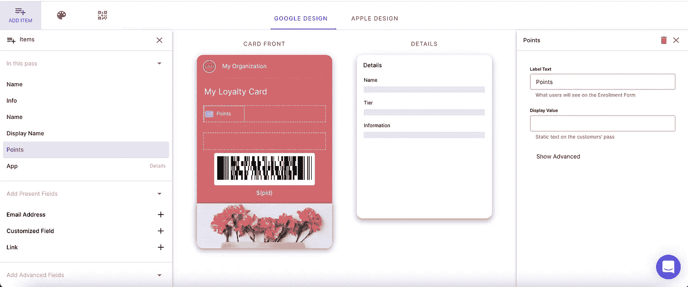
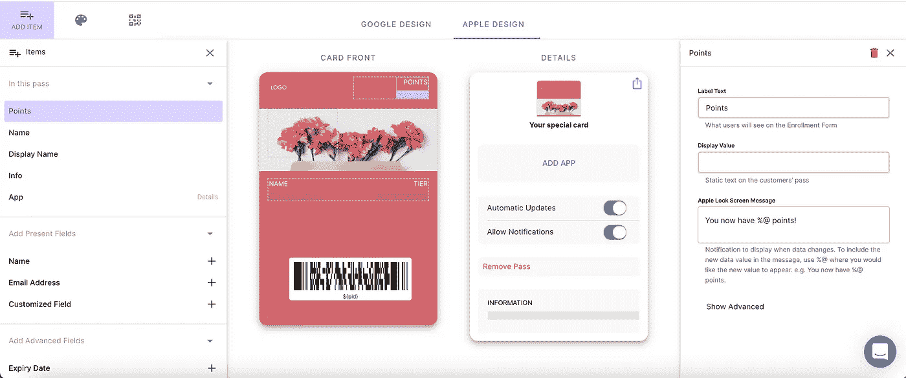
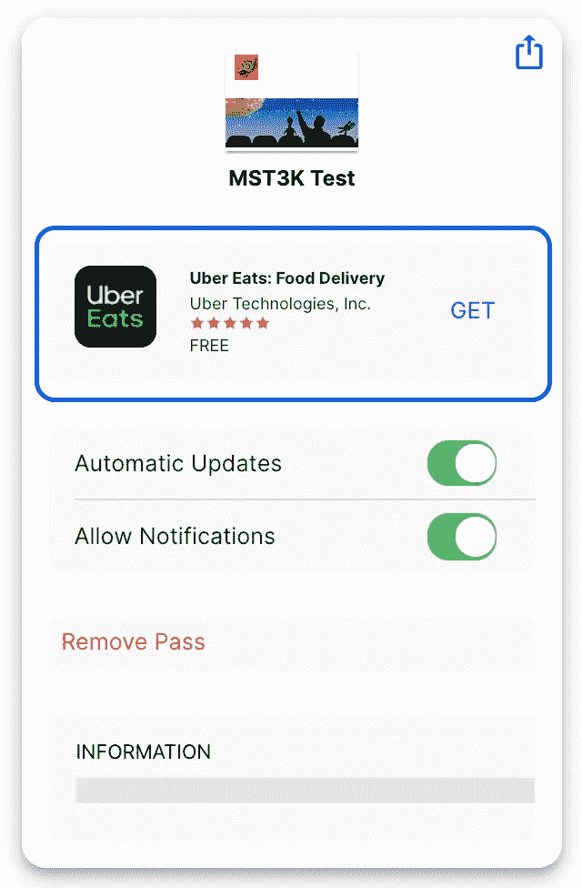
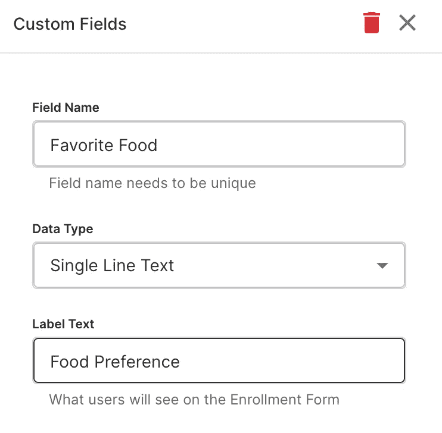

# 构建引人入胜的所见即所得编辑器的技巧

> 原文：<https://javascript.plainenglish.io/tips-for-building-engaging-wysiwyg-editors-e86a6cb050df?source=collection_archive---------24----------------------->


在过去的四年里，我负责构建了很多所见即所得(WYSIWYG)编辑器。我最近完成了迄今为止最具挑战性的一个项目，苹果钱包和谷歌支付通行证的编辑器。



Google Pay



Apple Wallet

现在它已经完成了，我想分享一些想法/建议给那些将要建立一个并且不知道从哪里开始的人。

# 构建您自己的对象

每个编辑的背后都是数据。根据我的经验，这些数据很少以一种适合物理模型的方式进行组织。我刚刚完成的编辑器使用了 google pay 通用模板进行设计。Google Pay 通用对象的一个示例如下所示:

这不是世界上最漂亮的东西，也不是我想在幕后处理的事情。我的解决方案是创建一个单独的对象。

当应用程序加载时，我将通用 JSON 转换成这个。当用户保存他们的设计时，我会将其转换回通用的谷歌版本。我已经写了一篇关于这个实践的独立文章，你可以点击这里查看。这里的好处是我自己的对象可以在我的设计器中根据我的需要进行定制。

# 百分之百的现实主义并不总是可能的

我从来没有能够让一个编辑百分之百的照片真实。通常，最终版本可以访问一些专有数据，而我不能。例如，我制作的设计师的 Apple Wallet 视图在背面有一个地方，你可以指定一个应用程序来链接应用程序内部。



我使用 Apple 提供的 app store API 来获取在我的编辑器中呈现应用程序项目所需的所有信息。

在试图使这一部分与最终产品相匹配时，我注意到我从 API 获得的星级并不总是与真实通行证背面显示的相符。要么是通行证从不同的未知来源获取信息，要么是评级的计算是以我不知道/看不到的方式进行的。

像这样的小细节在构建复杂的编辑器时很常见，我的建议是不要太在意它们。

# 考虑用类来帮助实现共同的价值观

我在编辑器中使用类来处理需要经常转换的数据。例如，当用户在通行证上添加一个新字段时，我们要求他们提供一个唯一的名称。



该名称被转换成我们称之为 uniqueName 的东西，并被添加到我们根据设计保存的数据字段对象中。

```
const name = "Favorite Color"
const uniqueName = "meta.favoriteColor"
```

当我们要告诉客户设计器中某个字段的名称时，不能使用“meta.favoriteColor”，因为这样会让不太懂技术的用户感到困惑。我使用一个类方法来获得一个人类可读的版本。我不想使用字段标签，因为它们并不总是匹配的。

# 许多文本通常会被忽略

根据以前的经验，这一点对大多数读者来说可能已经很明显了。我发现在可视化编辑器中，长的解释文本通常会被用户忽略。

我以前构建的编辑器中有很多解释文本，但我们仍然会收到相当多的客户服务请求，询问编辑器中解释的问题。我的经验是将解释文本保持在最少是最好的。

为了保持文本最少，我的第一条建议是雇佣一个有才华的设计师，让你的 UI 直观易懂。如果这对你的企业来说不可行，那么帮助文章和操作视频是下一个最好的选择。操作方法文章可以有很多文本，但是客户更有可能根据页面的上下文来阅读它们。

# **结束**

如果你从自己的经历中有什么其他的建议，请留下评论。

*更多内容尽在*[***plain English . io***](http://plainenglish.io/)