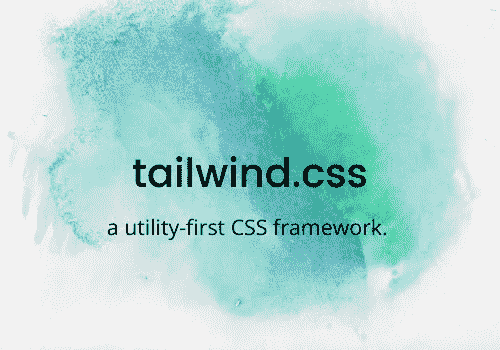
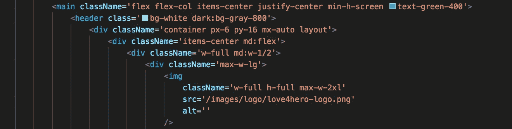
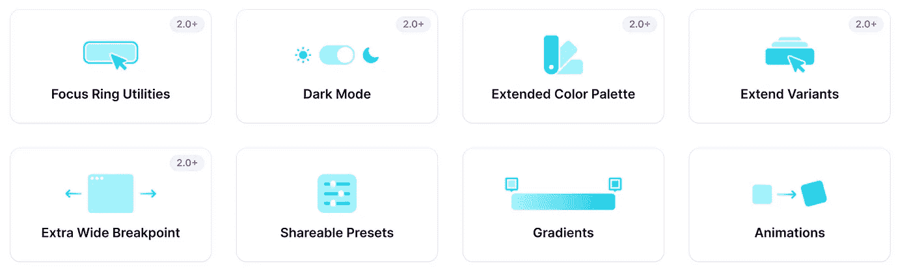

# 顺风 CSS 有什么用？

> 原文：<https://javascript.plainenglish.io/tips-for-tailwind-css-99c3f45b75d5?source=collection_archive---------9----------------------->

## 它是新的、可定制的、响应迅速的、实用优先的 CSS 框架，让我们试试吧！

先说 Tailwind.css 吧，它是新的，可定制的，反应灵敏的，实用至上的 css 框架，我们来试试吧！

css 的美妙之处在于它的使用非常简单。在传统的基本 CSS 中，你将声明类，并专门编码来自你创建的类的设计元素(例如，字体系列，颜色)。在 Tailwind 中，你也可以使用类名，但与经典 CSS 不同的是，你可以从预先创建的类名库中提取类名，一旦你将 Tailwind 下载到你的应用程序中，你就可以访问这些类名。这是一个理解你需要什么类名的问题，这需要在 [Tailwind Docs 网站](https://tailwindcss.com/)的搜索栏上搜索一下。没有比方便的搜索更好的了！

使用 Tailwind 的真正好处是，您的 CSS 代码不会线性增长，而是在元素之间使用预先创建的实用程序类。这允许定制，并确保更小的包大小(使用更少的代码)，也就是运行时优化。

看一下语法:

我推荐使用这个免费的社区创建的[顺风组件库](https://tailwindcomponents.com/)，作为一种掌握和使用顺风的方式。

这里有一个快速的概述来帮助你了解顺风知识:

*   **颜色是这样写的:bg-gray-300**
*   **1** )有一个 dom 元素是针对(即 bg，text) **2** )某种颜色色相(即红、灰、黄、绿、蓝) **3** )一个数字范围来表示色相的深浅(即。50，100，200，300，800，最高 900)
*   **边框可以这样写:border-rounded-md**
*   **1** )首先表示边框元素 **2** )声明圆角 **3** )声明大小，范围从无到全(即-md 为中等，-2xl 与边框半径相同:1 圆角
*   填充可以写成这样:p-2
*   **页边距可以写成:m-9**
*   **DOM 对象之间的空格可以写成:space-x-4**
*   ***dark-mode，是的 dark mode，*可以写成这样:****dark:text-gray-300**

2020 年 11 月 18 日发布的 Tailwind 最新 2.0 版本中的新更新包括:

# 结论

总的来说，我认为 Tailwind 非常适合用于个人项目或团队工作。一旦您开始理解基本的实用程序类，实现就变得有趣和无缝。一个潜在的缺点是试图加入更复杂的动画，Tailwind 不是支持这个的最好的 CSS 框架。可能在下一次更新中，会对它们的动画功能进行一些添加。

总之，我非常感谢能把这个框架放在我的后口袋里。现在就去探索吧！

 [## 顺风备忘单

### TailWindCSS 备忘单。Tailwind CSS 的所有实用程序类和 CSS 属性的参考列表

tailwindcomponents.com](https://tailwindcomponents.com/cheatsheet/) 

**您想实现反应式顺风吗？这里有一个很有帮助的 Y**[**out tube 教程**](https://www.youtube.com/watch?v=tHtSq9EllPI&amp%3Bfeature=youtu.be&amp%3Bab_channel=TheFieryCoder) **将 Tailwind 下载到你的 React App 中。**