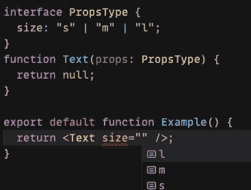

# 使用 TypeScript 键入 React 组件的提示

> 原文：<https://javascript.plainenglish.io/tips-for-typing-react-components-with-typescript-4cbc42f45c11?source=collection_archive---------0----------------------->

我喜欢打字稿。我认为这是建立一个新的 React 项目的最佳实践(即使是一个简单的项目！).对于提高开发人员的生产力和避免一些 bug 来说，这是一个很好的工具。开始很容易，create-react-app 和 nextjs 都有内置的支持。

在这篇文章中，我将展示一些技术，您可以在日常工作中使用 TypeScript 和 React。我们开始吧！

# 使用联合类型

每当给定的属性可以接受一组受约束的值时，使用[联合类型](https://www.typescriptlang.org/docs/handbook/unions-and-intersections.html#union-types)是一个好主意。假设您想要创建一个接受`size`属性的`Text`组件。最初的想法可能是将其作为字符串键入，但我们可以做得更好。让我们看一个例子。

现在我们可以确定`size`只能接受这三个值中的任何一个。作为奖励，我们获得了自动完成支持(假设我们使用 VSCode 或任何其他具有良好 TS 支持的 IDE)

here I actually use codesandbox.io

此外，我们可以避免使用像`TEXT_SIZE.SMALL`这样的常量，我个人觉得很难看。

# 不要重复你自己

因为我们对联合类型很满意，所以我们决定编写实际的实现。我们使用一个简单的对象来定义字体大小。

现在我们有一个问题。每当我们改变`sizes`对象时，我们需要更新`size`道具类型定义。让我们看看如何用`keyof`操作符来修复它。

厉害了，这个干多了！为了引入一个额外的大小，我们需要做的就是更新`sizes`对象。

# 使用泛型

假设我们想要构建一个通用的列表视图组件。我喜欢首先考虑界面。假设我们想要接受一个项目数组和一个渲染器函数(这被称为[渲染属性](https://reactjs.org/docs/render-props.html)模式)。

嗯，这行得通，但远非完美。在类型级别上不能保证`renderItem`函数能够呈现所提供的项目。让我们看看如何使用泛型使这段代码更好。

太好了！我们将`items`类型与`renderItem`函数签名绑定在一起。现在让我们分析一个完整的代码示例

有几件事需要注意:

1.  我们可以确定`renderItem`函数接受来自`items`数组的一个项(自己检查一下，试试破！)
2.  我们使用[通用约束](https://www.typescriptlang.org/docs/handbook/generics.html#generic-constraints)来确保每一项都有`uuid`属性(这很重要，这样我们就可以提供 [react 在呈现列表时需要](https://reactjs.org/docs/lists-and-keys.html#keys)的`key`属性)
3.  我们的`ListView`不在乎我们渲染什么样的项目，只要我们能提供一个函数来渲染单个项目。

# 摘要

感谢阅读！我希望你能在日常工作中发现一些新的东西。记住，练习就是一切。编码快乐！