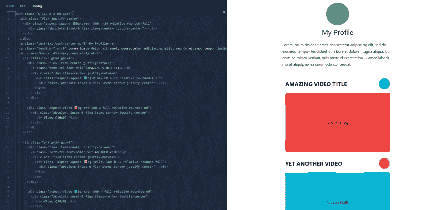
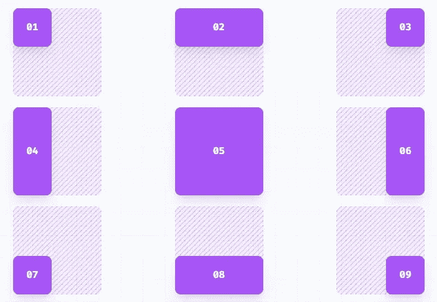

# 增强 TailwindCSS 项目的专业技巧

> 原文：<https://javascript.plainenglish.io/tips-to-enhance-tailwindcss-projects-a24fe086a14c?source=collection_archive---------9----------------------->

## 用于复杂设计的干净实用程序类

最近，TailwindCSS 发布了 3.0 版本，该框架仍然非常受欢迎。你知道清洁代码的所有小技巧吗？

# 宽比

一个干净的用户界面要求所有的卡片和图片在所有的设备上都有完美的尺寸。屏幕尺寸太多，无法使用响应缩放单元，如`em`、`rem`、`%`或`vh/vw`，导致媒体在某些平台上失真。

An example TailwindCSS Project w/ following concepts

强制媒体的大小对于像素来说并不简单，但是如何强制响应比率呢？也许，个人资料横幅是 1500x500 像素，但用户上传的内容使得保留用户体验具有挑战性。答案是长宽比容器。

demo: [https://play.tailwindcss.com/hBXgOiGwv7](https://play.tailwindcss.com/hBXgOiGwv7)

纵横比将强制内容增长到容器的宽度，同时自动缩放高度以匹配与`16:9`的比率。宽度为`1920`的节点的高度将为`1080`，而在移动设备上，它将缩放为`320x180`。

You can also customize the config file for more ratios

# 嵌入定位

目前，只有大约 79%的浏览器支持新的 CSS 纵横比属性。幸运的是，有一个使用底部填充的纵横比的顺风插件。这是插图变得方便的时候。

查看这些链接:

*   [长宽比插件](https://github.com/tailwindlabs/tailwindcss-aspect-ratio)
*   [我可以使用新的纵横比属性吗？](https://caniuse.com/?search=aspect-ratio)

插入技术与纵横比容器配合得很好，因为它是绝对定位的简写。也许，一个完美的正方形元素需要嵌套的滚动内容。最快的解决方案是在具有全宽和全高的子元素上使用绝对定位。以前，这需要一些类名来正确定位子元素。

Inset positioning

然而，Tailwind 开发人员知道这种技术很常见。现在，单个实用程序类将处理所有的定位。Insets 将填充或部分填充整个父节点。

demo: [https://play.tailwindcss.com/4ZTlx80ryN](https://play.tailwindcss.com/4ZTlx80ryN)

# 分割列表样式

Tailwind 并不完美，经常需要定制 CSS 来匹配 Bootstrap 等其他流行框架的列表样式。标志性的设计在每个列表项之间放置了边框。

这种样式更可取，因为它清楚地区分了列表项，而不需要复杂的结构，如表、flexbox 或网格。此外，列表在不同浏览器之间更加兼容。

如何在不编写自定义 CSS 的情况下，在 Tailwind 中快速样式化类似 Bootstrap 的列表？很简单，使用`divide`实用程序。

demo: [https://play.tailwindcss.com/hBXgOiGwv7](https://play.tailwindcss.com/YpbjZdaJoU)

# 结论

谢谢你看我的帖子。现在，您知道了一些减少代码中包含的实用程序类数量的方法。这是一个使用了上述所有技术的最终产品:[https://play.tailwindcss.com/6mpXYGwfdE](https://play.tailwindcss.com/6mpXYGwfdE)

An example TailwindCSS Project w/ following concepts

*更多内容看* [***说白了. io***](http://plainenglish.io/) ***。*** *报名参加我们的* [***免费每周简讯这里***](http://newsletter.plainenglish.io/) ***。***