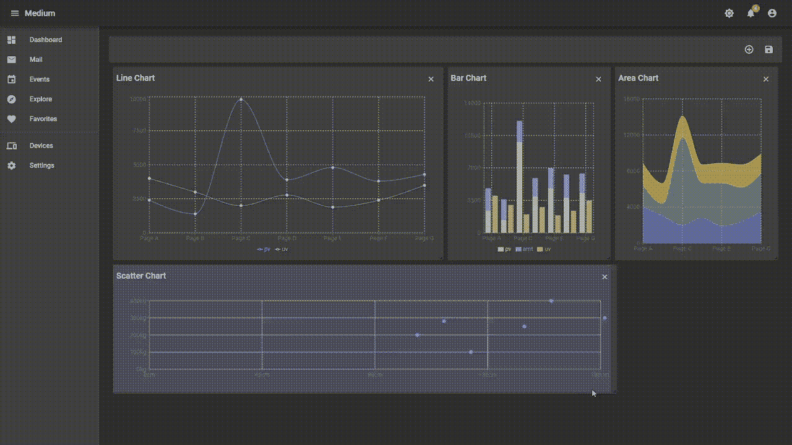
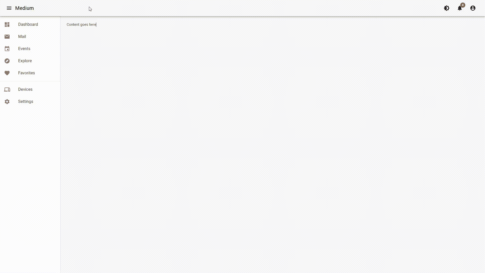
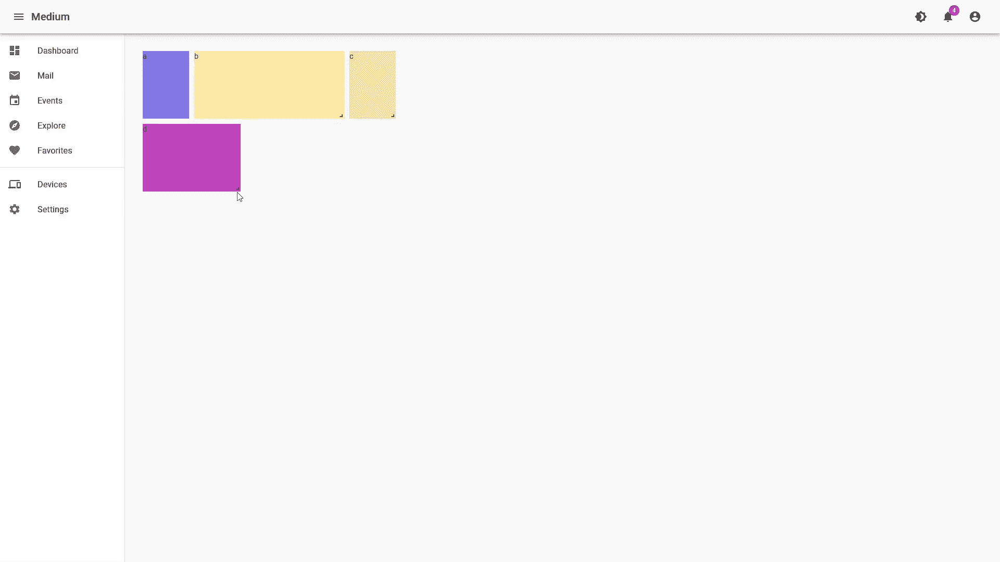
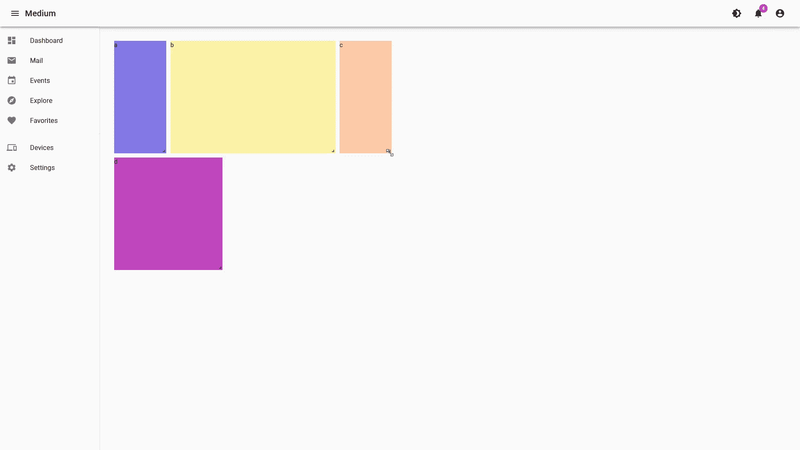
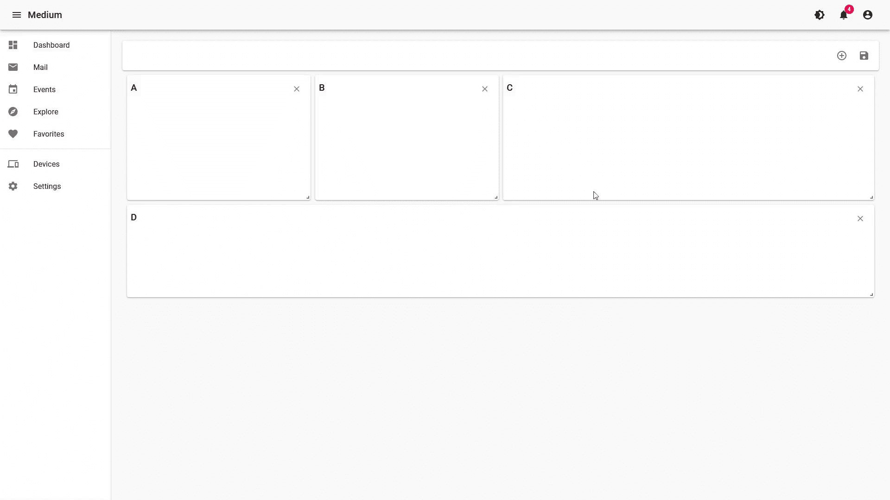
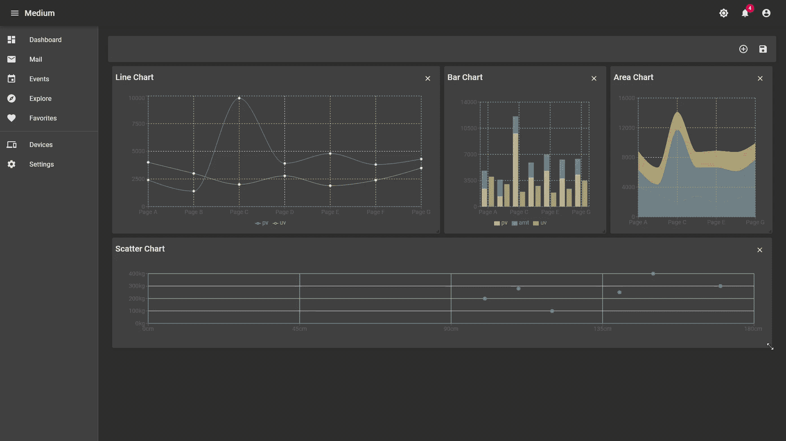

# 厌倦了枯燥的静态仪表盘？让我们在 React 中构建一个完全可定制的仪表板

> 原文：<https://javascript.plainenglish.io/tired-of-boring-static-dashboards-lets-build-a-fully-customizable-dashboard-in-react-88cb5369cfe1?source=collection_archive---------4----------------------->



如果您在任何市场搜索仪表板模板，我可以保证您会发现几乎所有的结果看起来都是一样的。顶部有几个指标，底部有两三个图表。没有定制的余地。感觉好过时！我们能做得更好吗？好吧，让我们来看看。

# 初始设置

说到外观，我并不太喜欢材质——UI。但是，总的来说，作为一个设计系统，它是最好的之一。我们将在这个应用程序中使用 [Material-UI](https://material-ui.com/) ,这样我们就可以在使用 Material-UI 的预构建组件的同时专注于可定制的仪表板部分。我创建了下面的样板文件让我们开始。它是一个带有 Material-UI 的基本 React 应用程序。它非常适合原型开发，如果您想在自己的项目中使用它，可以随意使用它。



# **React 网格布局**

我们将使用 [**React 网格布局**](https://github.com/react-grid-layout/react-grid-layout) 为我们的应用程序创建小部件。React 网格布局是一个可拖动和可调整大小的网格布局，带有用于 **React 的响应断点。我们可以使用下面的 npm 命令安装它。**

```
npm install react-grid-layout
```

当我们使用 **React 网格布局**时，我们需要从**节点模块**文件夹中导入两个 **CSS** 文件。如果我们想要定制样式，我们可以将这些 **CSS** 文件中的内容复制到我们的本地样式文件中。

```
/node_modules/react-grid-layout/css/styles.css
/node_modules/react-resizable/css/styles.css
```

我们可以使用内容组件中的 **React 网格布局报告**的第一个例子来测试一切是否正常。我为每个项目添加了不同的背景颜色，这样在视觉上更容易区分。

```
import React from 'react';
import GridLayout from 'react-grid-layout';export default function Content() {
  const layout = [
    { i: 'a', x: 0, y: 0, w: 1, h: 2, static: true },
    { i: 'b', x: 1, y: 0, w: 3, h: 2, minW: 2, maxW: 4 },
    { i: 'c', x: 4, y: 0, w: 1, h: 2 },
    { i: 'd', x: 0, y: 2, w: 2, h: 2, isDraggable: false },
  ];
  return (
    <GridLayout
      className="layout"
      layout={layout}
      cols={12}
      rowHeight={60}
      width={1200}
    >
      <div key="a">
        <Widget id="a" backgroundColor="#867ae9" />
      </div>
      <div key="b">
        <Widget id="b" backgroundColor="#fff5ab" />
      </div>
      <div key="c">
        <Widget id="c" backgroundColor="#ffcead" />
      </div>
      <div key="d">
        <Widget id="d" backgroundColor="#c449c2" />
      </div>
    </GridLayout>
  );
}function Widget({ id, backgroundColor }) {
  return (
    <div style={{ width: '100%', height: '100%', backgroundColor }}>{id}</div>
  );
}
```



现在，让我们深入研究一下代码。**布局**数组保存所有的初始位置和尺寸值。需要注意的一点是，我们不能使用 **CSS** 单位，如 **px** 或 **rem** 作为位置值。我们需要使用网格单位来代替。网格单位是使用我们提供给 **GridLayout 的 **cols** 和 **rowHeight** 属性计算的。**我们还可以提供一些可选值，如 **minW** 、 **static** 、**、**和**is debragable**，这些值都是不言自明的。

然后我们有了 **GridLayout** 组件**。**它将版面作为**道具**，我们也可以在这里指定版面宽度。请注意，在上面的例子中，当我将**小部件 C** 向右拖动时，如何返回？这是因为 **GridLayout** 组件不会占用所有可用的宽度，它只会扩展到我们指定为 **prop** 的宽度。同样，使用 **GridLayout** ，我们只能为所有断点指定一个布局。因此，对于响应式使用，我们必须使用来自 **React 网格布局的适当命名的**响应式**组件。**

# 响应性使用

因此，让我们使用 **React 网格布局**中的**响应**组件，并且为**响应**组件提供宽度，我们可以使用 **React 网格布局中的**宽度提供者**高阶组件。有了**响应式**组件，我们可以对每个断点使用多个布局，而不是一个布局。如果我们只提供**最大**断点的布局，**反应网格布局**将**插入**其余断点的尺寸。我们将为" **lg"** 断点指定布局，稍后将探索如何为其他断点定制布局并保存它，这样我们就不必一开始就为所有断点设置布局。**

```
import React from 'react';
import { Responsive, WidthProvider } from 'react-grid-layout';const ResponsiveGridLayout = WidthProvider(Responsive);export default function Content() {
  const layouts = {
    lg: [
      { i: 'a', x: 0, y: 0, w: 1, h: 2 },
      { i: 'b', x: 1, y: 0, w: 3, h: 2 },
      { i: 'c', x: 4, y: 0, w: 1, h: 2 },
      { i: 'd', x: 0, y: 2, w: 2, h: 2 },
    ],
  };
  return (
    <ResponsiveGridLayout
      className="layout"
      layouts={layouts}
      breakpoints={{ lg: 1200, md: 996, sm: 768, xs: 480, xxs: 0 }}
      cols={{ lg: 12, md: 10, sm: 6, xs: 4, xxs: 2 }}
      rowHeight={60}
    >
      <div key="a">
        <Widget id="a" backgroundColor="#867ae9" />
      </div>
      <div key="b">
        <Widget id="b" backgroundColor="#fff5ab" />
      </div>
      <div key="c">
        <Widget id="c" backgroundColor="#ffcead" />
      </div>
      <div key="d">
        <Widget id="d" backgroundColor="#c449c2" />
      </div>
    </ResponsiveGridLayout>
  );
}function Widget({ id, backgroundColor }) {
  return (
    <div style={{ width: '100%', height: '100%', backgroundColor }}>{id}</div>
  );
}
```

现在一切似乎都很好。但是当我们关闭抽屉时，小部件不会扩展到剩余的宽度，我们不能移动任何超过先前宽度的东西。


这是因为正如文件中提到的，

> WidthProvider 非常简单，只监听窗口的“resize”事件。

这里有几个 React 库可以用来替代**width provider**。在这个应用中，我们将使用 [**react-sizeme。**](https://github.com/ctrlplusb/react-sizeme) 我们可以使用

```
npm install react-sizeme
```

我们可以使用 **react-sizeme** 中的**和** HOC 来为我们的组件提供宽度。

```
import React from 'react';
import { Responsive as ResponsiveGridLayout } from 'react-grid-layout';
import { withSize } from 'react-sizeme';function Content({ size: { width } }) {
...
...
  return (
    <ResponsiveGridLayout
      className="layout"
      layouts={layouts}
      breakpoints={{ lg: 1200, md: 996, sm: 768, xs: 480, xxs: 0 }}
      cols={{ lg: 12, md: 10, sm: 6, xs: 4, xxs: 2 }}
      rowHeight={60}
      width={width}
    >
    ...
    ...
    </ResponsiveGridLayout>
  );
}export default withSize({ refreshMode: 'debounce', refreshRate: 60 })(Content);
...
...
```



如果你仔细观察，你会注意到当抽屉/侧边栏移动时，我们的小部件不会调整大小，只有当抽屉移动完成时才会改变大小。如果将**刷新模式**和**刷新速率** **支柱**从**与尺寸夹具**中移除，抽屉移动时尺寸会发生变化。但是我们故意设置了这两个道具，因为以后当我们在小部件上使用图表时，在每一帧上设置动画大小会弄乱图表库的内部动画。

# 保存布局

我们现在有可调整大小和可移动的部件。让我们看看如何保存布局。为了保存布局，首先，我们需要知道当前布局的配置是什么。到目前为止，我们的 **layouts** 变量提供了初始布局配置，然后 **React Grid Layout** 管理它内部的布局更改，我们没有任何东西记录它。在每次布局改变时， **Responsive** 组件触发 **onLayoutChange** 回调，其中 **currentLayout** 和 **allLayouts** 作为**参数**。我们可以使用这个 **allLayouts** 值来存储当前布局的配置**。**

```
...const initialLayouts = {
  lg: [
    ...
  ],
};
function Content({ size: { width } }) {
  const [layouts, setLayouts] = useState(initialLayouts);
  const onLayoutChange = (_, allLayouts) => {
    setLayouts(allLayouts);
  };
  return (
    <ResponsiveGridLayout
      ...
      onLayoutChange={onLayoutChange}
    >
     ...
    </ResponsiveGridLayout>
  );
}
...
```

现在我们有了当前布局的记录。我们可以将它发送到后端，保存为用户首选项。如果你需要自动保存布局，你可以在 **onLayoutChange** 函数中创建一个后端请求。否则，您可以等待用户点击按钮或其他事件，然后使用当前布局调用后端 API。此外，您可以在组件安装上获取用户偏好的布局。为简单起见，我们将把当前配置保存在本地存储器上。

```
...const initialLayouts = {
 ...
};
function Content({ size: { width } }) {
  const [layouts, setLayouts] = useState(
    getFromLS('layouts') || initialLayouts,
  );
  const onLayoutChange = (_, allLayouts) => {
    setLayouts(allLayouts);
  };
  const onLayoutSave = () => {
    saveToLS('layouts', layouts);
  };
...
}...
function getFromLS(key) {
  let ls = {};
  if (global.localStorage) {
    try {
      ls = JSON.parse(global.localStorage.getItem('rgl-8')) || {};
    } catch (e) {}
  }
  return ls[key];
}function saveToLS(key, value) {
  if (global.localStorage) {
    global.localStorage.setItem(
      'rgl-8',
      JSON.stringify({
        [key]: value,
      }),
    );
  }
}
```

# 添加和移除小部件

添加和删除项目非常简单。我们需要保存一个选择的项目列表，然后只需要在添加和删除操作中添加或删除列表中的项目。在 **ResponsiveGridLayout，**中，我们可以遍历所选项目，只显示那些项目。

```
..
const originalItems = ['a', 'b', 'c', 'd'];...
function Content({ size: { width } }) {
  const [items, setItems] = useState(originalItems);
  ...
  const onRemoveItem = (itemId) => {
    setItems(items.filter((i) => i !== itemId));
  };
  const onAddItem = (itemId) => {
    setItems([...items, itemId]);
  };return (
    <>
      <TopBar
        onLayoutSave={onLayoutSave}
        items={items}
        onRemoveItem={onRemoveItem}
        onAddItem={onAddItem}
        originalItems={originalItems}
      />
      <ResponsiveGridLayout
        ...
      >
        {items.map((key) => (
          <div
            key={key}
            className="widget"
            data-grid={{ w: 3, h: 2, x: 0, y: Infinity }}
          >
            <Widget
              id={key}
              onRemoveItem={onRemoveItem}
              backgroundColor="#867ae9"
            />
          </div>
        ))}
      </ResponsiveGridLayout>
    </>
  );
}...
```

我用带有关闭按钮的材质 UI 卡替换了我们的彩色小部件，并添加了一个弹出窗口来选择小部件。因为它与核心功能无关，所以我没有在这里添加代码。如果你好奇怎么做*可以参考下面的 **codesandbox** 。*



# 自定义小部件

就是这样。我们有一个完全可定制的仪表板。您可以自由地用您喜欢的任何组件填充小部件。这是一个 CodeSandbox 示例，我添加了几个来自[](https://recharts.org/en-US/)****的图表。****

****

# ****结论****

**就像我在图表示例中展示的那样，您可以将任何组件作为小部件添加。唯一的问题是，根据您添加的内容，您可能需要调整 **CSS** 和其他属性，以便在调整小部件大小时您的内容能够响应。这就是本教程的内容。希望你喜欢。**

***更多内容请看*[*plain English . io*](http://plainenglish.io/)**