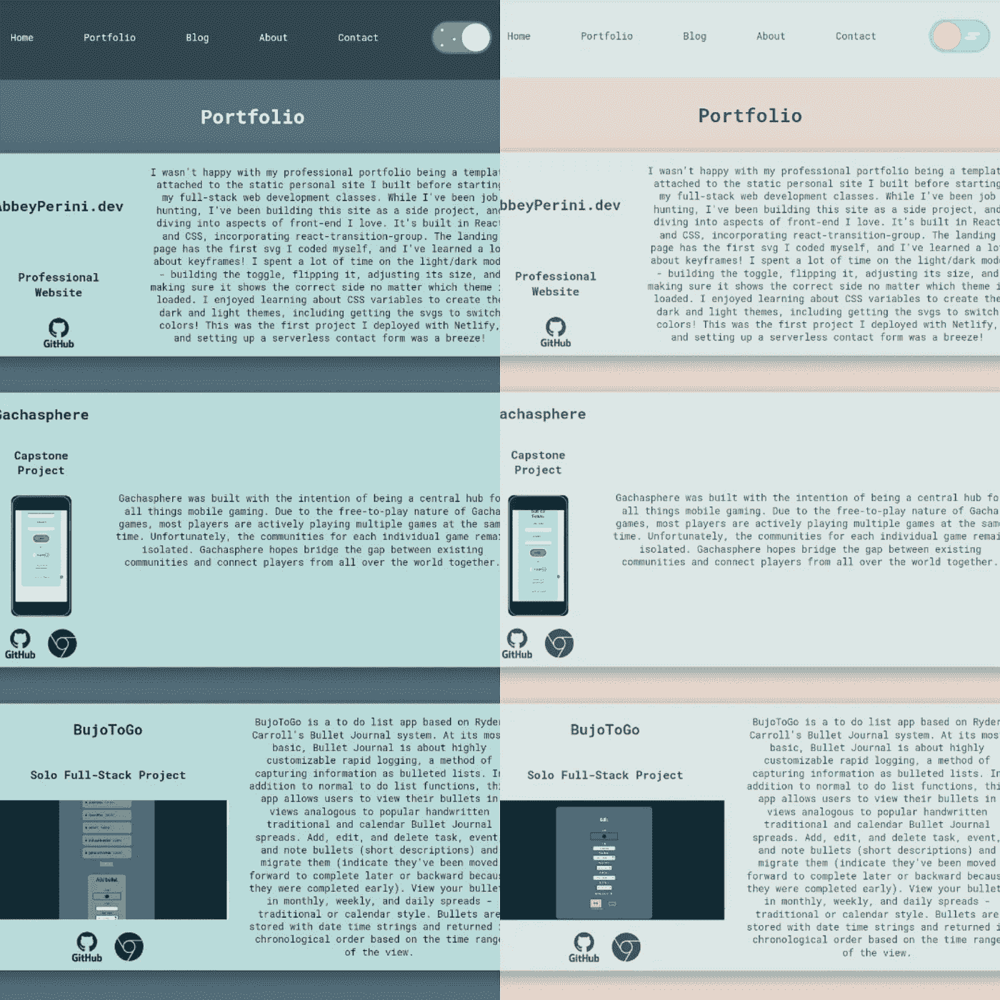
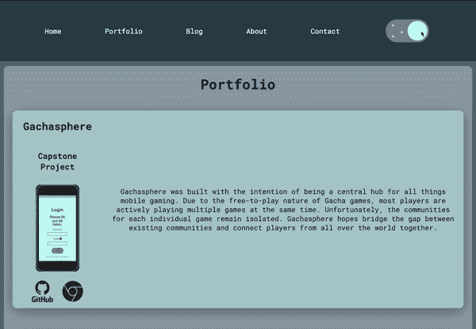
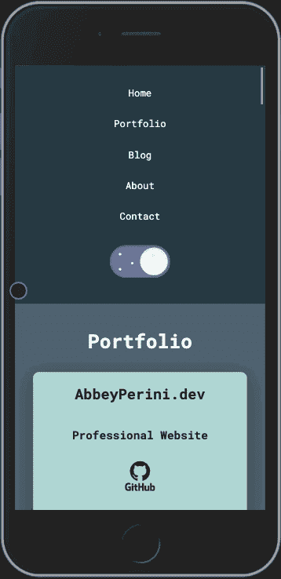

# 如何在 React 中切换黑暗模式

> 原文：<https://javascript.plainenglish.io/toggle-dark-mode-in-react-d1cf01d4c429?source=collection_archive---------12----------------------->



当我重建我的[作品集网站](https://abbeyperini.dev)时，我知道我想在设计中找点乐子，一个明暗模式正符合要求。我很喜欢在这个项目中的许多发现，但是我最喜欢的是颜色变化的 SVG。本教程假设熟悉 React，我使用的是 v17.0.1 和功能组件。

首先，我创建了一个基本布局。接下来，我把我的[深色](https://coolors.co/292929-2f4550-586f7c-b8dbd9-f9f8f8)和[浅色](https://coolors.co/eddcd2-fff1e6-dbe7e4-bcd4e6-1d2c35)配色方案放在一起。这需要一点反复试验，但是在测试了我所有的组合以获得足够的对比度和位置后，我发现我需要 6 个 CSS 变量。我猜你会说我使用了“黑暗优先”开发，因为变量名在黑暗主题的上下文中是有意义的。灯光主题变化较少，但需要`--button-border`，其中`--accent`将与背景颜色相同。

```
.theme-dark {
  --dark-text: #292929;
  --light-text: #F9F8F8;  
  --dark-background: #2F4550;
  --light-background: #586F7C;
  --accent: #B8DBD9;
  --button-border: #B8DBD9;
}
```

```
.theme-light {
  --dark-text: #5E4B56;
  --light-text: #5E4B56;
  --dark-background: #DBE7E4;
  --light-background: #EDDCD2;
  --accent: #DBE7E4;
  --button-border: #5E4B56;
}
```

然后，我开始将颜色应用到我的基本布局中:

```
html, #root {
  background-color: var(--dark-background);
  color: var(--dark-text);
}nav {
  background-color: var(--dark-background);
  color: var(--light-text);
}.main-container {
  background-color: var(--light-background);
}
```

我还将我想要弹出的内容部分的背景设置为`--accent`。`--dark-text`本来可以在黑暗主题的所有背景上工作，但是我将部分标题设置为`--light-text`以使它们更加突出。

我找到了 Musthaq Ahamad 的[基本主题切换器教程](https://medium.com/@haxzie/dark-and-light-theme-switcher-using-css-variables-and-pure-javascript-zocada-dd0059d72fa2)，并着手将其应用于功能性 React 组件。

我将更改主题和检查主题首选项的 localStorage 的函数放在一个名为 themes.js 的文件中。

```
function setTheme(themeName) {
    localStorage.setItem('theme', themeName);
    document.documentElement.className = themeName;
}function keepTheme() {
  if (localStorage.getItem('theme')) {
    if (localStorage.getItem('theme') === 'theme-dark') {
      setTheme('theme-dark');
    } else if (localStorage.getItem('theme') === 'theme-light') {
      setTheme('theme-light')
    }
  } else {
    setTheme('theme-dark')
  }
}module.exports = {
  setTheme,
  keepTheme
}
```

在我的 App.js 文件中，我将`keepTheme()`添加到我的`useEffect()`中。

```
import { keepTheme } from './utils/themes';function App() { useEffect(() => {
      keepTheme();
  })
}
```

接下来，我将切换组件添加到我的导航栏组件中。我根据克里斯·邦格斯的教程[和卡蒂亚·德·胡安的作品](https://h.daily-dev-tips.com/creating-day-night-css-only-toggle-switch)[设计了这个开关。然后我调整大小，翻转默认为](https://dribbble.com/shots/3220898-Day-Night-toggle-DailyUI-015)[黑暗模式](https://github.com/abbeyperini/Portfolio2.0/blob/master/portfolio/src/styles/toggle.css)。虽然这个开关如此可爱以至于你可能会死，但本教程将适用于任何`<button>`或可点击的`<input>`。首先，我设置了基本的 JSX、本地州和一个变量来保存我们从 localStorage 获得的主题:

```
import React, { useEffect, useState } from 'react';
import '../styles/toggle.css';
import { setTheme } from '../utils/themes';function Toggle() {
  const [togClass, setTogClass] = useState('dark');
  let theme = localStorage.getItem('theme'); return (
        <div className="container--toggle">
           <input type="checkbox" id="toggle" className="toggle--checkbox" onClick={handleOnClick} />
            <label htmlFor="toggle" className="toggle--label">
                <span className="toggle--label-background"></span>
            </label>
        </div>
    )
}export default Toggle;
```

当用户点击开关时，我希望页面上的主题改变，开关也随之改变。我将导入的`setTheme()`函数和本地状态的`setTogClass()`添加到一个`handleOnClick`函数中。你可以在上面的 JSX 中看到它被传递到了开关的可点击部分。

```
const handleOnClick = () => {
  if (localStorage.getItem('theme') === 'theme-dark') {
      setTheme('theme-light');
      setTogClass('light')
  } else {
      setTheme('theme-dark');
      setTogClass('dark')
  }
}
```

我使用这个组件的`useEffect()`来确保本地状态`togClass`总是加载正确的主题。

```
useEffect(() => {
    if (localStorage.getItem('theme') === 'theme-dark') {
        setTogClass('dark')
    } else if (localStorage.getItem('theme') === 'theme-light') {
        setTogClass('light')
    }
}, [theme])
```

因为我的切换是一个复选框，深色主题应该显示未选中(月亮)状态，浅色主题应该显示选中(太阳)状态。我无法让`[defaultChecked](https://reactjs.org/docs/uncontrolled-components.html)`按照我想要的方式工作，所以我用这个条件渲染[三元运算符](https://twitter.com/dan_abramov/status/1365107258280071168)(条件运算符)替换了未选中的`<input>`:

```
{
    togClass === "light" **?**
    <input type="checkbox" id="toggle" className="toggle--checkbox" onClick={handleOnClick} checked />
    **:**
    <input type="checkbox" id="toggle" className="toggle--checkbox" onClick={handleOnClick} />
}
```

如果您使用了一个`<button>`，您可以像这样轻松地使用条件呈现来更改`<button>`标签中的`className`属性，并获得相同的效果。

综上所述，切换组件的代码如下所示:

```
import React, { useEffect, useState } from 'react';
import '../styles/toggle.css';
import { setTheme } from '../utils/themes';function Toggle() {
    const [togClass, setTogClass] = useState('dark');
    let theme = localStorage.getItem('theme');const handleOnClick = () => {
        if (localStorage.getItem('theme') === 'theme-dark') {
            setTheme('theme-light');
            setTogClass('light')
        } else {
            setTheme('theme-dark');
            setTogClass('dark')
        }
    }useEffect(() => {
        if (localStorage.getItem('theme') === 'theme-dark') {
            setTogClass('dark')
        } else if (localStorage.getItem('theme') === 'theme-light') {
            setTogClass('light')
        }
    }, [theme])return (
        <div className="container--toggle">
            {
                togClass === "light" ?
                <input type="checkbox" id="toggle" className="toggle--checkbox" onClick={handleOnClick} checked />
                :
                <input type="checkbox" id="toggle" className="toggle--checkbox" onClick={handleOnClick} />
            }
            <label htmlFor="toggle" className="toggle--label">
                <span className="toggle--label-background"></span>
            </label>
        </div>
    )
}export default Toggle;
```

# 更新

要了解我是如何重构这个组件的逻辑并使其可访问的，请阅读 React 中的[一个可访问的黑暗模式切换。](https://abbeyperini.medium.com/an-accessible-dark-mode-toggle-in-react-873f7b1495c7)

最后，我最喜欢的部分:颜色切换 SVGs！CSS 变量也适用于 SVG 代码！

我从 [DEVICON](https://devicon.dev/) 获得了 Github 和 Chrome 图标的 SVG 代码。对于 Github 图标，我只需改变一个`<g>`中的填充属性:

```
<g fill="var(--dark-text)">
```

Chrome 图标在一个`<circle>`和一个`<path>`中有一个填充属性:

```
<circle fill="var(--dark-text)" cx="63.624" cy="64.474" r="22.634"></circle><path fill="var(--dark-text)" **...**>
```

结果看起来像这样:



# 结论

我试图包含所有相关的代码，但是你也可以在我的网站的 [Github 库](https://github.com/abbeyperini/Portfolio2.0)中看到完整的代码。如果你喜欢这篇文章或者有问题，请留下你的评论！我也希望看到任何按照本教程建立的东西。

*更多内容请看*[***plain English . io***](https://plainenglish.io/)