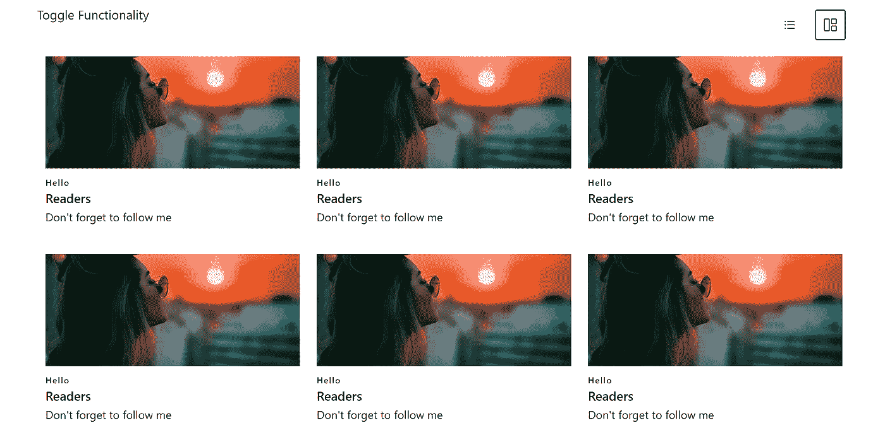
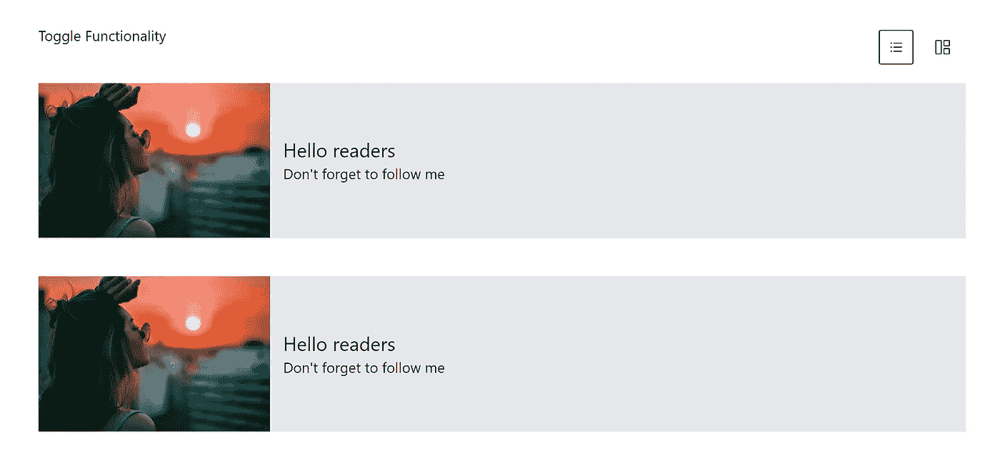

# 使用 Next.js 和 TailwindCSS 切换不同的组件

> 原文：<https://javascript.plainenglish.io/toggle-different-components-on-click-using-next-js-and-tailwindcss-3325cb764c3f?source=collection_archive---------4----------------------->

## 点击按钮并切换不同的组件


Photo by [Madison Yocum](https://unsplash.com/@madisontraveling?utm_source=medium&utm_medium=referral) on [Unsplash](https://unsplash.com?utm_source=medium&utm_medium=referral)

大家好，我正在做一个项目，我有两个按钮，当我点击其中一个按钮时，组件会发生变化。

简单来说，它基于按钮点击来切换组件。

为此，我必须想很多，然后我做到了。你们中的许多人甚至想在自己的网站上建立这样的功能，所以我在这里帮助你们。

您需要在计算机上安装 Node.js，并使用 TailwindCSS 创建一个新的 Next.js 项目。

通过以下命令在您的首选目录中创建新的 Next.js 文件夹。

```
npx create-next-app toggleTutorial
```

它将创建一个名为 toggleTutorial 的 Next.js 应用程序。

现在安装 TailwindCSS。

你可以在这里阅读更多，[停止使用 CSS 和 Bootstrap，使用 Tailwind CSS 代替](/stop-using-css-and-bootstrap-use-tailwind-css-instead-94c689ec3b8a)，因为它会节省你的时间，做得更简单。

为此，

```
cd toggleTutorial
```

然后通过以下命令安装 TailwindCSS，

如果您正在使用 Next.js v10

```
npm install -D tailwindcss@latest postcss@latest autoprefixer@latest
```

否则，如果您使用的是 Next.js v9 或更早的版本。

```
npm install -D tailwindcss@npm:@tailwindcss/postcss7-compat postcss@^7 autoprefixer@^9
```

然后通过编写以下命令初始化项目中的 TailwindCSS:

```
npx tailwindcss init -p
```

简单地说，它将在您的工作目录中添加 tailwind.config.js 和 postcss.config.js 文件。

现在转到 tailwind.config.js 文件，删除现有代码并添加以下代码。

```
module.exports = {**purge: [“./pages/**/*.{js,ts,jsx,tsx}”, “./components/**/*.{js,ts,jsx,tsx}”],**darkMode: false, // or ‘media’ or ‘class’theme: {extend: {},},variants: {extend: {},},plugins: [],};
```

这将有助于在您的文件和文件夹中使用 TailwindCSS。

现在是最后一步，由于我不打算使用 TailwindCSS 之外的 CSS，所以我将删除包含“globals.css”和“Home.module.css”文件的文件夹名称样式。

并将以下代码粘贴到 pages/_app.js 中

```
import “tailwindcss/tailwind.css”;
```

现在，您的 pages/_app.js 将如下所示:

```
import "tailwindcss/tailwind.css";function MyApp({ Component, pageProps }) {
  return <Component {...pageProps} />;
}export default MyApp;
```

就是这样。我知道这有点麻烦，但是相信我，这将会节省你未来最重要的时间。

现在我们开始吧。

为此，创建五个组件:

1.  容器. js
2.  网格. js
3.  GridCard.js
4.  NotAGrid.js
5.  HoriCard.js

在您的 toggleTutorial(我们下一个项目的名称)目录中创建一个`components`文件夹。

在其中创建五个文件，即 Container.js、Grid.js、GridCard.js、NotAGrid.js 和 HoriCard.js

容器是根据按钮点击显示 Grid.js 或 NotAGrid.js 的主要组件。



Grid.js 将基于一个网格显示内容，例如，一行三张卡片。在右上角，你可以看到两个按钮。一个将显示网格(GridCard)，另一个将显示全角水平卡片(HoriCard)。



并且 NotAGrid.js 将如上所示水平显示相同的内容。

# 制作卡片

首先，让我们通过单击网格按钮来构建将要显示的卡片。

所以在 GridCard.js 中，粘贴下面的代码。

```
import React from "react";const GridCard = () => {return (<div className="flex flex-wrap w-1/3">
<div className="px-3 pb-10"><h3 className="tracking-widest text-xs text-black font-medium"> Hello
</h3><h2 className="text-lg text-bc1 font-medium title-font">
Readers
</h2><p className="leading-relaxed text-base text-black">
Don't forget to follow me
</p></div></div>);
};
export default GridCard;
```

我在这里使用的图像是从 Unsplash 下载的，放在我们目录的 public 文件夹中。简单地说，我在公共文件夹中创建了一个图像文件夹，并粘贴了这些图像。

既然我们已经为网格按钮制作了卡片，那么让我们为另一个按钮制作横排卡片。

所以在 HoriCard.js 中，粘贴下面的代码。

```
import React from 'react';const HoriCard = () => {
return (<div class="w-full flex flex-wrap mb-12 bg-gray-200">
<div class="my-auto px-4 w-3/4 py-auto">
<h2 class="text-2xl text-black">Hello readers</h2>
<p className="text-lg text-black">Don't forget to follow me</p>
</div></div>);}
export default HoriCard;
```

就这样，我们为两个按钮都做了卡片。

# 渲染卡片

现在我们必须渲染这些卡片。为此，我们将使用呈现 GridCard.js 的 Grid.js 和呈现 HoriCard.js 的 NotAGrid.js

我们开始吧。

在 Grid.js 中，粘贴下面的代码。

```
import React from "react";
import GridCard from "./GridCard";const Grid = () => {
return (<>
<GridCard />
<GridCard />
<GridCard />
<GridCard />
<GridCard />
<GridCard />
</>);};export default Grid;
```

现在让我们跳到 NotAGrid.js。

在 NotAGrid.js 中，粘贴下面的代码。

```
import React from "react";import HoriCard from "./HoriCard";const NotAGrid = () => {
return (<>
<HoriCard/>
<HoriCard/>
<HoriCard/>
<HoriCard/>
<HoriCard/>
<HoriCard/>
</>);};export default NotAGrid;
```

# 创建按钮

我们实际上已经创造了很多东西，现在我们想要两个按钮。一个将显示网格卡，另一个将显示水平卡。

对于按钮，我将使用[反应图标](https://react-icons.github.io/react-icons)。

要安装它，只需在您的终端中编写以下代码。

```
npm install react-icons — save
```

就这样，现在你可以在你的项目中使用反应图标。

在 Container.js 中，创建按钮。

```
import React from "react";
import { BsGrid1X2 } from "react-icons/bs";
import { AiOutlineBars } from "react-icons/ai";const Container = () => {
return(<div class="w-11/12 mt-10 mx-auto flex flex-wrap"><h1 class="flex-none text-lg">Toggle Functionality</h1>
<div class="flex-1 px-2 mx-2"></div><button class="m-2 p-3">
<AiOutlineBars className="text-lg " />
</button><button class="m-2 p-3">
<BsGrid1X2 className="text-lg" />
</button></div>
);}export default Container;
```

因为您已经下载了反应图标，所以您可以从节点模块访问它。为此，您必须在[反应图标](https://react-icons.github.io/react-icons)中搜索图标，并复制图标名称。

简单地导入如下:

```
import { **Bs**Grid1X2 } from "react-icons/**bs**";
import { **Ai**OutlineBars } from "react-icons/**ai**";
```

# 添加功能

为了给我们的按钮增加功能，我们将使用反作用钩子。

代码如下所示，在 Container.js 中

```
import React from "react";
import { BsGrid1X2 } from "react-icons/bs";
import { AiOutlineBars } from "react-icons/ai";
import Grid from "./Grid";
import NotAGrid from "./NotAGrid";const Container = () => {
const [grid, setCard] = React.useState("grid");const cardDisplay = () => {
setCard("add-card");
};const gridDisplay = () => {
setCard("grid");
};return (
<><div class="w-11/12 mt-10 mx-auto flex flex-wrap"><h1 class="flex-none text-lg">Toggle Functionality</h1>
<div class="flex-1 px-2 mx-2"></div><button class="m-2 p-3" onClick={gridDisplay}>
<AiOutlineBars className="text-lg " />
</button><button class="m-2 p-3" onClick={cardDisplay}>
<BsGrid1X2 className="text-lg" />
</button></div><div className="w-11/12 mx-auto mt-4 flex flex-wrap">
{grid === "add-card" && <Grid />}
{grid === "grid" && <NotAGrid />}
</div></>);};export default Container;
```

就这样，我们完成了切换功能。

# 渲染容器

因为我们使用的是 Next.js，所以我们不需要创建路由。只需转到我们 toggleTutorial 中的 pages 文件夹，您就可以看到 index.js。

在 index.js 中，删除前面的代码并用下面的代码更新它。

```
import Container from "../components/Container";export default function Home() {
 return <Container />;
}
```

现在只需运行您的应用程序

```
npm run dev
```

你可以看到我们在 localhost:3000 上的工作。

在这里，您也可以根据道具传递不同的图像。

谢谢。

***如果你喜欢我的工作并想支持它，你可以*** [***请我喝杯咖啡！***](https://www.buymeacoffee.com/nitinfab)

[*如果你喜欢读这样的故事并且想帮助我成为一名作家，考虑成为一名中等会员*](https://nitinfab.medium.com/membership) *。它每月花费 5 美元，并且让您* [*无限制地访问中等内容*](https://nitinfab.medium.com/membership) *。如果你通过我的链接注册，我会得到一点佣金。*

*多内容见于* [***中***](http://plainenglish.io)