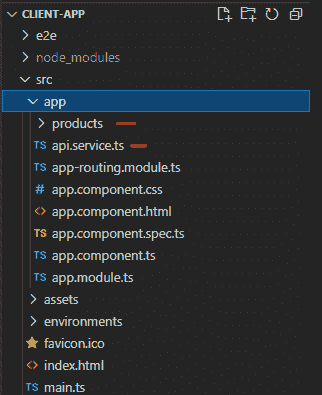

# 角度应用中基于令牌的安全性

> 原文：<https://javascript.plainenglish.io/token-based-security-angular-applications-9378791a3762?source=collection_archive---------9----------------------->

# 介绍

我写过几篇关于基于令牌的安全、其重要性、OAUTH、OIDC 和身份服务器的文章。如果你不熟悉这些话题，你可以查看之前的[帖子](https://medium.com/codex/token-based-security-setting-up-identityserver-ui-part-6-36173700857f)。

今天，我将讲述如何利用这些技术保护角度应用。我们将了解如何将角度应用程序与 IdentityServer 关联。

Angular 应用程序是一个**公共客户端**类型的应用程序，这些应用程序不像**服务器端**客户端应用程序如 ASP。NET MVC，Nodejs 等。

过去**隐式**流用于角流，但不再推荐。正如我们在以前的帖子中了解到的那样，授权码**+**PKCE**是当今的标准。**

这个流程涉及从 angular 应用程序重定向到 IdentityServer，用户在 IDP 上输入登录/密码，在那里进行验证，然后重定向回 angular 应用程序。

我见过许多带有**应用内**登录屏幕的应用程序(例如，在 Angular 应用程序内)，虽然这可以做到(通常使用资源所有者密码流)，但如果可能的话，请避免这种做法。它制造的问题比解决的问题还多。如果您对 IDP 默认的登录/注销视图不满意，您可以设计/更改 IDP 屏幕，而不是构建登录/注销等。角度应用中的屏幕。

在本文中，我们将介绍推荐的流程，但是，首先，我们需要一些 API 端点(在资源服务器上)来返回一些数据。接下来让我们创建一个简单的端点:

# API 端点

我有一个 API，只是一个. NET 核心的 web 应用。首先，我为产品创建了一个 API，如下所示，它使用 **dapper** 和 **postgreSQL** 从数据库中读取数据，并以 JSON 格式返回给调用者:


(我在 dapper ORM 上使用 postgres db，如果你愿意，你可以直接返回内存数据，完全跳过 db 部分)。

接下来，我们将创建一个 angular 应用程序和一个产品组件。Angular 应用程序将对 ProductsController 上的 Get 端点进行 HTTP 调用，并接收 JSON 数据，然后使用 HTML 显示这些数据。

# 角度应用

我已经使用 angular-cli 创建了一个非常基本的角度应用程序。应用程序包含一个在表格中显示产品数据的**产品组件**。您可以使用自己现有的或新的角度应用程序，其机制是相同的。

我还创建了一个角度服务 **api.service.ts** ，它对后端 api 端点(ProductsController)进行 HTTP 调用:



现在，如果我们运行 angular 应用程序并访问产品页面，产品会显示在页面上:


因此，我们的 angular 应用程序能够调用 API 端点并获取数据。接下来，让我们保护这个 API 端点:

# 保护 API

让我们通过应用 Authorize 属性来保护 API:


重新启动 web 应用程序，并尝试再次打开产品页面，但不会显示任何数据。打开控制台窗口，我们会看到 401 错误:


因此，API 受到保护，只有授权的客户才能访问它。

现在，在这一点上，我们在**资源服务器**中有一个产品 API 端点，它使用**授权**属性进行保护。我们的**身份服务器**正在保护资源服务器。我们还有一个 **Angular** 应用程序，它对产品 API 端点进行 HTTP 调用。接下来，让我们做一些必要的步骤来授权这个 HTTP 调用获取数据。

# OIDC 客户

为了将我们的 angular 应用程序连接到授权服务器并处理各种流，我们可以使用 **oidc** 客户端库来管理重定向和协议级细节。

您可以使用 npm 命令安装软件包:

```
npm install oidc-client
```

接下来，我们将创建一个服务(AuthService ),它将作为我们的 angular 应用程序的安全上下文。该服务将根据需要在内部使用 **oidc** 库。

# 授权服务

我们将从创建这个服务开始。Auth service 将使用 oidc 库，并为我们完成向 oidc 认证的艰苦工作。


首先，我们将从 oidc 库中导入 **UserManager** 和 **User** 类型。这些是您将从 oidc 客户端处理的主要类型。

接下来，我们包含了用于**用户管理器**和**用户**类型的私有字段。用户管理器将在登录过程完成时生成用户。接下来，我们在 AuthService 的**构造函数**中初始化 **UserManager** 。

我们很快就会看到**用户**变量。

*   对象为我们管理 OIDC 流的所有底层协议细节。因此，我们不必担心我们的应用程序和身份提供商之间的网络连接。
*   **User** type 封装了一个**登录的**用户的客户端信息，例如
*   从 **IDP** 返回的 ID 和访问**令牌**
*   作为**声明**从 IDP 返回的任何用户**资料**信息。
*   并且能够在用户的令牌过期时使用。

在服务的构造函数中，我们用 **stsSettings** 初始化 UserManager。如果你还记得我们的邮差演示，你可能已经认出了其中的一些。

*   **redirect_ur** i:这是 IdentityServer 在登录过程后重定向回来时的 uri。我们将为此创建一个角度组件。
*   **post_logout_redirect_uri** :与上面类似，我们将创建一个 angular 组件来处理用户在 STS 上注销并重定向回 angular 应用程序的情况。

这两个组件将非常简单，大多只有一个**空 div** 和一些 JavaScript。我们将在后面的文章中看到这两个组件。

# 登录过程

接下来，我在 AuthService 中添加了一个 **login** 方法，该方法在 **userManager** 对象上调用 **singinRedirect** :


成功登录后，UserManager 将它创建的结果用户对象存储在**会话存储器**中，以便在需要时可以随时检索，例如获取 **AccessToken** 以将其发送给 **API** 调用。

用户对象包含**访问**和 **ID 令牌**，以及一个**过期**标志，我们可以检查该标志以确保访问令牌没有过期。


# isLoggedIn Helper 方法

在上面的代码图中，我创建了**is loggin**方法。该方法将帮助我们从任何组件中找出“**检查用户是否已经登录**”。

# 加载用户时引发事件

当重定向从 STS 返回 angular app 时，获得 **ID** 和**访问令牌**的进程与根视图的加载异步**。因此，我们还需要**在用户加载时引发一个事件**(见下图)，这样依赖于它的 UI 就可以更新了。我们将使用一个 **RxJs 可观察值**来实现这一点:**


因此，为了实现这一点，我们将在 AuthService 上声明一个作为 RxJs 主题的**私有属性** `_loginChangedSubject`，然后声明一个由**主题**产生的**公共可观察对象** `_loginChanged`。然后我们在 **isLoggedIn** 方法中添加代码以**触发可观察的**。


当**登录过程** **完成**时，我们也会触发这个可观察事件，但是我们稍后会回到那个部分。

# 从会话存储中加载用户

接下来，用 **IsLoggedIn** check 更新根 **AppComponent** ，这样，如果会话存储中已经有一个来自上一次登录的文件，用户就可以在启动时加载。


我还添加了一个事件处理程序，当登录状态改变时更新 **isLoggedIn** 属性**。**


因此，现在每当用户状态改变时，应用程序组件都会得到通知，并且应用程序将能够对该改变做出反应。

# 登录/注销按钮和方法

接下来，我在 **AppComponent** 中添加了登录/注销按钮(HTML)和方法:


下面是登录/注销方法代码:


我们仍然必须设置登录和挑选出**回调组件**和一些更多的角度代码。我们还需要**用 angular 客户端设置来配置 STS** 。然而，为了控制帖子的长度，我们现在暂停，将在下一篇帖子中继续余下的设置。您可以从这个 git 存储库下载源代码。我们将在下一篇文章中继续这个设置，如果你有什么意见或问题，请告诉我。下次再见，快乐编码。

*原载于 2021 年 6 月 12 日 https://hexquote.com*[](https://hexquote.com/token-based-security-angular-applications/)**。**