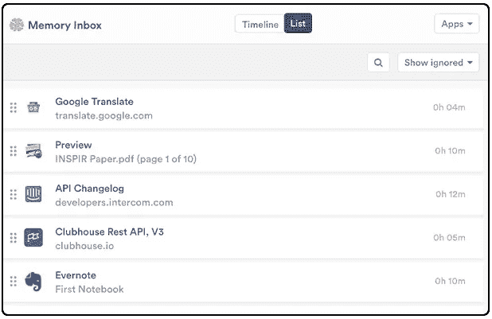
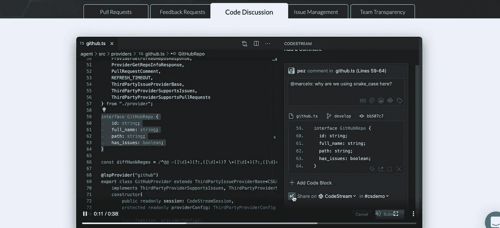
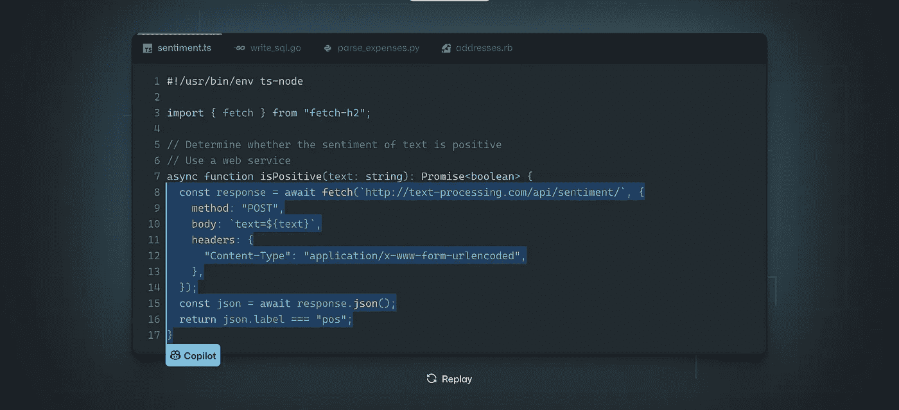
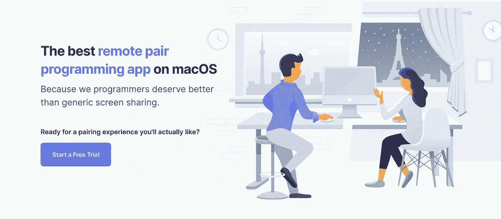
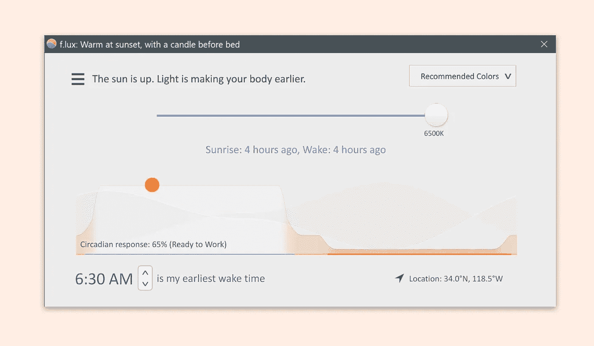
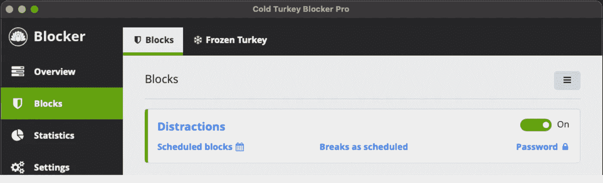
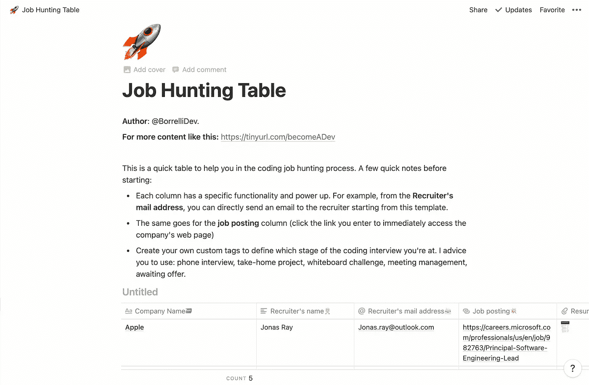
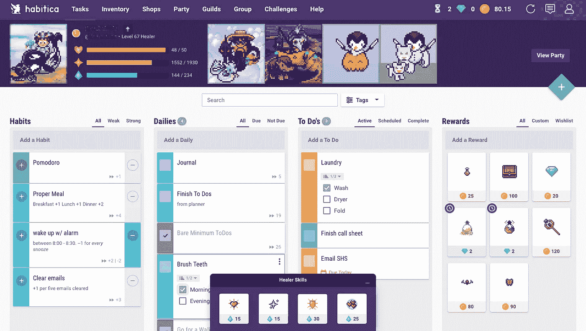

# 2021 年让你的编码效率翻倍的 8 个神奇工具

> 原文：<https://javascript.plainenglish.io/tools-to-double-your-coding-productivity-in-2021-13d96be4bde6?source=collection_archive---------2----------------------->

## 如果你只发挥了你真正能力的 20%呢？

Photo by [Austin Distel](https://unsplash.com/@austindistel?utm_source=unsplash&utm_medium=referral&utm_content=creditCopyText) on [Unsplash](https://unsplash.com/?utm_source=unsplash&utm_medium=referral&utm_content=creditCopyText)

如果你只发挥了你真正能力的 20%呢？

如果有一种工具可以让你最无聊的任务自动化，那会怎么样？有没有一个能准确告诉你你宝贵时间去了哪里的？还是让编码更有趣的？

让我们深入研究这些工具，看看今年哪些工具能对你的编码生活产生最大的影响。

## 及时的

分析你的时间是 2021 年的秘密力量。这意味着发现你有多少生产力，你所有的宝贵时间都去了哪里。有了像“及时”这样的工具，人工智能将在幕后跟踪你在电脑上的工作。发现你在每个网站、桌面应用程序或 Youtube 上看小猫花了多少时间。

An example of Timely tracking your time

我的结果令人震惊。多亏了这样一个工具，我意识到我每天浪费了多少时间，如果我付出努力而不是被愚蠢的事情分心，作为一名作家，我可以赚得更多。

## **码流**

如果你想共享你的代码，你不需要打开一个拉请求或者快速调用。有了 CodeStream，您可以通过在 IDE 中放置一个协作工具来加快开发速度。
该工具支持直接在您的代码环境中进行拉式请求、问题管理，甚至代码讨论。最后，您将避免我们作为开发人员都讨厌的枯燥的上下文切换。

## Github 副驾驶

显然，你再也不会独自编码了，因为人工智能支持的是未来。有了这个 alpha 阶段的项目，你可以直接在你的 IDE 中获得人工智能支持，为你提供线条甚至整个功能的建议。
除此之外，Copilot 还会将你的评论转换成工作代码，为你自动化重复的任务，并建议你测试你的代码。
这是我一生中见过的对我们编码方式最激动人心的改变。

## 元组

使用 Slack 或 Zoom 对于结对编程来说并不可怕，但是如果你有一台 mac，你可以做得更好。使用 Tuple，您可以通过获得远程控制、低延迟连接和阻止所有嘈杂通知等功能来提升您的疫情结对编程游戏。

## 勒克司

你明亮的电脑屏幕在白天可能看起来很棒，但在晚上就不是这样了，尤其是对你的睡眠周期而言。F.lux 通过在白天调节屏幕亮度，早上更亮，晚上更暗和更暖，防止你的电脑破坏你的睡眠时间表和你的眼睛。

只要设置好工具，剩下的就交给 F.lux 了！

F.lux brightness regulation

## 冷火鸡

冷火鸡是一门纯粹的学科，直接建立在你的计算机上。在你选择的特定时间内，它会阻止游戏、应用程序甚至互联网接入，让你无法不集中注意力。

也许一开始不是最好的，但你未来的自己会感谢你。

## 概念

这款笔记应用的魅力在于它的强大功能。你可以把你的每一个笔记塑造成你想要的样子:看板、图表、内嵌日历、表格。观念很难掌握，但是一旦你掌握了这个工具，你就正式成为了一个强大的 10 级创造者。

I created a full custom template for devs in just 5 minutes using Notion.

## 惯习

把你的活动游戏化，把你的生活变成角色扮演游戏。有了 Habitica，你每完成一项任务，就可以升级你的角色并获得盔甲、皮肤和物品。

你甚至可以和其他 Habitica 用户一起对抗游戏中的 bosses！

An example of how your life can turn into an RPG with Habitica.

## 结论

发现新工具最好的部分是让它们积极地影响我们的生活。希望这篇文章已经帮助你发现了一些你不知道的东西，并且从现在开始它将会以一种更有成效的方式改变你的工作方式。

—皮耶罗

## 想学习如何作为一名开发者赚更多的钱并达到财务自由吗？这是我给你的免费指南。

*更多内容尽在*[***plain English . io***](http://plainenglish.io)