# 面向高级开发人员的 10 大高级 VS 代码设置

> 原文：<https://javascript.plainenglish.io/top-10-advanced-vs-code-settings-for-senior-developers-46e348351bd6?source=collection_archive---------0----------------------->

## 警告:这些 VS 代码设置不适合初学者——但是如果你是一个高级开发人员，你会喜欢这些提示的。

Actual snapshot of the author looking at his VS Code settings ([JK!](https://www.urbandictionary.com/define.php?term=Just%20kidding%21) — Photo by [bruce mars](https://unsplash.com/@brucemars?utm_source=medium&utm_medium=referral) on [Unsplash](https://unsplash.com?utm_source=medium&utm_medium=referral))

你的 VS 代码`[settings.json](https://code.visualstudio.com/docs/getstarted/settings#_settings-file-locations)`文件有多长？要诚实。

我的目前是 109 行，这让我思考——我实际上使用这些设置中的哪一个？

还有哪些设置我会推荐给其他资深开发者？

如果你不确定你是否准备好接受高级建议，让我向你保证——高级只是一种精神状态。(*对不对爷爷？*👴)

但是我会等你去查看我的[VS 代码](https://betterprogramming.pub/how-to-set-up-vs-code-like-a-pro-in-just-5-minutes-65aaa5788c0d?gi=127b1618fb9c)初学者指南:

 [## 如何在短短 5 分钟内像专业人士一样设置 VS 代码

### 初学者指南

better 编程. pub](https://betterprogramming.pub/how-to-set-up-vs-code-like-a-pro-in-just-5-minutes-65aaa5788c0d) 

# 1.通过键盘快捷键隐藏活动栏

VS Code 的"[活动栏](https://code.visualstudio.com/docs/getstarted/userinterface#_basic-layout)"是屏幕左侧的图标列表，链接到程序的各个部分。

然而，一旦你使用 VS 代码一段时间，你可能想要回那个屏幕空间。没问题，只需切换活动栏。

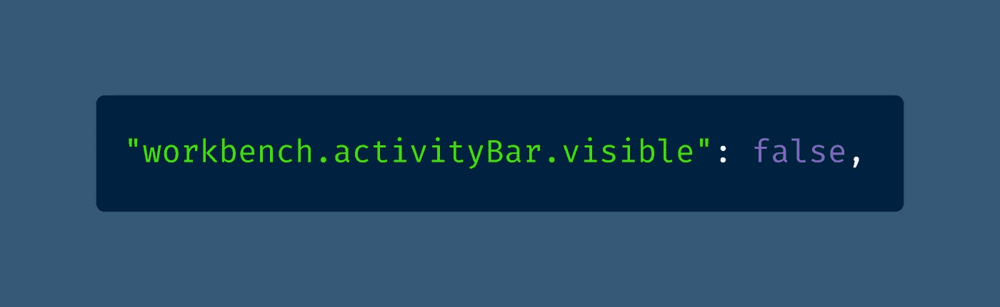

[View raw code](https://gist.github.com/DoctorDerek/190713a7206d173cb332a6f214de5def) as a GitHub Gist

隐藏活动栏后，您可能会发现自己在使用键盘快捷键，如 Ctrl+Shift+E(文件浏览器)、Ctrl+Shift+X(扩展)和 Ctrl+Shift+H(搜索和替换)。

但是当活动栏被隐藏后，你如何再次显示它呢？回到你的设置文件会很糟糕，所以你可以设置一个自定义的快捷方式。

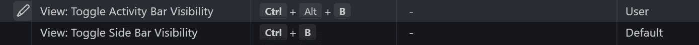

Screenshot of VS Code’s Keyboard Shortcuts editor by the author, [Dr. Derek Austin 🥳](https://medium.com/u/e5294c417caf?source=post_page-----46e348351bd6--------------------------------)

在这里，我已经进入[键盘快捷键编辑器](https://code.visualstudio.com/docs/getstarted/keybindings)来设置一个自定义快捷键。我已经用 Ctrl+B 隐藏了侧边栏(文件浏览器等)。)，所以我设置了 Ctrl+Alt+B 隐藏活动栏。

VS 代码设置是自动设置的，所以你不必担心每次都回到“开放设置(JSON)”中去弄乱它。

如果你喜欢使用[命令面板](https://code.visualstudio.com/docs/getstarted/userinterface#_command-palette) (Ctrl+Shift+P)，你也可以只搜索“切换活动栏”我更喜欢键盘快捷键。

# 2.GitHub 副驾驶

关于 GitHub Copilot 众说纷纭，这是新的 VS 代码扩展，由机器学习提供支持，在你编写代码时生成代码片段。

大多数人说它会把你的代码变成一堆热气腾腾的垃圾，从而毁掉你的代码，但是我碰巧喜欢它。抱歉，仇恨者！😏

[View raw code](https://gist.github.com/DoctorDerek/190713a7206d173cb332a6f214de5def) as a GitHub Gist

出于隐私方面的考虑，我不会在工作中使用 Copilot，但是对于个人项目，我发现它非常有趣和有用——尤其是对于单元测试。

当然，Copilot 不会在所有文件上工作，所以你可能需要配置它，在某些文件扩展名上关闭它。这就是这个设置的作用。

# 3.缩放设置和字体大小

没有什么比看不到小文本更高级的了，尽管似乎没有人会在 Zoom 通话中提起它。

你注意到了吗？有人在做笔记或在屏幕上显示 8 或 10 号字体的代码，而我看不到。

我甚至还没有远视，但我更喜欢大 DPI，大字体，工作时放大。如果我不需要，为什么要让我的眼睛疲劳？

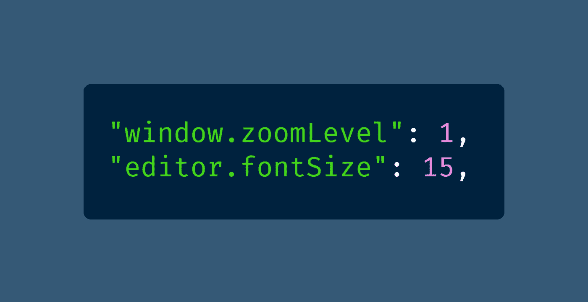

[View raw code](https://gist.github.com/DoctorDerek/190713a7206d173cb332a6f214de5def) as a GitHub Gist

当然，你可能不会进入“打开设置(JSON)”来[放大和缩小 VS 代码](https://medium.com/derek-develops/how-to-zoom-in-and-out-in-vs-code-plus-an-optional-extension-2e9722638fd1)，但是你可能想要编辑字体大小。

我个人认为，VS 代码将缩放级别保存在同一个`settings.json`文件中是很有趣的。

# 4.无需确认即可拖放和删除

你对自己的编程技能有多自信？或者，更好的说法是，你对 VS Code 的撤销(Ctrl+Z)功能有多少信心？

我发现每当我使用拖放或删除文件时，VS 代码中无休止的确认会分散我的注意力。

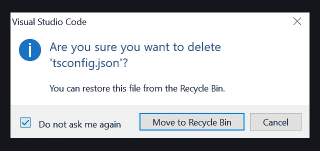

当您为拖放或删除提示选择“不要再问我”时，您会将选项保存到`settings.json`中。

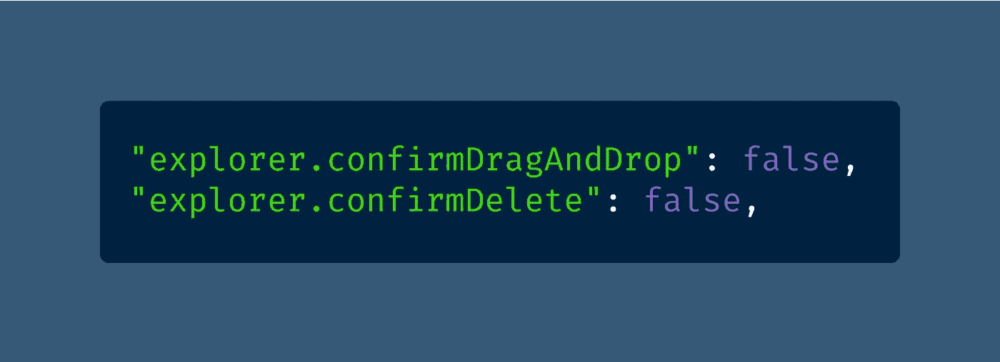

[View raw code](https://gist.github.com/DoctorDerek/190713a7206d173cb332a6f214de5def) as a GitHub Gist

如果您后来决定错过确认对话框，您会很高兴知道在哪里可以找到这些设置。😉

# 5.用绝对路径自动更新导入

VS 代码最好的特性之一是它如何处理文件导入——你可以通过一些调整使`[import](https://developer.mozilla.org/en-US/docs/Web/JavaScript/Reference/Statements/import)`语句变得更好。

首先，我更喜欢绝对文件路径，比如`@/components/Button`，而不是相对文件路径，比如`../../Button`。

第二，当我移动文件进行重新组织时，我总是希望我的文件导入自动更新。(为什么这甚至是一个选项？)

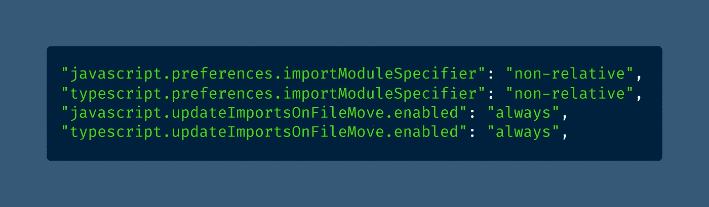

[View raw code](https://gist.github.com/DoctorDerek/190713a7206d173cb332a6f214de5def) as a GitHub Gist

在 VS 代码语言中，绝对导入被称为"[非相对](https://www.urbandictionary.com/define.php?term=relatives)"——因为这很有意义，以一种奇怪的方式？

注意，为了使用绝对导入，您需要在您的 `[.tsconfig](https://www.typescriptlang.org/tsconfig#paths)` [文件](https://www.typescriptlang.org/tsconfig#paths)中配置`[paths](https://www.typescriptlang.org/tsconfig#paths)` [。(JavaScript 的对等词是`.jsconfig`。)](https://www.typescriptlang.org/tsconfig#paths)

# 6.保存时的代码操作

你曾经希望 VS 代码能读懂你的思想吗？我经常希望它可以，而不是以令人毛骨悚然的 GitHub 副驾驶的方式。

这就是为什么我在保存文件时设置编辑器做两件事:

1.  修复所有 ESLint、StyleLint 或[更漂亮的](https://levelup.gitconnected.com/how-to-format-all-files-in-a-directory-with-prettier-5f0ff5f4ffb2)问题。
2.  添加缺少的导入(尚未导入的已知类型)。

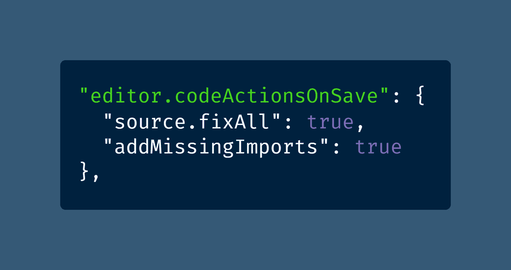

[View raw code](https://gist.github.com/DoctorDerek/190713a7206d173cb332a6f214de5def) as a GitHub Gist

我认为这是你能得到的最接近编程魔法的东西——除非你发现[多光标](https://code.visualstudio.com/docs/editor/codebasics#_multiple-selections-multicursor)技巧真的[敏锐](https://www.urbandictionary.com/define.php?term=keen)。

当然，添加缺失的导入并不总是正确的，但是当它正确的时候，我总是被深深的打动。

# 7.带有 Stylelint 的 CSS 林挺

您可能已经在使用 [Stylelint](https://stylelint.io/) ，而不是 VS 代码中内置的 CSS 验证，但是如果没有，您需要在设置中配置它。

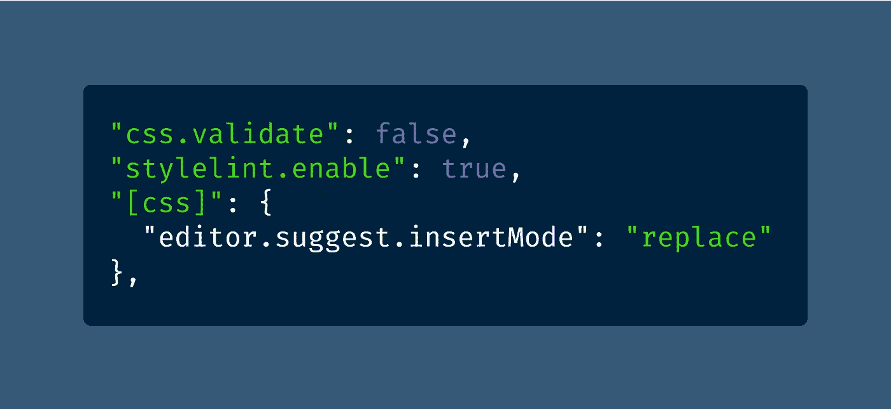

[View raw code](https://gist.github.com/DoctorDerek/190713a7206d173cb332a6f214de5def) as a GitHub Gist

这里说的另一个设定是`[editor.suggest.insertMode](https://stackoverflow.com/questions/41948329/how-to-make-vscode-to-replace-the-word-when-accepting-autocomplete-hint)`，写起来拗口，说起来更是如此。

当您将该设置设置为“替换”时，Intellisense 会稍有变化—当您选择一个提示并按 Tab 或 Enter 时，该提示会替换整个文本，而不仅仅是部分文本。很难描述，但是很有用。

# 8.埃米特的超能力

你可能熟悉 [Emmet](https://emmet.io/) ，“经验丰富的网络开发人员的基本工具包”如果不是，你应该去玩 [Sourcery](https://codepip.com/games/sourcery/) 。我会等的。

而埃米特是内置的 VS 代码(耶！)，您必须手动配置设置，以便 Tab 键触发自动完成(boo！).

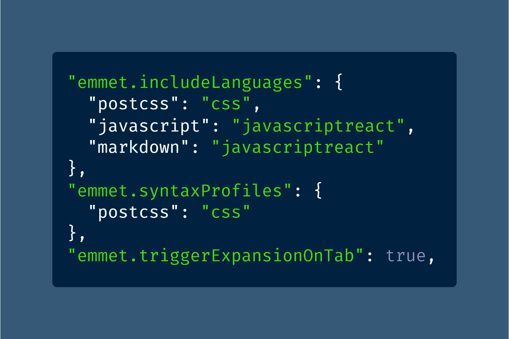

[View raw code](https://gist.github.com/DoctorDerek/190713a7206d173cb332a6f214de5def) as a GitHub Gist

你可能还会发现自己不得不教埃米特世界的方式——比如如何把“T1”后置 CSS 变成“T2”，或者如何把“T3”写成“T4”。

# 9.顺风 CSS 提示和技巧

[Tailwind CSS Intellisense](https://marketplace.visualstudio.com/items?itemName=bradlc.vscode-tailwindcss) 尚未内置于 VS Code 中，但它可以作为 VS Code 的免费扩展提供。

您可以通过两个额外的设置使它的 Tailwind CSS 增强功能更好。

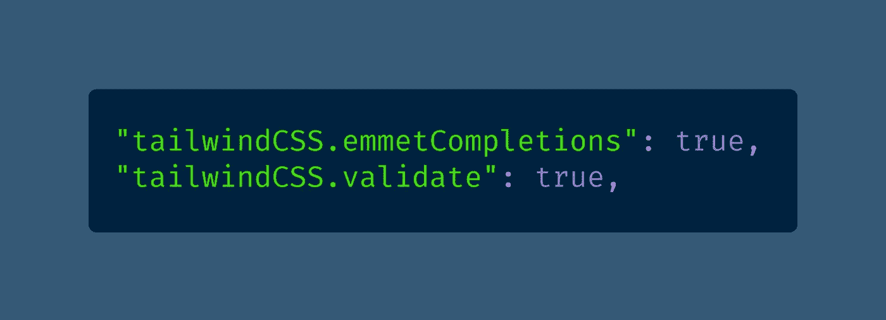

[View raw code](https://gist.github.com/DoctorDerek/190713a7206d173cb332a6f214de5def) as a GitHub Gist

第一个选项允许您将 Emmet 完井与 Tailwind CSS 一起使用，这意味着`h2.font-bold.text-red-500.text-2xl`将按预期工作。

第二个设置启用了 Intellisense 扩展的内置 Tailwind CSS linter。启用 linter 后，您将收到不支持使用 [@apply](http://twitter.com/apply) 指令的警告和错误、冲突的 CSS 属性，以及在 [JIT(准时制)模式](https://tailwindcss.com/docs/just-in-time-mode)中我最喜欢推荐的变体顺序。

为什么不同的订单如此重要？嗯，事实并非如此，除了当与我之前提到的“保存时全部修复”设置相结合时，VS 代码会自动对您的 Tailwind 类进行排序。

我曾经使用一个名为逆风的扩展对我的 Tailwind CSS 类进行排序，但是它还没有被 JIT 更新。我发现有一个自动工具可以保持我的 Tailwind CSS 类的有序，这就是[离合器](https://www.dictionary.com/e/slang/clutch/)。

# 10.通过单击打开文件

关于 VS 代码的默认用户界面，有一件事让我很困扰，那就是从文件浏览器双击打开一个文件。

一次点击就能得到奇怪的“预览”模式，当你点击下一个文件时，第一个文件就消失了。就像只有一张账单。

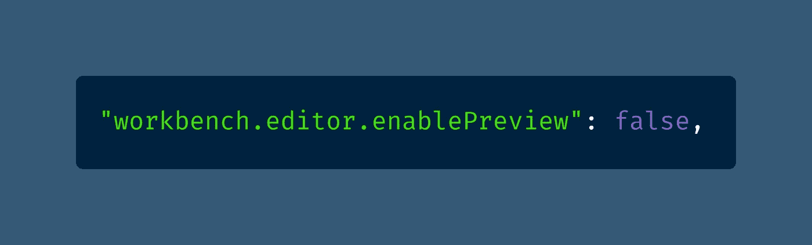

[View raw code](https://gist.github.com/DoctorDerek/190713a7206d173cb332a6f214de5def) as a GitHub Gist

我已经多次在谷歌上搜索如何解决这个 UX 问题，因为我甚至不记得它叫什么[预览模式](https://til.cybertec-postgresql.com/post/2019-09-14-Disable-preview-mode-in-VS-Code/)。

一旦您将其关闭，单击一下就会在新的选项卡中打开一个文件。问题解决了，您就可以回去工作了。[唷！](https://www.urbandictionary.com/define.php?term=phew)

# 额外提示-打开设置同步

我的前 10 个列表中还有一个被低估的 VS 代码特性， [Settings Sync](https://code.visualstudio.com/docs/editor/settings-sync) ，它实际上是在活动栏中配置的。

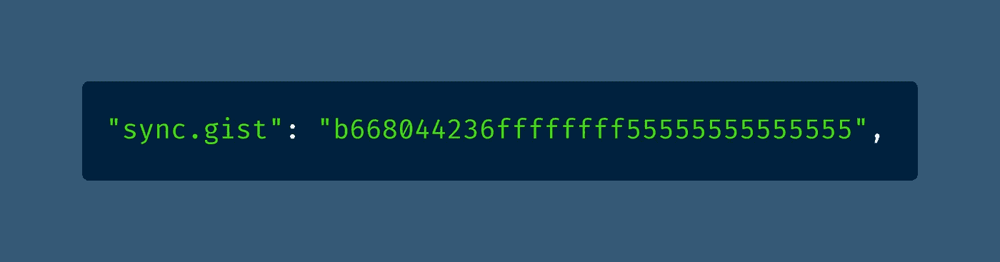

[View raw code](https://gist.github.com/DoctorDerek/190713a7206d173cb332a6f214de5def) as a GitHub Gist

点击屏幕左下方(活动栏的最底部)的齿轮，然后选择“打开设置同步…”

你大概可以猜到 Settings Sync 是做什么的——它将你的 settings.json 文件，以及你的扩展和主题，保存到 GitHub Gist 中。

[哇！这样的后援！当你的电脑不可避免地遭遇](https://www.meme-arsenal.com/en/create/meme/829591)[宇宙热寂](https://www.urbandictionary.com/define.php?term=heat%20death)时，它肯定会派上用场。或者[崩溃](https://www.urbandictionary.com/define.php?term=computer%20crash)。

我希望你喜欢我为高级开发人员提供的 10 大 VS 代码设置。请务必在回复中让我知道我遗漏了哪些设置。

**快乐编码！**🎃👻👑🎭🎏

德里克·奥斯汀博士是《职业规划:如何在 6 个月内成为成功的 6 位数程序员》一书的作者，该书现已在亚马逊上出售。