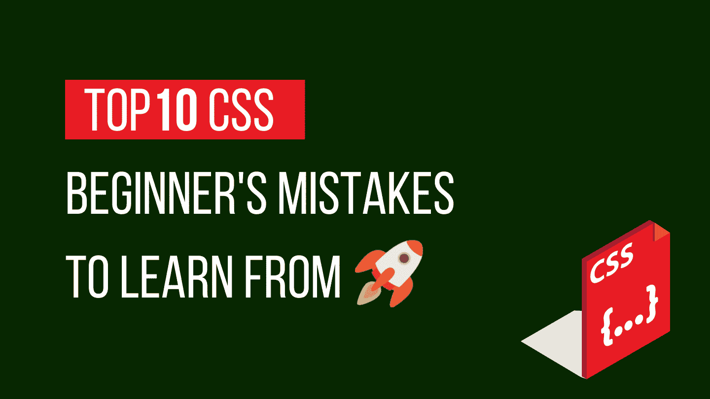
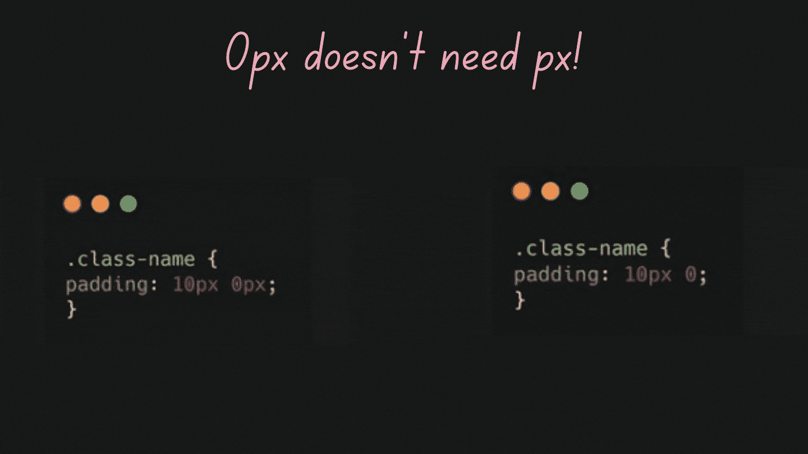
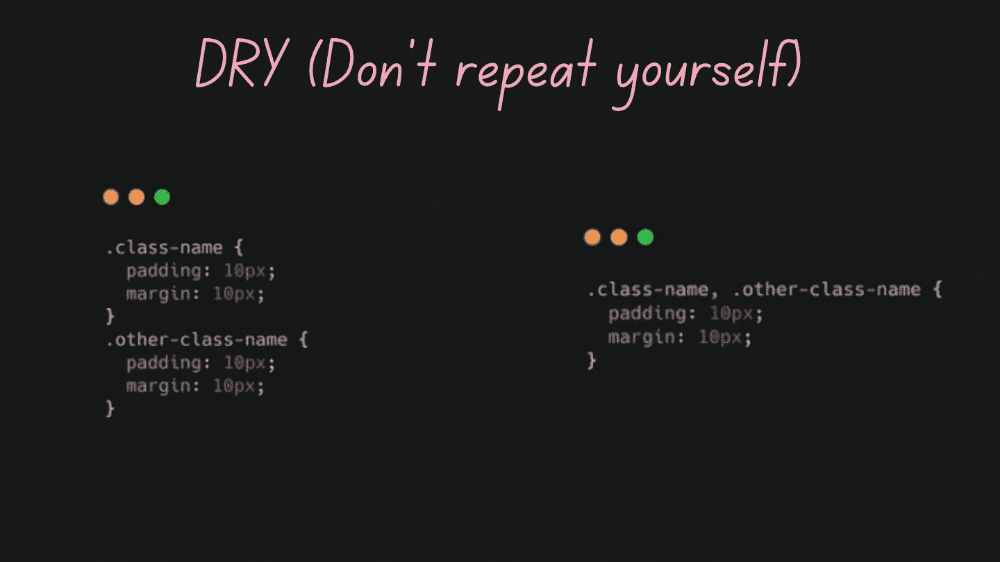
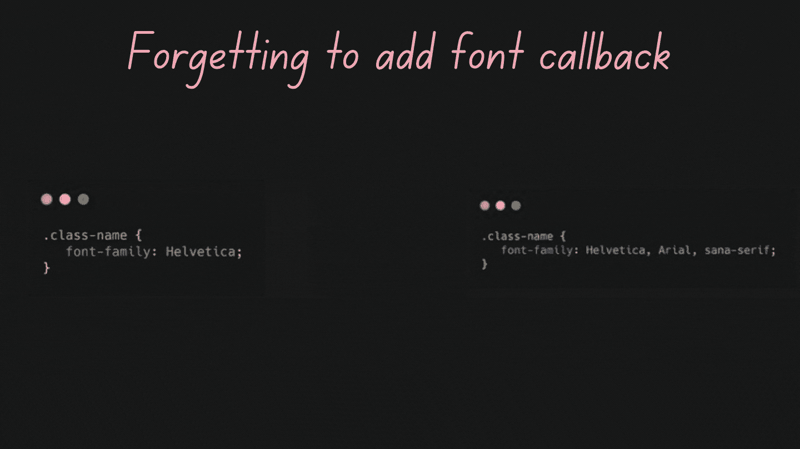
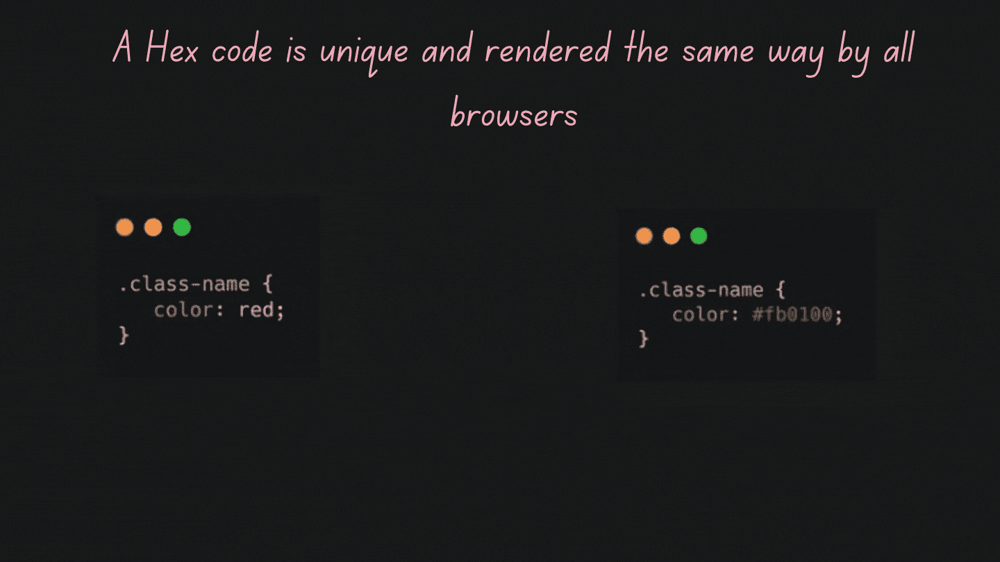
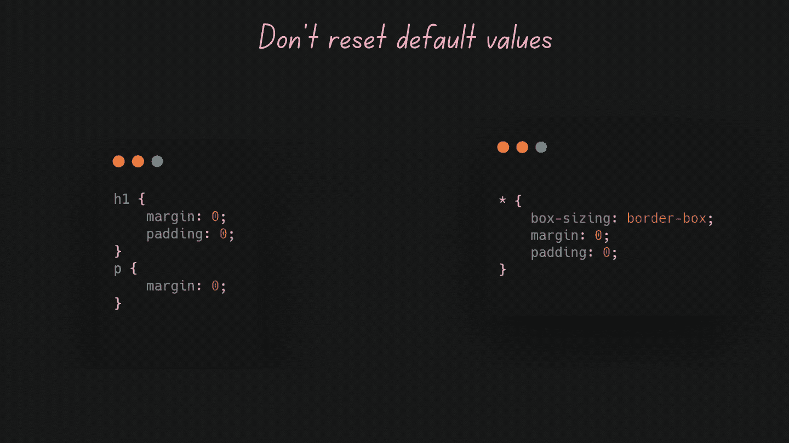
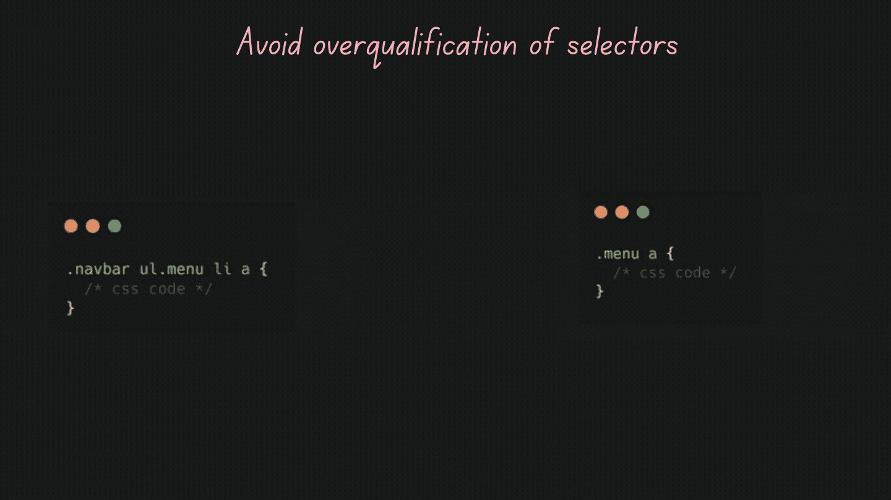

# 可供学习的 10 个 CSS 初学者错误

> 原文：<https://javascript.plainenglish.io/top-10-css-beginners-mistakes-to-learn-from-ffdf357c470b?source=collection_archive---------11----------------------->

## 从实践中学习是好的，但是从别人的错误中学习更好！

By FAM

> 向别人学习是事半功倍学得更快更聪明的最好方法！

你曾经有过和你分享经验和建议的导师吗？嗯，这就是有导师的好处。他会在几分钟或几个小时内与你分享他自己多年的经验。学别人几年学的东西是不是很棒？

如今，找到一个愿意为你投入时间和精力的导师并不容易。但是，您可以依靠文章和开发人员分享他们的经验。

我的博客目标之一是帮助你避免我自己的错误，因为当我开始时，我是独自开始的！没有从学长那里找到有帮助有价值的建议。出于愤怒，我决定创建这个博客，为经历同样事情的开发者改变一些事情！

我的博客不能解决所有问题。但至少，它尽力了！😜

这个列表是基于我自己的 CSS 错误和我在审核合并请求时发现的其他人的错误。

准备好了吗？开始吧！

# #1-不了解速记属性

当你开始了解 CSS 的时候，你会发现它有很多代码。几行代码仅仅是为了样式化一个文本，多行代码是为了样式化一个容器。不管怎样，当我们开始用 CSS 设计样式时，我们犯了一个常见的错误，那就是我们没有学习速记。这肯定会对你的 CSS 代码行以及你的生产力产生很大的影响。

我在下面的文章中分享了一些必须知道的短工，如果你想了解他们的话:

 [## 一行写 CSS 代码的 7 招！

### 如何少写 CSS 代码，提升生产力！

javascript.plainenglish.io](/7-tricks-to-write-css-code-in-one-line-64a4c9ffe57d) 

# #2-在不需要的时候使用 Px

这个错误让我想起了以前的自己。当我开始用 CSS 编码时，我犯了这个错误！

值为零时不需要像素单位！

0px doesn’t need px unit

# #3-干(不要重复自己)

有时在匆忙中，我们创建了一个 CSS 类，而没有检查是否有其他 CSS 类做了您需要的事情。你可能会说，我需要为现有的类添加额外的样式。没关系。在这种情况下，你需要 CSS 重构。

当类之间有共同点时，您可以收集它们并避免不必要的代码重复。

Avoid duplication code

# #4-没有字体回调

这也是另一个常见的错误。仅指定一种字体的名称是不够的，尽管这很有效。正确的方法是指定一个字体列表。

字体列表按优先级从高到低排序。因为字体选择一次只对一个字符起作用，所以有可能给定的字符不可用(字体没有该特定字符的字形)，这时就需要字体回调。系统将尝试后一种字体，以便能够呈现该特定字符。

Using Fonts the right way

# #5-不使用十六进制代码

老实对你说，出于懒惰，我也犯了这个错误。写一个颜色名字更快更人性化。这样做的问题是，不同浏览器上的颜色并不完全相同。唯一能识别唯一颜色的是它的十六进制代码；因此，出于专业原因和避免意外，十六进制代码应该是你的朋友。

Use Hex code for colors

# #6-将任何东西居中

居中是每个 web 应用程序或网站都需要的样式之一。用困难的方式去做，比如设定一个上下各占 50%的绝对位置，根本不是我们如何居中。既然这是很普通的学习，既然你想以正确的方式做事，你应该学习 CSS 中的专业居中方式:

 [## 像专家一样在 CSS 中居中 div 的 3 个简单方法

### 有用的 CSS 片段为生活保存

levelup.gitconnected.com](https://levelup.gitconnected.com/3-simple-ways-to-center-a-div-in-css-like-a-pro-2496f2af0a30) 

# #7-不重置默认值

使用 CSS 我们可以设计 HTML 元素的样式。例如，当元素需要添加填充或边距时，默认值为 0 边距、0 填充。有了这个，你就可以确定你是从一张白纸开始，你就不会去寻找你没有要求的怪异行为。

Not resetting default values

# #8-超过合格选择器

一个选择器不需要被过分限定和过分指定。当你能简化事情时，就去做。

Over qualifying selectors

# #9-不使用 CSS 组合子

CSS 组合子可能看起来很复杂，不可读，但是一旦你了解了每个组合子的作用，你的 CSS 代码会变得更加精确、干净和专业。

要了解关于组合子的更多信息:

 [## 如果你是一个网站开发者，你应该知道的 4 个 CSS 组合器

### CSS 组合子终极指南

levelup.gitconnected.com](https://levelup.gitconnected.com/4-css-combinators-you-should-know-if-you-are-a-web-dev-3ca64331bbe5) 

# #10-了解 CSS 单位，知道何时使用每个单位(像素、Em、Rem …)

CSS 有几个不同的单位来表示长度。数字和单位之间不能有空格。但是，如果值是`0`，单位可以省略(就像我在规则 **#2** 中提到的)。

CSS 中有两种长度类型:

*   **绝对长度:**像素，英寸，厘米…等等。
*   **相对长度:** em，rem，vw，vh，vmin，vmax，%…等。

如果你想了解更多关于每个单元在长度和屏幕方面代表什么:[看这里](https://www.w3schools.com/cssref/css_units.asp)。

📝 ***相对长度*** *单位更精确，因为它们的长度相对于另一个长度属性。*

📝 ***绝对长度*** *单位(如流行单位* `***px***` *)不建议在屏幕上使用，因为屏幕尺寸差异很大，所以在不同设备和屏幕上进行一些测试后，您可能会感到惊讶。但是，如果输出介质是已知的，则可以使用它们，例如用于打印布局。*

## 示例:

👉对于低 dpi 设备，1px 位于显示器的设备像素(点)上。

👉对于打印机和高分辨率屏幕(如 Retina 显示屏)，1px =多个设备像素。

是否使用`px`或`em`或`rem`有很多争论。事实上，这不仅是一个设备选择的问题，也是应用程序的目的，它的最终用户，无论它是只为桌面设备还是移动设备制作的。

更多详细信息的良好来源:

 [## CSS 中的大小调整:px vs em vs rem | Chiamaka Ikeanyi

### 我们已经熟悉了在 CSS 中使用像素来调整大小，但是为什么要使用 em 或 rem 呢？当构建可访问的网站时…

chiamakaikeanyi.dev](https://chiamakaikeanyi.dev/sizing-in-css-px-vs-em-vs-rem/#:~:text=Use%20em%20only%20for%20sizing,layout%20arrangement%2C%20use%20percentage%20%28%25%29.) 

# 结论

如果你已经犯了或者还在犯这些错误，不要感到羞愧；我们都去过那里。我们不是天生的演说家。随着时间的推移，我们学会了说话。web 开发领域学习永无止境，先从别人的错误中学习更明智更聪明。毕竟，你赢得了时间，第二，因为你用更少的努力学到了正确的东西！

如果你想和我们分享你的反馈，为什么不分享你的建议，我会很乐意以你的名义发表！

**让我们联系一下** [**中**](https://medium.com/@famzil/)**[**Linkedin**](https://www.linkedin.com/in/fatima-amzil-9031ba95/)**[**脸书**](https://www.facebook.com/The-Front-End-World)**[**insta gram**](https://www.instagram.com/the_frontend_world/)**[**Youtube**](https://www.youtube.com/channel/UCaxr-f9r6P1u7Y7SKFHi12g)**或** [【www.fam-front.com】T42](http://www.fam-front.com/)********

*****更多内容请看*[***plain English . io***](http://plainenglish.io)****