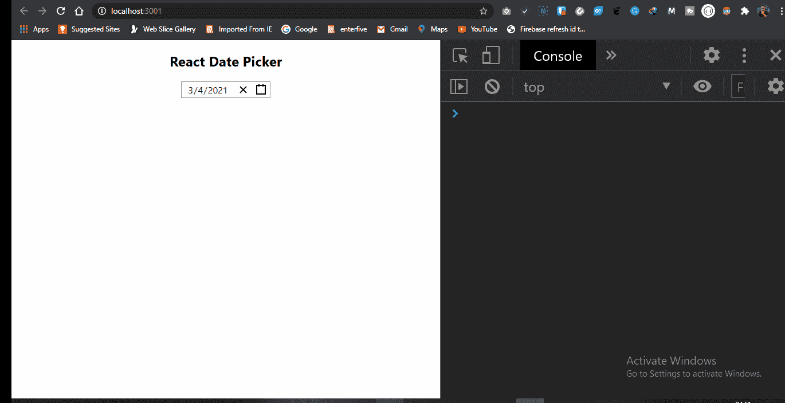

# React 的 10 大约会对象

> 原文：<https://javascript.plainenglish.io/top-10-date-pickers-in-react-c0fbf577e1cf?source=collection_archive---------17----------------------->


Header Image for Article

# 介绍

日期选择器是一种图形用户界面形式，允许用户从日历中选择日期和/或从时间范围中选择时间。实现日期选择器的常见做法是提供一个文本框字段，当单击该字段以输入日期时，会显示一个弹出日历，这样，当日历上的一个字符被选中时，它会显示文本输入字段中的值。

使用日期选择器的一些优势包括:

*   输入日期对用户来说变得更加容易，并且您可以控制接收到的数据的格式。
*   只能输入有效的日期。
*   日期被适当地格式化以避免混淆。
*   日期选择器可以通过包括公共假日来帮助用户，例如根据所选择的国家和他们自己日历的整合。
*   使用户只需点击弹出日历中的日期就可以输入日期，而不是必须将手从鼠标上拿开才能输入日期，从而减少了在这个过程中出错的机会。

在本教程中，我们将看看 react 中排名前十的日期选择者，从最少到最多使用 [NPM](https://www.npmjs.com/) 的估计周下载量。

# 10.@y0c/react-datepicker

这个日期选择器是 React 的一个灵活的、可重用的、移动友好的日期选择器组件。它以前的版本依赖于 **moment.js、**，但现在因为捆绑包大小的问题，它被改为 **Day.js** 。

# 简要概述:

**版本**

1.0.4

**执照**

麻省理工学院(Massachu-setts Institute of Technology)

**预计每周下载量**

677

**未包装尺寸**

154kb

**到存储库的链接:**

@ [yoc/react- date picker](https://github.com/y0c/react-datepicker)

# 代码演示/示例

在这个简短的教程中，我将向我们展示如何安装、显示和获取在 DatePicker 中选择的日期的值。

## 第一步

我们将需要安装反应，这可以通过创建-反应-应用程序。我在这里写了一篇如何安装的文章[。](https://thecodeangle.com/angular-vs-react-vs-vue-getting-started/#reactinstallation)

完成后，我们需要在终端中导航到我们的文件夹路径，并运行 npm 命令来安装我们的日期选择器包:

```
npm i @y0c/react-datepicker
```

## 第二步

我们在这里做的是创建一个新文件。之后，我们必须导入 **React** 、 **DatePicker** 、 **RangeDatePicker** 以及 **CSS 的资产。**

接下来，我们创建了一个包含两个变量的功能组件。第一个被称为 **onChangeValue** ，它接受一个参数，而第二个被称为 **onChangeRangeValue。**这些变量允许我们在控制台中记录日期数据。

最后，在我们的代码中，我们通过调用前面导入的***<date picker onChange = { onChange value }/>***和**<rangedate picker onChange = { onChange range value(" date ")}/>**来显示日期选取器。

每一个都有一个 **onChange** 属性，接受我们之前创建的变量。

## 结果


gif showing react-datepicker example

## 可能的错误

您可能会得到一个错误消息，说， ***错误无法找到模块‘node-sass’。*** 当你得到这个错误信息时，你所要做的就是在你的终端或命令行中运行命令`npm install node-sass`。

# 9.material ui-日期范围-选取器

这是一个使用@material-ui 的 react 日期范围选择器。Material-UI 是最受欢迎的 React 组件库，在全球拥有数百万用户。

# 简要概述:

**版本许可**

麻省理工学院(Massachu-setts Institute of Technology)

**预计每周下载量**

5,135

**未包装尺寸**

1.12 兆字节

**到存储库的链接:**

[material ui-date range-picker](https://github.com/jungsoft/materialui-daterange-picker#readme)

# 代码演示/示例

在这个简短的教程中，我将向我们展示如何安装、显示和获取在 DatePicker 中选择的日期的值。

## 第一步

我们将需要安装反应，这可以通过创建-反应-应用程序。我在这里写了一篇如何安装的文章。

完成后，我们需要在终端中导航到我们的文件夹路径，并运行 npm 命令来安装我们的日期选择器包:

```
npm i materialui-daterange-picker
```

## 第二步

这里我们按照预期导入了 **React** 和 **DateRangePicker** 。然后我们创建了一个功能组件。在这个组件中，我们声明了一个名为 **useState** 的 React 钩子，它接受一个变量(open)和一个函数(setOpen)。

默认情况下，我们将**使用状态**设置为**真**，因为这是我们的日期选择器在页面上显示的方式。

接下来，我们为一个名为 toggle 的变量分配了一个匿名函数。这确保了无论状态如何，我们的日期选择器总是打开的。

然后我们创建另一个名为 **setDateRange 的变量。**该变量接受一个匿名函数，该函数记录并警告所选日期的值。我们得到开始日期和结束日期的值。

最后，在我们的返回中，我们将< **DateRangePicker / >** 组件中的每个道具分配给每个变量。

## 结果


gif showing materialui-daterange-picker

# 8.反应日期时间选择器

这是一个快速，轻量级和易于风格的日期选择器，只为现代浏览器提供支持。它仅与 16.3 或更高版本兼容。

# 简要概述:

**版本许可**

麻省理工学院(Massachu-setts Institute of Technology)

**预计每周下载量**

20,973

**未包装尺寸**

193 kB

**链接到存储库:**

[react-datetime-picker](https://github.com/wojtekmaj/react-datetime-picker#readme)

# 代码演示/示例

在这个简短的教程中，我将向我们展示如何安装、显示和获取在 DatePicker 中选择的日期的值。

## 第一步

我们将需要安装反应，这可以通过创建-反应-应用程序。我在这里写了一篇关于如何安装的文章。

完成后，我们需要在终端中导航到我们的文件夹路径，并运行 npm 命令来安装我们的日期选择器包:

```
npm i react-datetime-picker
```

## 第二步

从上面，我们导入 **React** 、 **useState** 和 **DateTimePicker** ，然后我们创建了一个功能组件。然后我们声明了一个名为 **useState** 的 React 钩子，它接受一个变量(value)和一个函数(onChange)。

该值接受当前日期的值，默认情况下，该值将显示在输入字段中。

接下来，我们创建了一个名为 **getDateValue** 的变量。这个变量接受一个匿名函数，使我们能够记录和警告所选日期的值。另外，在匿名函数中调用了 **onChange** 函数，这使得输入字段中的日期值根据所选择的日期而改变。

最后，在我们的返回中，我们将变量传递给**<datetime picker/>**组件中的 props。

## 结果


gif showing react-datetime-picker

# 7.反应日期范围

这是一个用于选择日期和日期范围的 React 日期选择器组件。它利用**日期 fns** 进行日期操作。这个日期选择器的一些特性包括:

*   无状态日期操作
*   高度可配置
*   多重范围选择
*   基于本地 js 日期
*   拖放选择
*   键盘友好

# 简要概述:

**版本许可**

麻省理工学院(Massachu-setts Institute of Technology)

**预计每周下载量**

63,883

**未包装尺寸**

1.92 兆字节

**链接到存储库**

[反应-日期-范围](https://github.com/hypeserver/react-date-range#readme)

# 代码演示/示例

在这个简短的教程中，我将向我们展示如何安装、显示和获取在日期选择器中选择的日期值。

## 第一步

我们将需要安装反应，这可以通过创建-反应-应用程序来完成。我在这里写了一篇关于如何安装它的文章。

完成后，我们将需要导航到我们终端中文件夹的路径，并运行 npm 命令来安装我们的日期选择器包:

```
npm i react-date-range
```

**第 2 步**

我们做的第一件事是导入 **React** 、主题的 CSS 文件以及 **react-date-range 中的必要组件。**

接下来，我们创建了一个名为 **handleSelect** 的函数，它帮助将日期值记录到控制台中。

最后，作为回报，我们的第一个组件名为 **<日历/ >** 我们声明了一些道具并给它分配了一些变量。第一个是接收新日期值的日期属性，第二个是接收**句柄选择**变量的 **onChange** 属性，该变量将日期值记录到控制台。


gif showing react-date-range

# 6.反应-日期选择器

这是一个快速、轻量级且易于设置样式的日期选择器，只为现代浏览器提供支持。使用此日期选择器，您可以选择天、月、年，甚至几十年。

它只与 16.3 或更高版本兼容。

# 简要概述:

**版本许可证**

麻省理工学院(Massachu-setts Institute of Technology)

**预计-每周-下载**

78,779

**拆包尺寸**

209 kB

**链接至存储库**

[反应-日期选择器](https://github.com/wojtekmaj/react-date-picker#readme)

# 代码演示/示例

在这个简短的教程中，我将向我们展示如何安装、显示和获取在日期选择器中选择的日期值。

## 第一步

我们将需要安装反应，这可以通过创建-反应-应用程序来完成。我在这里写了一篇关于如何安装它的文章。

完成后，我们将需要导航到我们终端中文件夹的路径，并运行 npm 命令来安装我们的日期选择器包:

```
npm i react-date-picker
```

## 第二步

从上面，我们导入了**反应**、**使用状态**和**日期选择器**，然后我们创建了一个功能组件。接下来，我们声明了一个名为 **useState** 的 React 钩子，它接受一个变量(value)和一个函数(onChange)。

该值采用当前日期的结果，默认情况下，该结果将显示在输入字段中。

接下来，我们创建了一个名为 **dateValue** 的变量。这个变量接受一个匿名函数，使我们能够记录和警告所选日期的值。此外，在匿名函数中调用了 **onChange** 函数，这使得输入字段中的日期值根据选择的日期而改变。

最后，在我们的返回中，我们将变量传递给 **< DatePicker / >** 组件中的 props。

## 结果



gif showing example of react-date-picker

# 5.反应-大-日历

这是一个为 React 构建的事件日历组件，适用于现代浏览器(阅读:IE10+)，在传统的基于表格的方法上使用 flexbox。

**react-big-calendar** 利用三个选项来处理日期格式和文化本地化，这取决于您对 **DateTime** 库的偏好。您可以使用 [Moment.js](https://momentjs.com/) 、 [Globalize.js](https://github.com/jquery/globalize) 或 [date-fns](https://date-fns.org/) 本地化程序。

# 简要概述:

**版本许可**

麻省理工学院(Massachu-setts Institute of Technology)

**预计每周下载量**

126,292

**未包装尺寸**

1.13 兆字节

**链接到存储库**

[反应-日期-日历](https://github.com/jquense/react-big-calendar#readme)

# 代码演示/示例

在这个简短的教程中，我将向我们展示如何安装、显示和获取在 DatePicker 中选择的日期的值。

## 第一步

我们将需要安装反应，这可以通过创建-反应-应用程序。我在这里写了一篇如何安装的文章[。](https://thecodeangle.com/angular-vs-react-vs-vue-getting-started/#reactinstallation)

完成后，我们需要在终端中导航到我们的文件夹路径，并运行 npm 命令来安装我们的日期选择器包:

```
npm i react-big-calendar
```

## 第二步

从上面，我们导入 **React** ，从 **react-big-calendar** ， **moment.js** 的必要依赖，以及需要的 **CSS** 资产。

接下来我们为 **moment.js** 设置结构，之后我们声明一个名为 **myEventsList** 的变量。该变量包含一个对象数组，用于设置在这些天发生的事件的开始日期、结束日期以及标题。

最后，我们返回我们的 **<日历/ >** 组件，它包含我们传递日期和事件列表的道具。

## 结果


gif showing example of react-big-calendar

# 4.反应日期时间

这个日期选择器可以用作日期选择器，时间选择器，或者两者同时使用。它是高度可定制的，甚至允许编辑日期的毫秒数。

# 简要概述:

**版本许可**

麻省理工学院(Massachu-setts Institute of Technology)

**预计每周下载量**

207,604

**未包装尺寸**

296 kB

**链接到存储库**

[反应-日期时间](https://www.npmjs.com/package/react-datetime)

# 代码演示/示例

在这个简短的教程中，我将向我们展示如何安装、显示和获取在 DatePicker 中选择的日期的值。

## 第一步

我们将需要安装反应，这可以通过创建-反应-应用程序。我在这里写了一篇如何安装的文章[。](https://thecodeangle.com/angular-vs-react-vs-vue-getting-started/#reactinstallation)

完成后，我们需要在终端中导航到我们的文件夹路径，并运行 npm 命令来安装我们的日期选择器包:

```
npm i react-datetime
```

## 第二步

这里我们从 **react-datetime** 库中导入 **React** 、 **CSS** 资产和 **Datetime** 。

在我们的功能组件中，我们创建了一个名为 **setDateTime 的变量。该变量接受一个匿名函数，该函数将在浏览器控制台和警告框中显示日期值。**

最后，在我们的返回中，我们创建了我们的 **< Datetime / >** 组件，并为其分配了必要的属性，这使得我们的日期选择器能够正常工作。

## 结果


gif showing react-datetime

# 3.react-day-picker

这是一个高度可定制、可本地化的日期选择器，支持 ARIA，没有外部依赖性。

# 简要概述:

**版本许可**

麻省理工学院(Massachu-setts Institute of Technology)

**预计每周下载量**

438,116

**未包装尺寸**

686 kB

**链接到存储库**

[反应日拣货员](https://github.com/gpbl/react-day-picker)

# 代码演示/示例

在这个简短的教程中，我将向我们展示如何安装、显示和获取在 DatePicker 中选择的日期的值。

## 第一步

我们将需要安装反应，这可以通过创建-反应-应用程序。我在这里写了一篇如何安装的文章[。](https://thecodeangle.com/angular-vs-react-vs-vue-getting-started/#reactinstallation)

完成后，我们需要在终端中导航到我们的文件夹路径，并运行 npm 命令来安装我们的日期选择器包:

```
npm i react-day-picker
```

## 第二步

从上面的代码中，我们导入了 **React** 、 **DayPickerInput** 和 **CSS** 资产。

在我们的功能组件中，我们创建了一个名为 **onDayChangeInput 的变量。这个变量中有一个匿名函数，它将日期值记录到控制台，并显示一个警告框。**

最后，在我们的返回中，我们将道具包含在我们的**<day pickerinput/>**组件中。

## 结果


gif showing example of react-day-picker

# 2.@material-ui/pickers

这个日期选择器是 React 的一个可访问的、可定制的、令人愉快的日期和时间选择器。它是最优质的日期选择器之一。

它基于 Material-UI，这是世界上最流行的 React 组件库。

# 简要概述:

**版本许可**

麻省理工学院(Massachu-setts Institute of Technology)

**预计每周下载量**

596,404

**未包装尺寸**

1.49 兆字节

**链接到存储库**

[素材-ui 选取器](https://github.com/mui-org/material-ui-pickers)

# 代码演示/示例

在这个简短的教程中，我将向我们展示如何安装、显示和获取在 DatePicker 中选择的日期的值。

## 第一步

我们将需要安装反应，这可以通过创建-反应-应用程序。我在这里写了一篇如何安装的文章。

完成后，我们需要在终端中导航到我们的文件夹路径，并运行 npm 命令来安装我们的日期选择器包:

```
npm i @material-ui/pickers
```

## 第二步

上面的代码显示了我们如何导入必要的依赖项来运行项目。

然后在我们的功能组件中，我们创建了一个 **useState** 钩子，它有一个变量和一个函数，分别叫做 **selectedDate** 和 **handleDateChange** 。

接下来，我们创建了一个名为 **dateChangeValue** 的变量来保存一个匿名函数。在这个函数中，我们做了三件事:

*   我们从我们的**使用状态**中调用 **handleDateChange** 函数，这有助于我们更新日期选择器上的变更事件，如页面所示。
*   接下来，我们记录并警告在日期选择器上单击的日期值。

## 结果


gif showing example of @material-ui pickers

## 可能的错误

您可能会遇到以下错误:找不到模块:无法解析“@date-io/date-fns”

发生这种情况时，您可以运行以下命令来解决问题:

```
$ npm i --save date-fns@next @date-io/date-fns@1.x
```

# 1.反应日期选择器

这是一个为 React 设计的简单且可重用的 Datepicker 组件。它是网络上最受欢迎的软件包之一，每周下载数十万次。

这个日期选择器依靠 [date-fns 国际化](https://date-fns.org/v2.0.0-alpha.18/docs/I18n)来本地化它的显示组件。默认情况下，日期选择器将使用全局设置的区域设置，即英语。

# 简要概述:

**版本许可**

麻省理工学院(Massachu-setts Institute of Technology)

**预计每周下载量**

806,816

**未包装尺寸**

3.6.0

**链接到存储库**

[react-datepicker](https://github.com/Hacker0x01/react-datepicker)

# 代码演示/示例

在这个简短的教程中，我将向我们展示如何安装、显示和获取在 DatePicker 中选择的日期的值。

## 第一步

我们将需要安装反应，这可以通过创建-反应-应用程序。我在这里写了一篇如何安装的文章[。](https://thecodeangle.com/angular-vs-react-vs-vue-getting-started/#reactinstallation)

完成后，我们需要在终端中导航到我们的文件夹路径，并运行 npm 命令来安装我们的日期选择器包:

```
npm i react-datepicker
```

## 第二步

上面我们导入了所有必要的依赖项。然后在功能组件中，我们创建一个**使用状态**钩子。这个钩子分别接受一个名为 **startDate** 和 **setStartDate** 的变量和函数。

接下来，我们用一个名为 **getDateValue 的匿名函数创建一个变量。**

在这个变量中，来自**使用状态**的 **setStartDate** 函数随着页面上当前日期的变化而更新。我们还在控制台上记录和提醒日期值。

最后，在我们的返回中，我们声明了我们的 **< DatePicker / >** 组件，并为它分配了必要的道具。

## 结果


gif showing example of react-datepicker

# 结论

这就是 React 中的顶级日期选择者。日期选择器是前端开发世界中非常流行和重要的组件。我们有这么多日期选择器，这真是太好了，我们可以轻松地实现任何看起来适合我们项目的人。

如果你在实现上面讨论的日期选择器时有任何困难，请在评论区提出你的问题。

此外，如果您正在寻找一个开源项目，上面的许多日期选择器为您提供了一个绝佳的机会。

另外，[这里的](https://github.com/desoga10/date-pickers)是 GitHub 到本文中使用的代码示例的链接。

*订阅我的* [*Youtube 频道*](https://www.youtube.com/channel/UChi_aILZkMMx8_KlVAsbI7g) *获取更多关于 web 开发内容的教程。*

*原载于 2021 年 3 月 7 日 https://thecodeangle.com*[](https://thecodeangle.com/top-10-date-pickers-in-react/)**。**