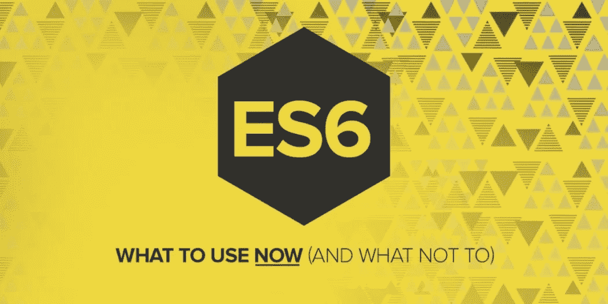

# 每个 JavaScript 开发人员都应该掌握的 10 个 ES6 特性

> 原文：<https://javascript.plainenglish.io/top-10-es6-features-that-every-javascript-developer-should-master-5bba68028076?source=collection_archive---------8----------------------->

If you want to be a JavaScript developer, you must know these 10 things.

## **1。模板字符串**

模板字符串用一个美元符号和在**反勾**符号内的花括号(`${expression}`)来表示。

示例:

## **2。假设和常数**

在 Es6 版本的 JavaScript 中，变量可以用另外两种方式声明。首先，我们可以用关键字 **let** 声明一个变量。

通过应用关键字 **let** ，我们可以不止一次地改变变量的值。如果我们在一个块范围内使用关键字 **let** ，那么我们将不会在这个块范围之外访问它。

我们也可以通过应用关键字 **const** 来声明一个变量。但是它的特点是变量值不能改变多次。

示例:

## 3.默认参数

在函数的参数中声明变量时，我们可以用等号设置默认的**值**。

示例:

## **4。箭头功能**

arrow 函数是函数声明的一种快捷方式。它将基本上**缩短**我们的函数语法。

示例:

## **5。多行字符串**

我们可以使用**反勾符号**轻松地编写多行字符串。

示例:

## 6。传播**操作员**

spread 运算符用于将多个数组的所有元素组合成一个数组**和组合数组或对象。展开运算符通常用三个点 **(…)** 书写。**

示例:

## **7。承诺**

承诺是 JavaScript 的构建对象，使用它我们可以轻松地完成**异步**任务。同样，用于创建**干净**代码的概念基本上是承诺。

示例:

## **8。解构**

析构语法是将数组元素转换为变量并将对象属性转换为变量的过程。另外，**析构**是一种从大型对象或数组中替换变量中一个或多个元素的快捷方式。

下面的例子向我们展示了如何将一个数组的所有元素转换成一个变量。

示例:

下面的例子向我们展示了如何将一个对象的所有属性转换成一个变量。

示例:

## **9。增强对象**

增强的对象文字可以很容易地用花括号(`{}`)内的属性创建对象。

示例:

## 10.班级

一个类是一个工厂的函数，它将被用来创建许多**对象**，但是在创建每个对象的过程中没有代码将被复制**。换句话说，代码将只写一次**，使用这些代码我们可以一次又一次地创建许多对象。****

****示例:****

*****更多内容请看*[***plain English . io***](http://plainenglish.io)****