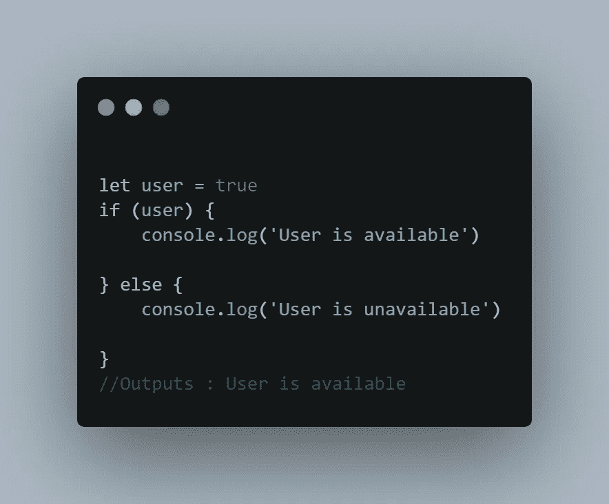
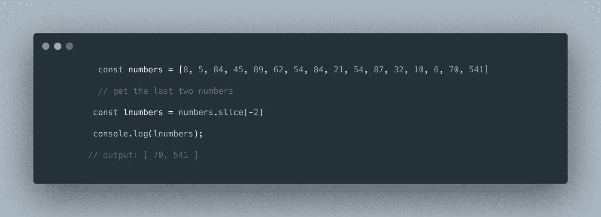

# 您需要知道的 10 大 JavaScript 技巧和诀窍

> 原文：<https://javascript.plainenglish.io/top-10-javascript-tips-and-tricks-you-need-to-know-27896d2a313f?source=collection_archive---------17----------------------->

## 您可能不知道可以在 JavaScript 中执行的有用提示和技巧。

Photo by [John Philip](https://medium.com/u/c2cdb19c0977?source=post_page-----27896d2a313f--------------------------------)

JavaScript 很神奇，许多程序员都在用它来解决问题和构建相关的解决方案。

在这篇文章中，我们将会看到一些在解决 JavaScript 问题时非常方便的 JavaScript 技巧和窍门。

## **1。三元运算符。**

**条件(三元)操作符**是一个 JavaScript 操作符，它接受三个操作数:一个条件后跟一个问号(`?`)，如果条件是**真值**后跟一个冒号(`:`)，则接受一个要执行的表达式，最后如果条件是**假值**，则接受一个要执行的表达式。

这个操作符经常被用作`**if**`语句的快捷方式。

使用 if-else 语句。

Image by Author.

使用三元运算符。

Image by Author.

## **2。将数字转换为字符串。**

也许你会遇到这样的情况，你想把一个数字转换成一个字符串。好吧，JavaScript 帮你搞定了。

Image by Author.

要将一个数字转换成一个字符串，你只需要在变量 number 后面加上一个空字符串，就可以了。

检查下面显示的片段。

Image by Author.

## **3。用空对象填充数组。**

我们可以用 JavaScript 创建并填充数组，同时向数组中输入空的对象或值。

你需要使用语法 ***数组(要填充的数值个数)。***

要用值填充空数组，您可以这样做，如下面的代码片段所示。

Image by Author.

类似地，我们可以声明要填充数组的数据类型。举个例子，当我们只想用**字符串**填充数组时，我们可以这样做，如下面的代码片段所示。

当你想要填充其他数据类型，如**数字**时，同样适用。

Image by Author.

## **4。从数组中筛选唯一值。**

有时候，我们只想从数组中筛选出唯一的值。假设我们有一个包含重复值的数组，并且只需要数组中的精确值，我们该怎么做呢？

我们可以使用带有**新集合**的 **Array.from()** 来实现，如下所示。

Image by Author.

## **5。创建动态对象和值。**

使用 JavaScript，我们可以动态地创建对象的键和值，并相应地更新它们。

Image by Author.

## **6。切片数组。**

以一个数组为例，我们只需要数组中的一些数字，比如说我们只需要数组的前 10 个数字。我们如何做到这一点？。

Image by Author.

## **7。切片数组中的最后一个元素**

与我们上面看到的非常相似，我们也可以切片数组中的最后一个元素。

例如，我们想要数组中的最后两个元素，我们可以这样做，如下所示。

Image by Author.

## **8。将对象转换为数组。**

有时候可能很有用，但是有一种方法可以把对象转换成数组。

我大部分时间不使用这个，但有时会很方便。我们需要在 **Objects.keys()里面传递对象。**

这样做是因为它只枚举了键，而忽略了值。

Image by Author.

## **9。性能检查。**

这个技巧让我们可以检查代码的整体性能。它显示了代码执行或运行的时间。

有时会派上用场。

Image by Author

## 10。自调用功能。

这是一个创建后立即执行的函数。它不会等待它的实例被调用。

也称为匿名函数或立即调用函数。

Image by Author.

## **结论**

这些是一些关于 JavaScript 的惊人的技巧和诀窍，我觉得很神奇，也很有用。

我很想知道你使用了什么样的技巧和窍门，并且发现它们很有用。

感谢您花时间阅读本文。

## **更多内容:**

 [## 5 个帮助我编码的惊人工具

### 我每天使用的 5 个帮助我编码的工具。

javascript.plainenglish.io](/5-insanely-amazing-tools-that-help-me-code-a0656a0a5ad5)  [## 如何在 Nuxt.js 中添加元数据？

### 通过示例了解如何添加元数据。

amjohnphilip.medium.com](https://amjohnphilip.medium.com/how-to-add-metadata-in-nuxt-js-b1a26855e8a) 

*更多内容请看*[***plain English . io***](http://plainenglish.io/)