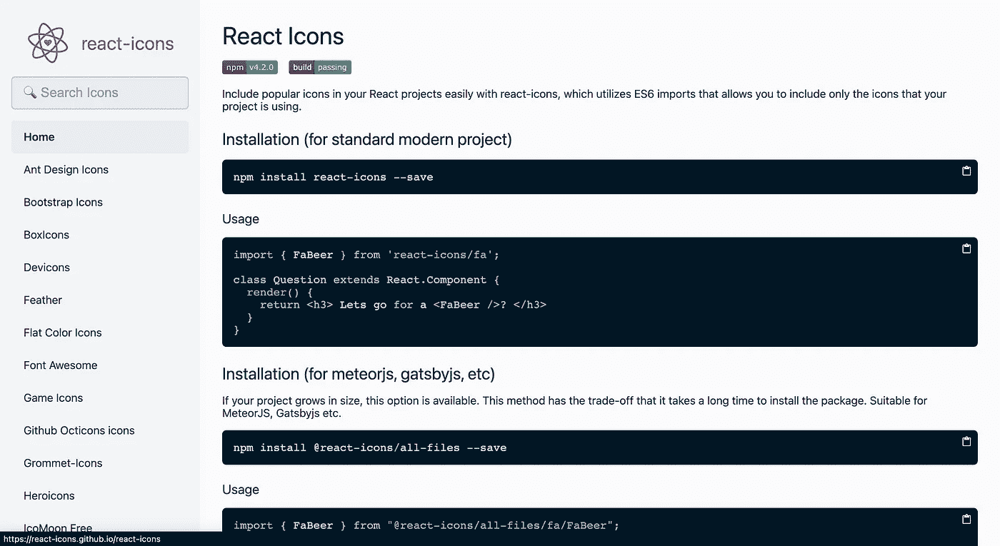
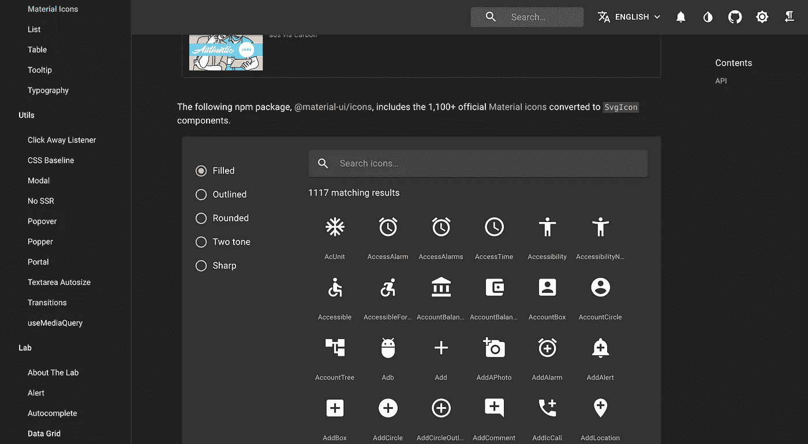
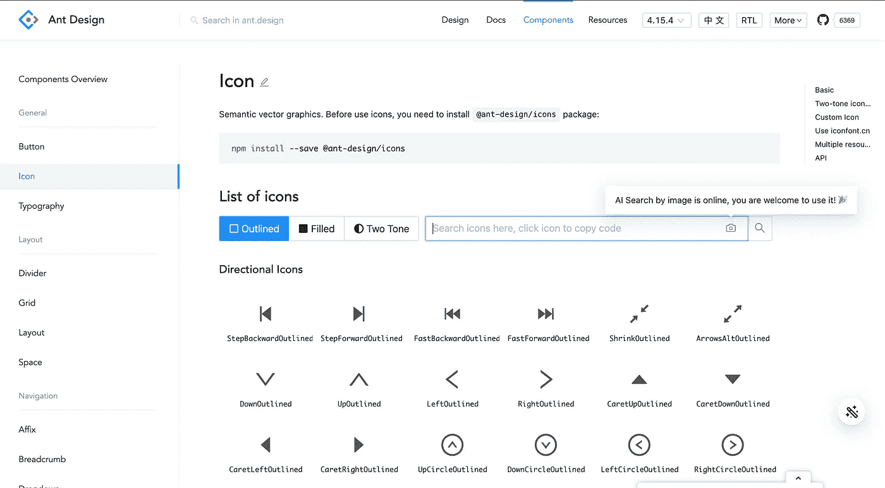
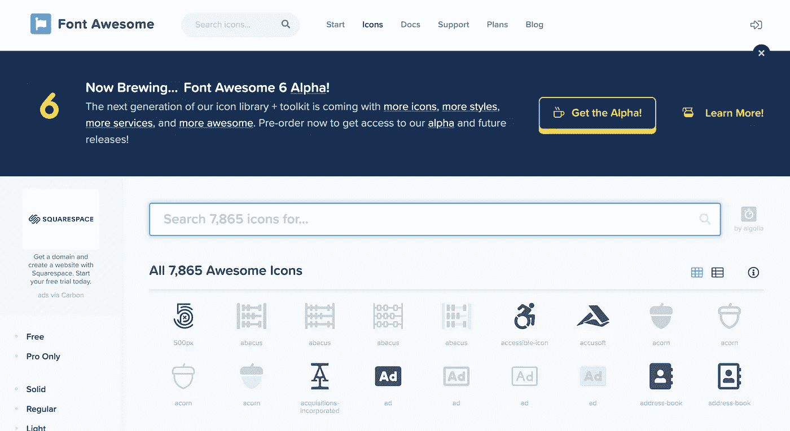
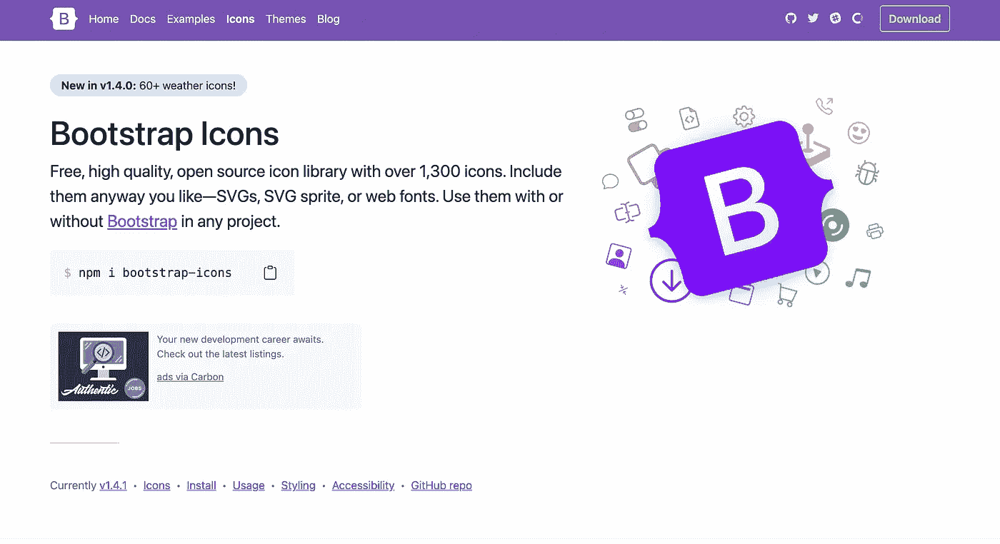
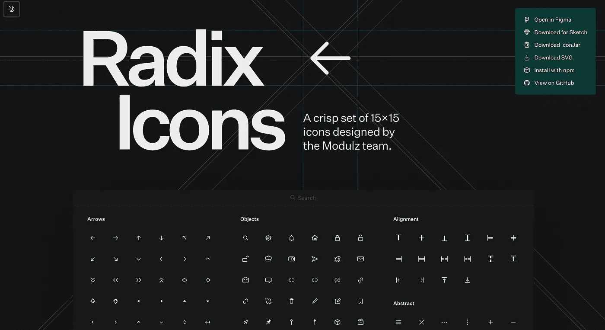
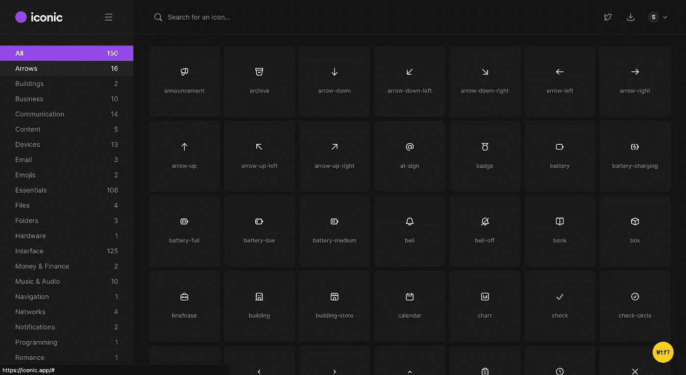
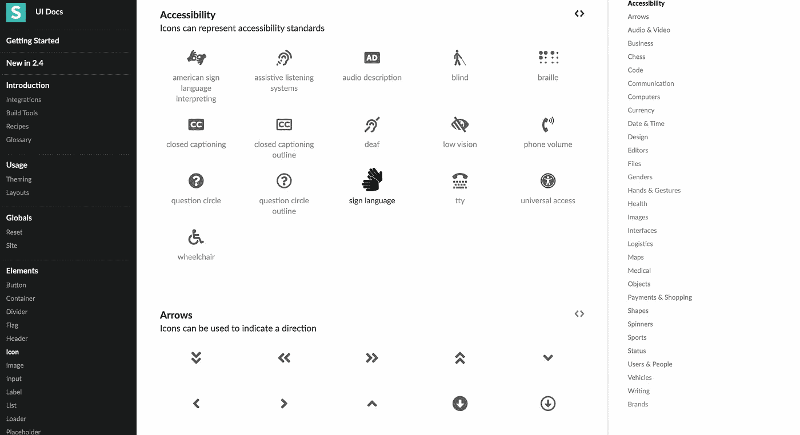
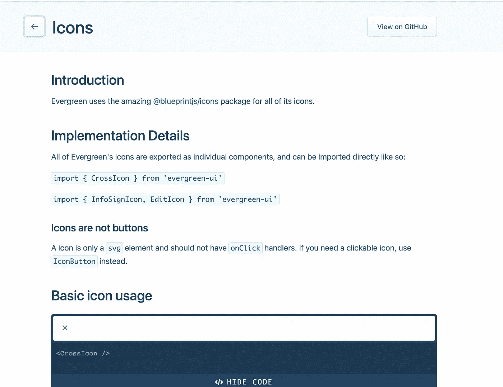
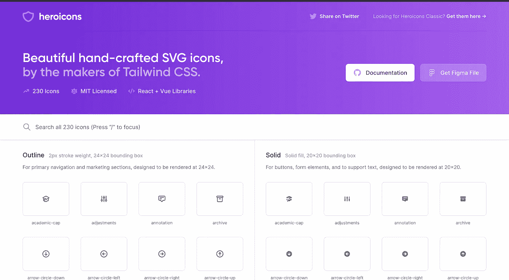

# 十大 React 图标库

> 原文：<https://javascript.plainenglish.io/top-10-library-for-icons-in-react-22265f47094?source=collection_archive---------1----------------------->

## 汇编 React 中最常用的 10 个图标库


Photo by [Harpal Singh](https://unsplash.com/@aquatium?utm_source=medium&utm_medium=referral) on [Unsplash](https://unsplash.com?utm_source=medium&utm_medium=referral)

## [1。反应图标](https://react-icons.github.io/react-icons/search)

这是我最喜欢的，也是我最喜欢的图书馆。免费，易集成，有 6.3K Github 星。



Screenshot from website

```
yarn add react-icons
```

## 2.[材质 UI 图标](https://material-ui.com/components/material-icons/)

Material UI library 是一个 react 库，它确实提供了自己的 68K Github stars 图标库和一个被广泛接受和使用的库。当它的图标被包装在 IconButton 组件中时，为用户提供了一个漂亮的涟漪效果。



```
yarn add [@material-ui/icons](https://www.npmjs.com/package/@material-ui/icons)
```

## 3.[蚂蚁设计图标](https://ant.design/components/icon/)

Ant Design 是 React 与 6K+ Github stars 中另一个广泛使用的 UI 库。



```
yarn add — save @ant-design/icons
```

## 4.[字体真棒图标](https://fontawesome.com/icons?d=gallery&p=2)

它们提供了包装在组件中的 SVG 图标。



```
yarn add font-awesome
```

## 5. [React 引导图标](https://icons.getbootstrap.com/)

他们只有 80 颗星，但他们的名单是惊人的，有各种各样的图标。



```
npm i react-bootstrap-icons
```

## 6.基数图标

他们也很少有明星，但他们的名单上有所有类型的所需图标。



```
[https://icons.modulz.app/](https://icons.modulz.app/)
```

## 7.[图标图标](https://iconic.app/)

他们提供了一个非常漂亮的界面来搜索、下载和复制图标。此外，通过点击他们网站上的下载按钮，您将获得 SVG gzip 文件的完整列表。



## 8.[语义 UI 图标](https://semantic-ui.com/elements/icon.html)

React with 48K Github stars 中被广泛接受和使用的库。



## 9. [Evergreen UI 图标](https://evergreen.segment.com/components/icons/)

这个库在 Github 上有 10K 之星，一旦 evergreen-UI 安装完毕，所有的图标都可以使用了。



```
yarn add evergreen-ui// Inside index.jsimport { InfoSignIcon, EditIcon } from 'evergreen-ui'
```

## 10.[顺风图标](https://heroicons.com/)

Tailwind CSS 依赖这个库作为它的图标资源。你必须直接下载 SVG 来使用它们。此外，他们还提供了一个完整的 Figma 图标文件夹，以便在 Figma 上使用。



下次再见，祝大家愉快

[](https://medium.com/nerd-for-tech/basic-imperative-underrated-node-js-packages-c02deb8c3ecc) [## 基本、必要和被低估的节点 JS 包。

### 在专业开发中广泛使用的 API 开发有用包。

medium.com](https://medium.com/nerd-for-tech/basic-imperative-underrated-node-js-packages-c02deb8c3ecc) [](/one-step-to-load-mp3-in-react-b952250912e2) [## 将 MP3 加载到 React 应用程序的一个步骤

### 是的，你只需要执行这一步就可以在 React 应用程序中加载 MP3。

javascript.plainenglish.io](/one-step-to-load-mp3-in-react-b952250912e2) [](/the-perfect-endpoints-for-filtering-currencies-in-88945e6a81c7) [## 如何为过滤货币创建完美的端点

### 我们不需要使用第三方库来搜索和过滤货币。

javascript.plainenglish.io](/the-perfect-endpoints-for-filtering-currencies-in-88945e6a81c7) 

*更多内容看*[***plain English . io***](http://plainenglish.io)