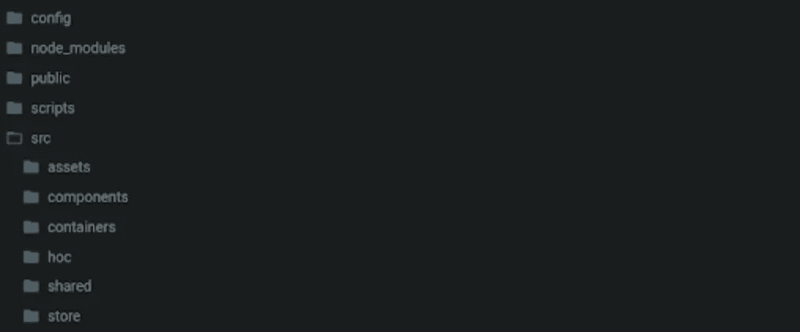

# 使用 React 时要避免的 10 大错误

> 原文：<https://javascript.plainenglish.io/top-10-mistakes-to-avoid-when-using-react-1796711ad2a0?source=collection_archive---------1----------------------->


React 已经迅速成为科技界最受欢迎的前端框架，被脸书、网飞、Airbnb 等大型科技公司所使用。React 开发者需求量很大，而且需求还在持续增长。

今天，我们将探讨 React 开发人员会犯的 10 大错误，以及如何纠正它们。

**我们将介绍**:

*   没有创建足够的组件
*   直接修改状态
*   传递道具时，将数字作为字符串传递
*   不在列表组件上使用键
*   忘记了 setState 是异步的
*   过多使用 Redux
*   创建和使用 God 组件
*   不遵循 React 文件夹结构
*   将道具作为字符串(而不是数字)发送
*   忘记以大写字母开始组件名称
*   接下来学什么

# 1.没有创建足够的组件

React 开发人员犯的一个常见错误是他们没有创建足够的组件。使用 React，您可以创建执行许多任务的大型组件，但是最好保持小型组件，一个组件对应一个功能。它不仅**节省了您的时间，而且它还帮助您调试**，因为您知道哪些组件与可能出现的任何错误相关联。

让我们来看一个`TodoList`组件的例子:

```
// ./components/TodoList.js

import React from 'react';

import { useTodoList } from '../hooks/useTodoList';
import { useQuery } from '../hooks/useQuery';
import TodoItem from './TodoItem';
import NewTodo from './NewTodo';

const TodoList = () => {
  const { getQuery, setQuery } = useQuery();
  const todos = useTodoList();
  return (
    <div>
      <ul>
        {todos.map(({ id, title, completed }) => (
          <TodoItem key={id} id={id} title={title} completed={completed} />
        ))}
        <NewTodo />
      </ul>
      <div>
        Highlight Query for incomplete items:
        <input value={getQuery()} onChange={e => setQuery(e.target.value)} />
      </div>
    </div>
  );
};

export default TodoList;
```

# 2.直接修改状态

在 React 中，**状态应该是不可变的**。如果直接修改状态，会导致难以修复的性能问题。

让我们看一个例子:

```
const modifyPetsList = (element, id) => {
  petsList[id].checked = element.target.checked;
  setPetsList(petsList);
};
```

您希望根据复选框的状态更新数组中对象的选中键，但是有一个问题。React 无法观察和触发重新渲染，因为对象正在使用相同的引用进行更改。

要解决这个问题，你可以使用`setState()`方法或者`useState()`钩子。这两种方法都将确保 React 确认您的更改，并正确地重新呈现您的 DOM。

让我们重写前面的例子，使用`useState()`方法。

> ***注意*** *:你也可以使用* `*map()*` *和* `*spread syntax*` *来避免其他状态值的突变。*

```
const modifyPetsList = (element, id) => {
  const { checked } = element.target;
  setpetsList((pets) => {
    return pets.map((pet, index) => {
      if (id === index) {
        pet = { ...pet, checked };
      }
      return pet;
    });
  });
};
```

# 3.传递道具时，将数字作为字符串传递

**在 React 程序中，当传递 props 时，将一个数字作为字符串传递会导致问题**。

让我们从一个例子开始:

```
class Arrival extends React.Component {
  render() {
    return (
      <h1>
        Hi! You arrived {this.props.position === 1 ? "first!" : "last!"} .
      </h1>
    );
  }
}
```

在本例中，组件期望位置是一个属性，并声明位置应该是一个数字。因为您正在进行严格的比较，所以任何不是数字或不完全等于 1 的东西都会触发第二个表达式并打印“last！”。

要解决这个问题，您应该像这样在输入周围插入花括号:

```
const element = <Arrival position={1} />;
```

# 4.没有在列表组件上使用`key`

假设您需要呈现一个项目列表，您的代码如下所示:

```
const lists = ['cat', 'dog', 'fish’];

render() {
  return (
    <ul>
      {lists.map(listNo =>
        <li>{listNo}</li>)}
    </ul>
  );
}
```

如果你正在使用一个较小的应用程序，这可能行得通。但是在处理大型列表时，当您想要修改或删除列表中的某个项目时，会遇到呈现问题。

**React 跟踪文档对象模型(DOM)上的所有列表元素**。如果没有这个记录，React 不会知道您的列表中发生了什么变化。

为了解决这个问题，**您需要为所有列表元素添加键**。键给每个元素一个惟一的标识，这有助于 React 确定哪些项目被添加、删除、修改等。

下面是如何做到这一点:

```
<ul>
  {lists.map(listNo =>
    <li key={listNo}>{listNo}</li>)}
</ul>
```

# 5.忘记了 setState 是异步的

很容易忘记 React 中的状态是异步的。即使是最有经验的 React 开发人员也会忘记这一点。

异步意味着**你所做的任何修改都不会立即生效**(可能会在下一次渲染时生效)。 **React 自动批量更新调用**以提高性能。如果在设置状态值后立即访问它，可能不会得到最准确的结果。

让我们看一个例子:

```
handlePetsUpdate = (petCount) => {
  this.setState({ petCount });
  this.props.callback(this.state.petCount); // Old value
};
```

您可以通过给`setState()`一个可选的第二个参数来解决这个问题，它将作为一个回调函数。在您用您的更改更新状态之后，回调函数将被调用。

```
handlePetsUpdate = (petCount) => {
  this.setState({ petCount }, () => {
    this.props.callback(this.state.petCount); // Updated value
  });
};
```

> ***注*** *:对于* `*useState()*` *也是如此，只不过他们没有类似于* `*setState()*` *的回调自变量。相反，你可以使用* `*useEffect()*` *钩子来得到同样的结果。*

# 6.过多使用 Redux

对于更大的 React 应用程序，许多开发人员使用 Redux 来管理全局状态。虽然 Redux 很有用，但你不需要用它来管理你的应用程序的每一个状态。

如果您的应用程序没有任何需要交换信息的并行级组件，则无需向项目添加额外的库。当您使用一个表单组件并希望在每次访问 check 按钮时检查它的状态时，建议使用本地状态方法或 Redux 上的`useState`。

# 7.创建和使用 God 组件

**God 组件是单片的，不可重复使用**。在 React 中，它们被称为“反模式”。你不应该把所有的 UI 元素都塞进一个组件来构建一个完整的页面。相反，你应该花时间勾勒出你的应用程序中不同的相互关联的部分，并把它们组成自己的组件。当您以这种方式分离组件时，应用程序的所有部分都更容易维护，并在需要时进行重组。

# 8.不遵循 ReactJS 文件夹结构

您创建的项目不仅仅是为了当前的开发。它们将来很可能需要维护或操作。**在考虑项目的未来可能性时，文件夹结构非常重要**。

让我们看看 ReactJS 社区遵循的标准文件夹结构:



Standard React JS Folder Structure

当导航到任何现有项目时，为容器、资产和组件提供单独的位置是很有用的。遵循命名约定也有助于提高可读性和组织性。这有助于您轻松识别项目中编写的任何代码的用途。

# 9.将道具作为字符串(而不是数字)发送

有编写大量 HTML 经验的 React 开发人员发现编写这样的代码很自然:

```
<MyComponent value=”4” />
```

这个值属性实际上将作为字符串发送给 MyComponent。如果您确实需要它作为一个数字，您可以通过使用类似于`parseInt()`的函数或者插入花括号而不是引号来解决这个问题。

```
<MyComponent value={4} />
```

# 10.忘记以大写字母开始组件名称

忘记以大写字母开始组件名称是一个很容易犯的小错误。**在 JSX，以小写字母开头的组件编译成 HTML 元素**。

假设你写了这样的东西:

```
class demoComponentName extends React.Component {
}
```

这将导致一个错误，告诉您如果您打算呈现 React 组件，您需要以大写字母开始它的名称。

这个错误有一个简单的解决方法，就是以大写字母开始组件名称，如下所示:

```
class DemoComponentName extends React.Component {
}
```

# 接下来学什么

既然我们已经探讨了 React 开发人员会犯的十大错误，是时候开始使用 React 并应用您今天在这里学到的技能了。React 开发人员需求量很大，所以将 React 加入你的技能是明智的职业投资。

下面是一些推荐的概念:

*   React 中的库
*   在 React 中初始化 Firebase
*   React 中全局状态的应用程序开发
*   等等。

*快乐学习！*

*更多内容请看*[*plain English . io*](http://plainenglish.io/)