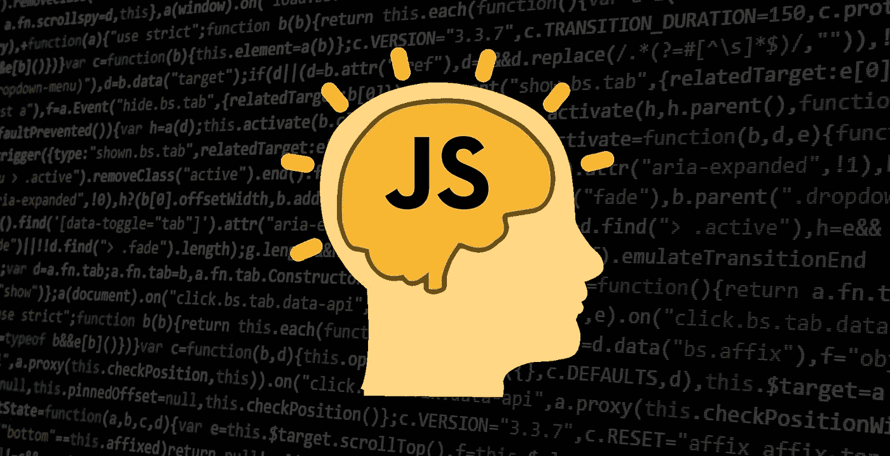

# 关于 JavaScript 你应该学习的 10 件事

> 原文：<https://javascript.plainenglish.io/top-10-things-you-should-learn-about-javascript-f9a2e1a88f31?source=collection_archive---------10----------------------->

If you want to be a JavaScript programmer, you must know these 10 things.

JavaScript 的一些重要概念。

## **1。**变量:

变量用于存储在程序执行期间可以使用的值。声明一个变量，首先我们要写 JavaScript 的保留关键字 **var** 。然后我们必须给这个变量起一个**的名字**。这意味着它是什么变量，是人还是物等等。那么我们必须被赋予一个**等号**。然后，我们要写一个**值**，意思是任何人都可以有名字，年龄，身高，任何物体的名称等等。然后，我们还要给一个**分号**。记住，变量名必须是 **meaningfu** l. JavaScript 还有两个保留的关键字用于声明变量: **let** 和 **cost** 。

示例:

## 2.数据类型:

JavaScript 变量有很多数据类型:数字、字符串、布尔、对象等。

**数字型:**如果一个变量的值是用一个数字来表示的，那么称之为数字型变量。

**字符串型:**如果一个变量的值是用一个或多个字母表示的，那么称之为字符串型变量。当我们表达一个或多个价值字母时，那么这个东西将以引用开始，以引用结束。

**布尔型:**如果一个变量的值用真或假来表示，那么就称为布尔型变量。

**对象类型:**一个事物的一组属性的集合称为对象数据类型。

示例:

## 3.If/Else 条件:

如果条件为真，我们将执行它。另一方面，如果这不是真的，那么我们将执行' **else** '条件。

示例:

## 4.数组:

当一个变量有一个以上的值，那么它被称为数组。要写一个数组，我们首先需要在两个值之间加一个逗号。然后，我们要给一个方括号，把所有的值放在一个盒子里。

示例:

## 5.While 循环:

While 循环是一个**条件**循环。只要条件允许，就会执行。要写 while 循环，首先我们要写 JavaScript 的保留关键字 **while** 。然后我们要给括号 **()** 。然后，我们需要在圆括号里写一个**条件**。最后还要给个花括号 **{}** 。

示例:

## 6.For 循环:

如果我们想要将许多数组的所有元素放在一起，那么我们将使用**作为**循环。要为循环编写一个**，首先我们必须为 JavaScript 的**编写保留关键字**。然后还要给个圆括号 **()** 。然后用三个**步骤**编写 for 循环。**

**第一步:**首先我们需要在圆括号里写一个**变量**。要写一个变量，我们要给关键字 **var** ，然后我们要给一个变量名 **i** 。然后，我们要给一个等号和一个值。那就要给个分号了。

**第二步:**写一个条件然后给一个分号。

**第三步:**增加变量的值**必须给定 i++** 。

最后还要给个花括号 **{}** 。

示例:

## 7.开关:

**Switch** 很像 **if-else** 但是两者还是有一些区别的。有效地说，如果我们想在某个东西上应用条件，那么我们将使用**开关**方法。

示例:

## **8。功能:**

当我们一遍又一遍地做同样的事情却又想随心所欲地改变它的时候，那么我们就要用函数法了。通过应用函数方法，我们可以在不同的地方使用相同的函数。首先我们会键入 JavaScript 的 function 关键字来写一个函数。然后，我们将给出两个带函数名的括号和两个花括号。

示例:

## 9.关闭:

当一个函数能够记住并访问它的词法范围时，即使该函数在其词法范围之外执行。

示例:

## 10.类别:

一个类是一个工厂的函数，它将被用来创建许多对象，但是在创建每个对象时没有代码是重复的。换句话说，代码只需编写一次，使用这些代码我们可以一次又一次地创建许多对象。

示例:

*更多内容请看*[*plain English . io*](http://plainenglish.io/)