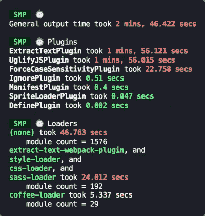
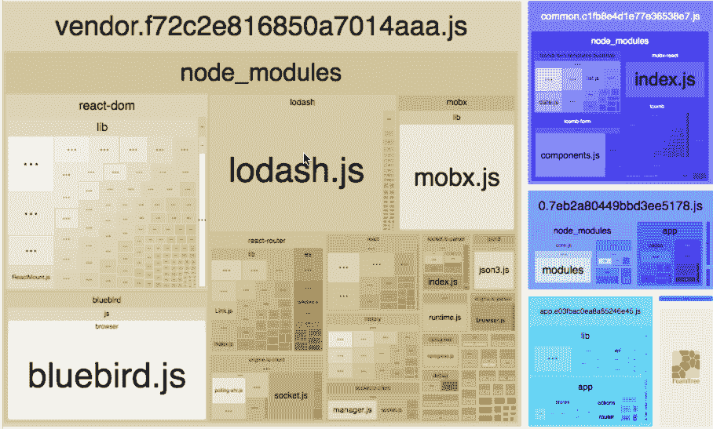

# 配置自动化插件以增强 Webpack 中 DevOps 的 10 大技巧

> 原文：<https://javascript.plainenglish.io/top-10-tips-of-automated-plugins-you-can-configurate-to-enhance-devops-in-webpack-de1495c725b5?source=collection_archive---------19----------------------->


Webpack 是一个打包工具，它的目的是打包所有的静态资源。有人会问为什么需要 webpack？Webpack 是现代前端技术的基石。jQuery、HTML、CSS 静态网页开发等常规开发方法已经落后。现在是 MVVM 和数据驱动界面的时代。Webpack 打包了现代 JavaScript 开发中各种新的有用的技术。

试图描述 webpack 可能会让人不知所措，所以我不会浪费大家的时间。看懂这张图就知道 webpack 的生态系统了:

# **1。加载器列表**

[](https://webpack.js.org/loaders/raw-loader/)**:加载文件的原始内容(UTF-8)
[**文件加载器**](https://webpack.js.org/loaders/file-loader/) :将文件输出到一个文件夹，在代码中使用相对 URL 引用输出文件(处理图片和字体)
[**URL-loader**](https://webpack.js.org/loaders/url-loader/):类似于文件加载器，不同的是用户可以设置一个阈值，如果阈值大于阈值， 它将被移交给文件加载器进行处理，并且当阈值小于阈值时， 它将返回文件 base64 格式编码(处理图片和字体)
**source-map-loader** :加载额外的源文件以便断点调试
**svg-inline-loader** :将压缩的 svg 内容注入代码
**image-loader** :加载并压缩图像文件
json-loader 加载 json 文件(默认包含)
**车把-加载器**:将车把模板编译成函数返回
**babel-loader** :将 ES6 转换成 ES5
**ts-loader** :将 typescript 转换成 JavaScript
**awesome-TypeScript-loader**:将 TypeScript 转换成 JavaScript，性能优于 ts-loader
**SASS-loader**:转换 SCSS 以及通过 DOM 操纵
**加载 css——post CSS-loader**:扩展 CSS 语法，使用下一代 CSS， 并用 autoprefixer 插件
**eslint-loader** 自动填充 CSS3 前缀:通过 ESLint
**ts lint-loader**检查 JavaScript 代码:通过 ts lint
**mocha-loader**检查 TypeScript 代码:加载 Mocha 测试用例
**coverjs-loader** 代码:计算测试
**vue-loader**的覆盖率**

# ****2。Webpack 仪表板****

**当使用 webpack 时，尤其是对于一个开发服务器，您可能习惯于看到很长很难阅读的东西。但是，webpack dashboard 可以帮助您节省阅读实际配置的时间:**

****

**要安装:**

```
$ npm install --save-dev webpack-dashboard
# ... or ...
$ yarn add --dev webpack-dashboard
```

**将配置添加到 webpack:**

```
// Import the plugin:
const DashboardPlugin = require("webpack-dashboard/plugin");

// Add it to your webpack configuration plugins.
module.exports = {
  // ...
  plugins: [new DashboardPlugin()];
  // ...
};
```

# ****3。网络包合并****

**[**webpack-merge**](https://www.npmjs.com/package/webpack-merge) 提供了一个`merge`函数，用于连接数组和合并对象，创建一个新对象。如果遇到函数，它将执行它们，通过算法运行结果，然后再次将返回值包装在函数中。**

****

**这种行为在配置 webpack 时特别有用，尽管它还有其他用途。每当你需要合并配置对象时， **webpack-merge** 就能派上用场。**

```
const { merge } = require('webpack-merge');

// Default API
const output = merge(object1, object2, object3, ...);

// You can pass an array of objects directly.
// This works with all available functions.
const output = merge([object1, object2, object3]);

// Keys matching to the right take precedence:
const output = merge(
  { fruit: "apple", color: "red" },
  { fruit: "strawberries" }
);
console.log(output);
// { color: "red", fruit: "strawberries"}
```

# ****4。速度测量插件****

**优化你的 webpack 构建速度的第一步是要知道你的注意力集中在哪里。**

**这个插件测量您的 webpack 构建速度，给出如下输出:**

****

**要安装:**

```
npm install --save-dev speed-measure-webpack-pluginyarn add -D speed-measure-webpack-plugin
```

**将配置添加到 webpack:**

```
const webpackConfig = {
  plugins: [new MyPlugin(), new MyOtherPlugin()],
};
```

# ****5。尺寸插件****

**打印 webpack 资产的 gzipped 大小以及自上次构建以来的更改。**

****

**要安装:**

```
 Install size-plugin as a development dependency using npm:npm i -D size-plugin
```

**将配置添加到 webpack:**

```
// webpack.config.js
+ const SizePlugin = require('size-plugin');

module.exports = {
  plugins: [
+    new SizePlugin()
  ]
}
```

# ****6。热模块替换插件****

**Webpack 的热更新也叫热模块替换，缩写为 HMR。这种机制可以用新改变的模块替换旧模块，而无需刷新浏览器。**

**HMR 的核心是客户端从服务器获取更新的文件。准确的说是 chunk diff(需要更新的那部分 chunk)。事实上，在 WDS 和浏览器之间维护着一个 Websocket。当本地资源发生变化时，WDS 会将更新推送到浏览器，并在构建时带来哈希，以便客户端可以与上一个资源进行比较。在比较了差异之后，客户端将向 WDS 发起一个 Ajax 请求，以获取更改的内容(文件列表、哈希)，这样客户端就可以使用这些信息继续向 WDS 发起一个 jsonp 请求，以获取块的增量更新。**

**后续部分—如何处理增量更新？应该保留哪个状态？哪些需要更新？—由 HotModulePlugin 完成，它提供了相关的 API 供开发者针对自己的场景进行处理，比如 react-hot-loader 和 Vue-loader 使用这些 API 实现 HMR。**

**[](https://webpack.js.org/plugins/hot-module-replacement-plugin/) [## HotModuleReplacementPlugin | web pack

### webpack 是一个模块捆绑器。它的主要目的是捆绑 JavaScript 文件以便在浏览器中使用，但它也…

webpack.js.org](https://webpack.js.org/plugins/hot-module-replacement-plugin/) 

```
config.plugins = config.plugins.concat([
 **new** webpack.optimize.OccurenceOrderPlugin(),
 **new** webpack.[**HotModuleReplacementPlugin**](https://www.codota.com/code/javascript/functions/webpack/HotModuleReplacementPlugin)(),
 **new** webpack.NoErrorsPlugin()
]);
```

# **7。文件哈希**

**Hash** :与整个项目的构建相关，只要修改项目文件，整个项目构建的 Hash 值就会改变

**Chunkhash** :与 Webpack 打包的组块有关。不同的条目会产生不同的 chunkhash。

**Contenthash** :根据文件内容定义 hash。如果文件的内容不变，contenthash 也不变

```
module.exports = {
  entry: {
  app: './scr/app.js',
  search: './src/search.js'
},
  output: {
  filename: '[name][chunkhash:8].js',
  path:__dirname + '/dist'
  }
}
```

# **8。CSS 自动修复**

postcss 中的 autoprefixer 可以用来给 CSS3 中一些需要兼容编写的属性添加响应前缀，这样可以节省我们很多时间因为它也是一个加载器，我们也需要先安装它:

```
npm i postcss-loader autoprefixer -D
```

创建 **postcss.config.js** 并导入 webpack 配置:

```
module.exports = { plugins: [require('autoprefixer')]  }
```

将配置添加到 webpack:

```
module.exports = {
    module: {
        rules: [
            {
                test: /\.css$/,
                use: ['style-loader', 'css-loader', 'postcss-loader']
            }
        ]
    }
}
```

# **9。Webpack 捆绑包分析器**

使用交互式可缩放树状图可视化 webpack 输出文件的大小。



要安装:

```
# NPM
npm install --save-dev webpack-bundle-analyzer
# Yarn
yarn add -D webpack-bundle-analyzer
```

将配置添加到 webpack:

```
const BundleAnalyzerPlugin = require('webpack-bundle-analyzer').BundleAnalyzerPlugin;

module.exports = {
  plugins: [
    new BundleAnalyzerPlugin()
  ]
}
```

# **10。进度条 Webpack 插件**


要安装:

```
npm i -D progress-bar-webpack-plugin
```

将配置添加到 webpack:

```
var ProgressBarPlugin **=** require('progress-bar-webpack-plugin');plugins**:** [**new** ProgressBarPlugin({      
    format: 'build [:bar] ' + chalk.green.bold(':percent') + '(:elapsed seconds)', clear: false    })]
```

至此，我们已经完成了基本的配置。但这并不完美，或者有时候，我们会有一些其他的需求。下一篇关于 webpack 配置的文章将介绍一些其他情况。感谢您的阅读。

*更多内容请看*[***plain English . io***](http://plainenglish.io/)**