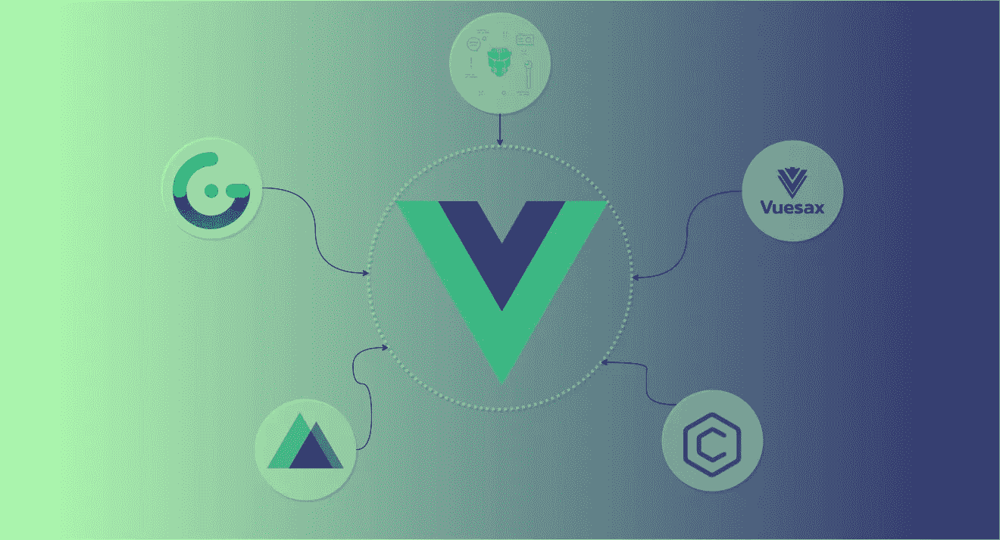

# 你应该看看的 10 个 Vue.js 库

> 原文：<https://javascript.plainenglish.io/top-10-vue-libraries-fe191b13ff1e?source=collection_archive---------7----------------------->

## 增长最快的 Vue 库

# 1.Vux

一个很棒的 UI 库，提供了基于 Vue 和 WeUI 的移动 UI 组件，大部分文档都是中文的，只有很少的英文翻译。 **Vux** 主要强调应用的快速开发，如果你想用 Vue 开发移动应用，你也应该考虑 Vux。

# 2.Vue 材料套件

如果您正在考虑加快您的设计和开发过程，那么 Vue 材料带有 60 个手工制作的组件。你所需要的只是一个关于 **JavaScript** & **Vue 路由器**的基础知识，来构建美观且易于维护的应用程序。它还带有优化的 Vue 插件和带有许多定制的仪表板组件。如果您正在构建一个仪表板应用程序，那么您应该考虑 ***Vue 材料工具包*** 而不是浪费时间从头开始组装小组件。

# 3.Vuex

Vue 的官方状态管理工具是一个集中存储可伸缩应用程序中所有组件的工具，它有适当的规则以可预测的方式确保状态性质，它还与 Vue 的开发工具集成以提供一些高级功能，例如:

*   零配置时间旅行调试
*   状态快照导出/导入

# 4.Vue 路由器

Vue 提供由 *Vue.js 的过渡系统*支持的路线/视图映射、路线参数、查询、通配符、过渡效果。提供了一个很棒的导航控件，带有自动活动 CSS 类和**可定制的滚动行为。**

# 5.CoreUI Vue

另一个伟大的组件库专注于创建管理模板，用现代框架和工具构建，如 **Bootstrap、Vue.js、**和 **Sass** 。您可以轻松地为管理应用程序创建仪表板和用户界面，并节省从零开始开发一切以构建功能性和美观的仪表板的无数时间。

# 6.Vuesax

提供了设计良好的组件，您可以将其用于您的项目，它还提供了一种开发，您可以根据自己的需求来设计组件的样式，而不会损失创建的速度。集成了前端生态系统中的许多最佳工具，如 **Sass、TypeScript 和 VuePress。**此外，它独立于任何设计语言，这使得你的 Vue 应用程序鹤立鸡群。

# 7.PrimeVue

允许您构建复杂的现代动态 Vue 应用程序的框架的绝佳选择。附带了广泛的组件，从**表格**和*分页器*到精心设计的基于图形的组织结构图。该库之所以受到 500 多家公司的信任，如**空客、福特、英特尔**，是因为它是构建企业软件用户界面的绝佳选择，因为组件是为复杂的软件应用程序设计的。

# 8.武泰风能公司

前端库基于流行的 ***Tailwind CSS*** 框架，该框架设置了在生产级应用中使用的低优先级。但是你可以用 Tailwind 构建你自己的小型 Vue 项目。当 VueTailwind 使用来自 **Tailwind 的实用程序类构建组件时，这个库提供了一些预先设计的组件。**

# 9.Nuxt

服务器端渲染已经成为在服务器上而不是在浏览器上渲染 spa 的最流行的技术，这为良好的用户体验提供了关键。Nuxt.js 是为 **SRR** 特性构建的，你可以创建 **SSR 应用 PWAs 和 spa**或者你也可以使用它作为静态站点生成器。

# 10.网格体

使用 Gridsome，你可以创建一个更快、更安全的网站，并将其部署到 Netlify 或 Amazon s3 上。

它基于数据源生成 SEO 友好的 HTML 文件&数据源可以是 **JSON、Markdown、CSV、Drupal、WordPress、MongoDB、**或 **Airtable，**一旦内容被加载到页面上，它就会变成一个 ***GraphQL 数据层*** 用于集中数据管理，之后您可以提取以构建和部署您的 Vue 应用程序。