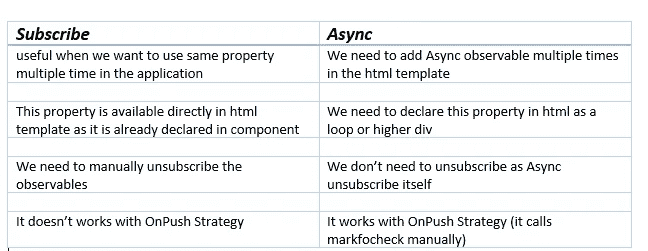
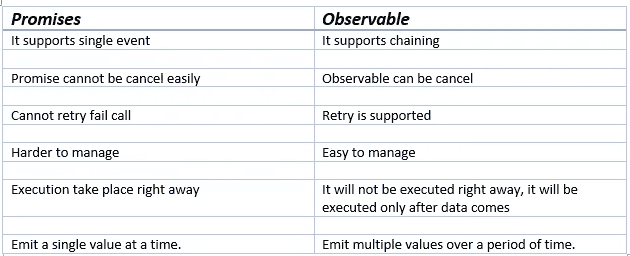
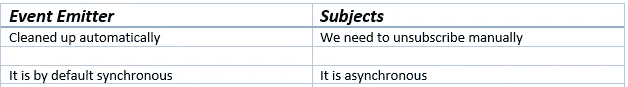
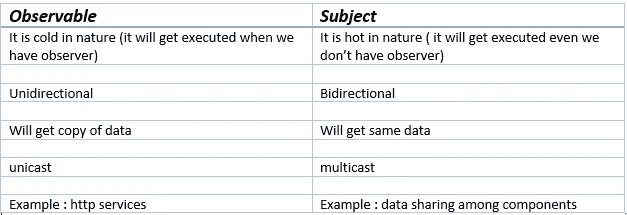

# 为赢得下一次面试，你必须准备的 100 个问题(10-20)

> 原文：<https://javascript.plainenglish.io/top-100-questions-you-must-prepare-for-to-ace-your-next-angular-interview-10-20-c3f5ab854be?source=collection_archive---------8----------------------->

## Angular 2021 面试问题

## 最常见的角度面试问题 2021


Photo by [Christina @ wocintechchat.com](https://unsplash.com/@wocintechchat?utm_source=medium&utm_medium=referral) on [Unsplash](https://unsplash.com?utm_source=medium&utm_medium=referral)

最近，我试图为即将到来的面试做准备，在谷歌上搜索并打开链接却每次都看到相同的问题，这有点困难。所以，我想到了分享我的发现，以及如果一个人准备面试，他应该知道的最常见的问题是什么。

以下是最新角度面试中最常被问到的面试问题。这些有角度的面试问题和答案帮助有角度的开发人员准备从初级到高级的面试。此外，这篇文章涵盖了你在 2021 年必须准备的基本问题。

# 如果你错过了 1-10 个问题，请查看这篇文章。

[](/top-100-questions-you-must-prepare-for-your-next-angular-interview-1-10-3e13d5fefab9) [## 你必须为下一次角度面试准备的 100 个问题(1-10)

### 最常见的角度面试问题 2021

javascript.plainenglish.io](/top-100-questions-you-must-prepare-for-your-next-angular-interview-1-10-3e13d5fefab9) 

# 11.为什么我们在 RXJS 中使用管道操作符。有什么用？

管道方法有助于将多个操作符组合在一起，并将它们转换成单个项目。

示例:

```
of(17,27,32).pipe(
 map(x => x + 1),
 filter(x => x > 18)
);
```

***为了更好地理解这个概念，我们来看看实际的代码。***

【https://stackblitz.com/edit/rxjs-pipe 

# 12.在 Angular 应用程序中使用异步管道和订阅函数有什么区别？

如果您正在使用现代技术，那么您通常会处理异步管道，它确实有一些好处，比如取消订阅本身或 OnPush 支持。

**让我们来看看异步操作符和订阅操作符的区别。**



***为了更好地理解这个概念，我们来看看实际的代码。***

[https://stack blitz . com/edit/component-vs-async-pipe-subscriptions-angular](https://stackblitz.com/edit/component-vs-async-pipe-subscriptions-angular)

# 13.承诺和可观察的区别是什么？

看起来是一样的，因为如果你有 JavaScript 背景，你通常会使用承诺。从承诺和可观察的角度看，哪一个最好？

让我们来看看承诺和可观察的区别。



***为了更好地理解这个概念，我们来看看实际的代码。***

[https://stackblitz.com/edit/observable-vs-promises](https://stackblitz.com/edit/observable-vs-promises)

# 14.事件发射器和主体有什么区别？

如果我得到这个问题，我通常会选择在子组件和父组件通信时使用事件发射器，但是为什么它比主题更受欢迎呢？

让我们来看看它们之间的区别。



***为了更好地理解这个概念，我们来看看实际的代码。***

[https://stack blitz . com/edit/angular-subject-vs-event-emitter](https://stackblitz.com/edit/angular-subject-vs-event-emitter)

# 15.可观察和主体有什么区别？

**警惕！面试官最喜欢问的问题是检验你对可观察事物的了解。**

***我们先来了解一下可观察与主体的区别。***



***为了更好地理解这个概念，我们来看看实际的代码。***

[https://stackblitz.com/edit/observables-and-subjects](https://stackblitz.com/edit/observables-and-subjects)

# 16.激活的路由和激活的路由快照有什么区别？

激活的路线与激活的路线快照之间的主要区别在于，激活的路线我们可以订阅可观察的，而激活的路线快照仅发出一个值。

***为了更好地理解这个概念，我们来看看实际的代码。***

[https://stack blitz . com/edit/angular-router-snapshot-and-params-Yakov](https://stackblitz.com/edit/angular-router-snapshot-and-params-yakov)

# 17.讨论在你的角度应用中使用的一种不同的加载策略

这种问题问的是检查你用了多深的 angular。大多数时候我们会回答懒惰加载和急切加载，但是还有一个我们应该考虑的。

## 急切装载

急切加载的组件在应用程序启动之前就被加载了。

[https://stackblitz.com/edit/ang-eager-loading-example](https://stackblitz.com/edit/ang-eager-loading-example)

## 惰性装载

延迟加载下的组件将仅在需要时加载。它有助于提高性能，并有助于更快地启动应用程序。

[https://stackblitz.com/edit/angular6-lazy-loading](https://stackblitz.com/edit/angular6-lazy-loading)

## 预加载

组件在应用程序启动后加载。

[https://stack blitz . com/edit/angular-custom-preload-strategy](https://stackblitz.com/edit/angular-custom-preloading-strategy)

要了解如何使用，请点击下面的链接

[](https://medium.com/@lifei.8886196/eager-loading-lazy-loading-and-pre-loading-in-angular-2-what-when-and-how-798bd107090c) [## Angular 2+中的急切加载、延迟加载和预加载:什么、何时以及如何加载？

### 自 2016 年以来，Angular 2+一直是现代 web 应用程序非常受欢迎的前端平台。它引入了一种…

medium.com](https://medium.com/@lifei.8886196/eager-loading-lazy-loading-and-pre-loading-in-angular-2-what-when-and-how-798bd107090c) 

# 18.什么是元数据？

对我来说棱角分明似乎是个新词。不，你每天都用它，但不知道确切的名字。让我们来看看这个…

> 它被用来装饰类，以获得与类不同的行为。

下面是 Angular 中使用的元数据的例子。

1.  ***班级装修工***——@组件
2.  ***属性装饰器***—@输入
3.  ***方法装饰者***——@ HostListner
4.  ***参数装饰器***——@注入

# 19.routerlinkActive 有什么用途？

你在角度应用中使用 navbar 了吗？如果是这样，这是显示激活项的常用指令之一。

它根据当前路由器状态检查激活路由器链路。

***为了更好地理解这个概念，我们来看看实际的代码。***

[https://stackblitz.com/edit/angular-routerlinkactive](https://stackblitz.com/edit/angular-routerlinkactive)

# 20.我们在 Angular 中使用泛型。

这是 Angular 最新的面试问题之一。面试官想通过对物体或特定的观察对象或事件进行打字来检查你写得有多干净。

我们通常在不同的地方使用泛型。

1.  ***定义发射器时***

```
Output() click : EventEmitter<string> = new EventEmitter<string>()
```

2. ***捕捉可观察对象*** 的响应

```
data: Observable<IResponse>
```

3. ***定义接口***

```
interface Item {
info:string,
…
}
Input public items: Item[]
```

# 第 1 部分是(1-10)个问题和答案

[](/top-100-questions-you-must-prepare-for-your-next-angular-interview-1-10-3e13d5fefab9) [## 你必须为下一次角度面试准备的 100 个问题(1-10)

### 最常见的角度面试问题 2021

javascript.plainenglish.io](/top-100-questions-you-must-prepare-for-your-next-angular-interview-1-10-3e13d5fefab9) 

# 第二部分是(10-20)个问题和答案

[](/top-100-questions-you-must-prepare-for-to-ace-your-next-angular-interview-10-20-c3f5ab854be) [## 为赢得下一次面试，你必须准备的 100 个问题(10-20)

### 最常见的角度面试问题 2021

javascript.plainenglish.io](/top-100-questions-you-must-prepare-for-to-ace-your-next-angular-interview-10-20-c3f5ab854be) 

# 第 3 部分是(20-30)个问题和答案

[](/top-100-questions-you-must-prepare-for-to-ace-your-next-angular-interview-20-30-5121828b4f91) [## 要在下一次面试中胜出，你必须准备的 100 个问题(20-30)

### 最常见的角度面试问题 2021

javascript.plainenglish.io](/top-100-questions-you-must-prepare-for-to-ace-your-next-angular-interview-20-30-5121828b4f91) 

# 第 4 部分是(30-40)个问题和答案

[](/top-100-questions-you-must-prepare-for-to-ace-your-next-angular-interview-30-40-6f195ed91de) [## 为赢得下一次面试，你必须准备的 100 个问题(30-40)

### 最常见的角度面试问题 2021

javascript.plainenglish.io](/top-100-questions-you-must-prepare-for-to-ace-your-next-angular-interview-30-40-6f195ed91de) 

# 其余的问题如下，我将在下一篇文章中提供答案。

1.  constructor 和 ngOnInit 有什么区别？
2.  组件和指令有什么区别？
3.  ElementRef、TemplateRef 和 viewContainerRef 有什么区别？
4.  ng-content、ng-template、ng-container 有什么区别？
5.  视图子级和内容子级的区别是什么？
6.  组件视图、主体视图和嵌入视图之间有什么区别？
7.  去抖时间和油门时间有什么区别？
8.  forEach 和 map 有什么区别？
9.  ng-content 和 ng-templateoutlet 有什么区别？
10.  forchild 和 forroot 有什么区别？
11.  为什么我们在 RXJS 中使用管道操作符。有什么用？
12.  在 Angular 应用程序中使用异步管道和订阅函数有什么区别？
13.  承诺和可观察的区别是什么？
14.  事件发射器和主体有什么区别？
15.  可观察和主体有什么区别？
16.  激活的路由和激活的路由快照有什么区别？
17.  讨论在您的角度应用中使用的不同类型的加载策略。
18.  什么是元数据？
19.  routerlinkActive 有什么用途？
20.  我们在 Angular 中使用泛型。
21.  外卡路线是什么？
22.  ngIf 和 hidden 有什么区别？
23.  什么是路由器插座？
24.  路由器状态是什么？
25.  什么是活动路由？
26.  以角度解释不同的注入。
27.  在 angular 中实现翻译的最好方法是什么？
28.  解释角度的不同布线参数。
29.  什么是 Angular 中的虚拟卷轴？
30.  路由参数和查询参数有什么区别？
31.  解释 Angular 中支持的不同防护装置。
32.  哪些 RXJS 运算符用于转换或操作数据？
33.  延迟加载组件的最佳方式是什么？
34.  我们有什么办法可以用 Angular 显示 app 版本？
35.  ES6 中的发电机有哪些？
36.  解释应用程序中的错误机制。
37.  angular 中的自举是什么？
38.  什么是角元素？我们为什么使用它？
39.  箭头函数和常规函数有什么区别？
40.  函数式编程语言和面向对象编程语言的区别是什么？你更喜欢哪一个，为什么？
41.  JavaScript 和 TypeScript 有什么区别？
42.  你对闭包了解多少？
43.  模板驱动表单和反应式表单有什么区别？
44.  Angular 中有哪些不同类型的绑定？
45.  您最常用哪些 RXJS 操作符来处理 HTTP 服务？
46.  mergemap/switchmap/concatmap 和 exhaustmap 有什么区别，我们可以在哪里使用它们？
47.  在 Angular 中讨论不同的装饰者。
48.  用 Angular 解释不同的生命周期方法。
49.  解释角度生命周期挂钩的层次。
50.  渲染器 2 是什么？
51.  渲染器和 ElementRef 有什么区别？
52.  Zone.js 是什么？
53.  Angular 中的竞争条件是什么？
54.  Angular 中的回调、承诺和异步/等待是什么？
55.  Angular 中的主机绑定和主机侦听器是什么？
56.  Angular 中的依赖注入是什么？
57.  以角度解释摘要周期/变化检测周期。
58.  markForCheck 和 detectchanges 有什么区别？
59.  克隆对象的方法有哪些？
60.  解释 Angular 应用程序如何加载/初始化。
61.  当一个 [@Input](http://twitter.com/Input) ()值发生角度变化时，如何检测非原语类型数据？
62.  Angular 中有哪些不同的封装策略？
63.  Angular 中的暗影 DOM 是什么？
64.  解释 Angular 中不同类型的指令。
65.  退订可观测的最好方法是什么？
66.  什么是有角度的语言服务？
67.  Angular 的 canLoad 和 canActivate 的区别？
68.  如何检查路线角度是否改变？
69.  用 Angular 解释不同的路由器事件。
70.  触发角度变化检测的手动方式有哪些？
71.  从角度讨论不同的管道。
72.  你在 Angular 中遵循的最佳安全实践是什么？
73.  提高角度性能的最佳方法是什么？
74.  你处理过检查错误后发生变化的表达式吗？
75.  如果已经加载了一个模块，该如何处理？
76.  你在 Angular 中创建了自定义库吗？
77.  你在应用中分析内存的方法有哪些？
78.  用 Angular 解释不同的路由器事件？
79.  Angular 中的数据类型有哪些？
80.  优化异步验证器的最好方法是什么？
81.  Angular 中的 Enums 是什么？
82.  JavaScript 中的 find 和 filter 有什么区别？
83.  防止在 Angular 中点击按钮时出现多个服务呼叫。
84.  如何在 Angular 中的组件之间传递数据？
85.  (change)和(ngModelChange)有什么区别？
86.  声明、提供者和导入之间有什么区别？
87.  如何在角元件库(比如角材)中覆盖 CSS？
88.  如何将组件中的字符串动态绑定到 HTML？
89.  如何在同一个元素上设置 ngFor 和 ngIf？
90.  你能举一个内置验证器的例子吗？
91.  什么是入门组件？
92.  什么是有角度的可观察和观察者？
93.  Angular 里的服务人员是什么？
94.  如何在 Angular 中用最新版本更新所有库？
95.  什么是拦截器？您如何配置您的应用程序/
96.  解释你的 Angular 应用的架构。
97.  解释一些你最常用的测试角度组件的方法。
98.  你在应用中使用了哪些不同的 SCSS 函数？
99.  OnPush 和默认变更检测有什么区别？
100.  如何将数据绑定到模板？
101.  takeWhile 和 takeUntil RXJS 运算符有什么区别？
102.  behavior Subject/Subject/replay Subject 和 Async Subject 有什么区别？
103.  解释 ng-temple、ng-content、ng-container 和 ng-templateOutlet 的实际用法。
104.  为什么我们在 route 中使用 forchild 和 forroot 方法？它的用法是什么？
105.  如何将所有角度库更新到最新版本？
106.  Angular 中的内容投影是什么，它是如何工作的？
107.  Angular 中的 APP _ INITILIZER 是什么，是用来做什么的？
108.  解释角度应用中的路由重用策略。
109.  Angular 中的服务器端渲染是如何工作的？
110.  Angular 里的服务人员是什么？如何使用它们？

# 请在评论中提供您的反馈，如果您想优先考虑一些问题。我将在 2 天内回答接下来的 20-30 个问题。

*更多内容看*[***plain English . io***](http://plainenglish.io/)