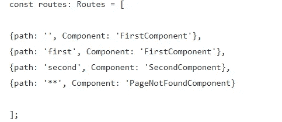
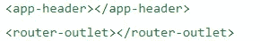

# 要在下一次面试中胜出，你必须准备的 100 个问题(20-30)

> 原文：<https://javascript.plainenglish.io/top-100-questions-you-must-prepare-for-to-ace-your-next-angular-interview-20-30-5121828b4f91?source=collection_archive---------8----------------------->

## Angular 2021 面试问题

## 最常见的角度面试问题 2021


Photo by [Christina @ wocintechchat.com](https://unsplash.com/@wocintechchat?utm_source=medium&utm_medium=referral) on [Unsplash](https://unsplash.com?utm_source=medium&utm_medium=referral)

最近，我试图为即将到来的面试做准备，在谷歌上搜索并打开链接却每次都看到相同的问题，这有点困难。所以，我想到了分享我的发现，以及如果一个人准备面试，他应该知道的最常见的问题是什么。

以下是最新角度面试中最常被问到的面试问题。这些有角度的面试问题和答案帮助有角度的开发人员准备从初级到高级的面试。此外，这篇文章涵盖了你在 2021 年必须准备的基本问题。

# 如果你错过了 1-10 个问题，请查看这篇文章。

[](/top-100-questions-you-must-prepare-for-your-next-angular-interview-1-10-3e13d5fefab9) [## 你必须为下一次角度面试准备的 100 个问题(1-10)

### 最常见的角度面试问题 2021

javascript.plainenglish.io](/top-100-questions-you-must-prepare-for-your-next-angular-interview-1-10-3e13d5fefab9) 

# 如果你错过了 10-20 个问题，请查看这篇文章。

[](/top-100-questions-you-must-prepare-for-to-ace-your-next-angular-interview-10-20-c3f5ab854be) [## 为赢得下一次面试，你必须准备的 100 个问题(10-20)

### 最常见的角度面试问题 2021

javascript.plainenglish.io](/top-100-questions-you-must-prepare-for-to-ace-your-next-angular-interview-10-20-c3f5ab854be) 

# 21.外卡路线是什么？

如果有人键入了不正确的路径，一个常用的通配符路由将重定向到此路由。

为了处理这个错误，我们可以使用**通配符**路由，而不是通知用户。

**例子**:



***为了更好地理解这个概念，我们来看看实际的代码。***

[https://stack blitz . com/edit/angular-feature-modules-final-and-wild card-route-example](https://stackblitz.com/edit/angular-feature-modules-final-and-wildcard-route-example)

# 22.ngIf 和 hidden 有什么区别？

两者不是一样的吗？两者都有隐藏东西的功能。不，但如果你检查 ngIf 不会加载模板，如果条件得到假，而隐藏将加载模板并隐藏它。

**如果条件不满足，ngIf** 不会加载里面写的 HTML 数据。

**隐藏**将加载数据并使用**显示:无**属性不显示在 HTML 中

哪个更好？

如果你考虑性能，ngIf 更好，因为它不会加载 HTML 本身，但如果条件满足，它会再次呈现 DOM。

# 23.什么是路由器插座？

我们确实在主应用程序组件 HTML 中看到了这个标签。但这是什么呢？让我们来理解这个术语。

该指令可从`@angular/router`包中获得，用于标记组件插入的位置。

它是 angular 应用程序的主要标签，因为它将充当我们应用程序的外壳。我们在 shell 中添加的任何内容都将在视图中呈现，只有路由器出口标记的部分将被更改。

例如:如果您在应用程序中使用标题，它将是稳定的，其他内容将根据组件而变化。



# 24.路由器状态是什么？

简而言之，路由器状态维护路由的状态，我们可以通过订阅特定的路由器事件来检查所有状态。

*例如:*

如果我们从“/inbox/33/messages/44”导航到“/inbox/33/messages/45”，可观察的数据将发出一组带有新消息对象的新数据，组件将显示消息 45。

***让我们来看看实用的代码，以便更好地理解这个概念。***

[https://stackblitz.com/edit/angular-routerlink-state](https://stackblitz.com/edit/angular-routerlink-state)

# 25.什么是活动路由？

**ActivatedRoute 提供对 URL、参数、数据、查询参数和片段观察值的访问。**

鉴于以下情况:

首先导航到“/inbox/33/data/44”，然后导航到“/inbox/33/data/45”，我们将看到:

```
url [{path: ‘data’, params: {}}, {path: ‘44’, params: {}}]
url [{path: ‘data’, params: {}}, {path: ‘45’, params: {}}]
```

# 26.以角度解释不同的注入。

在 angular 面试问题中，一个常见的面试问题是您如何在 Angular 应用中使用注射？

我们有 5 种不同的方式来提供依赖注入

1.  **使用类**
2.  **使用价值**
3.  **使用工厂**
4.  **代币厂**
5.  **成分注入**

要了解更多详细的实现，请查看下面的文章。

[](https://medium.com/its-tinkoff/what-can-you-provide-with-dependency-injection-in-angular-d7adcfd42db) [## Angular 中的依赖注入能提供什么？

### Angular 有强大的依赖注入基础。我们可以通过我们的应用程序传输任何数据，转换数据并替换…

medium.com](https://medium.com/its-tinkoff/what-can-you-provide-with-dependency-injection-in-angular-d7adcfd42db) 

***详细解释可以查看角度文档。***

[https://stackblitz.com/angular/pmmpqkbmanl](https://stackblitz.com/angular/pmmpqkbmanl)

# 27.在 angular 中实现翻译的最好方法是什么？

在单页面应用程序中，一个主要特性是动态多语言支持。但是有时候面试官会问你在你的申请中有没有实现翻译？

最常用的库是 ngx-translate，它通过添加 JSON 来提供翻译。

为了更好地理解这个概念，我们来看看实际的代码。

[https://stackblitz.com/edit/ngx-translate-example](https://stackblitz.com/edit/ngx-translate-example)

# 28.解释角度的不同布线参数。

我们确实使用路由参数来维护数据，或者有时在从一条路由导航到另一条路由时传递数据。

Angular 支持以下布线参数。

1.  必需的参数
2.  可选参数
3.  查询参数
4.  导航附加

# 29.什么是 Angular 中的虚拟卷轴？

在这里，面试官想检查你是否掌握了最新的角度特征。

虚拟滚动背后的主要概念是只呈现可见的项目。

例如，如果应用程序中有数千个警报，一种有效的方法是只加载可见的元素，当它们不可见时，通过用新的元素替换它们来卸载它们。

在@angular/cdk 中已经有了虚拟滚动的初始实现。(7.0.0 版-测试版)

***让我们来看看实用的代码，以便更好地理解这个概念。***

[https://stackblitz.com/edit/angular-virtual-scrolling](https://stackblitz.com/edit/angular-virtual-scrolling)

# 30.路由参数和查询参数有什么区别？

查询参数和路由参数之间的主要区别在于，路由参数是确定路由所必需的，而查询参数是可选的。

让我们了解 Angular 中路由的一些基础知识。

## 声明路线参数

```
export const routes: Routes = [{ path: '', redirectTo: 'data', pathMatch: 'full' },{ path: 'data', component: DataList },{ path: 'data/:id', component: DataDetails }];
```

`Example of URL: localhost:3000/data/5`

## 传递查询参数

```
<a [routerLink]="['data']" [queryParams]="{ page: 99 }">Go to Page 99</a>
```

或者，我们可以使用`Router`服务以编程方式导航:

```
goToPage(pageNum) {this.router.navigate(['/data'], { queryParams: { page: pageNum } });}
```

# 第 1 部分是(1-10)个问题和答案

[](/top-100-questions-you-must-prepare-for-your-next-angular-interview-1-10-3e13d5fefab9) [## 你必须为下一次角度面试准备的 100 个问题(1-10)

### 最常见的角度面试问题 2021

javascript.plainenglish.io](/top-100-questions-you-must-prepare-for-your-next-angular-interview-1-10-3e13d5fefab9) 

# 第二部分是(10-20)个问题和答案

[](/top-100-questions-you-must-prepare-for-to-ace-your-next-angular-interview-10-20-c3f5ab854be) [## 为赢得下一次面试，你必须准备的 100 个问题(10-20)

### 最常见的角度面试问题 2021

javascript.plainenglish.io](/top-100-questions-you-must-prepare-for-to-ace-your-next-angular-interview-10-20-c3f5ab854be) 

# 第 3 部分是(20-30)个问题和答案

[](/top-100-questions-you-must-prepare-for-to-ace-your-next-angular-interview-20-30-5121828b4f91) [## 要在下一次面试中胜出，你必须准备的 100 个问题(20-30)

### 最常见的角度面试问题 2021

javascript.plainenglish.io](/top-100-questions-you-must-prepare-for-to-ace-your-next-angular-interview-20-30-5121828b4f91) 

# 第 4 部分是(30-40)个问题和答案

[](/top-100-questions-you-must-prepare-for-to-ace-your-next-angular-interview-30-40-6f195ed91de) [## 为赢得下一次面试，你必须准备的 100 个问题(30-40)

### 最常见的角度面试问题 2021

javascript.plainenglish.io](/top-100-questions-you-must-prepare-for-to-ace-your-next-angular-interview-30-40-6f195ed91de) 

# 其余的问题如下，我将在下一篇文章中提供答案。

1.  constructor 和 ngOnInit 有什么区别？
2.  组件和指令有什么区别？
3.  ElementRef、TemplateRef 和 viewContainerRef 有什么区别？
4.  ng-content、ng-template、ng-container 有什么区别？
5.  视图子级和内容子级的区别是什么？
6.  组件视图、主体视图和嵌入视图之间有什么区别？
7.  去抖时间和油门时间有什么区别？
8.  forEach 和 map 有什么区别？
9.  ng-content 和 ng-templateoutlet 有什么区别？
10.  forchild 和 forroot 有什么区别？
11.  为什么我们在 RXJS 中使用管道操作符。有什么用？
12.  在 Angular 应用程序中使用异步管道和订阅函数有什么区别？
13.  承诺和可观察的区别是什么？
14.  事件发射器和主体有什么区别？
15.  可观察和主体有什么区别？
16.  激活的路由和激活的路由快照有什么区别？
17.  讨论在您的角度应用中使用的不同类型的加载策略。
18.  什么是元数据？
19.  routerlinkActive 有什么用途？
20.  我们在 Angular 中使用泛型。
21.  外卡路线是什么？
22.  ngIf 和 hidden 有什么区别？
23.  什么是路由器插座？
24.  路由器状态是什么？
25.  什么是活动路由？
26.  以角度解释不同的注入。
27.  在 angular 中实现翻译的最好方法是什么？
28.  解释角度的不同布线参数。
29.  什么是 Angular 中的虚拟卷轴？
30.  路由参数和查询参数有什么区别？
31.  解释 Angular 中支持的不同防护装置。
32.  哪些 RXJS 运算符用于转换或操作数据？
33.  延迟加载组件的最佳方式是什么？
34.  我们有什么办法可以用 Angular 显示 app 版本？
35.  ES6 中的发电机有哪些？
36.  解释应用程序中的错误机制。
37.  angular 中的自举是什么？
38.  什么是角元素？我们为什么使用它？
39.  箭头函数和常规函数有什么区别？
40.  函数式编程语言和面向对象编程语言的区别是什么？你更喜欢哪一个，为什么？
41.  JavaScript 和 TypeScript 有什么区别？
42.  你对闭包了解多少？
43.  模板驱动表单和反应式表单有什么区别？
44.  Angular 中有哪些不同类型的绑定？
45.  您最常用哪些 RXJS 操作符来处理 HTTP 服务？
46.  mergemap/switchmap/concatmap 和 exhaustmap 有什么区别，我们可以在哪里使用它们？
47.  在 Angular 中讨论不同的装饰者。
48.  用 Angular 解释不同的生命周期方法。
49.  解释角度生命周期挂钩的层次。
50.  渲染器 2 是什么？
51.  渲染器和 ElementRef 有什么区别？
52.  Zone.js 是什么？
53.  Angular 中的竞争条件是什么？
54.  Angular 中的回调、承诺和异步/等待是什么？
55.  Angular 中的主机绑定和主机侦听器是什么？
56.  Angular 中的依赖注入是什么？
57.  以角度解释摘要周期/变化检测周期。
58.  markForCheck 和 detectchanges 有什么区别？
59.  克隆对象的方法有哪些？
60.  解释 Angular 应用程序如何加载/初始化。
61.  当一个 [@Input](http://twitter.com/Input) ()值发生角度变化时，如何检测非原语类型数据？
62.  Angular 中有哪些不同的封装策略？
63.  Angular 中的暗影 DOM 是什么？
64.  解释 Angular 中不同类型的指令。
65.  退订可观测的最好方法是什么？
66.  什么是有角度的语言服务？
67.  Angular 的 canLoad 和 canActivate 的区别？
68.  如何检查路线角度是否改变？
69.  用 Angular 解释不同的路由器事件。
70.  触发角度变化检测的手动方式有哪些？
71.  从角度讨论不同的管道。
72.  你在 Angular 中遵循的最佳安全实践是什么？
73.  提高角度性能的最佳方法是什么？
74.  你处理过检查错误后发生变化的表达式吗？
75.  如果已经加载了一个模块，该如何处理？
76.  你在 Angular 中创建了自定义库吗？
77.  你在应用中分析内存的方法有哪些？
78.  用 Angular 解释不同的路由器事件？
79.  Angular 中的数据类型有哪些？
80.  优化异步验证器的最好方法是什么？
81.  Angular 中的 Enums 是什么？
82.  JavaScript 中的 find 和 filter 有什么区别？
83.  防止在 Angular 中点击按钮时出现多个服务呼叫。
84.  如何在 Angular 中的组件之间传递数据？
85.  (change)和(ngModelChange)有什么区别？
86.  声明、提供者和导入之间有什么区别？
87.  如何在角元件库(比如角材)中覆盖 CSS？
88.  如何将组件中的字符串动态绑定到 HTML？
89.  如何在同一个元素上设置 ngFor 和 ngIf？
90.  你能举一个内置验证器的例子吗？
91.  什么是入门组件？
92.  什么是有角度的可观察和观察者？
93.  Angular 里的服务人员是什么？
94.  如何在 Angular 中用最新版本更新所有库？
95.  什么是拦截器？您如何配置您的应用程序/
96.  解释你的 Angular 应用的架构。
97.  解释一些你最常用的测试角度组件的方法。
98.  你在应用中使用了哪些不同的 SCSS 函数？
99.  OnPush 和默认变更检测有什么区别？
100.  如何将数据绑定到模板？
101.  takeWhile 和 takeUntil RXJS 运算符有什么区别？
102.  behavior Subject/Subject/replay Subject 和 Async Subject 有什么区别？
103.  解释 ng-temple、ng-content、ng-container 和 ng-templateOutlet 的实际用法。
104.  为什么我们在 route 中使用 forchild 和 forroot 方法？它的用法是什么？
105.  如何将所有角度库更新到最新版本？
106.  Angular 中的内容投影是什么，它是如何工作的？
107.  Angular 中的 APP _ INITILIZER 是什么，是用来做什么的？
108.  解释角度应用中的路由重用策略。
109.  Angular 中的服务器端渲染是如何工作的？
110.  Angular 里的服务人员是什么？如何使用它们？

# 请在评论中提供您的反馈，如果您想优先考虑一些问题。我将在 2 天内回答接下来的 30-40 个问题。

*更多内容看*[***plain English . io***](http://plainenglish.io/)