# 你必须为下一次角度面试准备的 100 个问题(1-10)

> 原文：<https://javascript.plainenglish.io/top-100-questions-you-must-prepare-for-your-next-angular-interview-1-10-3e13d5fefab9?source=collection_archive---------2----------------------->

## 角度面试问题 2021

## 最常见的角度面试问题 2021

Photo by [Christina @ wocintechchat.com](https://unsplash.com/@wocintechchat?utm_source=medium&utm_medium=referral) on [Unsplash](https://unsplash.com?utm_source=medium&utm_medium=referral)

最近，我试图为即将到来的面试做准备，在谷歌上搜索并打开链接却每次都看到相同的问题，这有点困难。所以，我想到了分享我的发现，以及如果一个人准备面试，他应该知道的最常见的问题是什么。

以下是最新角度面试中最常被问到的面试问题。这些有角度的面试问题和答案帮助有角度的开发人员准备从初级到高级的面试。此外，这篇文章涵盖了你在 2021 年必须准备的基本问题。

# 1.constructor 和 ngOnInit 有什么区别？

每个面试官想到的最常见的问题是，构造者和 ngOnInit 之间有什么区别？用哪个，为什么？

我们通常的回答是，我们在构造函数中写依赖关系，而在 ngOninit 中写逻辑。

有时候面试官会查我们还知道些什么？为什么我们不能将服务或逻辑放在构造函数中？

简单的回答是，有时我们需要等到所有的依赖项都加载完毕，或者对于父/子组件，我们可能需要等到组件加载完毕，这就是为什么最好用 ngOnInit 编写逻辑的原因。

让我们检查一下其他的不同之处。

***让我们来看看实用的代码，以便更好地理解这个概念。***

[https://stackblitz.com/edit/ngoninit-vs-constructor](https://stackblitz.com/edit/ngoninit-vs-constructor)

# 2.组件和指令有什么区别？

当我想到这个问题时，我想我声明指令和模块中的组件是一样的，但是这两者之间的主要区别是什么呢？

指令:没有它们的影子 DOM，用来操纵 HTML 元素的行为

组件:有自己的 HTML，主要用于根据特性中断应用程序

**让我们检查一下其他的不同之处。**

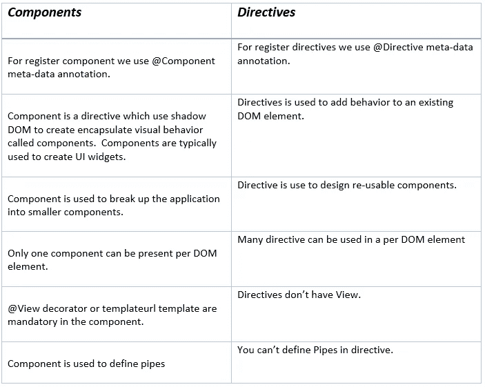

***为了更好地理解这个概念，我们来看看实际的代码。***

[https://stackblitz.com/edit/angular-directive](https://stackblitz.com/edit/angular-directive)

# 3.ElementRef、TemplateRef 和 viewContainerRef 有什么区别？

这么多参考？我们在哪里使用它们？

如果我接受采访，这可能是我的问题。它有助于面试官了解你对 Angular 中动态视图的了解。

**让我们用例子来检查 ElementRef、TemplateRef 和 viewContainterRef 的区别。**

> *ElementRef 示例:*

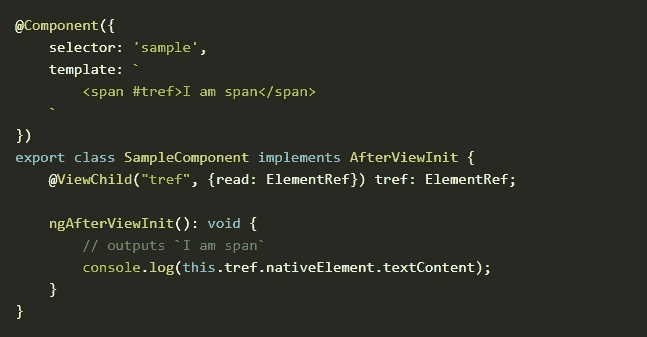

> *模板参考示例:*

> *视图包含以下示例:*

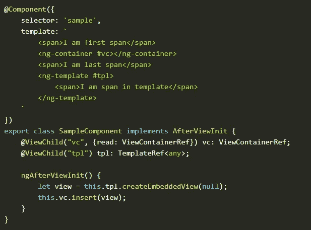

***让我们看看实用的代码，以更好地理解这个概念。***

[https://stackblitz . com/edit/element ref-template ref-view container ref](https://stackblitz.com/edit/elementref-templateref-viewcontainerref)

# 4.ng-content、ng-template 和 ng-container 之间有什么区别？

太多的 ng 无处不在，哈哈。

由于角确实有其模板的支持，ng-template 和 ng-container 的一些常用模板指令。

**我们来举例说明 ng-content、ng-template 和 ng-container 之间的区别。**

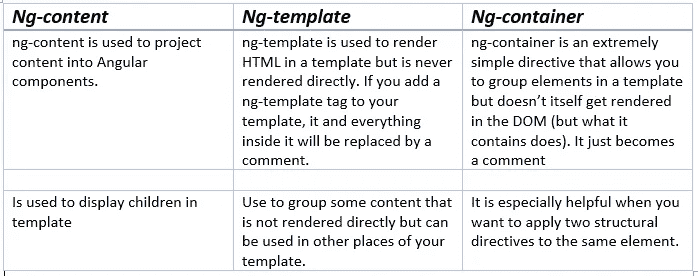

> *ng-含量示例:*

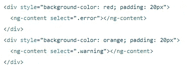

> *ng-模板示例:*

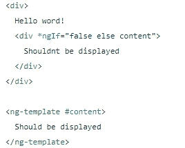

> *ng-容器示例:*

***让我们看看实用的代码，以更好地理解这个概念。***

[https://stackblitz . com/edit/angle-ng-template-ng-content-ng-container-example](https://stackblitz.com/edit/angular-ng-template-ng-content-ng-container-example)

# 5.视图子对象和内容子对象之间的区别是什么？

使用 angular 是重用组件，处理父子组件是我们作为 Angular Developer 所做的常见任务之一。

如何从父组件访问子组件？当您想要从父组件访问子组件时，这两个术语对您更有用。

**让我们通过例子来检查视图子对象和内容子对象的区别。**

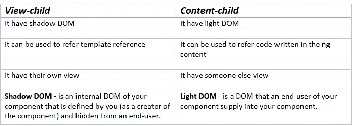

> *视图-子示例:*

> *内容-子例:*

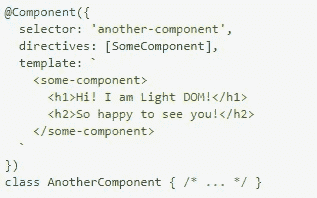

***让我们看看实用的代码，以更好地理解这个概念。***

[https://stackblitz.com/edit/angulr-view-content-child](https://stackblitz.com/edit/angulr-view-content-child)

# 6.组件视图、宿主视图和嵌入式视图之间的区别是什么？

老实说，这个问题只有在你参加高级面试时才会被问到。

**让我们通过例子来检查组件视图、宿主视图和嵌入式视图之间的区别。**

> *嵌入式视图示例:*

> *宿主视图示例:*

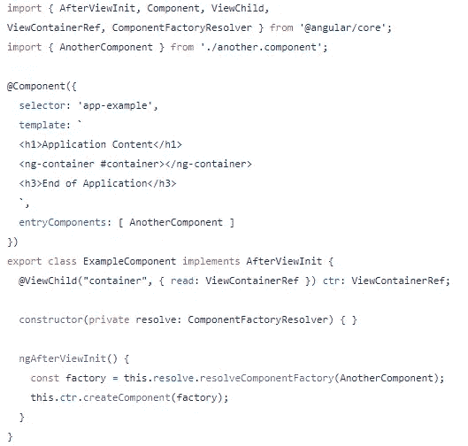

***让我们看看实用的代码，以更好地理解这个概念。***

[https://stackblitz.com/edit/ng-embedded-view](https://stackblitz.com/edit/ng-embedded-view)

# 7.去抖时间和节流时间有什么不同？

每个应用程序中的一个常见场景是以用户类型的形式调用服务。有很多方法可以达到这个结果，RXJS 确实提供了这两个功能来达到这个目的。

**让我们来关注一下它们之间的区别。**

***让我们来看看实用的代码，以便更好地理解这个概念。***

[https://stackblitz.com/edit/throttletimevsdebouncetime](https://stackblitz.com/edit/throttletimevsdebouncetime)

# 8.forEach 和 map 有什么区别？

我知道这是一个 JavaScript 面试问题，但在这里值得一提，因为任何事情都可以成为前端面试问题。

让我们来看看 forEach 和 map 之间的区别。

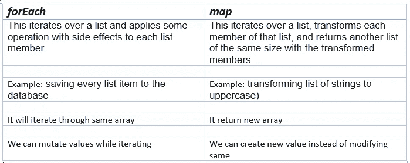

***为了更好地理解这个概念，我们来看看实际的代码。***

[https://stackblitz.com/edit/ken-demo-foreach-vs-map](https://stackblitz.com/edit/ken-demo-foreach-vs-map)

# 9.ng-content 和 ng-templateoutlet 有什么区别？

当我们处理多个模板时，最好在模板本身中编写可重用的逻辑。了解这两个术语可以增加你在开发人员面试中获胜的机会。

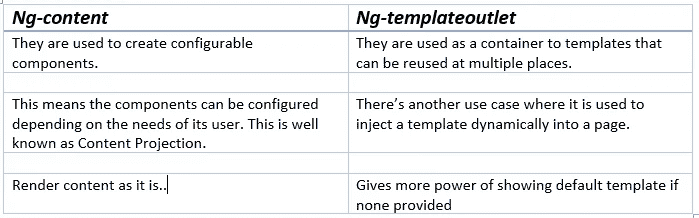

> *ng-含量示例:*

> *ng-模板出口示例:*

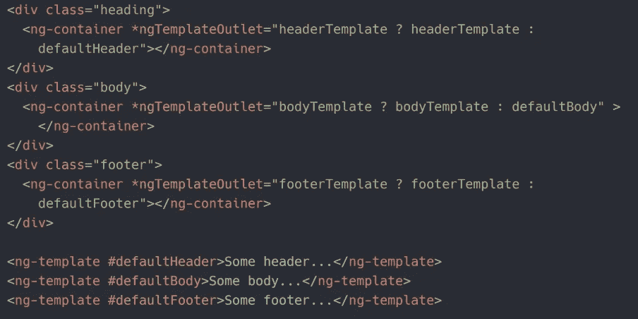

***为了更好地理解这个概念，我们来看看实际的代码。***

[https://stack blitz . com/edit/ngtemplate outlet-and-content-projection](https://stackblitz.com/edit/ngtemplateoutlet-and-content-projection)

[https://stackblitz.com/edit/ng-content-demo-example](https://stackblitz.com/edit/ng-content-demo-example)

# 10.forchild 和 forroot 有什么区别？

你应该知道的一个话题，因为这是角度依赖性注入的基础。我觉得你可以查看这篇详细的文章来了解这两个术语。

 [## 理解根和孩子角度

### 以及为什么我们需要它们来路由

medium.com](https://medium.com/javascript-in-plain-english/understand-angulars-forroot-and-forchild-f27fbc41cb7b) 

为了更好地理解这个概念，我们来看看实际的代码。

# 第二部分是(10-20)个问题和答案

 [## 为赢得下一次面试，你必须准备的 100 个问题(10-20)

### 最常见的角度面试问题 2021

javascript.plainenglish.io](/top-100-questions-you-must-prepare-for-to-ace-your-next-angular-interview-10-20-c3f5ab854be) 

# 第 3 部分是(20-30)个问题和答案

 [## 要在下一次面试中胜出，你必须准备的 100 个问题(20-30)

### 最常见的角度面试问题 2021

javascript.plainenglish.io](/top-100-questions-you-must-prepare-for-to-ace-your-next-angular-interview-20-30-5121828b4f91) 

# 第 4 部分是(30-40)个问题和答案

 [## 为赢得下一次面试，你必须准备的 100 个问题(30-40)

### 最常见的角度面试问题 2021

javascript.plainenglish.io](/top-100-questions-you-must-prepare-for-to-ace-your-next-angular-interview-30-40-6f195ed91de) 

# 其余的问题如下，我将在下一篇文章中提供答案。

1.  constructor 和 ngOnInit 有什么区别？
2.  组件和指令有什么区别？
3.  ElementRef、TemplateRef 和 viewContainerRef 有什么区别？
4.  ng-content、ng-template、ng-container 有什么区别？
5.  视图子级和内容子级的区别是什么？
6.  组件视图、主体视图和嵌入视图之间有什么区别？
7.  去抖时间和油门时间有什么区别？
8.  forEach 和 map 有什么区别？
9.  ng-content 和 ng-templateoutlet 有什么区别？
10.  forchild 和 forroot 有什么区别？
11.  为什么我们在 RXJS 中使用管道操作符。有什么用？
12.  在 Angular 应用程序中使用异步管道和订阅函数有什么区别？
13.  承诺和可观察的区别是什么？
14.  事件发射器和主体有什么区别？
15.  可观察和主体有什么区别？
16.  激活的路由和激活的路由快照有什么区别？
17.  讨论在您的角度应用中使用的不同类型的加载策略。
18.  什么是元数据？
19.  routerlinkActive 有什么用途？
20.  我们在 Angular 中使用泛型。
21.  外卡路线是什么？
22.  ngIf 和 hidden 有什么区别？
23.  什么是路由器插座？
24.  路由器状态是什么？
25.  什么是活动路由？
26.  以角度解释不同的注入。
27.  在 angular 中实现翻译的最好方法是什么？
28.  解释角度的不同布线参数。
29.  什么是 Angular 中的虚拟卷轴？
30.  路由参数和查询参数有什么区别？
31.  解释 Angular 中支持的不同防护装置。
32.  哪些 RXJS 运算符用于转换或操作数据？
33.  延迟加载组件的最佳方式是什么？
34.  我们有什么办法可以用 Angular 显示 app 版本？
35.  ES6 中的发电机有哪些？
36.  解释应用程序中的错误机制。
37.  angular 中的自举是什么？
38.  什么是角元素？我们为什么使用它？
39.  箭头函数和常规函数有什么区别？
40.  函数式编程语言和面向对象编程语言的区别是什么？你更喜欢哪一个，为什么？
41.  JavaScript 和 TypeScript 有什么区别？
42.  你对闭包了解多少？
43.  模板驱动表单和反应式表单有什么区别？
44.  Angular 中有哪些不同类型的绑定？
45.  您最常用哪些 RXJS 操作符来处理 HTTP 服务？
46.  mergemap/switchmap/concatmap 和 exhaustmap 有什么区别，我们可以在哪里使用它们？
47.  在 Angular 中讨论不同的装饰者。
48.  用 Angular 解释不同的生命周期方法。
49.  解释角度生命周期挂钩的层次。
50.  渲染器 2 是什么？
51.  渲染器和 ElementRef 有什么区别？
52.  Zone.js 是什么？
53.  Angular 中的竞争条件是什么？
54.  Angular 中的回调、承诺和异步/等待是什么？
55.  Angular 中的主机绑定和主机侦听器是什么？
56.  Angular 中的依赖注入是什么？
57.  以角度解释摘要周期/变化检测周期。
58.  markForCheck 和 detectchanges 有什么区别？
59.  克隆对象的方法有哪些？
60.  解释 Angular 应用程序如何加载/初始化。
61.  当一个 [@Input](http://twitter.com/Input) ()值发生角度变化时，如何检测非原语类型数据？
62.  Angular 中有哪些不同的封装策略？
63.  Angular 中的暗影 DOM 是什么？
64.  解释 Angular 中不同类型的指令。
65.  退订可观测的最好方法是什么？
66.  什么是有角度的语言服务？
67.  Angular 的 canLoad 和 canActivate 的区别？
68.  如何检查路线角度是否改变？
69.  用 Angular 解释不同的路由器事件。
70.  触发角度变化检测的手动方式有哪些？
71.  从角度讨论不同的管道。
72.  你在 Angular 中遵循的最佳安全实践是什么？
73.  提高角度性能的最佳方法是什么？
74.  你处理过检查错误后发生变化的表达式吗？
75.  如果已经加载了一个模块，该如何处理？
76.  你在 Angular 中创建了自定义库吗？
77.  你在应用中分析内存的方法有哪些？
78.  用 Angular 解释不同的路由器事件？
79.  Angular 中的数据类型有哪些？
80.  优化异步验证器的最好方法是什么？
81.  Angular 中的 Enums 是什么？
82.  JavaScript 中的 find 和 filter 有什么区别？
83.  防止在 Angular 中点击按钮时出现多个服务呼叫。
84.  如何在 Angular 中的组件之间传递数据？
85.  (change)和(ngModelChange)有什么区别？
86.  声明、提供者和导入之间有什么区别？
87.  如何在角元件库(比如角材)中覆盖 CSS？
88.  如何将组件中的字符串动态绑定到 HTML？
89.  如何在同一个元素上设置 ngFor 和 ngIf？
90.  你能举一个内置验证器的例子吗？
91.  什么是入门组件？
92.  什么是有角度的可观察和观察者？
93.  Angular 里的服务人员是什么？
94.  如何在 Angular 中用最新版本更新所有库？
95.  什么是拦截器？您如何配置您的应用程序/
96.  解释你的 Angular 应用的架构。
97.  解释一些你最常用的测试角度组件的方法。
98.  你在应用中使用了哪些不同的 SCSS 函数？
99.  OnPush 和默认变更检测有什么区别？
100.  如何将数据绑定到模板？
101.  takeWhile 和 takeUntil RXJS 运算符有什么区别？
102.  behavior Subject/Subject/replay Subject 和 Async Subject 有什么区别？
103.  解释 ng-temple、ng-content、ng-container 和 ng-templateOutlet 的实际用法。
104.  为什么我们在 route 中使用 forchild 和 forroot 方法？它的用法是什么？
105.  如何将所有角度库更新到最新版本？
106.  Angular 中的内容投影是什么，它是如何工作的？
107.  Angular 中的 APP _ INITILIZER 是什么，是用来做什么的？
108.  解释角度应用中的路由重用策略。
109.  Angular 中的服务器端渲染是如何工作的？
110.  Angular 里的服务人员是什么？如何使用它们？

# 请在评论中提供您的反馈，如果您想优先考虑一些问题。我会在两天内带着 10-20 个问题来。

 [## 角度面试问题:‘改变’和‘ngModelChange’有什么区别？

### 最常见的前端面试问题 2021

javascript.plainenglish.io](/frontend-interview-question-what-is-the-difference-between-change-vs-ngmodelchange-f6bb3cb26dbc)  [## Angular 有哪些不同的内置管道？

### 你必须为下一次面试准备的 100 个问题。

javascript.plainenglish.io](/what-are-the-different-built-in-pipes-available-in-angular-f59bbae6c949)  [## 如何获得 RxJS 主题或可观察对象的当前值

### 获取 RxJS 可观察值的当前值——每日角度提示、技巧和最佳实践

javascript.plainenglish.io](/how-to-get-the-current-value-of-an-rxjs-subject-or-observable-b5eb666b20f6)  [## 面向前端开发人员的 20 个最佳 VSCode 扩展指南

### 面向前端开发的 VSCode 最有用扩展的综合指南

javascript.plainenglish.io](/a-guide-to-the-20-best-vscode-extensions-for-frontend-developers-f75a5d716091)  [## 2021 年你应该知道的 JavaScript 顶级优化技术

### 使用现代速记技术、技巧和诀窍优化您的 JavaScript 代码。

javascript.plainenglish.io](/33-javascript-useful-shorthands-cheat-list-2021-e08b46a1a688)  [## 路由使用策略在角度上得到简化

### Angular 中的路由复用策略是什么？如何实施？

javascript.plainenglish.io](/routereusestrategy-simplified-in-angular-2e358db618d9)