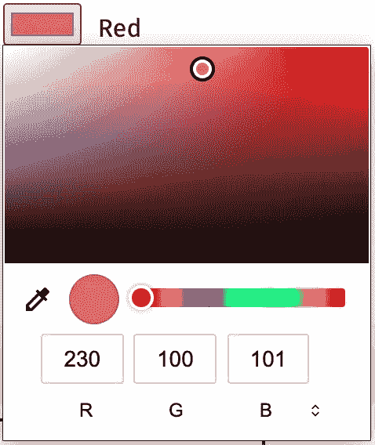
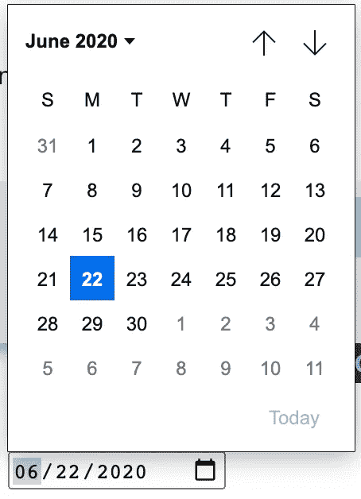
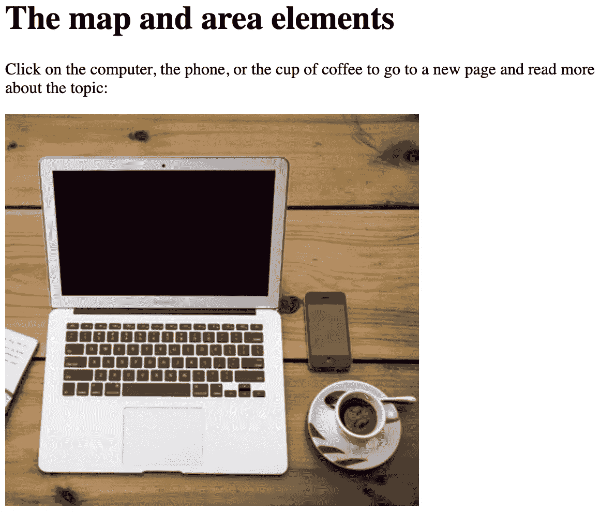
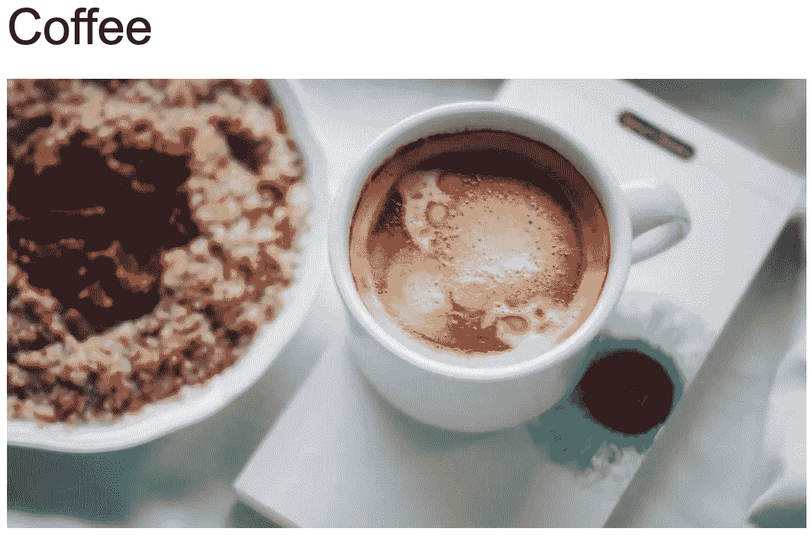
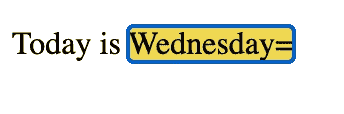
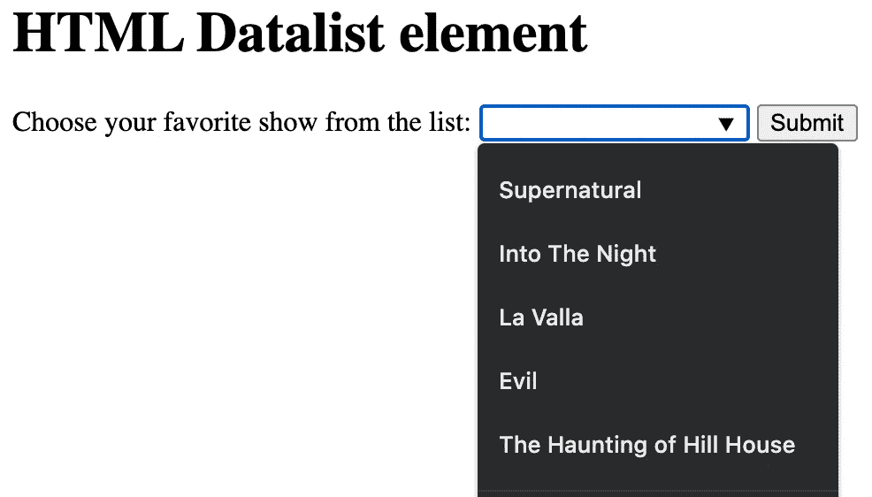

# 你不知道存在的 12 大 HTML 标签

> 原文：<https://javascript.plainenglish.io/top-12-html-tags-you-had-no-idea-existed-20e9be5208a8?source=collection_archive---------5----------------------->

*这些技巧将加速你的工作流程&使你的代码可伸缩。*

Photo by [Andhika Soreng](https://unsplash.com/@dhika88?utm_source=medium&utm_medium=referral) on [Unsplash](https://unsplash.com?utm_source=medium&utm_medium=referral)

有多少次你在创建网站或 web 应用程序时写了一个脚本，然后意识到有一个 HTML 元素做了*那件事？*

嗯——如果你和我一样，我想这已经不止一次了。现在让我告诉你一些鲜为人知的 HTML 金块，它们会让你大吃一惊，并让你尖叫“谢谢！”。 ***不谢我尽管*** 。

*走吧。*

# 1.仪表标签:

`min`和`max`值为我们的`value`属性设置了一个范围。`optimum`属性必须在最小值和最大值之间。

*MDN docs for more:*
[https://developer . Mozilla . org/en-US/docs/Web/HTML/Element/meter](https://developer.mozilla.org/en-US/docs/Web/HTML/Element/meter)

# 2.进度标签:

这个标签显示一个加载栏指示器，显示正在进行的某个操作的进度—在这个例子中，是一个文件上传。用一些好的 ole JavaScript 就可以很容易地将它变成动态的。

*MDN docs for more:*
[https://developer . Mozilla . org/en-US/docs/Web/HTML/Element/progress](https://developer.mozilla.org/en-US/docs/Web/HTML/Element/progress)

# 3.最小长度和最大长度:

`minlength`和`maxlength`属性作为指定输入的字符长度范围。

*MDN docs for more:*
[https://developer . Mozilla . org/en-US/docs/Web/HTML/Element/input](https://developer.mozilla.org/en-US/docs/Web/HTML/Element/input)

# 4-输入类型颜色:

Screenshot from MDN docs

*MDN 文档详情:*

 [## - HTML:超文本标记语言| MDN

### color 类型的元素提供了一个用户界面元素，该元素允许用户指定一种颜色，或者通过使用可视的…

developer.mozilla.org](https://developer.mozilla.org/en-US/docs/Web/HTML/Element/input/color) 

# 5.输入类型日期:

Screenshot from MDN docs

*MDN 文档详情:*

 [## - HTML:超文本标记语言| MDN

### type="date "的元素创建允许用户输入日期的输入字段，或者用文本框验证…

developer.mozilla.org](https://developer.mozilla.org/en-US/docs/Web/HTML/Element/input/date) 

# 6.地图元素:

`map`标签允许你在图像上定义一个边界框(图像地图)。这些区域可以点击到外部文档、页面等。这可能有许多用例— *，尤其是在营销产品方面*。

在下图中，点击电脑、手机或咖啡杯链接到自己的外部页面:

*在这里自己尝试一下(W3 Schools docs):*

 [## 试用编辑器 3.6 版

### 如果您单击“保存”按钮，您的代码将被保存，并且您将获得一个可以与其他人共享的 URL。

www.w3schools.com](https://www.w3schools.com/tags/tryit.asp?filename=tryhtml_areamap) 

# 7.内容可编辑:

Screenshot taken from W3 schools page.

这个属性不言自明，它允许 HTML 元素或其一部分是可编辑的。要获得可编辑的`span`标签的值，最好附加一个`input`的事件监听器，因为当用户**将**内容复制并粘贴到可编辑区域时，像`keydown`、`keypress`这样的事件监听器不会处理这种情况。

*在这里自己尝试一下(W3 Schools docs):*

 [## HTML 内容可编辑属性

### contenteditable 属性指定元素的内容是否可编辑。注意:当…

www.w3schools.com](https://www.w3schools.com/tags/att_global_contenteditable.asp) 

# 8.输入隐藏:

具有值为`hidden`的`type`属性的`input`可用于存储数据，当提交表单时，任何用户都不能看到或修改这些数据。

*您可以在 MDN 文档中了解更多信息:*

 [## - HTML:超文本标记语言| MDN

### 隐藏类型的元素允许 web 开发人员包含用户无法看到或修改的数据

developer.mozilla.org](https://developer.mozilla.org/en-US/docs/Web/HTML/Element/input/hidden) 

# 9.输入数据列表:

*附言——第 7-11 行是伟大的网飞狂欢:)*

元素代表一个输入字段的建议列表。您可以手动硬编码它们，或者使用 JavaScript 动态填充它们。看看这个基本的例子:

Screenshot taken from W3 schools.

# 10.文档刷新:

*让我们快速分解一下:*

1.  **刷新**:以秒为单位定义文档刷新的时间间隔(本例中为每 10 秒一次)。
2.  **内容安全策略**:指定 HTML 文档的内容策略。
3.  **内容类型**:指定 HTML 文档使用的字符编码。
4.  **默认样式**:指定文档使用的首选样式表。

需要注意一些陷阱。阅读 W3 文档了解更多:

 [## HTML http-equiv 属性

### content-security-policy 指定文档的内容策略。示例:内容类型指定字符…

www.w3schools.com](https://www.w3schools.com/tags/att_meta_http_equiv.asp) 

# 11.主题颜色:

`meta` HTML 标签上的`name`属性的`theme-color`值定义了应该用于在页面上显示的颜色——需要进一步的逻辑和定制来正确配置它。

*查看 MDN 文档了解更多信息:*

 [## 主题颜色 HTML:超文本标记语言| MDN

### 元素的 name 属性的主题颜色值表示用户代理应该使用的建议颜色…

developer.mozilla.org](https://developer.mozilla.org/en-US/docs/Web/HTML/Element/meta/name/theme-color) 

# 12.模板:

HTML `template`标签允许加载某些 HTML 元素，这些元素在 DOM 构造中被解析，但不会立即呈现。模板是一段代码，我们稍后可以在使用 JavaScript 的文档中使用。

*阅读更多关于 MDN 文档中模板的信息:*

 [## :内容模板元素- HTML:超文本标记语言| MDN

### HTML 元素是一种保存 HTML 的机制，它不会在页面加载时立即呈现，但可能…

developer.mozilla.org](https://developer.mozilla.org/en-US/docs/Web/HTML/Element/template) 

# 结论:

这些元素非常有用，只需一点点 JavaScript，您就可以为用户创造强大的体验。我鼓励你自己练习这些，这样你就可以作为一名开发人员提高你的知识水平。

我希望这对你有帮助。如果你需要采访编码方面的帮助，请随时联系我。你可以下载我创建的免费简历模板，用来获得苹果、亚马逊等公司的技术面试——[点击这里](http://pjcodes.com/shop)！

请到—[Pjcodes.com](https://www.pjcodes.com/)来找我

*更多内容请看*[***plain English . io***](http://plainenglish.io/)