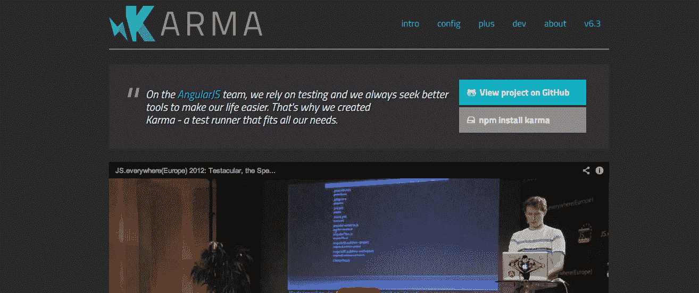
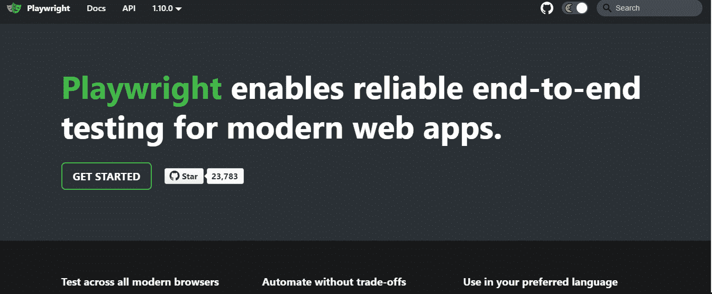

# 2021 年 12 大 JavaScript 自动化框架

> 原文：<https://javascript.plainenglish.io/top-12-javascript-automation-frameworks-in-2021-ea65929355a9?source=collection_archive---------9----------------------->

Source: Pixabay

今天的世界正在走向一个一切都自动化的时代。正在发生的最重要的变化之一是开发者如何创建 web 应用的客户端。JavaScript 是世界上最流行的编程语言，在软件测试自动化中起着关键作用。

JavaScript 自动化框架有助于 JavaScript 应用的前端和后端开发。然而，今天大量的可用框架使得选择最好的框架变得很困难。此外，JavaScript 和它使用的工具每天都在发展，保持更新是至关重要的。

作为一名自动化测试人员，您想知道今年最流行的框架。如果您也能找到一个完全符合您需求的 JavaScript 自动化框架，那将是最好的。本文探讨了 2021 年可以使用的 12 个最佳 JavaScript 自动化框架。

让我们开始吧。

## 1.玩笑

Jest 长期以来一直被评为顶级 JavaScript 自动化框架。这项由脸书开发的技术因其简单性而一飞冲天。用户不需要配置方面的经验，因为它是集成的，随时可以使用。

这是一个值得考虑的好选择，因为它对于大型项目来说速度很快。它也有一个简单方便的用户界面，增强了 UX。此外，对于软件开发人员来说，这是一个很好的选择，因为它支持跨浏览器使用。它很健壮，而且不容易出错是一个优点。

## 2.WebdriverIO

WebdriverIO 是今年要考虑的另一个流行的 JavaScript 自动化框架。它在本地和浏览器移动测试中表现出色。使用 WebdriverOI 可以帮助您避免拥有多个框架的压力。这是因为它测试不同性质的应用程序，并满足所有测试需求。

这是一个很好的选择，因为它与其他框架兼容。您只需要启动几个命令来设置它并开始测试。因此，WebdriverIO 对于希望测试几个应用程序的软件测试人员来说是理想的，并且不仅仅适合基本的测试。

## 3.摩卡

如果你想测试一个在 Node.js 上运行的应用程序，Mocha 是你的理想框架。建立和使用一个有大量在线参考资源的框架是很容易的。这是因为它比列表中的许多框架都要老。

由于其开源特性，Mocha 在灵活性方面非常出色。它还支持生成器，并按顺序执行测试，最后给出有见地的报告。但是，它有一个庞大的生态系统，这使它成为一个复杂的使用框架。与 Jest 等其他工具相比，它的设置和测试时间要长一些。

## 4.柏树

开发人员可以使用 Cypress 编写他们想要执行的各种测试。Cypress 只兼容 Mocha，是最好的前端测试工具之一。使用 Cypress 需要两个主要的先决条件——Node JS 和一个类似 Visual Studio 代码的 IDE。

有几个原因可以解释为什么柏树每天都变得受欢迎。第一个原因是，当使用它进行自动化测试时，您可以预期一致的结果。同样，当你想学习自动化测试时，使用 Cypress 也更容易。因此，如果它对刚起步的人有好处，但对那些已经掌握自动化测试知识的人来说仍然很棒。

其次是因为你可以修改 DOM 元素，也因为它不会经历网络延迟。

Cypress 还会在整个过程的每一步拍摄一张快照，这就更加方便了。它还可以修改一切，因为它可以访问前面和后面的部分。

## 5.因果报应

来源:https://karma-runner.github.io/latest/index.html

这种高度可配置和高效的测试环境在 2021 年值得一提。它更像是一个测试运行器，您可以将其配置为与大多数框架一起工作。Karma 允许用户在他们选择的浏览器和设备上执行测试。它还以易于与 CI/CD 包集成而闻名

它允许用户轻松地从他们的 IDE 或 CMD 控制工作流。Karma 是一个开源框架，这是选择它的足够理由。这是因为你可以访问很多关于它的在线资源。这意味着你可以很容易地设置它，使用它不会有压力。

## 6.操纵木偶的人

像 Mocha 一样，Puppeteer 是 Node.js 应用程序的另一个奇妙框架。它需要你在你的系统中安装 yarn 或 npm 以及最新版本的 Chrome。它有助于更快地执行测试，并允许软件测试人员模拟资源。然而，它最大的局限性是它只使用 Chrome。

木偶师在软件测试人员中越来越受欢迎。它简化了无头测试的事实是其受欢迎的因素之一。但是，如果您希望构建跨浏览器兼容的应用程序，这并不是一个理想的选择。值得庆幸的是，我们的列表中有很多选择可以帮助你毫不费力地做到这一点。

## 7.蛹

今年要考虑的另一个有希望的工具是 Aurelia。它支持为各种平台和设备构建不同种类的应用程序。Aurelia 始于 2015 年，已经建立了一个庞大的社区，并迅速吸引了软件开发人员的注意。

它是一个开源框架，具有强大的特性和功能。其网站上的 Aurelia 社区很有帮助，并且有指南可以帮助你使用它。正确设置所有配置后，它就可以使用了。Aurelia 已经成为一个强大的应用程序开发平台。

## 8.有角的

使用 Angular 创建 web 应用程序的客户端是一个简单的过程。它很受欢迎，许多大品牌都在使用它来构建和测试他们的应用程序。Angular 成立九年来，已经发展成为一个庞大的社区。由于它提供的支持，它继续扩大其用户基础。

Angular 基于组件的架构使其在开发者中广受欢迎。它还有一个超前的编译器，可以更快地执行测试。Angular 用户可以轻松地添加定制元素并增强自动化测试。此外，其他功能，如角通用发挥了重要作用的表现。

## 9.茉莉

Jasmine 是一个 JavaScript 框架，它使得开发 Node.js 应用程序变得很容易。它的安装和设置很简单，但是它的配置可能有点令人望而生畏。然而，当谈到灵活性时，Jasmine 令人印象深刻。您几乎可以将其配置为与任何选择的框架或应用程序一起工作。

它有一个大型社区，使初学者的学习曲线更加平滑。您还可以在这个框架中使用不同的编程模式和风格。您会发现它是大型项目的优秀解决方案，使它成为多年来流行的框架。

## 10.剧作家

来源:https://playwright.dev/

这个开源 JavaScript 自动化框架是最新的一个。微软在 2020 年 1 月发布了它，但它的受欢迎程度呈指数增长。剧作家最大的优势之一是它允许用户用任何语言编码，如 Java、Python 等。

但是，你可能会发现在目前的状态下使用它很有挑战性。这是因为新的更新频繁出现，因为微软希望让它变得更好。如果你也有一个自定义浏览器来帮助你更有效地使用剧作家，那将会很有帮助。但是，这增加了它的局限性，特别是与其他框架相比的灵活性。

尽管与许多框架不兼容，但您可以将它与不同的框架集成在一起。如果你需要跨浏览器测试，那么剧作家是你的不二选择。就目前而言，最好的办法是让这个框架足够成熟，以避免应对多重变化。

## 11.量角器

如果你想知道如何测试角度应用，量角器可以帮助你。该框架要求您在系统中安装 npm 和 Angular。您还需要一个 Selenium 服务器，使您能够顺利地跨不同的浏览器运行测试。

使它成为流行框架的一个原因是，它允许您编写和管理页面对象。它与各种平台的兼容性也使它成为一个完美的选择。它会自动捕捉屏幕截图，让你更容易进行比较。它也是在几个工作站上执行测试的理想选择。

## 12.测试咖啡馆

TestCafe 非常容易部署，这也是它变得流行的原因。它允许开发者在 JavaScript 和 TypeScript 语言之间进行选择。TestCafe 支持多种桌面浏览器，因此您可以选择任何符合您需求的浏览器。

您会发现它是端到端和回归测试的完美选择。这意味着，如果你想进行单元测试或集成测试，你可能必须探索替代框架。使用这个框架的缺点是，你只能用它来开发客户端应用。

# 结论

软件开发周期中最关键的阶段是测试。您可以决定手动完成，这需要较长时间，或者自动完成并缩短完成时间。使用自动化测试框架有助于您提高速度、效率、准确性，并降低成本。

这些是 2021 年可以使用的顶级 JavaScript 自动化框架。但是，本文并没有穷尽现有的框架。框架的选择将取决于您想要测试的软件。随着软件设计的变化，您可以从一个框架转换到另一个框架。

*更多内容尽在*[plain English . io](http://plainenglish.io/)