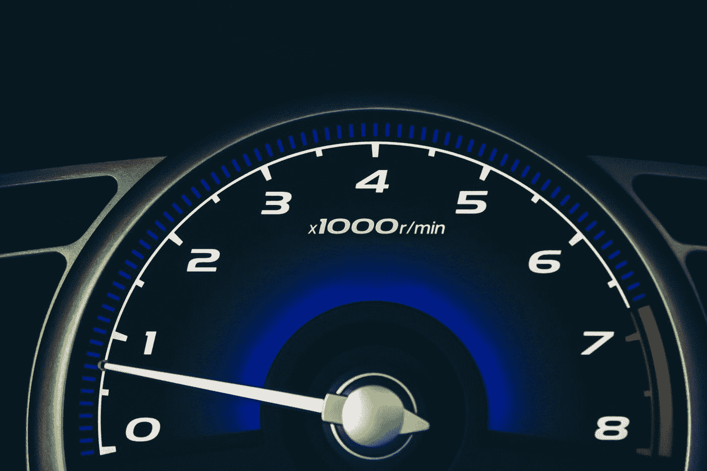

# 2021 年提升网站性能的 12 大诀窍

> 原文：<https://javascript.plainenglish.io/top-12-tricks-to-boost-site-performance-in-2021-8626d52ee985?source=collection_archive---------29----------------------->

## 稳扎稳打并不总能赢得比赛。说到防止反弹率， ***速度就是答案！***

Photo by [Shuaib Khokhar](https://unsplash.com/@shuaibk?utm_source=medium&utm_medium=referral) on [Unsplash](https://unsplash.com?utm_source=medium&utm_medium=referral)

**让我们进入正题:**

# 1.减少主线程工作

因为 JavaScript 是单线程的——主线程基本上是浏览器内部的一个焦点，它包括诸如**调用栈、浏览器 API(**`setTimeout`、`Promise`、`AJAX`等。)和不同的**队列**。主线程执行使网站运行的所有操作，例如:

*   解析 HTML。
*   执行脚本和用户事件。
*   样式和布局应用程序。
*   垃圾收集等。

*成功执行以下步骤将有助于完成这一关键步骤。*

# 2.缩小你的代码

这样做将减轻您的文件大小，并使您更容易将代码打包用于生产。缩小你的 HTML，CSS，JavaScript 的生产版本，肯定会帮助你提高网站的性能，因为现在解析器花更少的时间解析过去的空格和换行符。

***文件越轻，加载越快！***

# 3.推迟您的脚本文件

将`defer`属性放在**脚本**标签上，如下所示:

`<script src='something.js' defer>`将真正地*推迟*这些脚本文件的加载，直到解析器完成 DOM 树的构建，以防止**关键渲染路径**出现瓶颈。这将改善用户的感知加载时间，并将改善被称为**第一个内容丰富的油漆** (FCP)。

# 4.移除未使用的和注释的代码

未使用的代码就像一个空袋子，希望有一天会用到它。*最终会开始对性能产生影响！当测量网站速度时，尽可能保持你的代码整洁和优化。删除任何不必要的和注释掉的代码——这为解析器删除了额外的工作。*节省大量时间。**

# 5.使用下一代图像格式

**SVG** 、 **JPEG-2000** 、 **JPEG-XR** 和 **WebP** 就是很好的例子。与常规的 JPEG 和 PNG 相比，它们提供的主要好处是强大的元数据剥离和改进的图像质量。

# 6.延迟加载图像和部分

这是一个广泛使用的技巧，只加载当前视窗中的内容，而不是一次加载整个页面的图像和部分。这样做会提高**First Contentful Paint**(FCP)&**First mean inful Paint**(FMP)，从而加快你的站点速度&改善用户体验。

# 7.图像的显式宽度和高度

为你的图像设置明确的尺寸通常不是你的第一直觉——因为你知道，CSS 和所有。然而，这样做可以减少所谓的**布局偏移**。

发生这种情况的原因之一是——当浏览器还没有*加载或完全加载样式表时。解析 HTML 文件时加载的图像最初没有设置尺寸，但是几毫秒后解析样式表时——也就是实际应用样式时。**设置显式维度会告诉你的浏览器——“嘿，这个图片是某某维度，所以适当加载”。***

# 8.设置高效的缓存策略

HTTP 缓存非常值得努力，因为适当的缓存可以为回头客提供很好的用户体验。服务器可以告诉浏览器应该将输入的资源存储多长时间*(图像、字体、媒体文件、脚本和样式表)。*对于初始请求之后的所有请求，浏览器将使用其本地副本，而不是发出网络请求。

***这样做的缺点是用户看不到 UI 的任何更新。***

# 9.管理请求链

**关键请求链**是浏览器优先获取的资源列表——如字体、样式表和供应商库(如 jQuery)。

减少请求的数量和/或通过仅在执行某个用户操作时提取来优化请求，是缩短加载时间的一个很好的解决方案！

# 10.适当大小的图像

你不会想为你的徽标加载一个 3000x1500 像素的图像吧？合理选择图像大小将有助于控制文件大小。像图像格式、延迟加载和进一步图像压缩这样的进一步优化可以提高图像质量，从而改善文件大小。

# 11.压缩您的文件

使用 G-Zip 这样的工具——它基本上压缩你的 HTML、CSS 和 JavaScript 文件，去掉多余的元数据。这将减少文件大小！

# 12.经常审计你的网站

使用 Google Lighthouse、PageSpeed Insights 和 GT-Metrix 等工具。这些工具将审计你的移动和桌面网站— ***移动是这里的关键词，因为 2020 年所有网站访问量的 68.1%来自移动设备(*** [***根据 perficient.com***](https://www.perficient.com/insights/research-hub/mobile-vs-desktop-usage#:~:text=Globally%2C%2068.1%25%20of%20all%20website,increase%20from%2063.3%25%20in%202019.)***)。***

# 13.使用好的虚拟主机服务

在工作中使用正确的工具对成功至关重要。拥有负担得起的、可扩展的、在你需要的时候提供帮助的虚拟主机将会为你节省金钱、时间和很多麻烦。相信我。

**阅读本文**了解如何使用名为 BlueHost 的虚拟主机公司托管您的网站:

 [## 如何在几分钟内托管自己的网站

### 自由职业者、小企业或非盈利业主的快速分步指南。

javascript.plainenglish.io](/how-to-host-your-own-website-in-just-minutes-f8d76109765a) 

# **结论**

你的网站越快，越多的人愿意与之互动。简单明了。使用上面提到的这些技巧来… *实现技巧*并增加转化率、用户停留时间和用户互动性！

祝你好运！

如果你有任何问题，请随时给我发信息。

***(* ***)披露:*** *本文包含附属链接，我可能会从 BlueHost 获得少量佣金，如果您选择通过我的链接购买，无需额外费用)**。*

# **资源:**

***次世代图片:***
[https://web.dev/uses-webp-images/](https://web.dev/uses-webp-images/)

***累积布局移位:***
[https://web.dev/optimize-cls/?utm_source=lighthouse&UTM _ medium = devtools # images-without-dimensions](https://web.dev/optimize-cls/?utm_source=lighthouse&utm_medium=devtools#images-without-dimensions)

***最小化主线程工作***
[https://web.dev/mainthread-work-breakdown/?UTM _ source = light house&UTM _ medium = devtools](https://web.dev/mainthread-work-breakdown/?utm_source=lighthouse&utm_medium=devtools)

***浏览器缓存***
https://web.dev/uses-long-cache-ttl/?utm_source=lighthouse&UTM _ medium = devtools

***移动 Vs 桌面***
[https://www . perficient . com/insights/research-hub/Mobile-vs-Desktop-usage #:~:text = Globally % 2C % 2068.1% 25% 20 of % 20 all % 20 网站，从% 2063.3% 25% 20 in % 2019](https://www.perficient.com/insights/research-hub/mobile-vs-desktop-usage#:~:text=Globally%2C%2068.1%25%20of%20all%20website,increase%20from%2063.3%25%20in%202019)。

*更多内容看* [***说白了. io***](http://plainenglish.io)