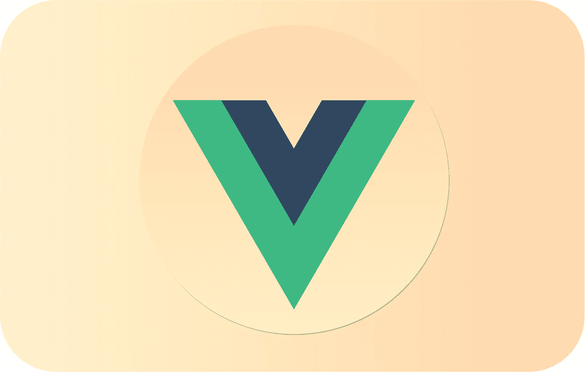

# 前 15 名 Vue.js 动画库

> 原文：<https://javascript.plainenglish.io/top-15-vue-js-animation-libraries-e173fdefb49b?source=collection_archive---------3----------------------->

对 Vue.js 开发人员有用的库

## [**1。vue 2-animate**](https://www.npmjs.com/package/vue2-animate)

一个可以在你的网站上使用的现成的跨浏览器动画库，它非常适合于**主页**、**滑块**和**注意指南**提示。这是 *Animate.css* 的一个端口，用于 Vue.js 2.0/3.0 和 *Alpines.js* 中的转场。虽然文档没有达到标准，但是有前端开发经验的开发人员会发现使用它很容易。

*   使用方便
*   反应灵敏的维护者

***安装:***

> NPM I vue 2-动画

## [②**。**](https://www.npmjs.com/package/vue-kinesis)

这是一个功能强大的动画工具，开发者可以用它来制作出色的动画。它还允许使用各种自定义属性来帮助实现所需的效果。

*   使用方便
*   出色的文档

***安装:***

> npm i vue-kinesis

## [**3。ts 粒子**](https://www.npmjs.com/package/tsparticles)

一个易于使用的轻量级库，可用于制作应用于网站背景的粒子动画。React、 **Vue.js (2.x 和 3.x)** 、Angular、Svelte、jQuery、Preact、Inferno 都有现成的组件。

*   使用方便
*   出色的文档
*   高度可定制

***安装:***

> 粒子

## [**4。v-编号**](https://www.npmjs.com/package/v-number)

v-number 是一个 Vue.js 组件，用于应用平滑的垂直数字过渡效果，这是一个非常平滑和轻量级的库，建议用于需要在较短时间内构建的个人前端项目。

*   使用方便
*   可定制的
*   光滑的

***安装:***

> npm 识别号

## [5**。vue-prlx**](https://www.npmjs.com/package/vue-prlx)

Vue-Prlx 是一个 *Vue.js* 视差指令，它将可定制的视差滚动效果应用到应用程序中的图像，它可以动画平移和背景位置。

*   可定制的
*   强烈推荐个人项目。

***安装:***

> npm i vue-prlx

## [6**。vue-典型**](https://www.npmjs.com/package/vue-typical)

这是一个非常简单小巧的 Vue.js 组件，用于 Vue.js 应用程序的动画输入，也用于 JavaScript 的 **~400 字节的动画输入。由于这个库是相当新的，并且每个月都有更新的版本发布，所以建议只使用这个库来尝试您个人项目中的新内容。**

*   轻量级选手

***安装:***

> NPM I vue-典型

## [**7。vue-collapse-transition**](https://www.npmjs.com/package/@ivanv/vue-collapse-transition)

您可以使用这个库来水平折叠元素*或垂直折叠元素*或*，自定义 Vue 转换&支持**固定**和**“自动”**宽度和高度。*

*   *平稳。*
*   *包装内置转场。*

****安装:****

> *NPM I @ ivanv/vue-折叠-过渡*

## *[**8。动画制作-** css](https://github.com/jofftiquez/v-animate-css)*

*这是最受欢迎和广泛使用的 Vue 动画库之一，它的最小化文件版本小到足以在移动网站上使用。*

*   *很好的文档。*
*   *最容易实现 Animate.css 的 Vue 指令。*

****安装:****

> *npm 安装 v-animate-CSS-保存*

## *[**9。vue 2-过渡**](https://www.npmjs.com/package/vue2-transitions)*

*Vue2-transitions 是一个优雅且可重用的组件转换，你可以在许多项目中重用它。您可以导入所需的过渡，并根据需要对其进行自定义。*

*   *使用方便*
*   *高度可定制*

****安装:****

> *NPM I vue 2-过渡*

## *[10**。**和](https://www.npmjs.com/package/vue-lottie)*

*一个伟大的 Vue 库，解析 Adobe After Effects 动画，并使用 Bodymovin 将它们导出到 **JSON** 并在本地播放。您可以轻松创建和提交漂亮的动画，而无需工程师手动重新创建。*

*   *简单易用*
*   *初学者友好。*

****安装:****

> *npm 我爱洛蒂*

## *[11**。vue-fake 3d-image-effect**](https://github.com/LuXDAmore/vue-fake3d-image-effect)*

*Fake3d 是一个 Vue.js 组件，可用于在 Vue.js 应用程序中创建交互式和 SSR 兼容的 3d 图像效果。*

*   *出色的文档*
*   *表演的*

****安装:****

> *npm 安装—保存@ luxdamore/vue-fake 3d-image-effect*

## *[**12。粒子-BG-vue**](https://github.com/lindelof/particles-bg-vue)*

*另一个伟大的 Vue.js 动画组件，用于创建吸引人的背景。您可以通过改变不同的参数来实现各种效果。*

*   *易于使用，只需要几行代码。*
*   *易于定制。*

****安装:****

> *npm 安装-保存粒子-bg-vue*

## *[**13。视频动画滚动**](https://www.npmjs.com/package/vue-animate-onscroll)*

*易于使用的库，当你需要为你的网站添加一些附件时会很方便。使用这个 vue.js 组件，您可以创建这样的元素，当您在元素上滚动时，动画首先被触发。*

*   *使用方便*
*   *小的*

****安装:****

> *NPM I vue-animate-on croll*

## *[14**。v-show-slide**](https://www.npmjs.com/package/v-show-slide)*

*v-show-slide 是一个 Vue.js 组件，通过可配置的上下滑动动画来显示/隐藏元素。没有 CSS 方法将元素设置为或从**高度:自动**，这个 Vue.js 指令解决了这个问题。*

*   *小。*
*   *很好的文档。*

****安装:****

> *NPM I v-show-幻灯片*

## *[**15。vue-glitch**](https://www.npmjs.com/package/vue-glitch)*

*风格偏好可以非常不同，使用 Vue 可以非常容易地给你的元素一个独特的外观。Vue Glitch 用作 Vue 的指令，可用于将毛刺效果应用于任何类型的文本。*

*   *很好的文档。*
*   *好用。*

****安装:****

> *npm i vue 故障*

* [## 渐进式网络应用(PWAs)的 9 个最佳实践

### 构建突出的 pwa

javascript.plainenglish.io](/9-best-practices-for-pwas-332be833f5fc)  [## 作为开发人员，您应该知道的 11 个 VS 代码特性和技巧

### 对 VS 代码更加自信

javascript.plainenglish.io](/11-vs-code-features-tricks-you-should-know-as-a-developer-47e5ec0c362b)  [## Web 应用程序的 6 种前端优化技术

### 构建极快的 Web 应用程序

javascript.plainenglish.io](/6-front-end-optimization-techniques-for-web-applications-6bcde2c42905) 

*更多内容请看*[*plain English . io*](http://plainenglish.io/)*