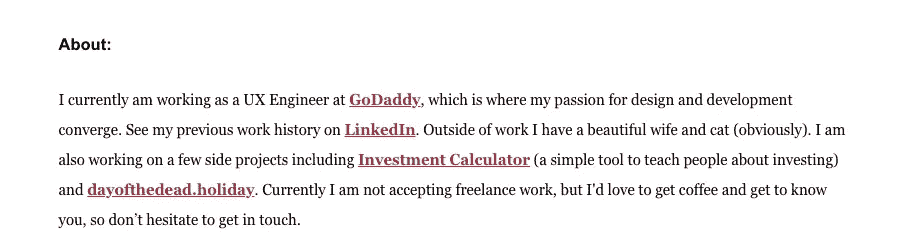
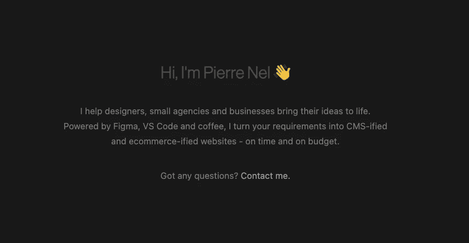
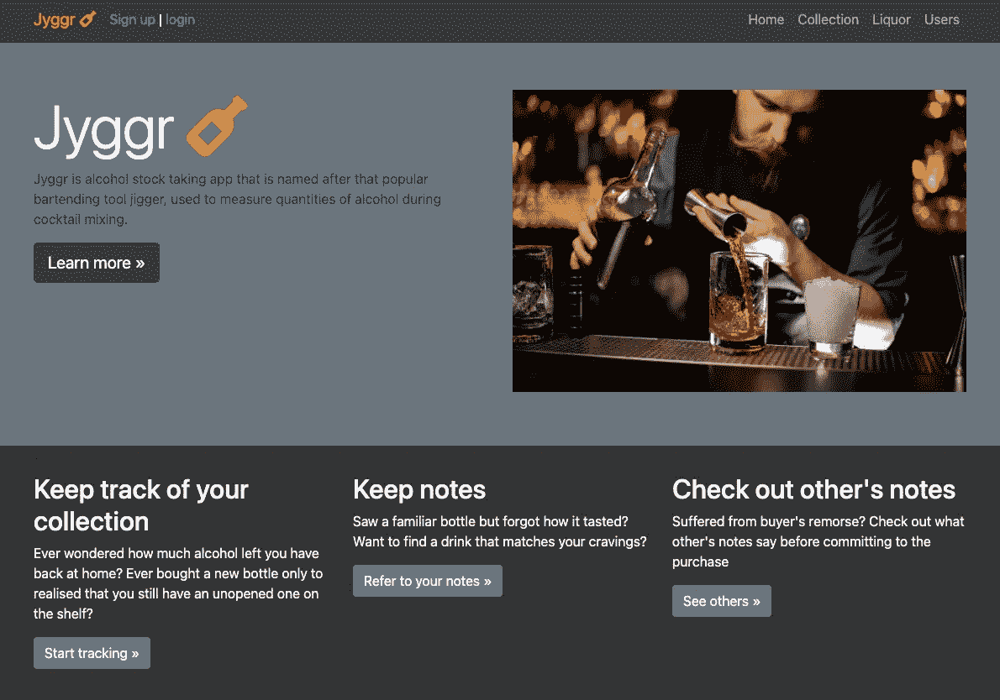
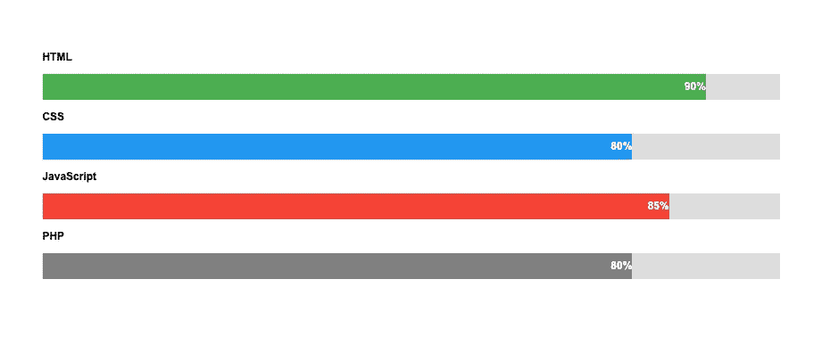
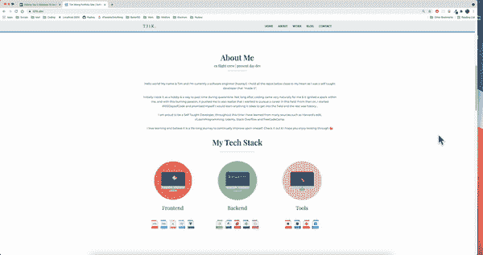

# 在建立投资组合网站时，不要再犯这 4 个错误了

> 原文：<https://javascript.plainenglish.io/top-4-mistakes-to-avoid-when-building-a-portfolio-site-57aab6572353?source=collection_archive---------5----------------------->

你好，我的朋友们，首先请允许我感谢大家对我之前的帖子的热烈回应。当我醒来看到这些数字时，我感到震惊。

感谢我的新老粉丝和我一起踏上这个旅程。一年前，我处于半失业状态，对编程一无所知，但一年后，我在这里与他人分享我如何成为程序员的技巧。😮

尽管如此，我在这些文章上投入了大量的精力和时间，因为我的目标是创作出让我*真正*自豪的高质量内容。我希望与那些可能有类似经历的人分享，希望他们在不久的将来也能获得成功。

现在，由于之前的帖子，我也收到了几封 DM 和电子邮件，人们要求我就上周的主题写更多的东西&所以我会的。

正如我上周提到的，作品集网站是任何优秀求职申请的*和*基石，但不知何故很难找到好的“参考”范例(出于某种奇怪的原因)。

即使通过谷歌搜索，大多数投资组合网站也很难找到，出现的网站似乎也不怎么样。因此，许多人在不知不觉中犯了几个危险信号错误，所以今天我来帮你消除其中一些错误，让我们开始吧！

# 1.关于页面的无聊

首先，当潜在雇主访问你的页面时，他们可能会浏览你的工作，了解你对 x 或 y 技术了解多少，以及你在这个行业工作了多长时间，但最终他们想了解你。

如果他们只是想建立一个 web 应用程序，他们可以轻松地雇佣一名开发人员进行 3-6 个月的升级工作。相反，他们想找一个能与他们目前的团队很好地协同合作，与他们的公司文化无缝结合的人&生产一个包含他们品牌身份的产品。好的公司不只是雇人做工作，他们会找到合适的人和他们一起踏上漫漫征途。

这里有两个很好的例子:

1️⃣[*https://Ben Adam . me*](https://benadam.me)

*courtesy of Benjamin from* [*https://benadam.me*](https://benadam.me)

> 🐟**我目前在 GoDaddy 担任 UX 工程师**
> 
> 🪝简短而甜蜜的介绍
> 
> 🐟**我对设计和开发的热情汇聚于此**
> 
> 🪝的两大优势一艘班轮
> 
> 🐟**包括投资计算器在内的少数项目**
> 
> 🪝是一个真正有激情的开发人员，他做自己的外部项目

2️⃣[t19】https://pierre . iot21】](https://pierre.io)

*courtesy of Pierre from* [*https://pierre.io*](https://pierre.io)

> 🐟我帮助设计师、小机构和企业将他们的想法变成现实
> 
> 🪝同样，简短而甜蜜的一句俏皮话
> 
> 🐟由 Figma 提供支持，VS Code 和 coffee …CMS 认证
> 
> 🪝简要概述了他的最高技能
> 
> 🐟**按时按预算**
> 
> 🪝shows:他完成了工作
> 
> **🐟有什么问题吗？联系我**
> 
> 🪝很好地放置了 CTA，它高度鼓励用户想要连接

我用了🐟还有🪝表情符号，因为这正是它应该有的样子，把它们卷起来，让它们*被你富有感染力的个性和令人向往的技能*所吸引。

还要注意这两个例子都没有漫谈他们的生活故事，而是保持简短&甜蜜、直截了当、直奔主题，你也应该这样做！

> 简单点，傻瓜！
> 
> 保持简洁明了！
> 
> [1960 年美国海军记录的设计原则](https://en.wikipedia.org/wiki/KISS_principle)

# 2.忽视次要项目

接下来，我之前已经在很多账户上提到过这一点，但是副业应该是你的**主要吸引力**。当谈到淘汰候选人是在一个公平的竞争环境，副业进来作为宝贵的印象分，可能会很好地推动你对你的竞争对手前进。

然而，许多人似乎忽视了他们的副业，而是强调他们的学术成就和教育证书。虽然两者都很重要，但《一个有价值的副业》却相反地描绘了:

✅是一个充满激情、渴望学习的候选人。

✅是一个真正热爱编程的候选人。

✅是一个能够真正超越并解决问题的候选人。

这些品质备受追捧，因为从长远来看，是内心的渴望和活力造就了高质量的最终产品，当然也让招聘决定更倾向于“是”。

话虽如此，除了列出你的副业。展示你的副业的一个更好的方法是详细描述它们。理想情况下，它应该包含您的:

> 🔥解决问题的愿望
> 
> 适用技术和工具的🛠决策
> 
> 💎受时间和资源限制的决策
> 
> 💪坚持不懈地完成项目

许多初学者在看到其他开发者的作品集包含复杂的算法密码散列器或完整的 Spotify 克隆时会感到害怕。但是不要担心，最有价值的副业是那些合理地帮助你解决日常生活中遇到的现实问题的副业。。

以下是一些例子:

1️⃣·凯文是一个酒精爱好者和葡萄酒鉴赏家。当然，混合杜松子酒或螺丝刀很简单，但当你混合复杂的鸡尾酒时，你往往会忘记组合的英格玛变化。当你想记录哪些瓶子被打开了，你还剩多少某种酒时，这也变得令人沮丧。

为了解决这个问题，他创建了一个完整的应用程序来跟踪打开的瓶子和他收集的大师级的混合物。虽然简单，但它实际上解决了他每天(或者每周，我猜)面临的一个问题😝).

courtesy of my friend Kevin

2️⃣:在我进入科技行业之前，我作为一名机组人员环游了世界。很多时候，当我们旅行时，我们会位于偏远地区，这意味着我们被剥夺了去餐馆、超市甚至有时去文明世界的便利。

courtesy of me

正因为如此，我制作了这个应用程序来记录酒店的提示和技巧。最近和最便宜的健身房在哪里，最有价值的客房服务餐，如何免费到达 VIP 游泳池。

当然，代码并不令人惊讶，用户界面也不怎么样，总的来说，它有一些小错误，但最终它表明我是一个*问题解决者*。程序员的主要特征不是他能生产出多少代码，而是解决问题的能力。

# 3.编程技能栏

如果你正在使用一个投资组合网站*，特别是针对开发者的*，你会发现他们中的很多都会包括这些风格的栏，列出你所拥有的技能。

在我看来，这是投资组合网站中的一个大的*危险信号*,主要是因为:

1️⃣这个数字**html 中的 90%和 JavaScript 中的 85%**从何而来？有一个微不足道的官方标准来计算一个人在某种编程语言中的技能百分比。在工具领域拥有丰富经验的高级开发人员不会声称自己掌握了 85%的 JavaScript，因为衡量一些不具体可见的东西是非常困难的。

此外，如果你看过一些 YouTube 教程，请避免使用某种编程语言。(我知道，我们很多人都为此感到内疚)。

相反，利用这个机会加入一些你有信心并且在个人/工作项目中广泛使用的语言。一个好的经验法则是，如果你有信心用那种语言解决一个编码问题，你就可以开始了。

> “多面手**很少**什么都擅长。把你所有的努力集中在一个明确的主要目标上。”
> 
> —拿破仑·希尔

2️⃣添加，如果你已经添加了一些酒吧编程技能的视觉表现。面试的时候你就像给自己挖了一个坟墓。这是因为如果你声称 JavaScript 有 90 分，面试官会高度重视你的技能，并根据他们对你的假设预先设定了预期。

他们会毫不犹豫地用高深的问题轰炸你，并期望你轻松地解决它们。本质上，你把自己放在一个基座上&让游戏对你来说更加困难。

# 4.非移动响应

在移动优先网站的时代，许多开发者仍然忽视为他们的组合网站编写定制的媒体查询。你可能会问，为什么这很重要？

有两个主要原因，或者更确切地说是两群人会浏览你的投资组合网站，因为他们的电子邮件客户端有另一个标签，关于他们是否应该回复人力资源部**是**还是**否**

这两类人包括:

1️⃣人(包括我)会这样做(调整他们的浏览器):

don’t lose your site to silly devices’ viewport widths

2️⃣人会这样做:

重点是:让你的作品集网站移动化和平板电脑化几乎不利于确保流畅的用户浏览体验。

让那些 CSS 开始运行，不要犯这个新手的错误。

成功响应的简单方法:

> 1.从“移动优先方法”开始开发
> 
> 2.为更大的分辨率添加媒体查询。
> 
> 3.如果媒体查询失败，至少移动网站在大显示屏上看起来还不错。
> 
> 4.使用[浏览器堆栈](https://www.browserstack.com/)在不同设备上测试你的网站

[🔗WevDevSimplified](https://www.youtube.com/watch?v=yU7jJ3NbPdA&ab_channel=WebDevSimplified) 和 [Travesy Media](https://www.youtube.com/watch?v=p0bGHP-PXD4&ab_channel=TraversyMedia) 都有这方面的精彩教程！

# 结论

这些提示不能保证你有一个完整的证明，一个适合所有投资组合的网站，但它肯定会有助于改善它，所以你在不断高需求但竞争激烈的开发人员就业市场中有更高的机会。

感谢您的阅读，下次我会再次抓住你。

[蒂姆](https://t31k.dev/blog)

[如果你喜欢我的内容并希望进一步支持我，请给我买一个☕️](https://buymeacoffee.com/t31k) 😃

[通过电子邮件获得通知](https://t31k.dev/newsletter)📧，当我再次在媒体上发布时

*更多内容看* [***说白了***](http://plainenglish.io)