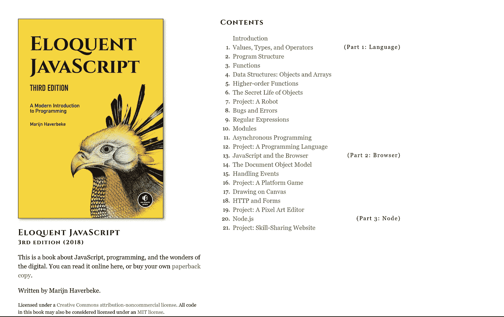
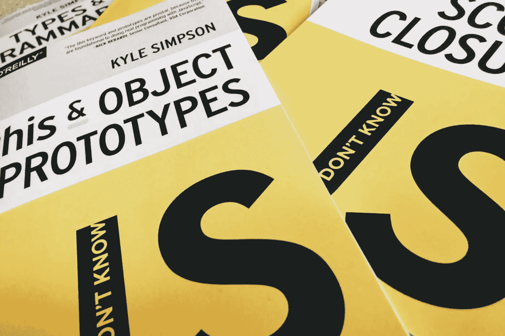
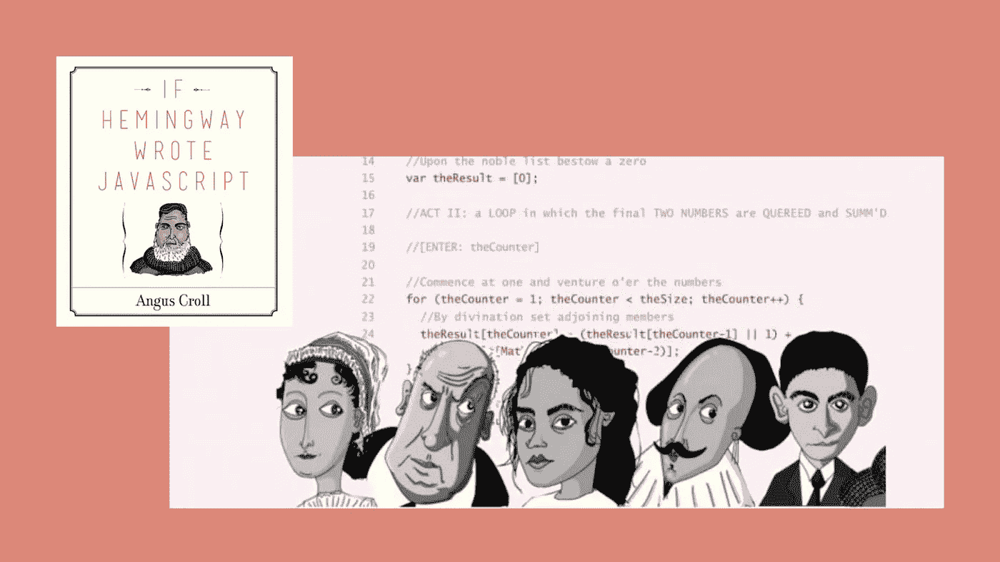
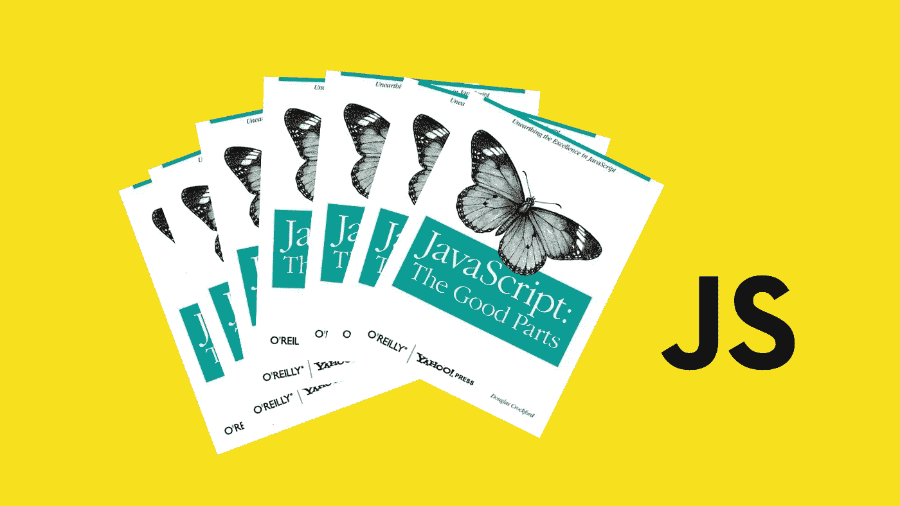

# 作为 JavaScript 开发人员应该阅读的前 5 本书

> 原文：<https://javascript.plainenglish.io/top-5-books-to-go-through-as-a-javascript-developer-d150ddc67ef4?source=collection_archive---------16----------------------->

## 从初学者到专家

Photo by [Adeolu Eletu](https://unsplash.com/@adeolueletu?utm_source=medium&utm_medium=referral) on [Unsplash](https://unsplash.com?utm_source=medium&utm_medium=referral)

如果你碰巧问为什么大多数人试图逃避 JavaScript，你会意识到他们可能没有学习它的好经历。我个人是这样理解的。问题是大多数初学者通常最终不喜欢这门语言，甚至没有给它一个公平的机会。为此，我将分享我认为有助于初学者顺利使用 JavaScript 的前 5 本书。这些书不仅适合初学者，也适合高级开发人员。查找一些你不一定理解的东西不会有什么坏处。让我们开始吧。

# 1.JavaScript 和 jQuery

Photo by [Adeolu Eletu](https://unsplash.com/@adeolueletu?utm_source=medium&utm_medium=referral) on [Unsplash](https://unsplash.com?utm_source=medium&utm_medium=referral)

我几乎想称之为经典，但它还没有老到足以成为经典，甚至是现代经典。我知道很多人都有这个。直到后来在我的旅程中，我才真正冒险读了它。我实际上使用了他的 HTML 和 CSS 书，真的很喜欢它们。我认为这是学习 JavaScript 的一个很好的起点。对于初学者来说，这本书里有很多概念。这本书的组织和布局使它在其他书中脱颖而出。我的意思是，它组织得很好，有很棒的代码片段，技术信息也很中肯。

我知道有些人不会同意这本书的 jQuery 部分，这没关系。每个人都有权发表自己的意见。请记住，如果您不想使用 jQuery，您并不一定要使用它。就这么简单。总而言之，学习 jQuery 仍然非常重要，因为企业和现实项目中的许多代码库都使用 jQuery。把它想象成 PHP。大多数人不使用它，但它仍然在许多代码库中使用。如果你是一名后端开发人员，并且你正试图对前端开发略知一二，我认为这也是一个不错的选择。我可以诚实地说，这本书是真正的新手友好。

# 2.Marijn Heverbeke 的雄辩 JavaScript 第三版

Photo by the Author

我相信这是最新的版本。使这本书脱颖而出的一些东西是项目和测试，或者在章节的结尾检查你的知识部分。他还研究了 Node 之类的东西。这是一本相当长的书，大约有 400 多页。它有很多很好的代码片段。这是一本更高级的书。我不会说它完全是新手友好的，也许是新手+。你可能想在约翰·达克特的书出版后看看这个。

# 3.凯尔·辛普森的《你不知道的 JS》系列

Photo by the Author

这本书包括上升和前进，范围和闭包，这个和对象原型，类型和语法，异步和性能，ESX 和其他。好消息是，这本书是一本相当短的书。它大概有七十多页。不要让篇幅的不足欺骗了你。他描述这些东西的方式，以及他将它们分成易于管理的大块的方式，是这本书和这个系列的一大卖点。

因此，尽管前两本书可能会很快让人不知所措，但你可以抓住这本书，直接进入 JavaScript 的基础知识。比如比较值，内置类型方法，什么是函数？什么是循环？它们是如何工作的？条件句有什么好理解的？如果您对 JavaScript 完全陌生，这将是您想要阅读的书籍之一。他还研究了其他东西，比如 ES6。

# 4.如果海明威写了安格斯·克罗尔的 JavaScript

Photo by the Author

这可能是我见过的最有创意的 JavaScript 书了。这个概念是，如果所有这些文学角色都承担编写 JavaScript 的任务，会发生什么。人们喜欢海明威、弗吉尼亚·沃尔夫、杰克·凯鲁亚克等。如果你不知道这些作者是谁，这可能会减少本书的乐趣，但你仍然可以看到一些语法。作者解释了不同的作者如何根据他对那个作者的了解来写一些语法。说实话，如果你不喜欢书或者古典文学，这可能会有点无聊。我只是想把它加入到这个列表中来迎合这样的人。至少，您可以看到不同的 JavaScript 编写方式。

# 5.JavaScript:道格拉斯·克洛克福特的精彩部分

Photo by the Author

我喜欢这本书的一点是，道格拉斯·克洛克福特不怕承认 JavaScript 有一些非常糟糕的部分。然而，在本书中，他去掉了那些不好的部分，并向您展示了好的部分，以及作为开发人员和问题解决者，您如何利用它们。这本书很旧了。当我们谈论 web 开发时，我甚至可以说是老古董。我是说，这是 2008 年的。但是，因为是基于 JavaScript 理论，所以这是 JavaScript 的核心，也是 JavaScript 之所以成为 JavaScript 的原因。它不会改变。核心永远不会变。这就是这本书的强大之处。Javascript 总是有文字。Javascript 总会有表达式。从他解释这些事情的方式，你可以看出他是一个非常好的作家，有点老派。这本书有很多流程图和代码片段，展示了 JavaScript 的优点。我喜欢把它看作是一种思想开放器，以防你对 JavaScript 感到沮丧。我明白 JavaScript 是一种非常令人沮丧的语言。它从来没有打算成为网络的主要语言，因为它在 Java 小程序失败后继承了网络。接下来是继承王国的钥匙。所以现在我们被它困住了。我们必须学习它，学习如何使用它，因为它不会很快就消失。

我并不是说这些书作为初学者的书是一成不变的，但是我相信你在阅读完它们之后会轻松得多。如果这些不适合你的学习风格，你可以使用其他的 JavaScript 书籍和视频。快乐编码。

*更多内容看*[***plain English . io***](http://plainenglish.io/)