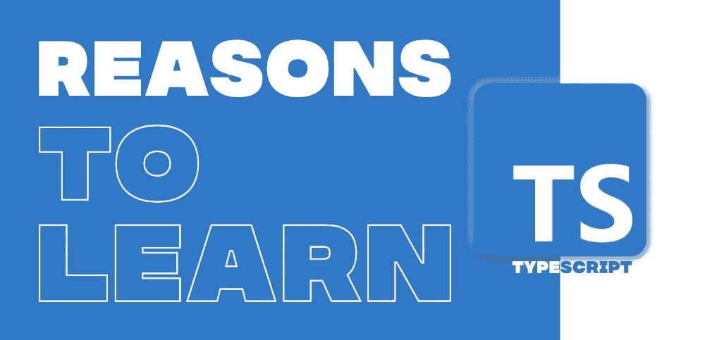

# 使用 TypeScript 的 5 个基本好处

> 原文：<https://javascript.plainenglish.io/top-5-essential-benefits-of-using-typescript-e55aa52038b4?source=collection_archive---------5----------------------->

TypeScript Benefits

本文将解释在我们的项目中使用 TypeScript 的好处。如果你对什么是 TypeScript 感到困惑，为什么我们已经有了可以满足我们所有需求的 JavaScript，还要使用它，让我们来详细看看。

# 什么是 TypeScript？

TypeScript 是一种由微软开发和维护的开源编程语言。它是为大规模应用程序的开发而设计的，TypeScript 和 JavaScript 之间最重要的区别是它们是两种不同的编程语言，尽管 TypeScript 在很大程度上基于 JavaScript。简单来说，人们习惯称之为 *TypeScript 是 JavaScript 的超集*这意味着所有用 JavaScript 编写的有效代码在 TypeScript 中也有效。

# 在项目中使用 TypeScript 的好处

## **类型安全**

众所周知， **JavaScript 没有类型。**所以很难控制我们使用的所有参数和变量，也很难验证它们。因为 **TypeScript 类似于 JavaScript，但是有类型。这有助于我们的代码更容易阅读，避免错误。**

## **未定义类型**

## **打字**

# 使用类和接口

## **类**

与 C#、Java 类似，C++ TypeScript 也允许我们在内部使用类。ts 文件。它完全支持 ES2015 中引入的 class 关键字。TypeScript 添加了类型批注和另一种语法，以允许您表达类和其他类型之间的关系。

班级成员:

向上述类添加成员

## **字段**

字段声明在类上创建一个公共的可写属性。

属性初始化:属性初始化设置控制类字段是否需要在构造函数中初始化。

## **无初始化**

## **带初始化**

# 连接

接口定义了任何实体都必须遵守的语法。接口定义属性、方法和事件，它们是接口的成员。

接口不能转换成 JavaScript。这只是 TypeScript 的一部分。如果你看到 TS Playground 工具的截屏，当你声明一个接口时，不像一个类，没有 JavaScript 发出。所以接口对运行时 JavaScript 没有任何影响。

## **接口的实现。ts 文件**

# IDE 支持

关于类型的信息使编辑器和集成开发环境(IDE)更有帮助。它们可以提供代码导航和自动完成等功能，提供准确的建议。您还可以在输入时获得反馈:编辑器会标记错误，包括一出现的与类型相关的错误。所有这些都有助于您编写可维护的代码，并显著提高生产率。

由于 Microsoft Visual Studio 是运行 TypeScript 的最流行和最自然的环境，它也受到许多其他 EDI 的支持，包括

*   [WebStorm](https://www.jetbrains.com/webstorm/) ，智能 JavaScript IDE
*   [Eclipse](https://www.eclipse.org/) ，提供 TS 开发插件的集成 IDE
*   [微软的轻量级跨平台编辑器 Visual Studio Code](https://code.visualstudio.com/)；
*   [Atom](https://atom.io/) ，跨平台文本编辑器；和
*   [CATS](https://github.com/jbaron/cats) ，一个开源的 TypeScript 开发环境。

# 未来的 EcmaScript (ES6)

TypeScript 是 ECMAScript 2015 的严格超集，ECMAScript 2015 本身是 ECMAScript 5 的超集，通常称为 JavaScript。因此，JavaScript 程序也是有效的类型脚本程序，类型脚本程序可以无缝地使用 JavaScript。transpiler 将基于 ES6 的代码转换成许多浏览器都支持的 ES5。TypeScript 是一个 transpiler。Grunt、Gulp 和 Babel 是其他一些编译模块的编译器。因此，TypeScript 支持 ES6。

# 跨平台和跨浏览器兼容性

每个运行 JavaScript 的设备、平台或浏览器都可以使用 TypeScript 在编译器将其翻译成普通 JS 之后。通常，支持 TypeScript 的 ide 和编辑器都带有内置的 TS 编译器(tsc)，可以从命令行调用。TS 允许通过将一个名为 **tsconfig.json** 的配置文件添加到正确的根目录，一次性转换部分代码库或整个应用程序。

## 结论

希望这篇文章能让你清楚地了解什么是 TypeScript 及其好处。继续学习！

*更多内容请看*[***plain English . io***](http://plainenglish.io)