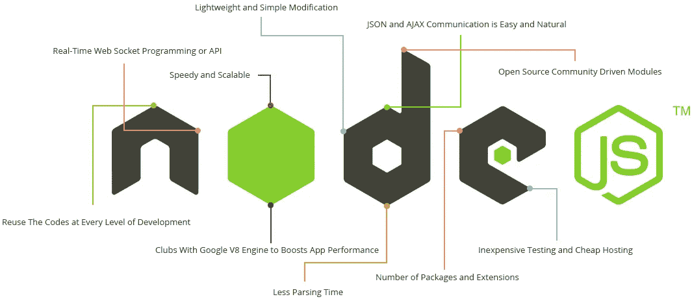

# 2022 年最热门的 5 种 NPM 封装和模块

> 原文：<https://javascript.plainenglish.io/top-5-hottest-node-js-libraries-to-use-in-2021-f4ef8bd99df4?source=collection_archive---------3----------------------->

NodeJS still leads as the number #1 Web, Cloud, Server, and API tool

2021 年底到了，这是多么美好的一年啊！今年 Node.js 和 NPM 发生了很多事情！随着对企业开发者的关注，我们已经看到许多公司改变了他们对使用 Node.js 的 NPM 包的看法。

在这篇综述中，我们将关注 2022 年 NPM 的顶级套餐，我们认为这些套餐在 2022 年仍然有分量。

下面这些模块/包(无论你想怎么称呼它们)都很热门，因为它们一直是最常用的，下载量(在 NPM 的统计中)也暗示了这一点。

2022 年最热门的 5 个 NPM 套餐是:

## 1.表达

Express 仍然是最受欢迎的 NPM 模块，并将继续保持下去。我不认为 2022 年会有所不同，随着越来越多的人从事网络开发，它的受欢迎程度肯定会继续增加。

## 2.有角的

Angular 仍然是顶级的 MVC JavaScript 框架，所以它在这个列表中是唯一正确的！从小型企业到大型合作企业，许多水疗中心都采用这种方式。显然，我们知道 React 已经走过了漫长的道路，就像 VueJS 和 SveltJS 这样的新手，但是顶级公司(特别是如果需要类型安全、与 OOP 和 MVC 架构的集成，比如与 C#或 Java、PHP 等。)然后团队更喜欢，更信任 Angular。

## 3.MongoDB

NoSQL 现在也在云中被大量使用，它也超级快速和健壮。我们坚信，到 2022 年，这仍将是 NoSQL 顶级数据库之一。

## 4.Socket.io

随着我们从 Web 2.0 迁移到 3.0，更多的应用将需要实时功能。这将是 Socket.io 仍然是 Node.js 顶级实时通信 API 的一个重要原因。这不是必须的，但是需要更多实时功能的应用程序将使用 Socket.io 或类似的工具。

## 5.网络包

对于 React 开发者来说，Webpack 是一个很棒的东西！许多开发人员仍然没有真正了解它，但这是它在 2022 年仍然是顶级竞争者的一个原因——因为那些真正了解 Webpack 并对其进行调整以释放其全部潜力的人！当你使用 Webpack 时，你可以开发得更快，构建更强大的应用程序，并且轻量级，因为你将只使用与你的构建相关的核心部分。

## 亚军:

6. **React** —一个 UI JavaScript 库，用于构建干净快速的 UI。

7.**巴贝尔** —前端捆扎机。

4.**获取** —一个小型的跨浏览器的 URL 获取库。

5.**Slacker**—node . js 的超简单 SPA 框架。

一年后你最喜欢的 NPM 模块是什么？

*更多内容看* [***说白了. io***](http://plainenglish.io/) ***。*** *报名参加我们的**[***免费每周简讯这里***](http://newsletter.plainenglish.io/) ***。****

*________________________*

*想了解 Meta 和元宇宙吗？参见我们的新网站*