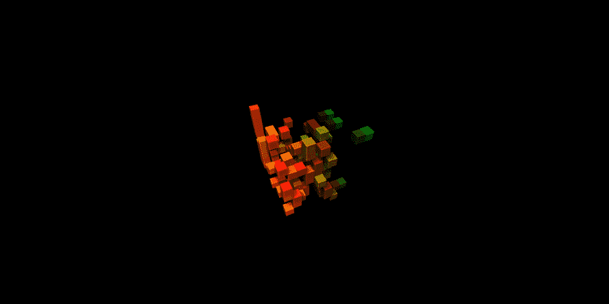

# 下一个项目的前 5 个 JavaScript 动画库

> 原文：<https://javascript.plainenglish.io/top-5-javascript-animation-libraries-for-your-next-project-580d47827f03?source=collection_archive---------2----------------------->

## 在你的下一个动画项目中使用的最佳 JavaScript 库

Gif by UpLabs

动画有助于改善网站的整体感觉和触感。如果实施得当，它们会提供良好的用户友好体验。另一方面，你可以很容易地通过动画抓住你的访问者的注意力。

可能有很多 JavaScript 库，我们可以利用它们在网络上构建令人印象深刻的动画。在本文中，我们将看看前五名最好的 JavaScript 动画库。

## **1。Anime.js**

Screenshot by Author

js 是一个轻量级的 JavaScript 动画库，有一个简单而强大的 API。它可以处理 CSS 属性、SVG、DOM 属性和 JavaScript 对象。

Anime.js 可以说是最好的动画库之一。从他们的网站登陆页面，你可以感受到它所提供的美丽动画的力量。

你可以通过这个 [***链接***](https://animejs.com) 访问他们的网站，他们有惊人的文档让你开始制作美丽的动画。

## **2。GSAP**

Screenshot by Author

GSAP 也是一个了不起的图书馆。现代网络的专业级 JavaScript 动画。GSAP 也为你的网站提供了一些疯狂而美丽的动画。

你可以在这里查看他们的网站 [***。***](https://greensock.com/gsap/)

## **3。Velocity.js**

Screenshot by Author

Velocity 是一个动画引擎，其 API 与 jQuery 的$相同。动画()。不管有没有 jQuery，它都可以工作。这是令人难以置信的快，它的特点是彩色动画，变换，循环，季节，SVG 支持和滚动。它是 jQuery 和 CSS 转换的最佳组合。

Velocity 还提供了一些很好的兼容性，尤其是与旧浏览器的兼容性。Velocity.js 也有令人惊叹的文档和令人惊叹的社区来帮助您。

你可以在这里查看他们的文档 [***。***](http://velocityjs.org/)

## **4。三个 j**

Screenshot by Author

Three.js 是一个跨浏览器 JavaScript 库和应用程序编程接口，用于使用 WebGL 在 web 浏览器中创建和显示动画 3D 计算机图形。

Three.js 使得在浏览器中显示复杂的 3D 计算机动画变得更加容易，而不需要传统的独立应用程序或插件。

你可以在这里查看 threejs [***。***](https://threejs.org/)

## **5。MO.js**

Screenshot by Author

Mo.js 是一个 JavaScript 运动图形库，是一个快速的、视网膜就绪的、模块化的开源库。与其他库相比，它有不同的语法和代码动画结构方法。声明式 API 为您提供了对动画的完全控制，使您可以轻松定制动画。

该库提供了内置组件，可以从头开始制作 HTML、shape、swirl、burst 和 stagger 等动画，而且还为您带来了帮助您最自然地制作动画的工具。在你的网站上使用 Mo.js 将增强用户体验，丰富你的视觉内容，并精确地创建令人愉快的动画。

Mo.js 也有广泛的社区。点击这里查看他们的链接 [***。***](https://github.com/mojs/mojs)

## **结论**

在你的网站中加入动画可以改善用户体验，并为你的网站提供一个漂亮的外观。

感谢您花时间阅读这篇文章。

## **更多阅读内容**

 [## 让你成为更好的远程开发者的 3 个重要技能

### 我自己远程工作的经历

javascript.plainenglish.io](/3-important-skills-to-make-you-a-better-remote-developer-3921d1f1b252)  [## 这就是为什么你不应该回避算法和数据结构

### 有些人倾向于回避算法和数据结构；不要成为那样的人。

javascript.plainenglish.io](/this-is-why-you-shouldnt-shy-off-from-algorithms-and-data-structures-95d335bb110b) 

*更多内容请看*[***plain English . io***](http://plainenglish.io)