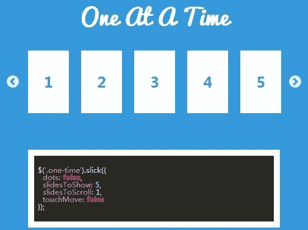
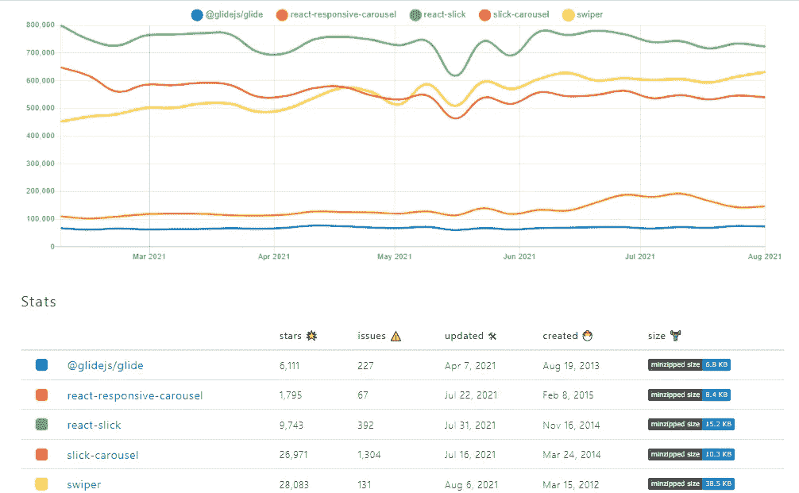

# 前 5 名 JavaScript Carousel 库

> 原文：<https://javascript.plainenglish.io/top-5-javascript-carousel-libraries-ef51375aba2d?source=collection_archive---------5----------------------->

## 为你的网站推荐轮播库。


实现一个吸引人的、响应迅速的轮播不是一件容易的事情。但是，如果你知道正确的方法，你可以使它变得容易得多。

因此，在本文中，我将介绍 5 个用于 React 特性比较的旋转图表库，以帮助您为下一个项目选择最佳的一个。

# 1.滑行/滑行


> 一个独立的 JavaScript ES6 滑块和转盘。

Glide.js 是一个简单、轻量级、面向多个方向的 jQuery carousel。不同技能水平的开发人员可以在他们的项目中添加简单而强大的滑块。

Glide.js 提供了大量的设置，可以用来创建任何你能想到的滑块。

> GliderJS 拥有超过 76K 的每周 NPM 下载量和 6K GitHub stars

## 装置

```
$ npm install @glidejs/glide
```

## 特征

*   用普通的 JS 构建。
*   轻量级—gzip 后 2.8kb。
*   极快—25 毫秒初始化时间。
*   完全可定制的箭头，点导航，鼠标拖动，键盘辅助功能。

# 2.反应-响应-旋转木马


> 强大、轻量级、完全可定制的轮播组件

React-response carousel 是 React 项目的一个 carousel 组件。它是强大的，轻量级的，完全可定制的。

此外，它是移动友好的，与 SSR 一起工作，并有自定义动画和布局。该组件可以显示图像、视频、文本或任何其他类型的材料。

## 装置

```
$ npm install react-responsive-carousel --save
```

> 它拥有超过 145，000 的每周 NPM 下载量和 2，000 颗 GitHub 星。

## 特征

*   移动友好，支持刷卡动作。
*   支持服务器端呈现。
*   支持键盘导航。
*   使用自定义间隔自动播放。
*   高度可定制的拇指、箭头、指示器和状态。

# 3.光滑的旋转木马



> 完全响应灵活的 jQuery Carousel。

Slick 是一个全新的 jQuery 插件，允许您使用任何 HTML 组件创建完全可配置的、响应迅速的、移动友好的传送带/滑块。

## 装置

```
$ npm install slick-carousel
```

> 它拥有超过 546K 的每周 NPM 下载量和 27K GitHub stars

## 特征

*   完全响应。
*   如果可用，使用 CSS3。
*   如果您愿意，可以启用或禁用刷卡。
*   无限循环。
*   自动播放。

# 4.反应圆滑


> 你需要的最后一个反应转盘。

React slick 是一个基于 React 的转盘组件。Slick 是市场上最受欢迎的 jQuery 传送带之一，它的 react 版本也受到了同样多的关注。

它有一个灵敏的设计，允许水平和垂直滚动。此外，无限循环、自动滑动、延迟加载和一系列其他选项都是可访问的。

## 装置

```
$ npm install react-slick --save
```

> 它有超过 735K 的每周 NPM 下载和 10K GitHub 星

## 特征

*   完全响应。
*   易于定制。
*   水平和垂直滑动。
*   桌面鼠标拖动。
*   无限循环。
*   箭头键导航。

# 5.Swiper


> Swiper 是一个免费的移动触摸滑块，具有硬件加速过渡和令人难以置信的本机行为。

它专为移动网站、移动 web 应用程序和原生/混合移动应用程序而设计。Swiper 并不与所有平台兼容；这是一款专为现代应用和平台设计的现代触摸滑块，旨在提供最佳体验和简单性。

## 装置

```
$ npm i swiper
```

> 它拥有超过 618K 的每周 NPM 下载量和 28K GitHub stars

## 特征

*   不可知的图书馆。
*   完全导航控制。
*   双向控制。
*   过渡效果。
*   Flexbox 布局。
*   多行幻灯片布局。

# 结论

上面的 Carousel 库只是 React 可用库的一个子集。然而，我展示了 5 个精选的库以及它们的优缺点。你可以在下面的图表中找到他们在 GitHub 上的受欢迎程度。



我希望我的建议能帮助你为你的网站选择最好的转盘库。

感谢您的阅读！

*更多内容看*[***plain English . io***](http://plainenglish.io/)