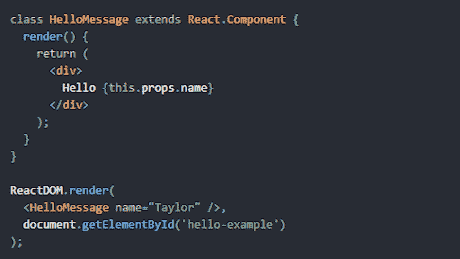
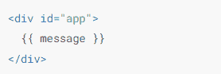
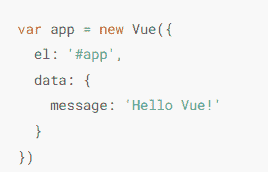
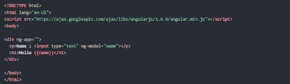
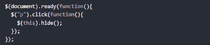

# 前 5 名 JavaScript 框架

> 原文：<https://javascript.plainenglish.io/top-5-javascript-framework-cff0ed2371a7?source=collection_archive---------7----------------------->

## **在这篇文章中，**我们将告诉你排名前五的 javascript 框架，以及这些框架按照 **StackOverflow** 的顺序排列。

Photo by [James Harrison](https://unsplash.com/@jstrippa?utm_source=medium&utm_medium=referral) on [Unsplash](https://unsplash.com?utm_source=medium&utm_medium=referral)

## **1。React.js**

React.js 是一个令人惊叹的开源前端 javascript 框架。通过使用 React.js，我们可以构建**可重用的**组件。React.js 是一个**高效**和**灵活**的库，用于构建令人惊叹的 **UI(用户界面)。**

React.js 是由**乔丹·沃克**创建的，他是**脸书**的软件工程师。它于 2011 年开发，但在 2013 年向公众发布。

**为什么 React.js 是最流行的框架？**在市场上，许多 javascript 框架构建了单页面应用程序，但 React 在所有这些应用程序中都是不同的，因为它使用虚拟 DOM。React 受欢迎有许多原因，但这个原因足以说明。根据 StackOverflow 的统计，React.js 开发者的平均年收入为 58128 美元(T21)。

现在，大多数大公司都在他们的网站上使用 React.js。使用过 React.js 的公司列表:

*   照片墙
*   脸谱网
*   拼趣
*   网飞
*   购物化
*   优步
*   亚马孙

## **2。Vue.js**

Vue.js 是一个开源的渐进式框架。使用 Vue.js，我们可以构建一个单页面应用程序和交互式用户界面。在 **MEVN** 开发中 Vue.js 主要集中在应用工具的视图部分，Vue.js 用于 **MEVN** 开发中的前端。

Vue.js 由来自**中国**的**尤雨溪**创建，最初于 2014 年 2 月发布。它是用打字稿写的。根据 StackOverflow serve 的数据，Vue.js 开发人员平均年收入为 5 万美元。

现在，大多数大公司都在他们的网站上使用 Vue.js。使用过 Vue.js 的公司列表:

*   脸谱网
*   网飞
*   砖坯黏土
*   语法上
*   德国宝马汽车公司(Bavarian Motor Works)
*   苹果
*   谷歌

## **3。Angular.js**

Angular.js 是一个基于 TypeScript 的开源前端框架，使用它你可以很容易地创建一个单页交互式 web 应用程序。Angular.js 完全基于组件树。

Angular.js 是由 Misko Hevery 创建的。Misko Hevery 是谷歌的一名开发人员。根据 StackOverflow 的调查，Angular.js 开发者的平均年收入为 49450 美元。

现在，大多数大公司都在他们的网站上使用 Angular.js。使用过 Angular.js 的公司列表:

*   微软办公
*   福布斯（美国出版及媒体集团）
*   德意志银行
*   搅拌器
*   贝宝
*   桑坦德
*   谷歌邮箱
*   向上工作

**4。Express.js**

Express.js 是一个 Node.js 框架，用于开发基于 web 的应用程序和基于移动的应用程序。它是全栈开发的重要组成部分，如 MERN 栈、MEAN 栈和 MEVN 栈。使用 Express.js 我们可以增强我们的后端。

Express.js 由 StrongLoop 创建，最初于 2010 年 12 月 16 日发布。根据 StackOverflow 的调查，Express.js 的开发者平均年收入为 47，850 美元。

现在，大多数大公司都在他们的网站上使用 Express.js。使用过 Express.js 的公司列表:

*   网飞
*   美国国家航空航天局
*   商务化人际关系网
*   优步
*   贝宝
*   推特
*   通过易趣网购买

**5。JQuery**

JQuery 是一个开源的 JavaScript 库，用于操作 HTML、CSS，使用它我们可以与 DOM 进行更多的交互。与 JavaScript 相比，我们可以轻松地进行切换、放大、缩小等操作。

JQuery 由 John Resig 于 2006 年创建。JQuery 是一个轻量级的 javascript 库。JQuery 以“少写多做”而闻名。根据 StackOverflow 的调查，JQuery 开发者的平均年收入为 45797 美元**。**

现在，大多数大公司都在他们的网站上使用 JQuery。使用过 JQuery 的公司列表:

*   优步
*   商务化人际关系网
*   乌德米
*   推特
*   Reddit
*   堆叠共享
*   松弛的

如果你想要更多这样的帖子[点击这里](http://www.feedgocode.com)。

这个帖子到此为止。感谢您的阅读。

*更多内容请看*[*plain English . io*](http://plainenglish.io/)*。报名参加我们的* [*免费周报*](http://newsletter.plainenglish.io/) *。在我们的* [*社区*](https://discord.gg/GtDtUAvyhW) *获得独家的写作机会和建议。*