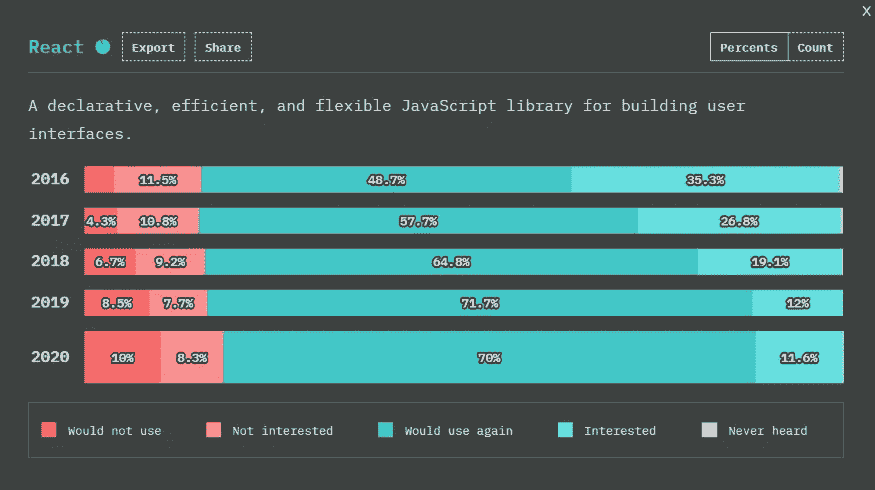

# 2022 年前 5 大 JavaScript 框架

> 原文：<https://javascript.plainenglish.io/top-5-javascript-frameworks-for-2022-270521f63a2f?source=collection_archive---------11----------------------->

## 有棱角的与反应的与脆弱的与苗条的与行动的

JavaScript 是 web 开发中使用最多的语言之一。因此，有许多基于 JavaScript 的框架可用，并且每一个都是独一无二的。

然而，选择学习哪一个可能具有挑战性，因为它们都有一些奇妙的功能。于是，我想到对比一下最近几年最常用的 5 个 JavaScript 框架，看看 2022 年最适合学习的框架是什么。

# 1.反应

[https://reactjs.org/](https://reactjs.org/)

> React 是构建 Web 应用程序最流行的 JavaScript 前端框架之一。

脸书在 2013 年开源了它，现在，它已经接管了 Angular，成为领先的基于 Jacascriptbased 的前端框架。

## React 的特点:

*   支持基于组件的开发。
*   虚拟 DOM 确保快速的 UI 更新。
*   单向数据流。
*   JSX 使应用程序易于理解和编码。
*   Typescript 支持。
*   React-Native 的原生支持。
*   快速高效。

## **何时使用 React:**

*   任何单页应用程序(SPA)的完美解决方案。
*   适用于数据密集型应用，如 stat 仪表盘。
*   适用于高度互动的应用，如社交媒体和电子商务。

> 在 JS 2020 调查的[状态中，React 被发现是所有基于 JavaScript 的前端开发框架中最受欢迎的框架。](https://2020.stateofjs.com/en-US/technologies/front-end-frameworks/)

在过去的五年里，React 一直保持着这一地位，在之前的两年里，它已经成为开发人员中最知名的语言。

State of JavaScript Survey Results

# 2.有角的

[https://angular.io/](https://angular.io/)

CLI、类型脚本支持、双向数据绑定、依赖注入、Ivy、指令是 Angular 的一些突出特性，它是大规模应用程序的理想技术。

## 棱角分明的特点:

*   AngularJS 的双向数据绑定处理 DOM 和模型之间的同步，反之亦然。
*   AngularJS 中提供了一些内置服务。
*   AngularJS 中的模板是包含来自控制器和模型的数据的渲染视图。
*   AngularJS 有一个内置的依赖注入，使开发人员可以轻松地创建、理解和评估应用程序。

## 何时使用角度:

*   这使得网络爬虫更容易在搜索引擎中提高你的网络应用的排名。
*   它减少了加载页面所需的时间，并增强了移动设备的性能。

> 根据 JS 2020 调查的[状况，Angular 已经连续第五年保持第二大最受欢迎语言的地位。](https://2020.stateofjs.com/en-US/technologies/front-end-frameworks/)

# 3.某视频剪辑软件

Vue 是一个用于设计用户界面的免费开源 JavaScript 框架。Vue 被设计成多功能的，很容易集成到使用其他 JavaScript 库的应用程序中。Vue 目前被超过 36，000 个网站使用。

## Vue 的特点:

*   VueJS 使用虚拟 DOM。
*   V-on 是添加到 DOM 元素中的 VueJS 属性，允许它们监听事件。
*   Vue 中的数据绑定功能允许你操作和分配 HTML 属性的值，改变样式，给类等等。
*   VueJS 提供了 HTML 模板，用于执行到 Vue 实例数据的 DOM 绑定。
*   组件是 VueLS 的一个主要特性，它允许您创建可以在 HTML 中重用的定制元素。

## 何时使用 Vue:

*   开始很简单，使用基于 HTML、CSS 和 JS 的组件库。
*   官方库涵盖路由和数据管理等基本功能。
*   虚拟 DOM 确保快速渲染和最短的加载时间。

> 根据 JS 2020 调查的[状态，Vue.js 是过去四年中使用第三多的前端框架。](https://2020.stateofjs.com/en-US/technologies/front-end-frameworks/)

上图表明开发者对 Vue.js 的兴趣随着时间的推移而增长，预示着光明的未来。Vue.js 曾被认为不适合大型项目，但它揭穿了这些信念。

# 4.苗条的

Svelte 是一个开源的 JavaScript 框架，用于在前端创建交互式网页。Svelte 的主要前提与 React 和 Vue 等现有框架相似，它允许开发人员创建 web 应用程序。

## 苗条的特征:

*   较少代码
*   没有虚拟 DOM
*   真正的反应

## 何时使用纤体:

*   Svelte 是一个现代的 JavaScript 框架，用于为开发人员创建快速、简洁、有趣的静态 web 应用程序
*   Svelte 可以用来为任何项目创建单一的、可重用的组件

因此，Svelte 作为速度和性能最强大的框架之一越来越受欢迎。

> 此外，根据 JS 2020 调查的[状态，在过去的两年中，Svelte 一直是开发者最感兴趣的框架。](https://2020.stateofjs.com/en-US/technologies/front-end-frameworks/)

上面的图表描述了开发者对苗条身材的兴趣和知识，随着时间的推移，这种兴趣和知识明显增加了。

# 5.提前

Preact 于 2013 年首次推出，与 react 有许多相似之处，包括基于组件的开发和虚拟 DOM。然而，由于 Preact 强调为消费者提供闪电般的性能，开发人员对采用 react 的功能持谨慎态度。

如果我们看一下 Preact 的 [npm 趋势](https://www.npmtrends.com/preact)下载统计数据，我们可以看到下载数量在去年大幅增加，从 20 万增加到 60 万。

## Preact 的特点:

*   体积小，重量轻
*   易懂
*   有效内存使用
*   快速高效地渲染

根据上图，我们可以看到对 Preact 的兴趣有所下降。这可能是因为有太多具有相同标准的类似框架，比如 react-lite、Inferno 等等。另一方面，了解像 Preact 这样的框架将有助于您的成长。

# 结论

除了这五个框架之外，诸如 Ember、Inferno 和 Aipine.js 之类的框架在你的软件开发生涯中也会很有用。然而，在所有基于 JavaScript 的前端开发框架中，我选择了上面列出的五个，因为它们是最著名和最可靠的。

如上图所示，在过去的五年中，已经使用了几个基于 JavaScript 的框架。React、Angular、Vue.js、Svelte、Preact 分别排名第一至第五。

如果你想在 2021 年学习一个基于 JavaScript 的前端框架，我推荐上面的一个选项。

感谢您的阅读。

*更多内容看*[***plain English . io***](http://plainenglish.io/)