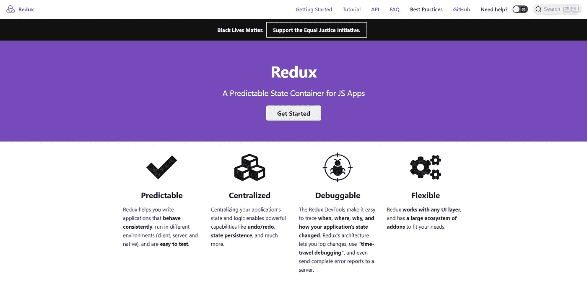
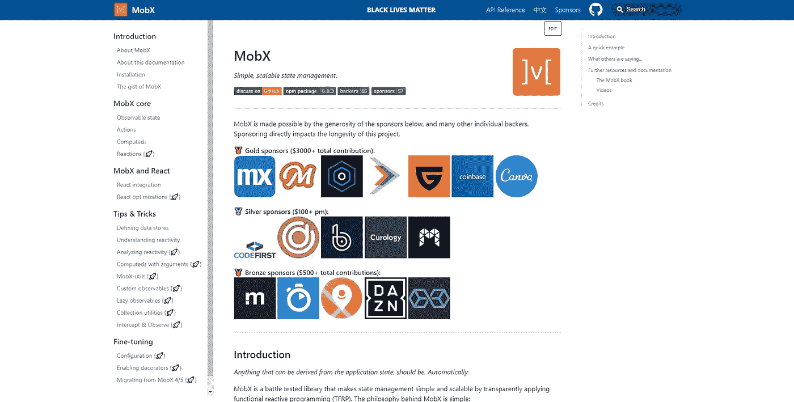
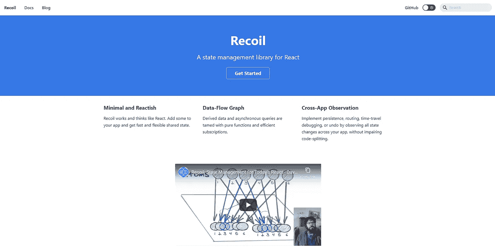
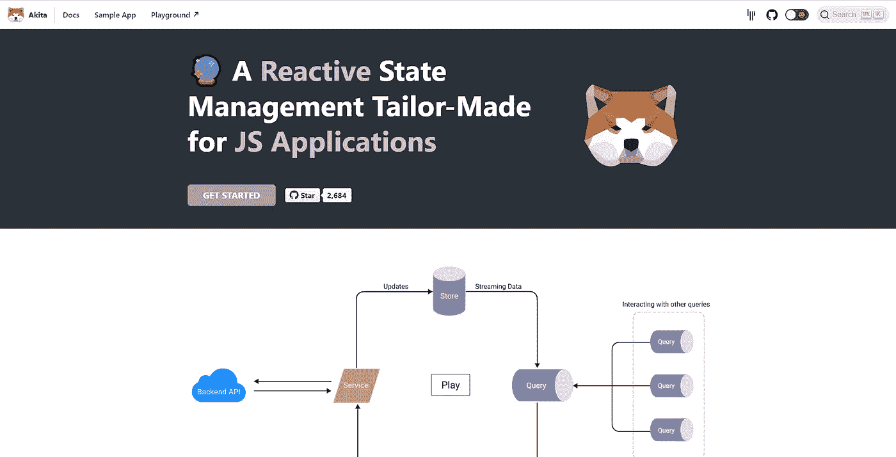
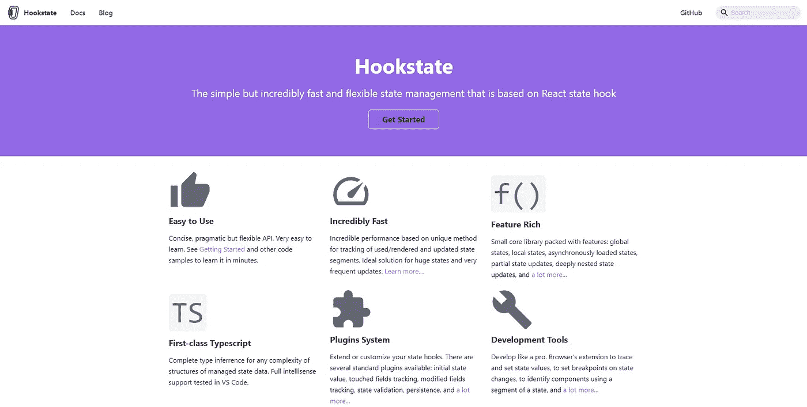

# 前 5 名 React 状态管理库

> 原文：<https://javascript.plainenglish.io/top-5-react-state-management-libraries-13749d2833e9?source=collection_archive---------16----------------------->

今天我为大家带来了我的前 5 名 **React 状态管理** **库**，排名不分先后。其中一些你几乎肯定知道，而另一些可能会让你吃惊。和往常一样，我会给你一个简短的描述，如果它引起你的注意，那么一定要检查链接的文档。

不管怎样，我们开始吧！

# [Redux](https://redux.js.org/)

Redux landing page

你知道会这样。谈到状态管理库，Redux 已经相当长一段时间了。当然，它通常与 React 捆绑在一起，但它的核心是独立于**的**，因此，它可以与任何 UI 库或框架一起使用。

所以，是的——Redux 实际上是同类产品的*“默认”*。但是它开始*【显示它的年龄】*如果不是这样，就会激怒一些开发者。不要误解我的意思——这是一个很棒的库，但是它的[大小](https://bundlephobia.com/result?p=@reduxjs/toolkit)、**陡峭的学习曲线**和**冗长的 action-reducer 方法**到状态管理会让一些人想要转换。

尽管如此，Redux 是同类产品中最受欢迎的，拥有最大的社区和最大的生态系统，所以它不会很快去任何地方。

# [MobX](https://mobx.js.org/README.html)

MobX landing page

又一个惊喜，对吧？类似于 Redux，但更像是第二个， **MobX** 是一个非常受欢迎的，**电池包含的**状态管理库主要(但不是唯一)是为 React 准备的。

现在，MobX 当然不是一个小库，但是与 Redux 相比，有些人可能会发现它的 API 和可观察的方法更令人满意。对于这种类型的库来说，仍然有一个明显的学习曲线，但是之后，感觉真的很好，并且比传统的 Redux 更少重复。

我不知道，也许只是我。但是给你硬币的另一面，MobX 当然不适合极简主义者。它的 API 很好，可以产生一些非常漂亮和干净的代码，但本质上它是一个沉重的库，很难完全掌握。除此之外，你还会得到一个明显更小的社区和生态系统。

# [反冲](https://recoiljs.org/)

Recoil landing page

好了，现在我们进入了一个未知的领域，但肯定是一个更有趣的领域。

你可能对**反冲**很熟悉。当它在今年年初的一个**不稳定阶段**作为一个*【脸书实验】*“发射”时，它获得了很大的牵引力。

尽管它仍然是一个实验项目，但事实上它是由脸书(React 的诞生地)的人开发的，这无疑帮助**提高了它的受欢迎程度**，以至于有些人甚至可以[现在就在生产中使用它](https://www.reddit.com/r/reactjs/comments/i3asfg/is_recoil_production_ready/?utm_source=share&utm_medium=web2x&context=3)。

但这并不意味着后坐力没有别的用处。几乎完全相反！一个现代的基于原子的状态管理和流体的方法，以钩子为中心的 API 确实使它很有吸引力。

但是，现在由于反冲的实验阶段，我建议不要在生产级项目中使用它。试着置身事外，关注它的发展(甚至可能[促成](https://github.com/facebookexperimental/Recoil))，看看事情会如何发展。

# [秋田](https://datorama.github.io/akita/)

Akita landing page

接下来，**秋田**有点像**不太知名的**国家管理图书馆。它类似于 MobX，但是它转向了更加面向对象的 API，而不是像 MobX 那样的功能性 API。

因此，秋田公司通过其面向对象的方法脱颖而出。尤其明显的是它大量使用了**打字稿**和**装饰器**。现在，虽然 TypeScript 并不是面向对象编程的专利，而且得到了广泛的支持(最值得注意的是这个列表中的所有库)，但是 Decorators 更像是一个**利基特性**。除了 Akita 之外，MobX 是这个列表中唯一一个[正式支持它们](https://mobx.js.org/enabling-decorators.html)的库，但即使是它也已经将重点转移到了 v6 中的不同方法上。

所以，随着所有的**函数式编程** (FP)和 hook 热潮正在进行，以及 Decorators 还不是一个稳定的 JS 特性的事实，Akita 可能不是你的 jazz。也许这就是为什么它似乎更专注于 **Angular** (装饰者更常见的地方)而不是 React。

但总的来说，如果你喜欢 Akita 和它的 API，没有什么可以阻止你使用 React。如果你使用基于类的组件，有很棒的文档，和一个规模相当大的社区，它可以很好地配对。

# [胡克州](https://hookstate.js.org/)

Hookstate landing page

我把*【最好的】*留到了最后。

**Hookstate** 是目前我最喜欢的 React 状态管理库，尽管它是组中最不受欢迎的。它很小，最小，干净，可扩展，并且有一个可爱的基于钩子的 API。

这款可能适合你，但前提是你——像我一样——喜欢 React hooks。Hookstate 利用它们和其他一些令人印象深刻的技术来交付**出色的开发体验**和性能。

不仅可以用于全局状态，还可以用附加特性增强局部`useState()`，处理**嵌套状态**而不损失性能，轻松处理**异步数据**！

所有这些都在一个 [**小封装**](https://bundlephobia.com/result?p=@hookstate/core) 中，简单易用的**插件架构**提供更多功能。

我强烈推荐你去看看！

# 不要忘记基础

所以，在这一点上，当我们浏览了所有这些**伟大的图书馆**，我想提醒你**你不一定需要它们**。

与一些人的想法相反，在使用 React 时，状态管理库并不是必需的。事实上，React 为此提供了自己的工具——只有[状态](https://reactjs.org/docs/state-and-lifecycle.html)和[上下文](https://reactjs.org/docs/context.html)API。当然，工作起来不太方便，但是当项目不太复杂时，可以完成工作。

所以，状态和上下文 API——这是默认的**。没有直接来自脸书的冗余甚至反冲。只有当你 100%确定你会需要它的时候，或者在需要的时候，才选择加入一个外部库。这也是我如此喜欢 Hookstate 的部分原因。它用一个令人愉快的 API 提供了许多额外的特性，同时占用空间最小。这是我能轻松找到的最接近“股票反应”的解决方案。**

# 结束语

这份名单到此为止。请在评论中告诉我你对我的选择有什么看法？也许你有一些我没有包括在这里的其他选项要分享？再次声明，**评论区是你的**。

想要更多的网站开发列表、教程、新闻等等，请在[推特](https://twitter.com/areknawo)、[脸书](https://facebook.com/areknawoblog)或通过[我的简讯](https://areknawo.com/#newsletter)关注我。感谢阅读和快乐编码！

*更多内容请看*[***plain English . io***](http://plainenglish.io/)