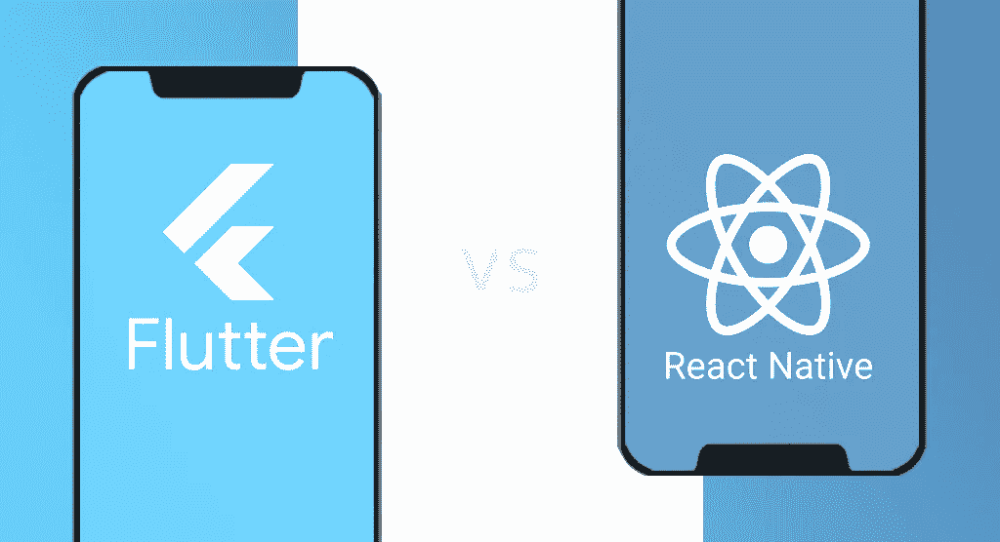
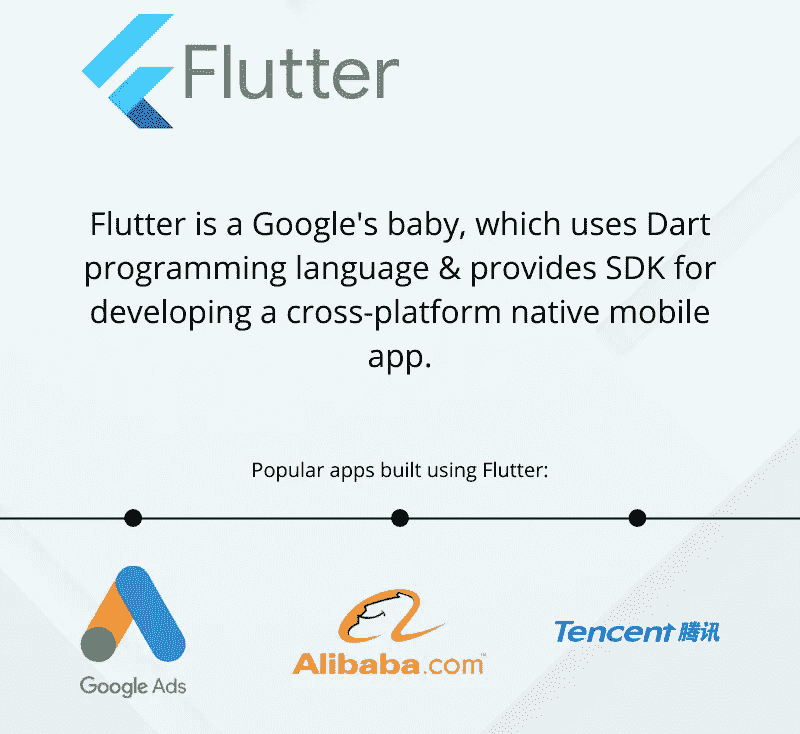
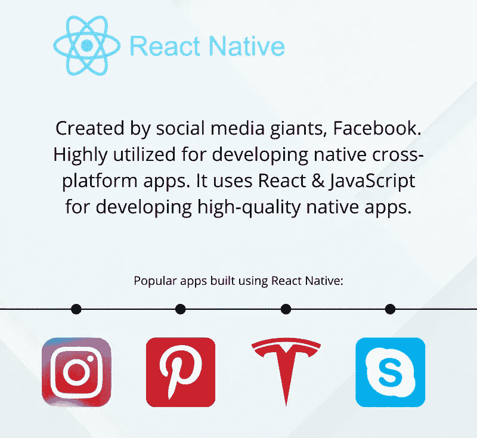

# 2022 年选择 Flutter 而非 React Native 的五大理由

> 原文：<https://javascript.plainenglish.io/top-5-reasons-to-choose-flutter-over-react-native-in-2022-617cd8357005?source=collection_archive---------6----------------------->

React Native 和 Flutter 是市场上两个领先的框架，以其用户友好的特性而闻名。他们简化应用程序开发过程的能力使他们与众不同。它们简化了编码任务，有助于制作出色的应用程序 UI/UX。尽管提供了相同的价值和设施，但它们在几个方面彼此不同。React native 是一个更大的社区，提供了一个开发应用程序的大平台，而 Flutter 更多的是内置工具，对第三方工具的依赖更少。

Flutter 是使用最多、需求最大的框架之一，在过去几年中获得了极大的欢迎。全球大多数开发者都对 Flutter 应用开发充满热情。这是因为 Flutter 框架易于使用，它提供了一系列功能来构建无与伦比的应用程序。有了 Flutter 框架，任何人都可以为移动(Android，iOS)，web，Linux，Mac 等开发应用。

在这篇博客中，我们将解释为什么 Flutter 比 React Native 更好，但首先，让我们理解这两个框架的含义。

## **什么是颤振？**

Flutter 是一个基于 Google 的 UI 工具包，被全世界的开发者用来在最短的时间内构建无缝应用。Flutter 有助于为 web、移动和桌面开发令人印象深刻的本地编译应用程序。只需一个代码库，你就可以构建多个应用程序。这是使用 Flutter 框架的最大好处。

它是一个开源框架，只能通过 Google 创建的 Dart 语言使用。

***用飘起制作的热门应用***

*   谷歌广告
*   腾讯
*   阿里巴巴
*   通过易趣网购买
*   哈密尔顿
*   菲利普斯色调

## **什么是 React Native？**

它是一个流行的开源框架，运行在 Javascript 上。它是由脸书在 2015 年开发的跨平台应用开发框架，用于开发安卓和 IOS 平台的应用。这是一个有效的框架

*   跨平台开发应用程序
*   通过 Javascript 构建移动应用
*   使用单一代码库开发 IOS 和 Android 应用程序

***用 React Native 制作的热门应用***

*   脸谱网
*   FB 广告经理
*   拼趣
*   照片墙
*   彭博
*   特斯拉
*   网络电话

## **为什么选择 Flutter 而不是 React Native？**

**热装-快速开发**

Flutter 是动态的，比其他框架快得多。开发人员可以随时简单地进行更改，并可以检查应用程序中的即时反映。检查应用程序中所做的更改只需几秒钟。热重装特性允许开发人员尝试构建 ui、添加/删除特性、更快地修复 bug 等。这减少了整个应用程序开发的时间和成本。React 原生应用程序开发过程相当耗时。

**富有表现力和灵活性的用户界面**

Flutter 拥有高级功能，可以让你构建漂亮的应用程序，并让你控制屏幕上的每个像素。其强大的工具允许您整合动画视频，文本和图形没有任何中断。因此，与其他定制相比，flutter 的定制非常简单。借助 Flutter，您可以在 IOS 和 Android 平台上为您的用户提供一流的体验。

React 原生开发人员不得不依赖第三方工具来构建 ui，这有时会影响应用程序的性能，并缩小定制的范围。使用 React Native 无法轻松满足您的定制需求。

**开发高性能应用**

说到应用的性能，没有人能打败 Flutter 框架。你不会面临任何与应用程序性能相关的问题。这背后的一个关键原因是用于与不同本机组件通信的编程语言。React native 基于 Javascript，它需要一个桥来与不同的本机组件通信，而在 Flutter 中不需要桥来通信。它保证了更快的应用程序开发。

**镖语**

它是由谷歌开发的，旨在为程序员的生活带来便利。它适用于移动、桌面和 web 应用程序。这是一种确保多平台更快应用开发的语言。它消除了复杂的编码任务，使编码者很容易。一切都可以用 Flutter 框架定制。Flutter 使用 C++语言，使得开发过程流畅。

**你的用户会喜欢的设计**

Flutter 提供了大量的自定义窗口小部件，如果你愿意，你甚至可以创建自己的窗口小部件。它是一个超级友好的操作系统，帮助开发者创建高性能的用户友好的应用程序。当涉及到在任何新的架构中集成代码时，React native 是复杂的，但是使用 Flutter，这个过程是简单而顺利的。在这里，将代码集成到本机平台要容易得多。

**简单易学**

学习颤振比反应自然要容易得多。谷歌开发了 Flutter，它需要更少的代码，而且它的内置工具也很容易使用。慢慢地，Flutter 正在成为大多数开发者的优先选择，只要他们想在更短的时间内开发应用程序。学习 React native 可能需要你的时间，因为它需要大量的精力和努力来习惯它的特性和工具。

**最适合 MVP**

如果你计划构建一个最小可行的产品，Flutter 将是你最好的选择。大多数 [Flutter 应用程序开发服务](https://www.xongolab.com/flutter-app-development/)提供商使用 Flutter 创建应用程序的 MVP，向他们的潜在客户展示项目的要点。

**质量保证测试支持**

Flutter 附带了一个集成的质量测试框架，可以确保所有类型的移动应用程序的 UI 测试、单元测试和集成测试。在 react native 上，开发人员必须使用 javascript 提供的几个测试，他们甚至不为任何 QA 测试提供官方支持。他们不得不依赖其他的聚会工具。

## 结论

Flutter 和 React Native 都保持着巨大的市场份额，并受到全球大多数开发者的青睐。Flutter 加载了内置工具、文档、帮助和支持工具，有助于为多个平台创建功能丰富的应用程序。通过利用 Flutter 应用程序开发服务，你可以在应用程序中获得你想要的东西。Flutter 是谷歌的产品，所以你不必担心结果，它肯定是你能得到的最好的结果。

*更多内容请看*[***plain English . io***](http://plainenglish.io/)*。报名参加我们的* [***免费周报***](http://newsletter.plainenglish.io/) *。在我们的* [***社区***](https://discord.gg/GtDtUAvyhW) *获得独家获得写作机会和建议。*