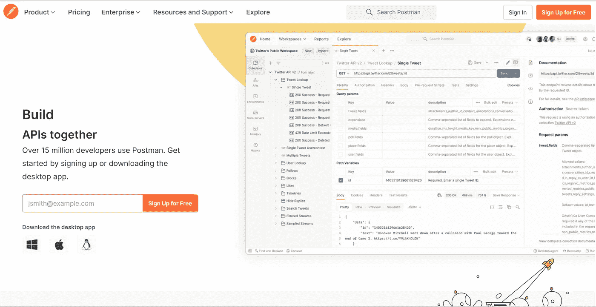
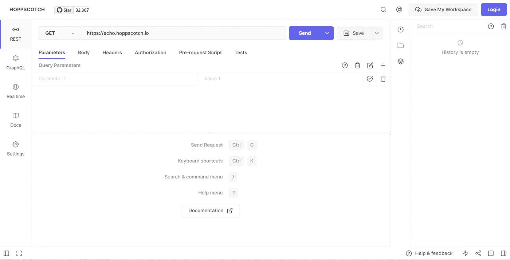
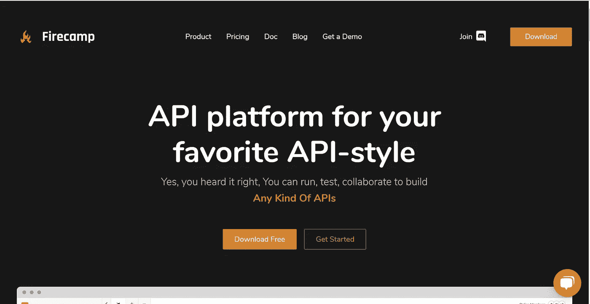
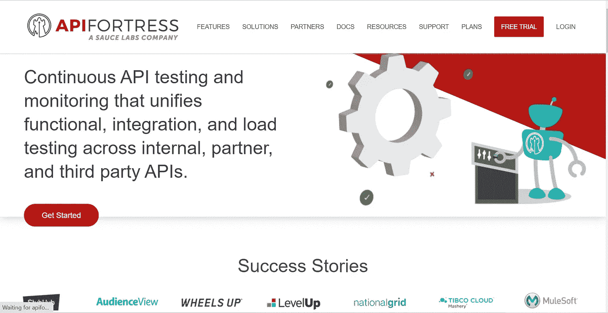
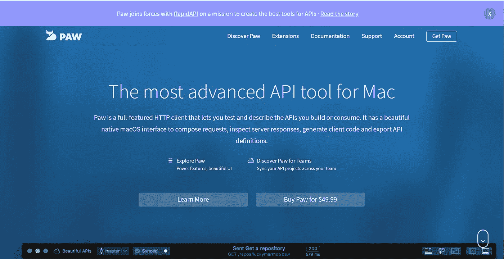
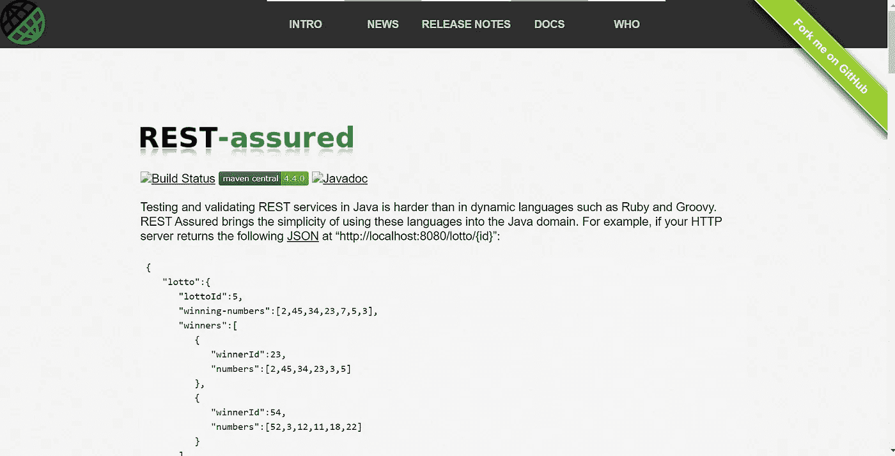

# 你应该检查的 6 大 API 测试工具

> 原文：<https://javascript.plainenglish.io/top-6-api-testing-tools-you-should-check-out-aada25913f1b?source=collection_archive---------12----------------------->

## 你应该检查的 API 测试工具

Photo by [Sigmund](https://unsplash.com/@sigmund?utm_source=medium&utm_medium=referral) on [Unsplash](https://unsplash.com?utm_source=medium&utm_medium=referral)

API(应用程序编程接口)使两台计算机更容易通信和共享信息。在开发 API 时，经常会忽略测试各种端点，并查看当给定的请求呈现给它们时它们的行为。

可以使用各种工具来有效地测试您的 API 端点，并在将它们推向生产之前大致了解它们如何服务和响应请求。

在这篇文章中，我们将看看一些最好的 API 测试工具。

## **1。邮递员**

Postman Landing page-screenshot by Author.

Postman 是一个用于构建和使用 API 的 API 平台。Postman 简化了 API 生命周期的每个步骤，并简化了协作，因此您可以更快地创建更好的 API。

Postman 使集成到开发服务器和检查 API 的行为变得更加容易和简单。

除此之外，它还为构建 API 提供了持续的协作。他们的界面也是极简而伟大的，提供了对你的测试和更容易的错误和排序登录的关注。Postman 还提供 API 文档。

你可以在这里查看邮差 [***。***](https://www.postman.com/)

## **2。霍普斯科奇**

Hoppscotch Landing page-screenshot by Author

Hoppscotch 是一个了不起的 API 测试工具。它还是一个开源的 API 开发生态系统。帮助您更快地创建请求，节省宝贵的开发时间。

Hoppscotch 的神奇之处在于，它是基于浏览器的，你不必把它安装在电脑上。你可以直接在浏览器上模仿你的 API。

你可以在这里查看 Hoppscotch [***。***](https://hoppscotch.io/)

## **3。Firecamp**

Firecamp Landing Page-Screenshot by Author

Firecamp 是一个通用的 API 开发平台。它也是一个多协议 API 开发平台。它为从传统到现代的协议和风格提供了专用的 GUI 客户端、工具和服务。

Firecamp 还提供了与不同团队的良好协作。除此之外，它还提供了惊人的用户体验。

你可以在这里查看 [***。***](https://firecamp.io/)

## **4。API 堡垒**

API fortress landing page-Screenshot by Author.

持续的 API 测试和监控，统一内部、合作伙伴和第三方 API 的功能、集成和负载测试。

它还提供对 REST、SOAP、GraphQL、Web 服务和微服务的测试。将测试自动化作为 CI 流程的一部分。持续监控内部 API。

你可以在这里查看 [***。***](https://apifortress.com/)

## **5。爪子**

Paw Landing Page-screenshot by Author

Paw 是 Mac 最先进的 API 工具。Paw 是一个功能齐全、设计精美的 Mac 应用程序，它使与 REST 服务的交互变得令人愉快。无论你是 API 的制造者还是消费者。

它有一个漂亮的本机 macOS 界面来编写请求、检查服务器响应、生成客户端代码和导出 API 定义。

你可以在这里查看 [***。***](https://paw.cloud/)

## **6。放心**

REST-Assured landing page-Screenshot by Author.

用 Java 测试和验证 REST 服务比用 Ruby 和 Groovy 等动态语言更难。放心将使用这些语言的简单性带入 Java 领域。

可以在这里查看 [***。***](https://rest-assured.io/)

## **结论**

拥有测试 API 的最佳工具对于评估各种端点的行为非常有效。

感谢您抽出时间查看这些资源。

## **更多阅读内容**

 [## 下一个项目的前 5 个 JavaScript 动画库

### 在你的下一个动画项目中使用的最佳 JavaScript 库

javascript.plainenglish.io](/top-5-javascript-animation-libraries-for-your-next-project-580d47827f03)  [## 让你成为更好的远程开发者的 3 个重要技能

### 我自己远程工作的经历

javascript.plainenglish.io](/3-important-skills-to-make-you-a-better-remote-developer-3921d1f1b252) 

*更多内容请看*[***plain English . io***](http://plainenglish.io/)