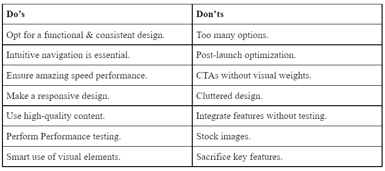
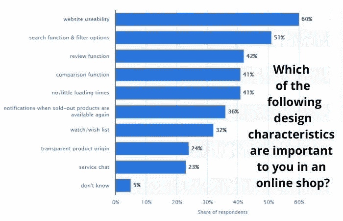
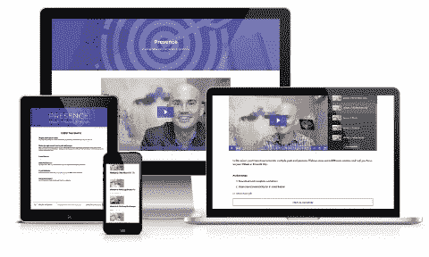
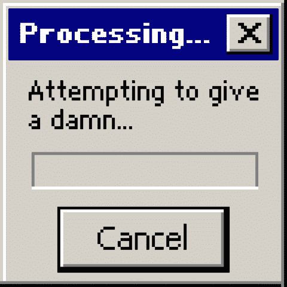

# 决定你的网站开发项目成败的 7 件大事

> 原文：<https://javascript.plainenglish.io/top-7-dos-don-ts-that-can-make-or-break-your-website-development-project-7a0ca694bfe1?source=collection_archive---------8----------------------->

一个直观创新的网站清晰地展示了关键的业务目标，是发展中企业的终极工具。一个网站如果不能在几秒钟内表明公司的主要目的，那它就一无是处。

当网站无法加载或难以浏览时，用户会点击后退按钮。为了帮助你，我们列出了网站开发的首要注意事项。

> **下面的表格描述了创建一个出色网站的主要技巧:**

# **优秀网站的七大必做事项**

> **做:创建一个可用的&一致的设计**

网站的整体设计必须便于用户导航。访问者必须迅速找到他们正在寻找的产品或服务。网站关键功能的位置应该**显眼。**

一旦你成功地创建了一个功能设计，你需要关注网站的**设计一致性。**例如，当按照表格格式进行产品描述时。电子商务网站上的所有产品必须有一个类似的表展望。

在一些网站中有段落格式的描述，而在另一些网站中有表格，这导致了网站缺乏统一性和更高的不一致性。

> **做:关注直观导航**

根据网络发展统计， **94%的网络浏览器认为导航**是浏览网站的关键因素。一个清晰的菜单结构，方便用户找到网站的基本项目，不是蛋糕上的樱桃，而是蛋糕本身。

By [Statista](https://www.statista.com/forecasts/961919/important-design-characteristics-for-online-shops-for-us-consumers)

浏览你网站的用户必须尽可能少的点击就能找到想要的东西。最好在四次点击之外。因此，重点必须始终是在网站上创建类别和子类别，让用户在四次点击之内就能找到想要的部分。

> **Do:确保最大转换的闪电般速度性能**

网页加载时间超过 3 秒，用户开始对你的网站感到失望。即使你处理的是你网站上独有的东西，你也不能牺牲速度。

在大多数情况下，当网站不能给人留下速度表现的印象时，用户就开始点击替代品。

> 做:开发一个响应式设计

浏览器使用的设备有数十亿个。其中很大一部分是智能手机。每天售出 400 多万部手机并不奇怪。每个设备型号都有不同的屏幕尺寸，响应式设计是最大化收益的终极解决方案。

无论浏览器是在 PC、台式机、平板电脑还是智能手机上，响应式设计都能提供吸引人的网站视图，增强网站的用户体验。

> **Do:提供可读性分数高的内容**

内容需要引起网站目标受众的共鸣。抄袭竞争对手的内容会给人一种欺骗性和缺乏原创性的印象。只要可行，最好以各种形式避免。

此外，找出你的网页内容的可读性分数。虽然不同的企业有不同的理想分数，但这个值永远不应该低于 50，完美的分数范围在 50 到 65 之间。

这篇文章的可读性**得分是 54。**

> **做:测试错误**

测试团队必须检查网站，以检测和消除网站上出现的各种错误。你可以像用户一样简单地检查所有的 do-follow 链接、附加链接、图片、描述等。

记住，座右铭是向用户呈现一个完美的网站，没有任何断开的链接，模糊的图像等。当浏览你的网站时，试着格外小心和完全公正，因为这将帮助你找到需要改进的地方。

作为一个简单的用户，**分析**开发的网站是否满足可视化的功能，或者是否有很大的改进空间。

> **做:使用视觉元素**

设计元素必须有效地与用户沟通。显示为链接但实际上是文字的行只会给用户造成不必要的混淆。交互设计元素是成功的关键，不应该被忽视。

# **优秀网站的 7 大禁忌**

> **不要:提供太多选择**

选择太多**会减少转换数量**，因为用户会在选择什么和放弃什么之间感到困惑。根据《纽约时报》的一项研究，一家杂货店将果酱的数量从 24 种减少到 6 种。结果是销售额增长了 600%。

尽管品尝果酱的人的比例从 60%下降到 40%，但销售的转化率却从仅仅 3%猛增至 30%。这个想法不是将选项减到最少，而是在最优和过多之间找到平衡。

> **不要:忽略发布后优化**

一旦你启动网站，你会发现**来自客户的真实反馈**,他们称赞网站的优点，对网站无用的部分感到沮丧。根据最终用户的需求来优化网站组件是最好的时机。

> **不要:保留缺乏视觉效果的 CTA**

一旦用户确信你的网站提供真实的信息、产品、服务等。，他们会找 CTA。将**更高的视觉权重放在 USPs 和 CTA 上**提高了网站的转化率。

> **不要:选择缺乏空白空间的杂乱设计**

空白空间的最佳使用是吸引人的网页设计的关键。缺乏空白只会导致模糊的前景，影响网站的用户体验，并创造一个**混乱的介绍。对于用户来说，阅读或了解页面的特定部分也是一个挑战。**

> **不要:不测试就集成新特性**

为了保持领先于竞争对手，设计师和开发商试图在网站上开发独特和创新的功能。乍看之下，它们似乎相对繁荣，但最好是在获得用户的反馈后进行整合。

一个带有最小目标受众部分的简单测试可以帮助您认识到该特性是否值得集成或者需要从项目中删除。例如，水平滚动听起来很吸引人，但是由于标准的垂直滚动，用户不能理解它。

> **不要:使用库存图像**

库存照片可能看起来是很方便的选择，但是最终它们无法给你提供独家信息。当访问你的网站的用户发现上面有相同的照片时，他们会把你放在众多选项中，而不是把它看作一个品牌。

> **不要:在开发成本上牺牲关键特性**

虽然降低整体项目开发成本是所有商业企业的愿望，但一些企业承受着牺牲网站关键功能的负担。相反，去争取 MVP，为网站选择一个**开源技术栈**。它们是降低总体项目开发成本的更好的选择。

此外，你可以从亚洲国家 [**雇佣网络开发人员**](https://www.pixelcrayons.com/hire-web-developers) 。与欧洲、美国和拉丁美洲国家相比，印度和孟加拉国的开发者费用几乎是一半。

选择一个可靠的 web 开发公司是任何编程项目的一个重要方面。正确的选择有助于你创建一个非凡的网站，而蹩脚的选择会导致令人沮丧的体验。

如果没有告诉你如何联系到合适的专家，网站开发的技巧是不完整的。请看下表，它描述了与网络开发公司联系的最佳技巧。

# **选择网络开发公司的首要注意事项**

> **体验**

**做:分析公司经验**

试着去找一家在这个领域至少有**五年经验**的网站开发公司。有了多种选择，你可以很容易地联系到在 web 开发项目上有超过十年经验的公司。一个成熟的、有经验的公司会让你在项目完成中占上风。

**不要忘记索要个人团队简历**

虽然公司可能很老，但他们可以为你提供一个没有软件开发实践经验的团队。了解与您的项目相关的整个团队的成就和专业知识是至关重要的。

> **认证**

**Do:检查公司认证**

公司是否通过 ISO 认证或任何其他同等的国家/国际认证。ISO 认证**增强你对所选公司的信心**。

**不要:忽视询问关于荣誉的问题**

基于公司的表现，他们从独立评级机构获得奖励和赞誉。凭借出色的表现，公司在成立后的几年内不断获奖。所以，问问被选中的公司，他们是否根据之前的表现获得了奖励和赞誉。

> **案例分析**

**做:询问公司交付的早期项目**

回顾公司以前完成的项目有助于你分析公司的工作质量。它还会帮助你想象这家公司是否是正确的选择，或者为最好的程序员团队进行**研究。**

不要盲目相信公司所说的话

该公司交付的项目主要在网上提供，尤其是当它们是网站或应用程序时。您可以浏览网站并下载应用程序，以了解公司交付的工作质量。

> **点评**

做:检查早期客户的评论

评论让你清楚地了解公司与客户打交道的方式。除了交付一个伟大的项目，开发的数字产品还需要与客户的需求产生共鸣。

**不要忘记亲自联系评审人员**

在这个数字时代，**虚假评论占主导地位，**许多公司利用它们来愚弄客户。你可以通过电子邮件、社交媒体链接等方式与评论者联系，从而获得积极的评论。

> **价格匹配、NDA、准时交货等。**

**做:查看附加福利**

现在的公司提供了大量的特性来帮助客户进行他们的 web 开发项目。其中重要的包括以下内容:

*   *准时交货让您能够* ***恰当地规划您的项目营销策略*** *。*
*   *保密协议保护您的想法* ***安全无虞*** *不被窃取。*
*   *100%工程保修连同* ***零合同锁定。***
*   *价格匹配保护你免受各种* ***不公平收费*** *。*

**不要忘记讨论连接选项**

顶尖的开发公司为你提供了多种与开发者团队沟通的方式。标准的包括**通话、短信、实时聊天和电子邮件**。

# **包装完毕**

[网站开发公司](https://www.pixelcrayons.com/web-development/) 被证明是编程项目的绝佳选择。它们遵循 web 开发的最佳实践，而且价格非常低廉。

与他们联系，以实惠的预算体验专门的项目开发。

*更多内容请看*[***plain English . io***](http://plainenglish.io/)