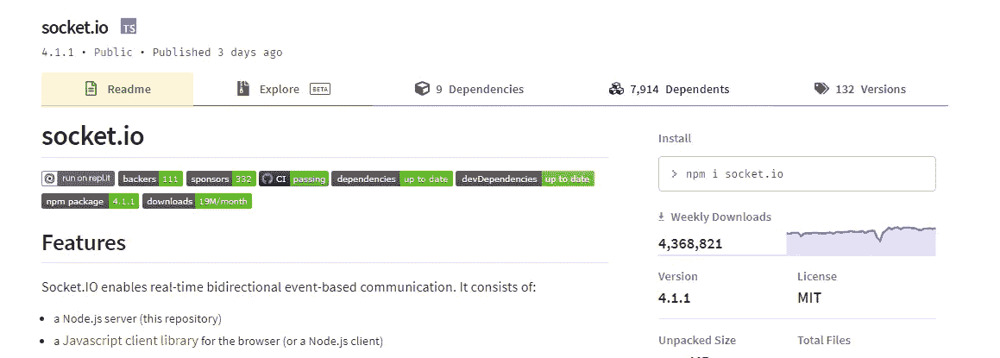

# 每个 Web 开发人员都应该知道的 7 个 NPM 软件包

> 原文：<https://javascript.plainenglish.io/top-7-must-know-npm-packages-for-every-web-developer-95e727855309?source=collection_archive---------2----------------------->

## 发现 web 开发人员中最受欢迎的 NPM 软件包


Top 7 must-know NPM packages for every web developer

# 1.Dotenv

Dotenv 是一个零依赖模块，它将环境变量从一个`.env`文件加载到`[process.env](https://nodejs.org/docs/latest/api/process.html#process_process_env)`中。将配置存储在独立于代码的环境中是基于十二因素应用程序方法的。


这个包每周下载超过 ***16M*** 次。很大，不是吗？


[Dotenv package](https://www.npmjs.com/package/dotenv)

它使用起来简单快捷，这也是我喜欢它的原因:

## 如何安装

```
npm install dotenv
```

## 如何使用它

```
require('dotenv').config()
```

在项目的根目录下创建一个`.env`文件。

以`NAME=VALUE`的形式在新行上添加特定于环境的变量。

## 示例:

```
DB_HOST=localhost
DB_USER=root
DB_PASS=P@ssw0rd
```

恭喜，`process.env`现在拥有了您在`.env`文件中定义的键和值。你可以像下面这样使用它:

```
const db = require('db')
db.connect({
  host: **process.env**.DB_HOST,
  username: **process.env**.DB_USER,
  password: **process.env**.DB_PASS
})
```

下面是一个 React 应用程序的例子:

[](https://levelup.gitconnected.com/how-to-create-node-global-variables-to-use-in-react-app-9df1514a4eb7) [## 如何创建用于 React 应用程序的节点全局变量

### 修复返回未定义的 process.env.VARIABLE_NAME

levelup.gitconnected.com](https://levelup.gitconnected.com/how-to-create-node-global-variables-to-use-in-react-app-9df1514a4eb7) 

# 2.Bcrypt

这个包每周下载超过 70 万次，由于它的密码散列技术和在 Node JS 中的易用性而广受欢迎。


[Bcrypt package](https://www.npmjs.com/package/bcrypt)

## 如何安装

```
npm install bcrypt
```

## 它是如何工作的？

```
// Import the library
const **bcrypt** = require('bcrypt');// Passwords
const saltRounds = 10;
const myPlaintextPassword = 's0/\/\P4$$w0rD';// Hashing passwords
bcrypt.**hash**(myPlaintextPassword, saltRounds, function(err, hash) {
    // Store hash in your password DB.
});// Checking pasword, load hash from your password DB.
bcrypt.compare(myPlaintextPassword, hash, function(err, result) {
    // result == true
});
```

# 3.UUID 和 CUID

正如您可能已经猜到的，这两个包用于生成强大的、唯一的随机 ID。目前最受欢迎的是 UUID 套餐。超过 ***51M*** 周下载量。CUID 软件包不像 UUID 那样受欢迎，每周只有 612，187 次下载，但由于其安全性和独特的服务器端记录查找，它正在受到关注。


[UUID package](https://www.npmjs.com/package/uuid)


[CUID package](https://www.npmjs.com/package/cuid)

## 如何安装这些软件包

```
// CUID
npm install --save **cuid**// UUID
npm install --save **uuid**
```

## UUID 用法示例

```
const { v4: uuidv4 } = require('uuid');
console.log(uuidv4()); // ⇨ '1b9d6bcd-bbfd-4b2d-9b5d-ab8dfbbd4bed'
```

## CUID 用法示例

```
var cuid **=** require('cuid');
console.log( cuid() ); *//* ⇨ *'cjld2cyuq0000t3rmniod1foy'*
```

# 4.Axios

谁不知道 Axios，这个包是新潮的，尤其是在 React 应用里。每周下载量超过 1800 万次。这个库是 browser 和 Node.js 的基于 promise 的 HTTP 客户端。


[Axios package](https://www.npmjs.com/package/axios)

## 如何安装

```
npm install axios
```

## 它是如何工作的？

# 5.Socket.io

***Socket.io*** 实现 web 客户端广告服务器之间的实时双向通信。



[Socket.io package](https://www.npmjs.com/package/socket.io)

## 如何安装

```
npm install socket.io
```

## 它是如何工作的？

```
const **server** = require('http').createServer();
const **io** = require('socket.io')(server);**io**.on('connection', client => {
  client.on('event', data => { /* … */ });
  client.on('disconnect', () => { /* … */ });
});
server.listen(3000);
```

# 6.洛达什

Lodash 非常有用，让你的程序员的生活更容易。这是我在操作字符串、数组等等时必备的。


[Lodash package](https://www.npmjs.com/package/lodash)

## 如何安装

```
npm i --save lodash
```

## 它是如何工作的？

```
// Load the full build if your need almost all what it got
var _ = require('lodash');
// Load the core build.
var _ = require('lodash/core');// Load the FP build for immutable auto-curried iteratee-first data-last methods.
var fp = require('lodash/fp');

// Load method categories. 
var array = require('lodash/array');
var object = require('lodash/fp/object');

// Cherry-pick methods for smaller browserify/rollup/webpack bundles.
var at = require('lodash/at');
var curryN = require('lodash/fp/curryN');
```

## Lodash cloneDeep 函数示例:

```
var objects = [{ 'a': 1 }, { 'b': 2 }];
var deep = _.**cloneDeep**(objects);
console.log(deep[0] === objects[0]);
// => false
```

如您所见，由于 Lodash，无需为深度克隆创建实用函数。这还不是全部。真的是开发者的一个大工具箱。

# 7.时刻和日期-fns

***矩*** 包所以流行并用于管理日期。但是，这个解决方案现在已经被否决了。您可以使用`**date-fns**`代替 ***。*** 该软件包也很受欢迎，每周都有 ***10M*** 下载。


[Date-fns package](https://www.npmjs.com/package/date-fns)

## 如何安装它？

```
npm install date-fns --save
```

## 它是如何工作的？

```
import { **compareAsc**, **format** } from '**date-fns**'

**format**(new Date(2014, 1, 11), 'yyyy-MM-dd')
//=> '2014-02-11'

const dates = [
  new Date(1995, 6, 2),
  new Date(1987, 1, 11),
  new Date(1989, 6, 10),
]
dates.**sort**(**compareAsc**)
//=> [
//   Wed Feb 11 1987 00:00:00,
//   Mon Jul 10 1989 00:00:00,
//   Sun Jul 02 1995 00:00:00
// ]
```

## 概述


Top NPM web dev packages

你最喜欢哪一个？对我来说，我不能只选择一个！作为一个开发者，我不能没有这些软件包！

你还有其他没有它们就无法生存的包裹吗？请与我们分享！

# 最终说明

*   请注意，您也可以使用带有经典 ***的 ES6 模块语法导入*** 来代替 ***要求的*。**
*   你也可以用 ***纱*** 代替 ***NPM*** 。

**永远享受！**亲爱的读者，我希望这是清晰和有用的。我希望你和你的家人在任何地方都安全！坚持住。明天会更好！

**让我们联系上** [**中**](https://medium.com/@famzil/) **、**T39**领英** **、**[脸书、**、**](https://www.facebook.com/The-Front-End-World)[insta gram](https://www.instagram.com/the_frontend_world/)T55，或[推特 T60**。**](https://twitter.com/FatimaAMZIL9)

[www.fam-front.com](http://www.fam-front.com/)

*更多内容参见* [***简明英语. io***](http://plainenglish.io)